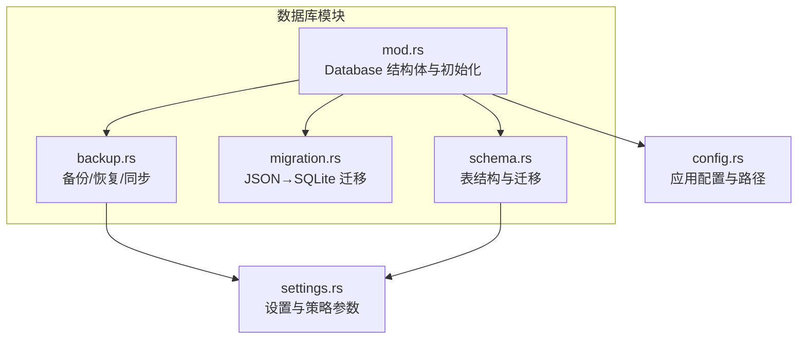
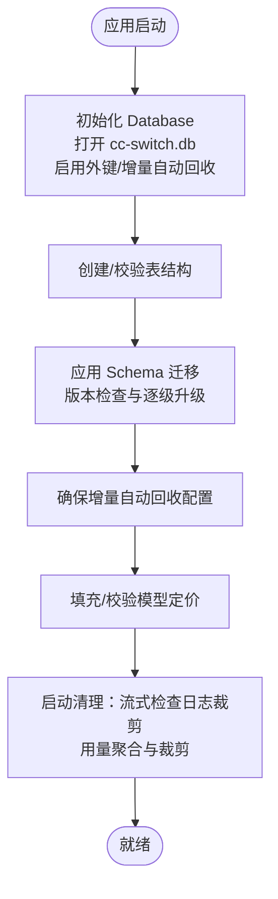
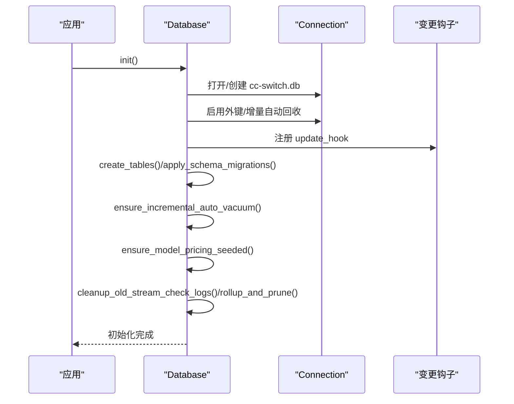
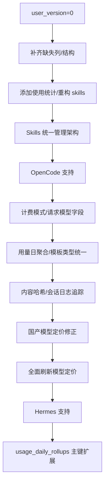
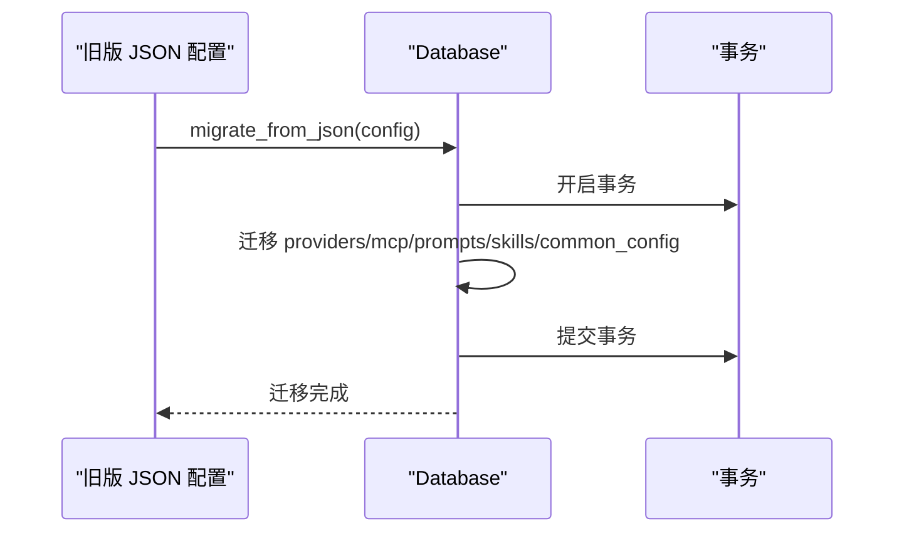
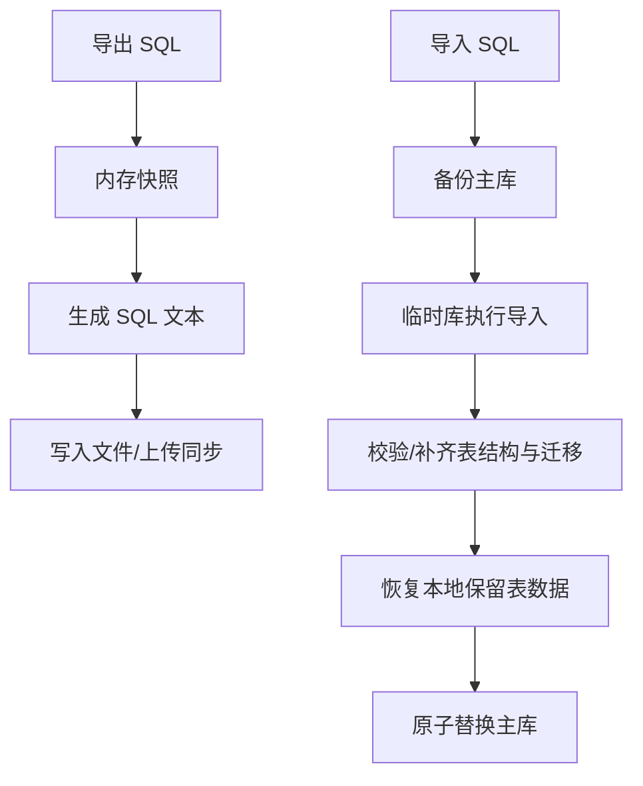
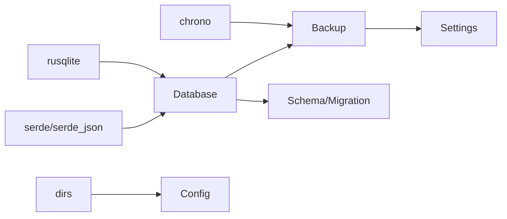

# 数据库架构

<cite>
**本文引用的文件**
- [src-tauri/src/database/mod.rs](file://src-tauri/src/database/mod.rs)
- [src-tauri/src/database/schema.rs](file://src-tauri/src/database/schema.rs)
- [src-tauri/src/database/migration.rs](file://src-tauri/src/database/migration.rs)
- [src-tauri/src/database/backup.rs](file://src-tauri/src/database/backup.rs)
- [src-tauri/src/config.rs](file://src-tauri/src/config.rs)
- [src-tauri/src/settings.rs](file://src-tauri/src/settings.rs)
</cite>

## 目录
1. [简介](#简介)
2. [项目结构](#项目结构)
3. [核心组件](#核心组件)
4. [架构总览](#架构总览)
5. [详细组件分析](#详细组件分析)
6. [依赖分析](#依赖分析)
7. [性能考量](#性能考量)
8. [故障排查指南](#故障排查指南)
9. [结论](#结论)
10. [附录](#附录)

## 简介
本文件系统性阐述 CC Switch 的数据库架构，重点围绕 SQLite 的选择理由、双层存储策略（SQLite 同步数据表与 JSON 设备设置分离）、初始化流程、连接管理与锁保护、并发与一致性保障、文件位置与权限、跨平台兼容性，以及性能优化与监控指标。目标是帮助开发者与运维人员快速理解并高效维护数据库层。

## 项目结构
数据库相关代码集中在 Rust 后端模块 src-tauri/src/database 下，采用“模块化 + DAO 层”的分层设计：
- 数据库入口与连接封装：database/mod.rs
- 表结构与迁移：database/schema.rs
- JSON → SQLite 迁移：database/migration.rs
- 备份/恢复/同步：database/backup.rs
- 配置与路径：src-tauri/src/config.rs
- 设置与策略参数：src-tauri/src/settings.rs

图表来源
- [src-tauri/src/database/mod.rs:1-273](file://src-tauri/src/database/mod.rs#L1-L273)
- [src-tauri/src/database/schema.rs:1-800](file://src-tauri/src/database/schema.rs#L1-L800)
- [src-tauri/src/database/migration.rs:1-246](file://src-tauri/src/database/migration.rs#L1-L246)
- [src-tauri/src/database/backup.rs:1-861](file://src-tauri/src/database/backup.rs#L1-L861)
- [src-tauri/src/config.rs:89-123](file://src-tauri/src/config.rs#L89-L123)
- [src-tauri/src/settings.rs:938-957](file://src-tauri/src/settings.rs#L938-L957)

章节来源
- [src-tauri/src/database/mod.rs:1-273](file://src-tauri/src/database/mod.rs#L1-L273)
- [src-tauri/src/database/schema.rs:1-800](file://src-tauri/src/database/schema.rs#L1-L800)
- [src-tauri/src/database/migration.rs:1-246](file://src-tauri/src/database/migration.rs#L1-L246)
- [src-tauri/src/database/backup.rs:1-861](file://src-tauri/src/database/backup.rs#L1-L861)
- [src-tauri/src/config.rs:89-123](file://src-tauri/src/config.rs#L89-L123)
- [src-tauri/src/settings.rs:938-957](file://src-tauri/src/settings.rs#L938-L957)

## 核心组件
- Database 结构体：封装 Mutex 包装的 rusqlite::Connection，支持多线程共享；提供初始化、表创建、迁移、备份、维护等能力。
- Schema 管理：集中定义表结构、索引与迁移逻辑，支持版本演进与向后兼容。
- 迁移层：负责从旧版 JSON 配置（MultiAppConfig）迁移到 SQLite，确保数据完整性与一致性。
- 备份与同步：提供 SQL 导出/导入、二进制快照备份、周期性维护、WebDAV 同步策略（区分可同步与本地保留的数据）。
- 配置与路径：统一管理数据库文件位置、兼容历史路径、测试隔离等。

章节来源
- [src-tauri/src/database/mod.rs:72-160](file://src-tauri/src/database/mod.rs#L72-L160)
- [src-tauri/src/database/schema.rs:16-364](file://src-tauri/src/database/schema.rs#L16-L364)
- [src-tauri/src/database/migration.rs:10-65](file://src-tauri/src/database/migration.rs#L10-L65)
- [src-tauri/src/database/backup.rs:45-147](file://src-tauri/src/database/backup.rs#L45-L147)
- [src-tauri/src/config.rs:89-123](file://src-tauri/src/config.rs#L89-L123)

## 架构总览
SQLite 作为嵌入式数据库，满足 CC Switch 的以下需求：
- 简化部署：单文件数据库，无需独立服务进程。
- 事务与一致性：ACID 事务保证数据一致性。
- 跨平台：原生支持 Windows/Linux/macOS。
- 性能与可靠性：结合 WAL、索引、增量 VACUUM 等策略提升性能与空间回收效率。

双层存储策略：
- 同步数据表：供应商、MCP、提示词、技能、代理配置、使用统计等结构化数据，统一存储于 SQLite，便于查询、索引与迁移。
- JSON 设备设置：通用配置片段（如各应用的公共配置片段）以 JSON 形式存储于 settings 表，避免与业务表混杂，便于快速读取与变更。

图表来源
- [src-tauri/src/database/mod.rs:96-160](file://src-tauri/src/database/mod.rs#L96-L160)
- [src-tauri/src/database/schema.rs:366-470](file://src-tauri/src/database/schema.rs#L366-L470)

章节来源
- [src-tauri/src/database/mod.rs:96-160](file://src-tauri/src/database/mod.rs#L96-L160)
- [src-tauri/src/database/schema.rs:366-470](file://src-tauri/src/database/schema.rs#L366-L470)

## 详细组件分析

### 数据库初始化与连接管理
- 初始化流程
  - 计算数据库文件路径（默认位于用户配置目录下的 cc-switch.db）。
  - 若数据库不存在，启用增量自动回收（auto_vacuum=INCREMENTAL）以降低碎片与空间膨胀风险。
  - 注册数据库变更钩子（update_hook），在 INSERT/UPDATE/DELETE 时通知 WebDAV/S3 自动同步。
  - 创建/校验表结构，应用 Schema 迁移，确保 user_version 与当前版本一致。
  - 启动时执行清理与维护：裁剪流式检查日志、用量聚合与裁剪、增量 VACUUM。
- 连接管理与锁保护
  - 使用 Mutex 包装 rusqlite::Connection，使 Connection 可在多线程环境中安全共享。
  - 所有数据库操作均通过 lock_conn! 宏获取互斥锁，避免竞态条件。
  - 事务封装：迁移与导入等批量操作使用显式事务，失败回滚，保证原子性。
- 并发与一致性
  - 外键约束启用（PRAGMA foreign_keys = ON），确保参照完整性。
  - 通过事务与锁保护，避免并发写入导致的数据不一致。
  - 通过增量 VACUUM 与定期维护，维持良好的写入性能与空间利用率。

图表来源
- [src-tauri/src/database/mod.rs:96-160](file://src-tauri/src/database/mod.rs#L96-L160)
- [src-tauri/src/database/mod.rs:80-90](file://src-tauri/src/database/mod.rs#L80-L90)

章节来源
- [src-tauri/src/database/mod.rs:72-160](file://src-tauri/src/database/mod.rs#L72-L160)
- [src-tauri/src/database/mod.rs:60-71](file://src-tauri/src/database/mod.rs#L60-L71)

### 表结构与迁移机制
- 表结构
  - 供应商表（providers）、端点表（provider_endpoints）、MCP 服务器表（mcp_servers）、提示词表（prompts）、技能表（skills）、代理配置表（proxy_config）、健康状态表（provider_health）、请求日志表（proxy_request_logs）、模型定价表（model_pricing）、流式检查日志表（stream_check_logs）、用量日聚合表（usage_daily_rollups）、会话日志同步表（session_log_sync）等。
  - 为高频查询建立索引（如按 provider_id/app_type、created_at、model、session_id、status 等）。
- 迁移策略
  - 通过 user_version 管理 Schema 版本，逐级迁移（v0→v1→...→v11），每个版本对应明确的 DDL/DML 变更。
  - 兼容历史结构：如将单行代理配置表迁移为按应用类型的三行结构；修复历史定价数据；重构技能表结构等。
  - 迁移过程使用 SAVEPOINT 与回滚，确保失败不影响现有数据。

图表来源
- [src-tauri/src/database/schema.rs:366-470](file://src-tauri/src/database/schema.rs#L366-L470)
- [src-tauri/src/database/schema.rs:472-1271](file://src-tauri/src/database/schema.rs#L472-L1271)

章节来源
- [src-tauri/src/database/schema.rs:16-364](file://src-tauri/src/database/schema.rs#L16-L364)
- [src-tauri/src/database/schema.rs:366-470](file://src-tauri/src/database/schema.rs#L366-L470)

### 双层存储策略：SQLite 同步数据表与 JSON 设备设置
- 同步数据表（SQLite）
  - 存储结构化、可查询、可索引的业务数据，如供应商、MCP、提示词、技能、代理配置、使用统计等。
  - 通过事务与索引保证查询与写入性能。
- JSON 设备设置（settings 表）
  - 存储通用配置片段（如各应用的公共配置片段），以 JSON 文本形式保存，便于快速读取与变更。
  - 与业务表分离，避免结构化数据与配置片段混杂，提升维护性与灵活性。

章节来源
- [src-tauri/src/database/schema.rs:116-121](file://src-tauri/src/database/schema.rs#L116-L121)
- [src-tauri/src/database/migration.rs:216-244](file://src-tauri/src/database/migration.rs#L216-L244)

### JSON → SQLite 迁移
- 迁移范围
  - 供应商、MCP 服务器、提示词、技能仓库、通用配置片段等。
- 迁移策略
  - 使用事务包裹，失败回滚。
  - 兼容历史结构：如将旧的 skills 表结构迁移到统一的 id 主键结构；将单行代理配置表迁移为按应用类型的三行结构。
  - 对于技能安装状态，不再直接写入新表，避免“数据库显示已安装但文件缺失”的不一致，后续通过扫描或导入重建。

图表来源
- [src-tauri/src/database/migration.rs:10-65](file://src-tauri/src/database/migration.rs#L10-L65)

章节来源
- [src-tauri/src/database/migration.rs:10-65](file://src-tauri/src/database/migration.rs#L10-L65)

### 备份、恢复与同步
- 备份
  - 二进制快照备份：使用 Backup API 将主库原子性复制到备份文件，支持周期性自动备份与手动备份。
  - SQL 导出/导入：支持完整导出与同步专用导出（跳过本地数据），导入时先备份主库，再在临时库执行导入，最后原子替换主库。
- 同步策略
  - 同步导出时跳过本地数据（如请求日志、流式检查日志、健康状态、用量聚合等），避免跨设备同步敏感或可重建数据。
  - 同步导入时，对本地保留表（如请求日志、用量聚合、流式检查日志）进行本地快照恢复，确保本地状态不被覆盖。
- 维护
  - 周期性清理：裁剪旧的流式检查日志、用量聚合与裁剪、增量 VACUUM，释放空间并保持性能。

图表来源
- [src-tauri/src/database/backup.rs:45-147](file://src-tauri/src/database/backup.rs#L45-L147)
- [src-tauri/src/database/backup.rs:297-334](file://src-tauri/src/database/backup.rs#L297-L334)

章节来源
- [src-tauri/src/database/backup.rs:45-147](file://src-tauri/src/database/backup.rs#L45-L147)
- [src-tauri/src/database/backup.rs:297-334](file://src-tauri/src/database/backup.rs#L297-L334)

### 数据库文件位置、权限与跨平台兼容性
- 文件位置
  - 默认路径：用户主目录下的 .cc-switch/cc-switch.db。
  - Windows 兼容：若在 HOME 环境变量指向的目录存在旧版数据库，则优先使用该位置，避免“数据丢失”现象。
  - 测试隔离：可通过环境变量 CC_SWITCH_TEST_HOME 指定测试使用的用户目录。
- 权限与安全
  - 通过原子写入与备份机制，降低数据损坏风险。
  - 导入 SQL 时进行格式校验与本地保留表恢复，防止误导入破坏本地状态。
- 跨平台
  - SQLite 原生支持 Windows/Linux/macOS，无需额外依赖。
  - Linux 上针对 WebKit 渲染问题设置环境变量，间接保障应用稳定性。

章节来源
- [src-tauri/src/config.rs:89-123](file://src-tauri/src/config.rs#L89-L123)
- [src-tauri/src/config.rs:9-34](file://src-tauri/src/config.rs#L9-L34)
- [src-tauri/src/database/backup.rs:551-599](file://src-tauri/src/database/backup.rs#L551-L599)

## 依赖分析
- 组件耦合
  - Database 依赖 rusqlite、serde、log 等；通过 Mutex 包装 Connection，避免直接暴露非 Sync 的底层连接。
  - Schema 与 Migration 依赖 Database 的辅助方法（如 create_tables_on_conn、apply_schema_migrations_on_conn）。
  - Backup 依赖 Database 的快照与校验能力，并与 Settings 协作控制备份间隔与保留数。
- 外部依赖
  - rusqlite：SQLite 绑定与事务、备份 API。
  - serde/serde_json：结构化数据序列化与迁移。
  - chrono：时间戳处理。
  - dirs：跨平台用户目录解析。

图表来源
- [src-tauri/src/database/mod.rs:42-46](file://src-tauri/src/database/mod.rs#L42-L46)
- [src-tauri/src/database/backup.rs:5-14](file://src-tauri/src/database/backup.rs#L5-L14)
- [src-tauri/src/config.rs:1-8](file://src-tauri/src/config.rs#L1-L8)

章节来源
- [src-tauri/src/database/mod.rs:42-46](file://src-tauri/src/database/mod.rs#L42-L46)
- [src-tauri/src/database/backup.rs:5-14](file://src-tauri/src/database/backup.rs#L5-L14)
- [src-tauri/src/config.rs:1-8](file://src-tauri/src/config.rs#L1-L8)

## 性能考量
- 索引与查询优化
  - 为高频查询字段建立索引（如 proxy_request_logs 的 provider_id/app_type、created_at、model、session_id、status 等）。
  - 使用复合主键与分区维度（如 usage_daily_rollups 的日期、应用类型、提供商、模型、请求模型、计价模型）减少聚合成本。
- 写入与空间回收
  - 启用增量自动回收（auto_vacuum=INCREMENTAL），降低碎片与空间膨胀。
  - 周期性增量 VACUUM 与裁剪策略，释放空间并维持写入性能。
- 事务与并发
  - 批量写入使用事务，减少 WAL 日志压力。
  - 通过 Mutex 与锁保护，避免并发写入竞争。
- 查询建议
  - 对大表进行分页查询与 LIMIT 控制。
  - 使用 EXPLAIN QUERY PLAN 分析慢查询，针对性补充索引或改写查询。

## 故障排查指南
- 初始化失败
  - 检查数据库文件路径是否存在写权限；Windows 上确认 HOME 与用户目录一致性。
  - 查看外键约束与增量自动回收设置是否生效。
- 迁移失败
  - 关注版本检查与逐级迁移日志；必要时手动备份后重试。
  - 确认 SAVEPOINT 是否正确提交或回滚。
- 导入/同步异常
  - 确认导入 SQL 文件头标识与格式校验通过。
  - 检查本地保留表恢复逻辑是否正确执行。
- 性能下降
  - 检查索引使用情况与查询计划。
  - 触发周期性维护（裁剪、增量 VACUUM）。
- 备份与恢复
  - 使用 list_backups 确认备份文件状态。
  - 恢复时注意安全备份 ID 与导入后的迁移执行。

章节来源
- [src-tauri/src/database/mod.rs:96-160](file://src-tauri/src/database/mod.rs#L96-L160)
- [src-tauri/src/database/schema.rs:366-470](file://src-tauri/src/database/schema.rs#L366-L470)
- [src-tauri/src/database/backup.rs:83-147](file://src-tauri/src/database/backup.rs#L83-L147)
- [src-tauri/src/database/backup.rs:515-599](file://src-tauri/src/database/backup.rs#L515-L599)

## 结论
CC Switch 的数据库架构以 SQLite 为核心，结合双层存储策略（结构化数据与 JSON 配置分离）、完善的迁移与备份体系、严格的锁保护与一致性保障，实现了在多平台、多应用场景下的高性能与高可靠。通过索引、增量回收、周期性维护与事务封装，系统在保证数据一致性的同时，兼顾了查询效率与写入吞吐。建议在生产环境中配合监控指标与定期维护，持续优化性能与稳定性。

## 附录
- 监控指标建议
  - 数据库大小与增长趋势
  - 索引命中率与慢查询数量
  - 迁移与备份成功率与耗时
  - 增量 VACUUM 执行频率与效果
  - 请求日志与用量聚合的裁剪比例
- 最佳实践
  - 严格使用事务进行批量写入
  - 定期执行维护任务（裁剪、增量 VACUUM）
  - 保留合理的备份数量与周期
  - 对高频查询字段持续评估索引策略