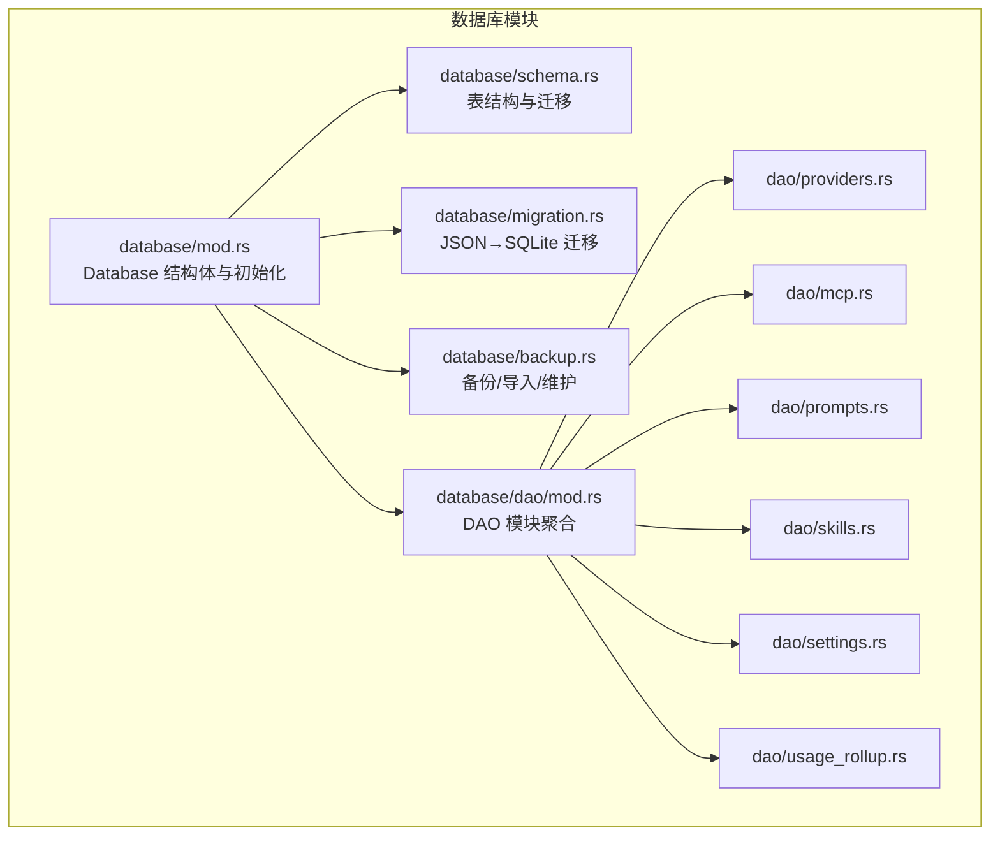
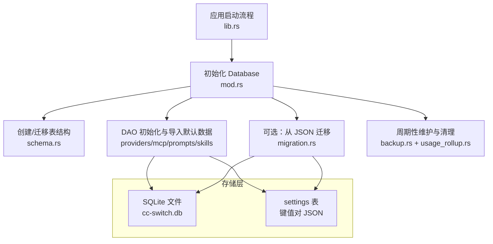
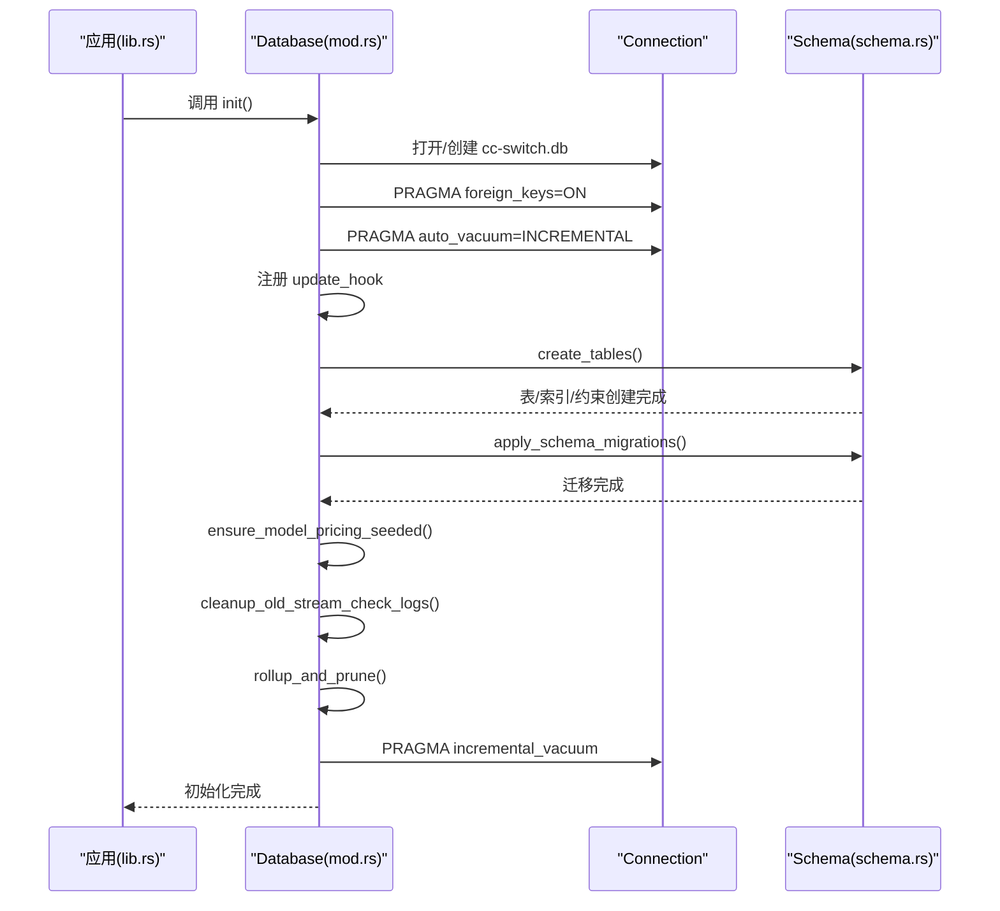
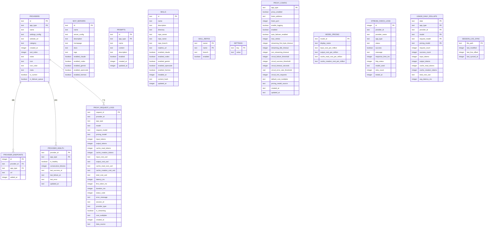
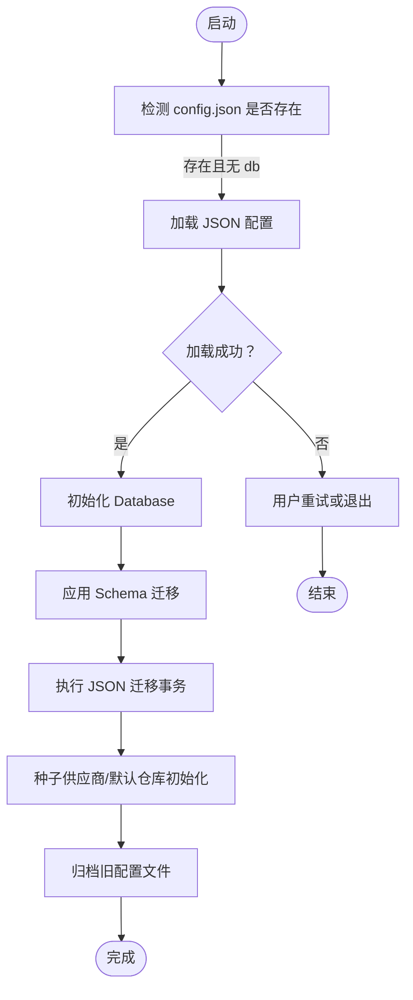
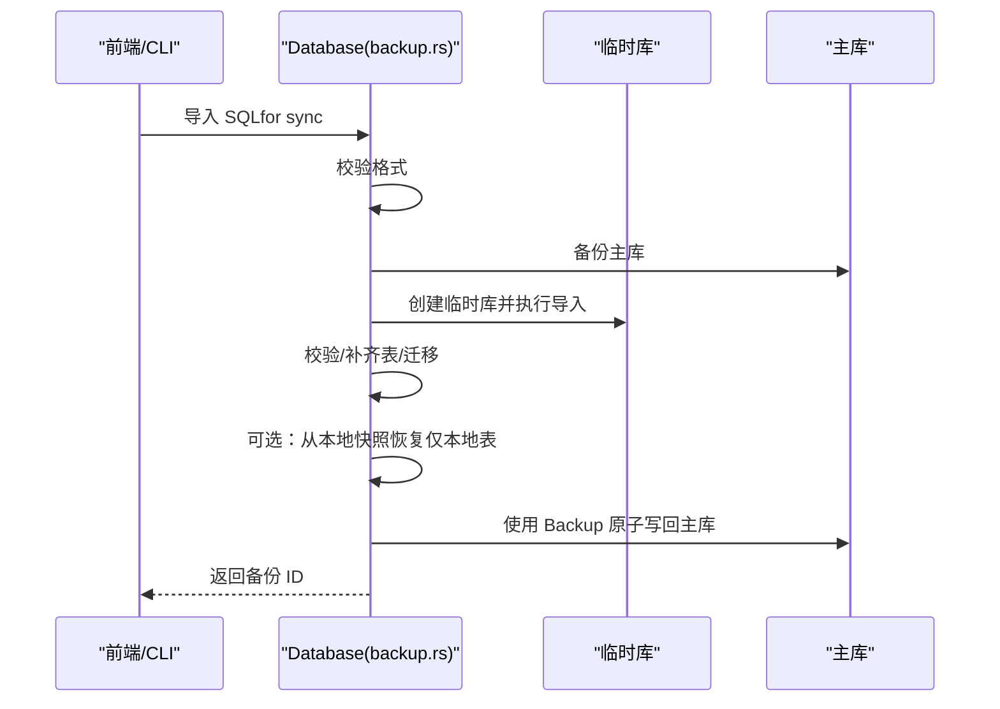
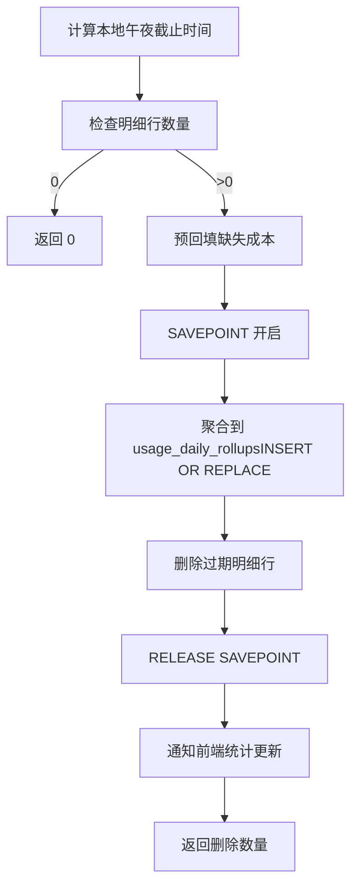
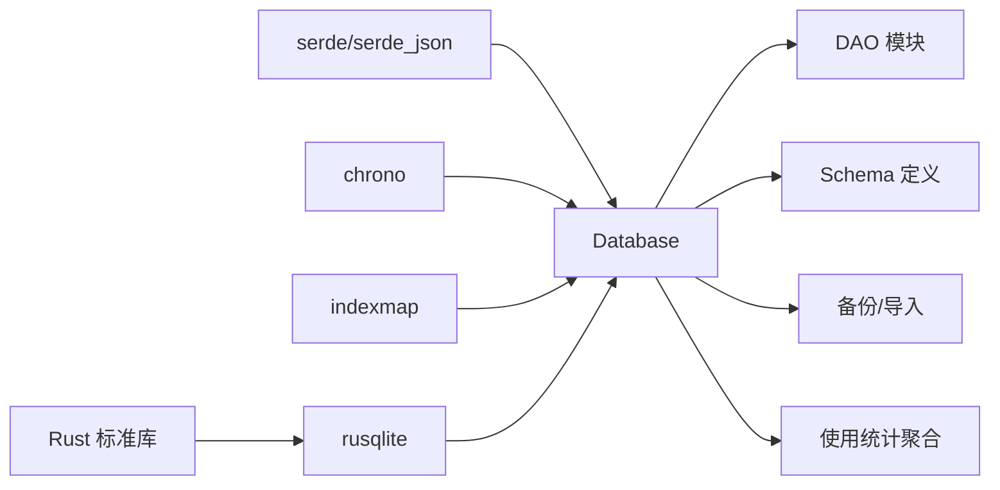

# 数据库设计

<cite>
**本文引用的文件**
- [src-tauri/src/database/mod.rs](file://src-tauri/src/database/mod.rs)
- [src-tauri/src/database/schema.rs](file://src-tauri/src/database/schema.rs)
- [src-tauri/src/database/migration.rs](file://src-tauri/src/database/migration.rs)
- [src-tauri/src/database/backup.rs](file://src-tauri/src/database/backup.rs)
- [src-tauri/src/database/dao/mod.rs](file://src-tauri/src/database/dao/mod.rs)
- [src-tauri/src/database/dao/providers.rs](file://src-tauri/src/database/dao/providers.rs)
- [src-tauri/src/database/dao/mcp.rs](file://src-tauri/src/database/dao/mcp.rs)
- [src-tauri/src/database/dao/prompts.rs](file://src-tauri/src/database/dao/prompts.rs)
- [src-tauri/src/database/dao/skills.rs](file://src-tauri/src/database/dao/skills.rs)
- [src-tauri/src/database/dao/settings.rs](file://src-tauri/src/database/dao/settings.rs)
- [src-tauri/src/database/dao/usage_rollup.rs](file://src-tauri/src/database/dao/usage_rollup.rs)
- [src-tauri/src/lib.rs](file://src-tauri/src/lib.rs)
- [Cargo.toml](file://src-tauri/Cargo.toml)
</cite>

## 目录
1. [简介](#简介)
2. [项目结构](#项目结构)
3. [核心组件](#核心组件)
4. [架构总览](#架构总览)
5. [详细组件分析](#详细组件分析)
6. [依赖分析](#依赖分析)
7. [性能考量](#性能考量)
8. [故障排查指南](#故障排查指南)
9. [结论](#结论)
10. [附录](#附录)

## 简介
本设计文档面向 CC Switch 的数据库系统，围绕其采用 SQLite 的双层存储策略（SQLite 同步数据 + JSON 设备设置）进行深入阐述。文档涵盖数据库架构、表结构设计、索引与约束、数据类型选择、迁移与版本兼容、并发安全、数据访问模式、缓存与性能优化、维护与故障排除等内容，帮助开发者与运维人员理解并维护该数据库系统。

## 项目结构
数据库相关代码集中在 src-tauri/src/database 目录，采用模块化分层：
- database/mod.rs：数据库入口与初始化、并发控制、变更钩子、自动清理与重建
- database/schema.rs：表结构定义、索引、约束、Schema 迁移
- database/migration.rs：从旧版 JSON 配置迁移至 SQLite
- database/backup.rs：数据库快照备份、SQL 导出/导入、周期性维护
- database/dao/*：领域数据访问对象（DAO），分别对应 providers、mcp、prompts、skills、settings、usage_rollup 等
- src-tauri/src/lib.rs：应用启动流程中数据库初始化、迁移与导入逻辑

图表来源
- [src-tauri/src/database/mod.rs:1-273](file://src-tauri/src/database/mod.rs#L1-L273)
- [src-tauri/src/database/schema.rs:1-800](file://src-tauri/src/database/schema.rs#L1-L800)
- [src-tauri/src/database/migration.rs:1-246](file://src-tauri/src/database/migration.rs#L1-L246)
- [src-tauri/src/database/backup.rs:1-861](file://src-tauri/src/database/backup.rs#L1-L861)
- [src-tauri/src/database/dao/mod.rs:1-20](file://src-tauri/src/database/dao/mod.rs#L1-L20)

章节来源
- [src-tauri/src/database/mod.rs:1-273](file://src-tauri/src/database/mod.rs#L1-L273)
- [src-tauri/src/database/schema.rs:1-800](file://src-tauri/src/database/schema.rs#L1-L800)
- [src-tauri/src/database/migration.rs:1-246](file://src-tauri/src/database/migration.rs#L1-L246)
- [src-tauri/src/database/backup.rs:1-861](file://src-tauri/src/database/backup.rs#L1-L861)
- [src-tauri/src/database/dao/mod.rs:1-20](file://src-tauri/src/database/dao/mod.rs#L1-L20)

## 核心组件
- Database 结构体：封装 rusqlite::Connection，使用 Mutex 保障多线程安全；提供初始化、内存数据库、自动清理、增量自动收缩等能力
- DAO 层：按领域划分，提供 CRUD 与业务查询接口，统一通过 Database impl 暴露
- Schema 与迁移：集中定义表结构、索引、约束与版本迁移逻辑
- 备份与导入：支持 SQL 导出/导入、二进制快照备份、周期性维护与清理
- 启动流程：应用启动时初始化数据库、执行 JSON 迁移、导入默认配置与种子供应商、执行使用统计聚合与清理

章节来源
- [src-tauri/src/database/mod.rs:72-180](file://src-tauri/src/database/mod.rs#L72-L180)
- [src-tauri/src/database/dao/mod.rs:1-20](file://src-tauri/src/database/dao/mod.rs#L1-L20)
- [src-tauri/src/lib.rs:363-446](file://src-tauri/src/lib.rs#L363-L446)

## 架构总览
数据库采用“SQLite 同步数据 + JSON 设备设置”的双层存储策略：
- SQLite：持久化核心业务数据（供应商、MCP、提示词、技能、代理配置、使用统计等），具备 ACID、外键约束、索引与迁移能力
- JSON：设备侧设置（如通用配置片段、代理整流器/优化器配置、日志配置等）以键值形式存储在 settings 表中，便于与外部工具交互与快速读写

图表来源
- [src-tauri/src/lib.rs:363-446](file://src-tauri/src/lib.rs#L363-L446)
- [src-tauri/src/database/mod.rs:92-160](file://src-tauri/src/database/mod.rs#L92-L160)
- [src-tauri/src/database/schema.rs:16-364](file://src-tauri/src/database/schema.rs#L16-L364)
- [src-tauri/src/database/migration.rs:10-65](file://src-tauri/src/database/migration.rs#L10-L65)
- [src-tauri/src/database/backup.rs:297-334](file://src-tauri/src/database/backup.rs#L297-L334)
- [src-tauri/src/database/dao/usage_rollup.rs:57-113](file://src-tauri/src/database/dao/usage_rollup.rs#L57-L113)

## 详细组件分析

### 数据库初始化与并发安全
- 初始化流程：创建配置目录、打开/创建数据库文件、启用外键、设置增量自动收缩、注册变更钩子、创建/迁移表、执行迁移、确保模型定价种子、启动清理与聚合
- 并发控制：rusqlite::Connection 非 Sync，通过 Mutex<Connection> 包装；提供 lock_conn! 宏简化加锁；DAO 方法均通过 Database impl 提供，避免直接暴露底层连接
- 变更钩子：注册 update_hook，监听 INSERT/UPDATE/DELETE，触发 WebDAV/S3 自动同步通知
- 自动清理：启动时清理过期流式检测日志、执行使用统计聚合与修剪、必要时执行增量 VACUUM

图表来源
- [src-tauri/src/lib.rs:363-421](file://src-tauri/src/lib.rs#L363-L421)
- [src-tauri/src/database/mod.rs:92-160](file://src-tauri/src/database/mod.rs#L92-L160)
- [src-tauri/src/database/schema.rs:16-364](file://src-tauri/src/database/schema.rs#L16-L364)
- [src-tauri/src/database/dao/usage_rollup.rs:57-113](file://src-tauri/src/database/dao/usage_rollup.rs#L57-L113)

章节来源
- [src-tauri/src/database/mod.rs:72-180](file://src-tauri/src/database/mod.rs#L72-L180)
- [src-tauri/src/database/schema.rs:16-364](file://src-tauri/src/database/schema.rs#L16-L364)
- [src-tauri/src/database/dao/usage_rollup.rs:57-113](file://src-tauri/src/database/dao/usage_rollup.rs#L57-L113)

### 表结构设计与关系
核心表与关系概览：
- providers：供应商主表，支持 app_type 复合主键，外键指向自身（故障转移队列）
- provider_endpoints：供应商自定义端点，与 providers 复合主键关联
- mcp_servers：MCP 服务器配置，启用标志按应用维度
- prompts：提示词，按 app_type 分组
- skills：技能统一结构，SSOT 目录 + 数据库存储
- skill_repos：技能仓库
- settings：通用键值设置（含 JSON 片段）
- proxy_config：代理配置（三行结构，按 app_type 主键）
- provider_health：供应商健康状态
- proxy_request_logs：请求日志明细，带使用统计字段
- model_pricing：模型定价
- stream_check_logs：流式检测日志
- usage_daily_rollups：每日使用聚合
- session_log_sync：会话日志同步状态

图表来源
- [src-tauri/src/database/schema.rs:25-296](file://src-tauri/src/database/schema.rs#L25-L296)

章节来源
- [src-tauri/src/database/schema.rs:25-296](file://src-tauri/src/database/schema.rs#L25-L296)

### 索引策略与数据类型
- 索引策略
  - proxy_request_logs：按 provider_id/app_type、created_at、model、session_id、status_code 建立索引，支撑高频查询与聚合
  - stream_check_logs：按 app_type/provider_id/tested_at 建立复合索引，支持健康状态与检测日志查询
  - providers：建立故障转移队列索引（app_type, in_failover_queue, sort_index）
  - usage_daily_rollups：按日期/应用/供应商/模型/维度组合建立复合主键，避免重复与提升聚合效率
- 数据类型选择
  - 时间戳统一使用 INTEGER（Unix 毫秒/秒），便于排序与范围查询
  - JSON 字段使用 TEXT 存储，配合 serde_json 序列化/反序列化
  - 成本与用量字段使用 TEXT 存储（如 '0'、'0.01'），避免浮点误差
  - 布尔值使用 INTEGER（0/1）存储，符合 SQLite 约定
- 约束与外键
  - 外键约束启用（PRAGMA foreign_keys=ON），确保数据一致性
  - 复合主键用于 app_type 维度的数据隔离（providers、prompts 等）

章节来源
- [src-tauri/src/database/schema.rs:201-247](file://src-tauri/src/database/schema.rs#L201-L247)
- [src-tauri/src/database/schema.rs:280-284](file://src-tauri/src/database/schema.rs#L280-L284)

### 数据迁移策略
- 版本兼容与迁移
  - SCHEMA_VERSION：当前 Schema 版本号，每次结构变更递增并在 schema.rs 中添加迁移逻辑
  - 迁移流程：启动时读取 user_version，逐版本迁移，使用 SAVEPOINT 保证原子性
  - 旧版 config.json 迁移：通过 migrate_from_json 将 MultiAppConfig 迁移至 SQLite，事务内执行，失败回滚
- 迁移验证
  - dry-run 模式：在内存数据库中验证迁移逻辑，避免部署风险
  - 基础校验：导入后校验核心表至少包含有效数据
- 迁移后处理
  - 归档旧配置文件（config.json.migrated）
  - 种子供应商与默认仓库初始化
  - 使用统计回填与聚合

图表来源
- [src-tauri/src/lib.rs:374-445](file://src-tauri/src/lib.rs#L374-L445)
- [src-tauri/src/database/migration.rs:10-65](file://src-tauri/src/database/migration.rs#L10-L65)
- [src-tauri/src/database/schema.rs:366-470](file://src-tauri/src/database/schema.rs#L366-L470)

章节来源
- [src-tauri/src/database/migration.rs:10-65](file://src-tauri/src/database/migration.rs#L10-L65)
- [src-tauri/src/database/schema.rs:366-470](file://src-tauri/src/database/schema.rs#L366-L470)
- [src-tauri/src/lib.rs:374-445](file://src-tauri/src/lib.rs#L374-L445)

### 备份与恢复
- 快照备份：使用 rusqlite::backup 将主库原子写入备份文件，支持周期性自动备份
- SQL 导出/导入：支持完整导出与同步专用导出（跳过本地数据），导入时在临时库执行，失败不污染主库
- 同步保护：导入同步 SQL 时可保留本地“仅本地表”数据（如使用统计明细、流式检测日志等）
- 维护清理：定期清理过期日志与聚合，必要时执行增量 VACUUM

图表来源
- [src-tauri/src/database/backup.rs:83-147](file://src-tauri/src/database/backup.rs#L83-L147)
- [src-tauri/src/database/backup.rs:297-334](file://src-tauri/src/database/backup.rs#L297-L334)

章节来源
- [src-tauri/src/database/backup.rs:45-147](file://src-tauri/src/database/backup.rs#L45-L147)
- [src-tauri/src/database/backup.rs:297-334](file://src-tauri/src/database/backup.rs#L297-L334)

### 数据访问模式与缓存策略
- DAO 访问模式：每个领域一个 DAO 模块，统一通过 Database impl 提供方法，DAO 内部使用参数化查询与事务保证一致性
- 缓存策略：当前未见专门的数据库层缓存；通过合理的索引与聚合（usage_daily_rollups）降低查询成本
- 读写分离：明细日志（proxy_request_logs）与聚合（usage_daily_rollups）分离，减少热路径上的写放大

章节来源
- [src-tauri/src/database/dao/mod.rs:1-20](file://src-tauri/src/database/dao/mod.rs#L1-L20)
- [src-tauri/src/database/dao/providers.rs:19-109](file://src-tauri/src/database/dao/providers.rs#L19-L109)
- [src-tauri/src/database/dao/mcp.rs:11-67](file://src-tauri/src/database/dao/mcp.rs#L11-L67)
- [src-tauri/src/database/dao/prompts.rs:11-54](file://src-tauri/src/database/dao/prompts.rs#L11-L54)
- [src-tauri/src/database/dao/skills.rs:16-62](file://src-tauri/src/database/dao/skills.rs#L16-L62)
- [src-tauri/src/database/dao/settings.rs:9-34](file://src-tauri/src/database/dao/settings.rs#L9-L34)
- [src-tauri/src/database/dao/usage_rollup.rs:57-113](file://src-tauri/src/database/dao/usage_rollup.rs#L57-L113)

### 使用统计与聚合
- 聚合策略：将过期明细日志按日期/应用/供应商/模型/维度聚合到 usage_daily_rollups，然后删除明细行
- 成本回填：在剪枝前尽力回填缺失的成本字段，避免统计偏差
- 过滤规则：使用 effective_usage_log_filter 过滤重复会话行，确保统计准确性

图表来源
- [src-tauri/src/database/dao/usage_rollup.rs:57-113](file://src-tauri/src/database/dao/usage_rollup.rs#L57-L113)
- [src-tauri/src/database/dao/usage_rollup.rs:115-179](file://src-tauri/src/database/dao/usage_rollup.rs#L115-L179)

章节来源
- [src-tauri/src/database/dao/usage_rollup.rs:57-179](file://src-tauri/src/database/dao/usage_rollup.rs#L57-L179)

## 依赖分析
- 外部依赖
  - rusqlite：SQLite 绑定，启用 backup、hooks、bundled 等特性
  - serde/serde_json：JSON 序列化/反序列化
  - chrono：时间处理与时区支持
  - indexmap：有序集合，保证遍历顺序稳定
- 内部依赖
  - DAO 模块依赖 database/mod.rs 提供的 Database 结构体与锁机制
  - schema.rs 与 migration.rs 共同维护表结构与迁移
  - backup.rs 与 usage_rollup.rs 依赖 schema 定义的表结构

图表来源
- [Cargo.toml:75-76](file://src-tauri/Cargo.toml#L75-L76)
- [src-tauri/src/database/mod.rs:42-46](file://src-tauri/src/database/mod.rs#L42-L46)

章节来源
- [Cargo.toml:25-83](file://src-tauri/Cargo.toml#L25-L83)
- [src-tauri/src/database/mod.rs:42-46](file://src-tauri/src/database/mod.rs#L42-L46)

## 性能考量
- 查询性能
  - 为高频查询字段建立索引（如 proxy_request_logs 的 provider_id/app_type、created_at、model、session_id、status_code）
  - 使用复合主键与索引避免重复与提升聚合效率
- 写入性能
  - 事务批量写入（迁移、导入、聚合）
  - 增量自动收缩（auto_vacuum=INCREMENTAL）减少碎片与空间膨胀
- 存储与 IO
  - 使用 Backup 原子写回，避免部分写入导致的不一致
  - 周期性维护（清理过期日志、增量 VACUUM）降低磁盘占用
- 数值精度
  - 成本与用量使用 TEXT 存储，避免浮点误差累积

章节来源
- [src-tauri/src/database/schema.rs:201-247](file://src-tauri/src/database/schema.rs#L201-L247)
- [src-tauri/src/database/mod.rs:182-253](file://src-tauri/src/database/mod.rs#L182-L253)
- [src-tauri/src/database/backup.rs:132-140](file://src-tauri/src/database/backup.rs#L132-L140)
- [src-tauri/src/database/dao/usage_rollup.rs:83-113](file://src-tauri/src/database/dao/usage_rollup.rs#L83-L113)

## 故障排查指南
- 数据库初始化失败
  - 检查配置目录权限与磁盘空间
  - 查看错误对话框提示，确认是否重试或退出
  - 关注日志中的 user_version 过新或迁移失败信息
- 迁移失败
  - 确认 JSON 配置可加载（导入前验证）
  - 检查磁盘空间与权限，确保事务可提交
  - 使用 dry-run 验证迁移逻辑
- 备份/恢复异常
  - 确认备份文件名合法（不含路径遍历、以 .db 结尾）
  - 导入前备份主库，导入失败会回滚
  - 同步导入时注意仅本地表数据的保留策略
- 使用统计异常
  - 检查 cutoff 计算是否受夏令时影响
  - 确认成本回填是否成功，必要时手动触发回填
- 并发与锁
  - 避免在持有锁期间执行耗时操作
  - 使用 DAO 提供的方法，避免直接操作底层连接

章节来源
- [src-tauri/src/lib.rs:374-445](file://src-tauri/src/lib.rs#L374-L445)
- [src-tauri/src/database/backup.rs:551-599](file://src-tauri/src/database/backup.rs#L551-L599)
- [src-tauri/src/database/dao/usage_rollup.rs:18-55](file://src-tauri/src/database/dao/usage_rollup.rs#L18-L55)

## 结论
CC Switch 的数据库系统通过 SQLite 提供可靠的 ACID 存储与灵活的迁移能力，结合 JSON 键值设置实现“同步数据 + 设备设置”的双层存储策略。通过完善的索引、事务与周期性维护，系统在性能与可靠性之间取得平衡。DAO 层清晰分离业务逻辑与数据访问，配合变更钩子与自动同步，满足多应用与多场景下的使用需求。

## 附录
- 启动流程要点
  - 检测 JSON 与 DB 存在性，必要时加载 JSON 并迁移
  - 初始化 Database，创建/迁移表，执行迁移与种子初始化
  - 导入默认配置与种子供应商，执行使用统计聚合与清理
- 常用 DAO 接口
  - providers：供应商 CRUD、故障转移队列、种子供应商初始化
  - mcp：MCP 服务器 CRUD
  - prompts：提示词 CRUD
  - skills：技能 CRUD、仓库 CRUD、默认仓库初始化
  - settings：通用设置、代理配置、整流器/优化器/日志配置
  - usage_rollup：使用统计聚合与清理

章节来源
- [src-tauri/src/lib.rs:517-762](file://src-tauri/src/lib.rs#L517-L762)
- [src-tauri/src/database/dao/providers.rs:19-109](file://src-tauri/src/database/dao/providers.rs#L19-L109)
- [src-tauri/src/database/dao/mcp.rs:11-67](file://src-tauri/src/database/dao/mcp.rs#L11-L67)
- [src-tauri/src/database/dao/prompts.rs:11-54](file://src-tauri/src/database/dao/prompts.rs#L11-L54)
- [src-tauri/src/database/dao/skills.rs:16-62](file://src-tauri/src/database/dao/skills.rs#L16-L62)
- [src-tauri/src/database/dao/settings.rs:9-34](file://src-tauri/src/database/dao/settings.rs#L9-L34)
- [src-tauri/src/database/dao/usage_rollup.rs:57-113](file://src-tauri/src/database/dao/usage_rollup.rs#L57-L113)