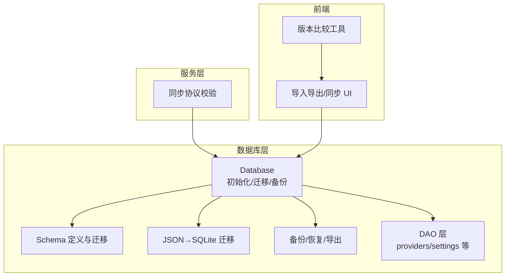
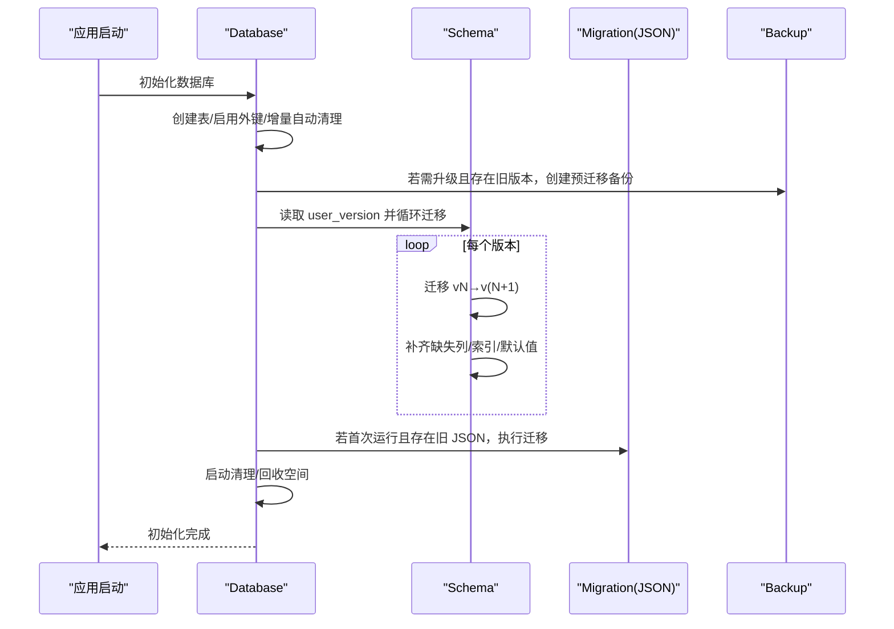
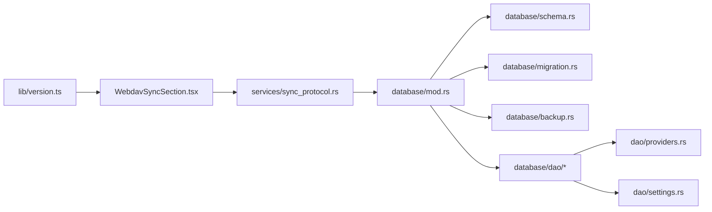

# 向后兼容性

<cite>
**本文引用的文件**
- [src-tauri/src/database/mod.rs](file://src-tauri/src/database/mod.rs)
- [src-tauri/src/database/schema.rs](file://src-tauri/src/database/schema.rs)
- [src-tauri/src/database/migration.rs](file://src-tauri/src/database/migration.rs)
- [src-tauri/src/database/backup.rs](file://src-tauri/src/database/backup.rs)
- [src-tauri/src/database/dao/mod.rs](file://src-tauri/src/database/dao/mod.rs)
- [src-tauri/src/database/dao/providers.rs](file://src-tauri/src/database/dao/providers.rs)
- [src-tauri/src/database/dao/settings.rs](file://src-tauri/src/database/dao/settings.rs)
- [src-tauri/src/database/tests.rs](file://src-tauri/src/database/tests.rs)
- [src/lib/version.ts](file://src/lib/version.ts)
- [src/lib/version.test.ts](file://src/lib/version.test.ts)
- [src-tauri/src/services/sync_protocol.rs](file://src-tauri/src/services/sync_protocol.rs)
- [src/components/settings/WebdavSyncSection.tsx](file://src/components/settings/WebdavSyncSection.tsx)
- [src-tauri/src/proxy/providers/claude.rs](file://src-tauri/src/proxy/providers/claude.rs)
- [src-tauri/src/codex_config.rs](file://src-tauri/src/codex_config.rs)
</cite>

## 目录
1. [简介](#简介)
2. [项目结构](#项目结构)
3. [核心组件](#核心组件)
4. [架构总览](#架构总览)
5. [详细组件分析](#详细组件分析)
6. [依赖分析](#依赖分析)
7. [性能考虑](#性能考虑)
8. [故障排查指南](#故障排查指南)
9. [结论](#结论)
10. [附录](#附录)

## 简介
本文件面向 CC Switch 的数据库向后兼容性策略，系统阐述如何在新版本中安全地兼容旧版本数据库，覆盖以下方面：
- 数据库 Schema 版本控制与迁移
- JSON → SQLite 的数据迁移流程
- 数据格式兼容性检查与字段向后兼容处理
- 版本间 API 兼容性保证与数据结构演进策略
- 兼容性测试方法与回归测试流程
- 向后兼容性破坏的处理方案与用户数据保护措施
- 不同版本间的配置差异与数据冲突处理

## 项目结构
数据库相关代码集中在 Rust 后端的 src-tauri/src/database 目录，前端提供导入导出与同步界面，版本比较逻辑位于前端 src/lib。

图表来源
- [src-tauri/src/database/mod.rs:1-273](file://src-tauri/src/database/mod.rs#L1-L273)
- [src-tauri/src/database/schema.rs:1-260](file://src-tauri/src/database/schema.rs#L1-L260)
- [src-tauri/src/database/migration.rs:1-246](file://src-tauri/src/database/migration.rs#L1-L246)
- [src-tauri/src/database/backup.rs:1-200](file://src-tauri/src/database/backup.rs#L1-L200)
- [src-tauri/src/database/dao/mod.rs:1-20](file://src-tauri/src/database/dao/mod.rs#L1-L20)
- [src-tauri/src/services/sync_protocol.rs:219-246](file://src-tauri/src/services/sync_protocol.rs#L219-L246)
- [src/components/settings/WebdavSyncSection.tsx:1591-1685](file://src/components/settings/WebdavSyncSection.tsx#L1591-L1685)
- [src/lib/version.ts:1-86](file://src/lib/version.ts#L1-L86)

章节来源
- [src-tauri/src/database/mod.rs:1-273](file://src-tauri/src/database/mod.rs#L1-L273)
- [src-tauri/src/database/schema.rs:1-260](file://src-tauri/src/database/schema.rs#L1-L260)
- [src-tauri/src/database/migration.rs:1-246](file://src-tauri/src/database/migration.rs#L1-L246)
- [src-tauri/src/database/backup.rs:1-200](file://src-tauri/src/database/backup.rs#L1-L200)
- [src-tauri/src/database/dao/mod.rs:1-20](file://src-tauri/src/database/dao/mod.rs#L1-L20)

## 核心组件
- 数据库初始化与迁移：负责打开数据库、创建表、应用 Schema 迁移、备份与维护。
- Schema 定义与迁移：定义表结构、版本号、逐版本迁移逻辑与列补齐。
- JSON→SQLite 迁移：从旧版 MultiAppConfig JSON 迁移到 SQLite。
- 备份与恢复：提供 SQL 导出/导入、二进制快照备份、周期性备份与恢复。
- DAO 层：面向领域对象的数据访问接口，保证读写兼容。
- 同步协议校验：远端数据库快照版本兼容性检查。
- 前端版本比较：避免误报更新提示，保障 UI 体验。

章节来源
- [src-tauri/src/database/mod.rs:92-160](file://src-tauri/src/database/mod.rs#L92-L160)
- [src-tauri/src/database/schema.rs:366-470](file://src-tauri/src/database/schema.rs#L366-L470)
- [src-tauri/src/database/migration.rs:10-65](file://src-tauri/src/database/migration.rs#L10-L65)
- [src-tauri/src/database/backup.rs:45-147](file://src-tauri/src/database/backup.rs#L45-L147)
- [src-tauri/src/database/dao/providers.rs:19-109](file://src-tauri/src/database/dao/providers.rs#L19-L109)
- [src-tauri/src/services/sync_protocol.rs:219-246](file://src-tauri/src/services/sync_protocol.rs#L219-L246)
- [src/lib/version.ts:64-85](file://src/lib/version.ts#L64-L85)

## 架构总览
数据库层采用“版本号 + 逐版本迁移 + 列补齐 + 外键约束 + 索引优化”的策略，确保从任意旧版本平滑升级至当前版本。迁移过程在事务内执行，失败即回滚；同时提供预迁移备份与增量自动清理，降低风险。

图表来源
- [src-tauri/src/database/mod.rs:96-160](file://src-tauri/src/database/mod.rs#L96-L160)
- [src-tauri/src/database/schema.rs:366-470](file://src-tauri/src/database/schema.rs#L366-L470)
- [src-tauri/src/database/migration.rs:10-65](file://src-tauri/src/database/migration.rs#L10-L65)
- [src-tauri/src/database/backup.rs:297-334](file://src-tauri/src/database/backup.rs#L297-L334)

## 详细组件分析

### 数据库初始化与迁移
- 初始化流程：创建目录、打开数据库、启用外键、设置增量自动清理、注册变更钩子、创建表、预迁移备份、应用迁移、确保增量自动清理、种子数据、启动清理与回收。
- 版本控制：通过 PRAGMA user_version 管理 Schema 版本，禁止高于当前应用支持的版本。
- 预迁移备份：当检测到旧版本且即将升级时，先备份数据库，失败也继续迁移，保证可恢复性。
- 启动维护：清理过期日志、滚动聚合、增量 vacuum，提升性能与空间利用率。

章节来源
- [src-tauri/src/database/mod.rs:96-160](file://src-tauri/src/database/mod.rs#L96-L160)
- [src-tauri/src/database/mod.rs:123-136](file://src-tauri/src/database/mod.rs#L123-L136)
- [src-tauri/src/database/mod.rs:144-157](file://src-tauri/src/database/mod.rs#L144-L157)

### Schema 定义与迁移
- 表结构：providers、provider_endpoints、mcp_servers、prompts、skills、skill_repos、settings、proxy_config、provider_health、proxy_request_logs、model_pricing、stream_check_logs、usage_daily_rollups、session_log_sync 等。
- 迁移链路：从 v0 到 v11 的逐版本迁移，每个版本只做必要改动，保证幂等与可回退。
- 列补齐与默认值：对旧表结构进行列补齐、默认值对齐、类型修正，确保新逻辑可用。
- 兼容性修复：如将单行 proxy_config 迁移为 per-app 三行结构，删除旧表与索引，重建索引。

章节来源
- [src-tauri/src/database/schema.rs:16-364](file://src-tauri/src/database/schema.rs#L16-L364)
- [src-tauri/src/database/schema.rs:366-470](file://src-tauri/src/database/schema.rs#L366-L470)
- [src-tauri/src/database/schema.rs:669-800](file://src-tauri/src/database/schema.rs#L669-L800)

### JSON→SQLite 迁移
- 迁移入口：在事务中依次迁移 Providers、MCP Servers、Prompts、Skills、Common Config。
- 数据完整性：使用 INSERT OR REPLACE 保证幂等；对自定义 endpoints 进行拆分写入。
- 旧版兼容：Skills 的安装状态不再直接写入新表，避免“数据库显示已安装但文件缺失”的不一致，后续通过前端扫描或启动时重建。

章节来源
- [src-tauri/src/database/migration.rs:10-65](file://src-tauri/src/database/migration.rs#L10-L65)
- [src-tauri/src/database/migration.rs:67-214](file://src-tauri/src/database/migration.rs#L67-L214)
- [src-tauri/src/database/migration.rs:216-244](file://src-tauri/src/database/migration.rs#L216-L244)

### 备份与恢复
- SQL 导出/导入：支持完整导出与同步专用导出（跳过本地数据），导入时先备份、在临时库执行、校验后再原子替换。
- 二进制快照备份：生成一致性快照，周期性备份与清理，保留策略可配置。
- 恢复流程：安全备份当前数据库，从备份文件恢复，再执行迁移与种子数据。
- 同步兼容：导入同步数据时可选择保留本地特定表（如日志类）以避免丢失本地状态。

章节来源
- [src-tauri/src/database/backup.rs:45-147](file://src-tauri/src/database/backup.rs#L45-L147)
- [src-tauri/src/database/backup.rs:149-233](file://src-tauri/src/database/backup.rs#L149-L233)
- [src-tauri/src/database/backup.rs:297-334](file://src-tauri/src/database/backup.rs#L297-L334)
- [src-tauri/src/database/backup.rs:551-599](file://src-tauri/src/database/backup.rs#L551-L599)

### DAO 层与数据访问
- Provider 读写：支持按 app_type 查询、获取当前 Provider、保存 Provider（含 endpoints），读写 JSON 字段并兼容旧结构。
- Settings：键值对设置、布尔 flag、通用配置片段（common_config_*）、全局代理 URL、废弃字段兼容读取。
- 兼容性：DAO 层在读取 JSON 字段时进行容错处理，避免因字段缺失导致崩溃。

章节来源
- [src-tauri/src/database/dao/providers.rs:19-109](file://src-tauri/src/database/dao/providers.rs#L19-L109)
- [src-tauri/src/database/dao/providers.rs:180-200](file://src-tauri/src/database/dao/providers.rs#L180-L200)
- [src-tauri/src/database/dao/settings.rs:16-57](file://src-tauri/src/database/dao/settings.rs#L16-L57)
- [src-tauri/src/database/dao/settings.rs:120-136](file://src-tauri/src/database/dao/settings.rs#L120-L136)

### 同步协议与版本兼容
- 远端快照版本校验：根据本地 DB 兼容版本与远端快照版本进行对比，不兼容时报错。
- UI 提示：前端在上传/下载确认对话框中展示远端数据库快照版本信息与兼容性提示，避免误操作。

章节来源
- [src-tauri/src/services/sync_protocol.rs:219-246](file://src-tauri/src/services/sync_protocol.rs#L219-L246)
- [src/components/settings/WebdavSyncSection.tsx:1591-1685](file://src/components/settings/WebdavSyncSection.tsx#L1591-L1685)

### 前端版本比较与 API 兼容
- 版本比较：严格的 semver 比较，预发布版本与正式版的优先级规则，避免抢先版误报更新。
- API 兼容：在代理适配与模型映射中保留向后兼容逻辑，兼容旧字段类型与命名风格。

章节来源
- [src/lib/version.ts:64-85](file://src/lib/version.ts#L64-L85)
- [src-tauri/src/proxy/providers/claude.rs:65-89](file://src-tauri/src/proxy/providers/claude.rs#L65-L89)
- [src-tauri/src/codex_config.rs:1840-1875](file://src-tauri/src/codex_config.rs#L1840-L1875)

## 依赖分析
- 数据库层依赖 rusqlite、serde、chrono 等，通过 Mutex 包装 Connection 实现多线程安全。
- 迁移与备份均在事务中执行，失败回滚，确保一致性。
- DAO 层通过 Database impl 提供统一入口，避免直接暴露底层细节。
- 前端版本比较与同步 UI 与后端协同，确保用户操作的安全性与可见性。

图表来源
- [src-tauri/src/database/mod.rs:1-273](file://src-tauri/src/database/mod.rs#L1-L273)
- [src-tauri/src/database/schema.rs:1-260](file://src-tauri/src/database/schema.rs#L1-L260)
- [src-tauri/src/database/migration.rs:1-246](file://src-tauri/src/database/migration.rs#L1-L246)
- [src-tauri/src/database/backup.rs:1-200](file://src-tauri/src/database/backup.rs#L1-L200)
- [src-tauri/src/database/dao/mod.rs:1-20](file://src-tauri/src/database/dao/mod.rs#L1-L20)
- [src-tauri/src/services/sync_protocol.rs:219-246](file://src-tauri/src/services/sync_protocol.rs#L219-L246)
- [src/components/settings/WebdavSyncSection.tsx:1591-1685](file://src/components/settings/WebdavSyncSection.tsx#L1591-L1685)
- [src/lib/version.ts:1-86](file://src/lib/version.ts#L1-L86)

## 性能考虑
- 增量自动清理：启用 PRAGMA auto_vacuum = INCREMENTAL，减少碎片与空间浪费。
- 索引优化：为高频查询建立索引（如请求日志、会话日志、健康状态等），并随迁移重建。
- 启动清理：定期清理过期日志与聚合数据，避免膨胀。
- 导出/导入：使用内存快照与原子替换，避免长时间锁表。

章节来源
- [src-tauri/src/database/mod.rs:182-253](file://src-tauri/src/database/mod.rs#L182-L253)
- [src-tauri/src/database/schema.rs:200-220](file://src-tauri/src/database/schema.rs#L200-L220)
- [src-tauri/src/database/backup.rs:235-295](file://src-tauri/src/database/backup.rs#L235-L295)

## 故障排查指南
- 迁移失败：检查 user_version 与迁移链路，确认是否存在未来版本标记；查看日志中的错误信息并回滚到预迁移备份。
- 导入失败：确认导入 SQL 文件头与格式，确保目标数据库处于一致状态；必要时使用同步导入保留本地数据。
- 同步不兼容：根据远端快照版本与本地兼容版本提示，决定是否升级或降级。
- 数据不一致：通过 DAO 层的容错读取与默认值补齐，避免因字段缺失导致异常；必要时手动修复 JSON 字段。

章节来源
- [src-tauri/src/database/schema.rs:372-470](file://src-tauri/src/database/schema.rs#L372-L470)
- [src-tauri/src/database/backup.rs:83-147](file://src-tauri/src/database/backup.rs#L83-L147)
- [src-tauri/src/services/sync_protocol.rs:219-246](file://src-tauri/src/services/sync_protocol.rs#L219-L246)
- [src-tauri/src/database/dao/providers.rs:46-48](file://src-tauri/src/database/dao/providers.rs#L46-L48)

## 结论
CC Switch 的数据库向后兼容性策略以“版本号 + 逐版本迁移 + 列补齐 + 外键约束 + 原子导入/备份”为核心，结合前端 UI 的兼容性提示与版本比较，形成完整的升级与回滚闭环。该策略在保证功能演进的同时，最大限度降低用户数据风险，确保跨版本升级的稳定性与可恢复性。

## 附录

### 兼容性测试方法与回归测试流程
- 单元测试：覆盖迁移链路、列补齐、默认值与类型修正、未来版本拒绝、v10→v11 聚合维度重建等。
- 集成测试：模拟从旧版本 JSON 迁移到 SQLite，以及从旧 Schema 版本升级到当前版本。
- 同步测试：验证远端快照版本与本地兼容版本的匹配与错误提示。
- 前端测试：验证版本比较逻辑与 UI 提示行为。

章节来源
- [src-tauri/src/database/tests.rs:154-225](file://src-tauri/src/database/tests.rs#L154-L225)
- [src-tauri/src/database/tests.rs:227-346](file://src-tauri/src/database/tests.rs#L227-L346)
- [src-tauri/src/database/tests.rs:348-350](file://src-tauri/src/database/tests.rs#L348-L350)
- [src/lib/version.test.ts:1-50](file://src/lib/version.test.ts#L1-L50)

### 数据格式兼容性检查与字段向后兼容处理
- JSON 字段容错：DAO 层在读取 JSON 时进行容错处理，避免缺失字段导致崩溃。
- 列补齐与默认值：迁移过程中补齐缺失列、修正默认值与类型，确保新逻辑可用。
- 兼容字段读取：对已废弃字段提供兼容读取方法，仅用于迁移与读取，不写入。

章节来源
- [src-tauri/src/database/dao/providers.rs:46-48](file://src-tauri/src/database/dao/providers.rs#L46-L48)
- [src-tauri/src/database/schema.rs:372-470](file://src-tauri/src/database/schema.rs#L372-L470)
- [src-tauri/src/database/dao/settings.rs:175-200](file://src-tauri/src/database/dao/settings.rs#L175-L200)

### 版本间 API 兼容性保证与数据结构演进策略
- 版本比较：严格的 semver 比较，避免抢先版误报更新。
- 代理与模型映射：保留旧字段类型与命名风格的兼容逻辑，确保旧配置仍可工作。
- 配置迁移：将旧配置结构迁移为新结构（如 proxy_config 三行化），并在迁移后补齐缺失字段。

章节来源
- [src/lib/version.ts:64-85](file://src/lib/version.ts#L64-L85)
- [src-tauri/src/proxy/providers/claude.rs:65-89](file://src-tauri/src/proxy/providers/claude.rs#L65-L89)
- [src-tauri/src/database/schema.rs:669-800](file://src-tauri/src/database/schema.rs#L669-L800)

### 向后兼容性破坏的处理方案与用户数据保护措施
- 预迁移备份：升级前自动备份数据库，失败也继续迁移，保证可恢复。
- 原子导入：导入 SQL 时在临时库执行，校验通过后再原子替换主库。
- 未来版本拒绝：若检测到高于当前应用支持的版本，直接拒绝迁移并提示升级。
- 恢复机制：提供备份列表、重命名、删除与从备份恢复的能力。

章节来源
- [src-tauri/src/database/mod.rs:123-136](file://src-tauri/src/database/mod.rs#L123-L136)
- [src-tauri/src/database/backup.rs:83-147](file://src-tauri/src/database/backup.rs#L83-L147)
- [src-tauri/src/database/schema.rs:372-385](file://src-tauri/src/database/schema.rs#L372-L385)
- [src-tauri/src/database/backup.rs:551-599](file://src-tauri/src/database/backup.rs#L551-L599)

### 不同版本间的配置差异与数据冲突处理
- 同步兼容性：远端快照版本与本地兼容版本不匹配时拒绝同步，避免数据冲突。
- 导入保留策略：同步导入时可选择保留本地特定表（如日志类），避免丢失本地状态。
- 配置迁移：将旧配置迁移为新结构，补齐缺失字段，确保新功能可用。

章节来源
- [src-tauri/src/services/sync_protocol.rs:219-246](file://src-tauri/src/services/sync_protocol.rs#L219-L246)
- [src-tauri/src/database/backup.rs:88-147](file://src-tauri/src/database/backup.rs#L88-L147)
- [src-tauri/src/database/schema.rs:669-800](file://src-tauri/src/database/schema.rs#L669-L800)