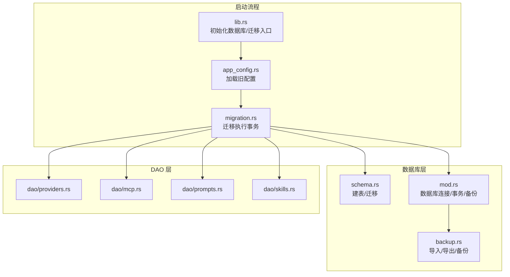
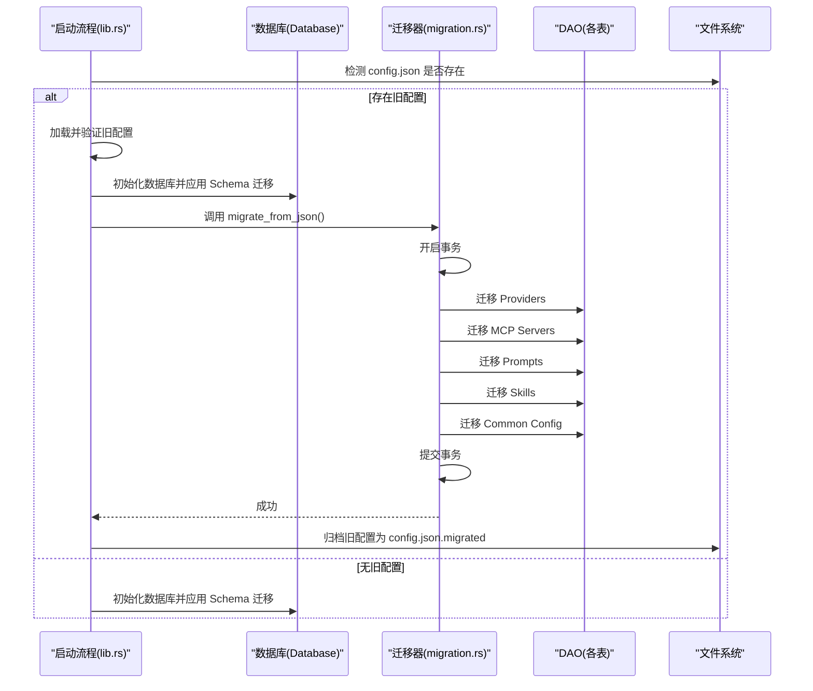
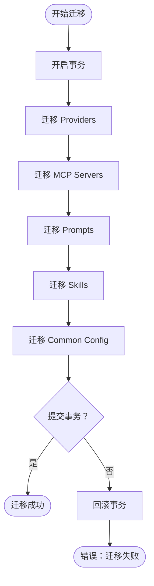
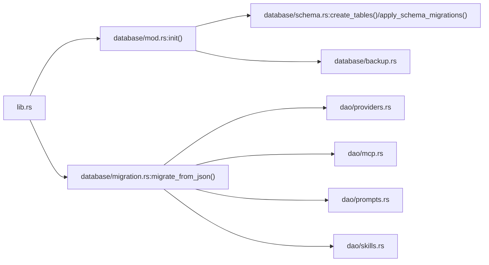

# 数据迁移步骤

<cite>
**本文引用的文件**
- [src-tauri/src/database/migration.rs](file://src-tauri/src/database/migration.rs)
- [src-tauri/src/database/mod.rs](file://src-tauri/src/database/mod.rs)
- [src-tauri/src/database/schema.rs](file://src-tauri/src/database/schema.rs)
- [src-tauri/src/database/backup.rs](file://src-tauri/src/database/backup.rs)
- [src-tauri/src/database/dao/providers.rs](file://src-tauri/src/database/dao/providers.rs)
- [src-tauri/src/database/dao/mcp.rs](file://src-tauri/src/database/dao/mcp.rs)
- [src-tauri/src/database/dao/prompts.rs](file://src-tauri/src/database/dao/prompts.rs)
- [src-tauri/src/database/dao/skills.rs](file://src-tauri/src/database/dao/skills.rs)
- [src-tauri/src/app_config.rs](file://src-tauri/src/app_config.rs)
- [src-tauri/src/lib.rs](file://src-tauri/src/lib.rs)
</cite>

## 目录
1. [简介](#简介)
2. [项目结构](#项目结构)
3. [核心组件](#核心组件)
4. [架构总览](#架构总览)
5. [详细组件分析](#详细组件分析)
6. [依赖关系分析](#依赖关系分析)
7. [性能考虑](#性能考虑)
8. [故障排查指南](#故障排查指南)
9. [结论](#结论)

## 简介
本文面向 CC Switch 的数据迁移流程，聚焦从旧版 MultiAppConfig（config.json）到 SQLite 数据库的完整迁移步骤。文档详细说明迁移顺序、事务处理、错误处理与回滚、数据完整性保障与一致性检查，并提供失败后的恢复策略。

## 项目结构
- Rust 后端负责数据库初始化、Schema 迁移、数据迁移与导入。
- 前端通过命令与服务层读写数据库，启动时执行一次性导入与种子数据填充。

图示来源
- [src-tauri/src/lib.rs:363-445](file://src-tauri/src/lib.rs#L363-L445)
- [src-tauri/src/database/migration.rs:10-65](file://src-tauri/src/database/migration.rs#L10-L65)
- [src-tauri/src/database/schema.rs:16-364](file://src-tauri/src/database/schema.rs#L16-L364)
- [src-tauri/src/database/mod.rs:92-160](file://src-tauri/src/database/mod.rs#L92-L160)
- [src-tauri/src/database/backup.rs:45-147](file://src-tauri/src/database/backup.rs#L45-L147)

章节来源
- [src-tauri/src/lib.rs:363-445](file://src-tauri/src/lib.rs#L363-L445)
- [src-tauri/src/database/migration.rs:10-65](file://src-tauri/src/database/migration.rs#L10-L65)
- [src-tauri/src/database/schema.rs:16-364](file://src-tauri/src/database/schema.rs#L16-L364)

## 核心组件
- 数据库初始化与迁移入口：负责检测旧配置、加载旧配置、执行迁移、归档旧配置。
- 迁移执行器：在单个事务内按顺序迁移 Providers、MCP Servers、Prompts、Skills、Common Config。
- DAO 层：提供各表的读写接口，确保迁移过程中的数据一致性。
- 备份与恢复：提供导入/导出 SQL、二进制快照备份、周期性维护与恢复能力。

章节来源
- [src-tauri/src/database/mod.rs:92-160](file://src-tauri/src/database/mod.rs#L92-L160)
- [src-tauri/src/database/migration.rs:10-65](file://src-tauri/src/database/migration.rs#L10-L65)
- [src-tauri/src/database/backup.rs:45-147](file://src-tauri/src/database/backup.rs#L45-L147)

## 架构总览
迁移流程分为“准备阶段”和“执行阶段”：
- 准备阶段：检测旧配置文件，加载并验证旧配置，创建数据库并应用 Schema 迁移。
- 执行阶段：在单个事务中依次迁移各表，成功后归档旧配置；失败则回滚并提示用户。

图示来源
- [src-tauri/src/lib.rs:374-445](file://src-tauri/src/lib.rs#L374-L445)
- [src-tauri/src/database/migration.rs:12-23](file://src-tauri/src/database/migration.rs#L12-L23)
- [src-tauri/src/database/dao/providers.rs:19-109](file://src-tauri/src/database/dao/providers.rs#L19-L109)
- [src-tauri/src/database/dao/mcp.rs:11-67](file://src-tauri/src/database/dao/mcp.rs#L11-L67)
- [src-tauri/src/database/dao/prompts.rs:11-54](file://src-tauri/src/database/dao/prompts.rs#L11-L54)
- [src-tauri/src/database/dao/skills.rs:16-62](file://src-tauri/src/database/dao/skills.rs#L16-L62)

## 详细组件分析

### 迁移顺序与数据转换
迁移严格遵循以下顺序，确保外键与依赖关系满足：
1) Providers
- 字段映射：id、app_type、name、settings_config、website_url、category、created_at、sort_index、notes、icon、icon_color、meta、is_current。
- 结构重组：将旧配置中的自定义 endpoints 从 meta 中剥离，写入 provider_endpoints 表。
- 数据格式：settings_config 与 meta 统一序列化为 JSON 文本存储。

2) MCP Servers
- 字段映射：id、name、server_config（JSON）、description、homepage、docs、tags（JSON 数组）、enabled_* 标志。
- 数据格式：server 与 tags 序列化为 JSON 文本存储。

3) Prompts
- 字段映射：id、app_type、name、content、description、enabled、created_at、updated_at。
- 数据格式：content 与 description 为文本；enabled 默认 1。

4) Skills
- 表结构变化：v3.10.0+ 采用统一结构，SSOT（~/.cc-switch/skills/）+ 数据库存储安装记录。
- 迁移策略：不再直接写入旧版安装状态，避免“数据库显示已安装但文件缺失”的不一致；通过前端「导入已有」或启动时扫描重建。

5) Common Config
- 字段映射：settings 表 key/value，分别写入 common_config_claude、common_config_codex、common_config_gemini。

章节来源
- [src-tauri/src/database/migration.rs:44-65](file://src-tauri/src/database/migration.rs#L44-L65)
- [src-tauri/src/database/migration.rs:67-118](file://src-tauri/src/database/migration.rs#L67-L118)
- [src-tauri/src/database/migration.rs:120-149](file://src-tauri/src/database/migration.rs#L120-L149)
- [src-tauri/src/database/migration.rs:151-188](file://src-tauri/src/database/migration.rs#L151-L188)
- [src-tauri/src/database/migration.rs:190-214](file://src-tauri/src/database/migration.rs#L190-L214)
- [src-tauri/src/database/migration.rs:216-244](file://src-tauri/src/database/migration.rs#L216-L244)

### 事务处理与错误处理
- 事务边界：迁移在单个 rusqlite 事务中执行，任一步骤失败将整体回滚，保证原子性。
- 错误传播：迁移器捕获底层数据库错误并转换为 AppError，向上抛出；启动流程对数据库初始化与迁移失败进行用户交互提示。
- 幂等性：DAO 层使用 INSERT OR REPLACE/UPSERT 语义，避免重复导入导致的主键冲突。

图示来源
- [src-tauri/src/database/migration.rs:12-23](file://src-tauri/src/database/migration.rs#L12-L23)
- [src-tauri/src/database/migration.rs:44-65](file://src-tauri/src/database/migration.rs#L44-L65)

章节来源
- [src-tauri/src/database/migration.rs:12-23](file://src-tauri/src/database/migration.rs#L12-L23)
- [src-tauri/src/database/migration.rs:44-65](file://src-tauri/src/database/migration.rs#L44-L65)

### 数据完整性与一致性检查
- 外键约束：数据库初始化时启用 PRAGMA foreign_keys = ON，确保引用完整性。
- 索引与约束：schema.rs 中定义各表主键、唯一索引与外键约束，迁移后应用 Schema 迁移确保历史表结构补齐。
- DAO 查询：DAO 层在读取时反序列化 JSON 字段，提供稳定的结构访问；写入时严格序列化，避免格式错误。
- 启动阶段校验：导入/种子数据前，通过 is_providers_empty、is_mcp_table_empty、is_prompts_table_empty 等判断决定是否执行导入，避免重复导入。

章节来源
- [src-tauri/src/database/mod.rs:107-116](file://src-tauri/src/database/mod.rs#L107-L116)
- [src-tauri/src/database/schema.rs:16-364](file://src-tauri/src/database/schema.rs#L16-L364)
- [src-tauri/src/database/dao/providers.rs:505-552](file://src-tauri/src/database/dao/providers.rs#L505-L552)
- [src-tauri/src/database/dao/mcp.rs:11-67](file://src-tauri/src/database/dao/mcp.rs#L11-L67)
- [src-tauri/src/database/dao/prompts.rs:11-54](file://src-tauri/src/database/dao/prompts.rs#L11-L54)

### 迁移失败处理与数据恢复
- 失败策略：迁移失败时回滚事务，保留旧配置不变；启动流程弹窗提示用户重试或退出。
- 恢复方案：
  - 备份与恢复：提供二进制快照备份与 SQL 导入/导出能力；导入时可选择保留本地“瞬态表”数据。
  - 预迁移备份：升级数据库版本时自动创建备份，降低风险。
  - 旧配置归档：迁移成功后将旧 config.json 重命名为 config.json.migrated，便于人工恢复。

章节来源
- [src-tauri/src/lib.rs:424-445](file://src-tauri/src/lib.rs#L424-L445)
- [src-tauri/src/database/backup.rs:94-147](file://src-tauri/src/database/backup.rs#L94-L147)
- [src-tauri/src/database/backup.rs:297-334](file://src-tauri/src/database/backup.rs#L297-L334)

## 依赖关系分析
- 启动流程依赖数据库初始化与迁移入口，数据库层依赖 schema 定义与 DAO 接口。
- 迁移器依赖 DAO 层完成具体表的写入；DAO 层依赖数据库连接与事务。
- 备份模块依赖数据库连接与 rusqlite Backup API，提供原子替换与一致性保障。

图示来源
- [src-tauri/src/lib.rs:363-445](file://src-tauri/src/lib.rs#L363-L445)
- [src-tauri/src/database/mod.rs:92-160](file://src-tauri/src/database/mod.rs#L92-L160)
- [src-tauri/src/database/schema.rs:16-364](file://src-tauri/src/database/schema.rs#L16-L364)
- [src-tauri/src/database/migration.rs:10-65](file://src-tauri/src/database/migration.rs#L10-L65)
- [src-tauri/src/database/backup.rs:45-147](file://src-tauri/src/database/backup.rs#L45-L147)

章节来源
- [src-tauri/src/lib.rs:363-445](file://src-tauri/src/lib.rs#L363-L445)
- [src-tauri/src/database/mod.rs:92-160](file://src-tauri/src/database/mod.rs#L92-L160)
- [src-tauri/src/database/migration.rs:10-65](file://src-tauri/src/database/migration.rs#L10-L65)

## 性能考虑
- 事务批处理：迁移在单事务中执行，减少多次提交带来的开销。
- 索引与查询：schema 中预先建立必要索引，DAO 查询使用精确列选择，避免全表扫描。
- 启动阶段增量导入：仅在表为空时执行导入，避免重复 IO。
- 维护任务：启动时执行增量 vacuum 与日志裁剪，保持数据库健康。

## 故障排查指南
- 数据库版本过新：当 user_version 高于当前应用支持版本时，迁移会提示升级应用后再试。
- 权限不足/磁盘空间不足：初始化与迁移失败时，弹窗提示用户备份配置目录并重试。
- 迁移失败：查看日志定位具体表与字段；确认旧配置 JSON 格式正确；必要时使用备份恢复。
- 导入/导出异常：检查 SQL 文件头与格式；导入时可选择保留本地瞬态表数据。

章节来源
- [src-tauri/src/database/schema.rs:372-470](file://src-tauri/src/database/schema.rs#L372-L470)
- [src-tauri/src/database/backup.rs:94-147](file://src-tauri/src/database/backup.rs#L94-L147)
- [src-tauri/src/lib.rs:1842-1870](file://src-tauri/src/lib.rs#L1842-L1870)

## 结论
CC Switch 的迁移流程通过“事务化迁移 + 多层校验 + 自动备份”的设计，确保从 MultiAppConfig 到 SQLite 的平滑过渡。严格的数据映射、外键约束与 DAO 幂等写入，有效保障了数据完整性与一致性；完善的错误处理与恢复机制，降低了迁移风险并提升了用户体验。