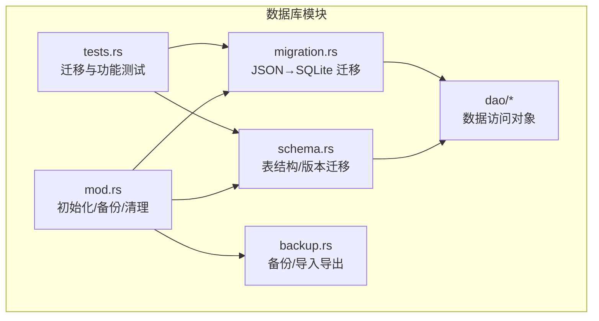
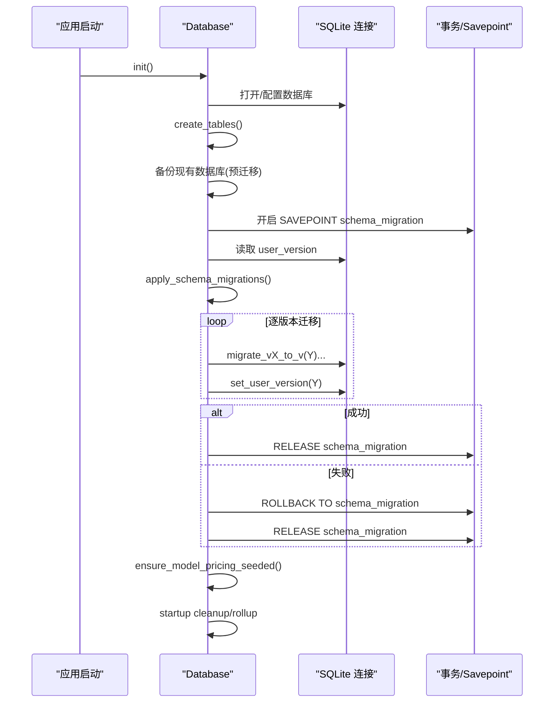
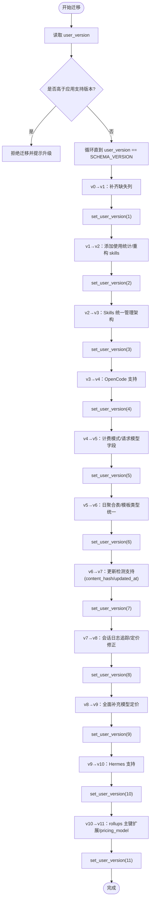
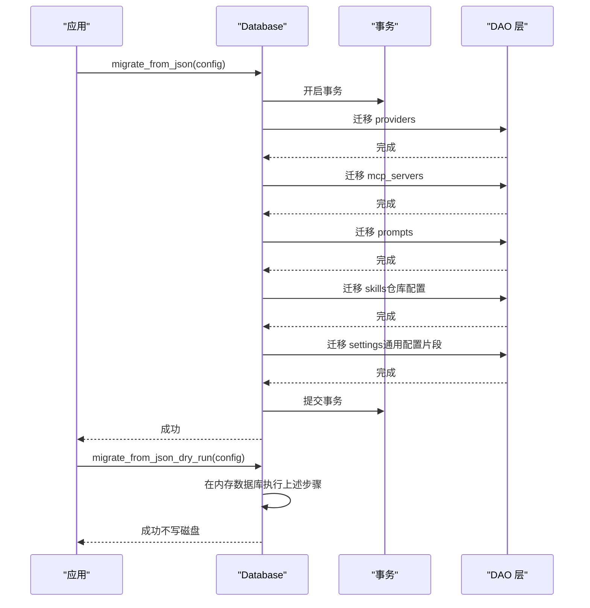
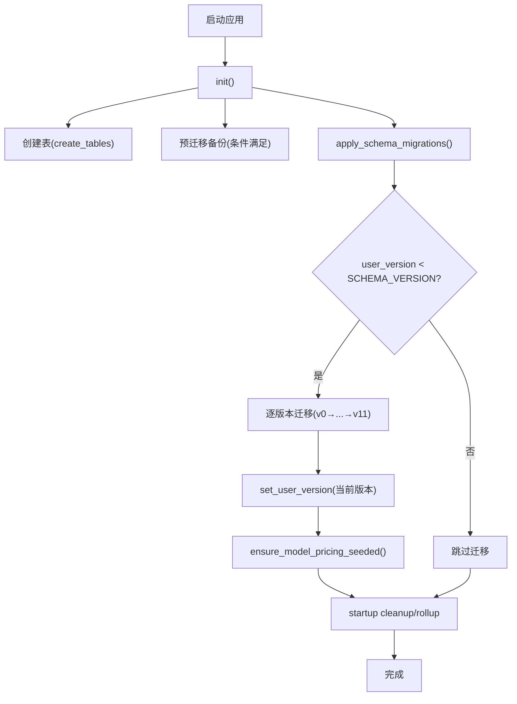
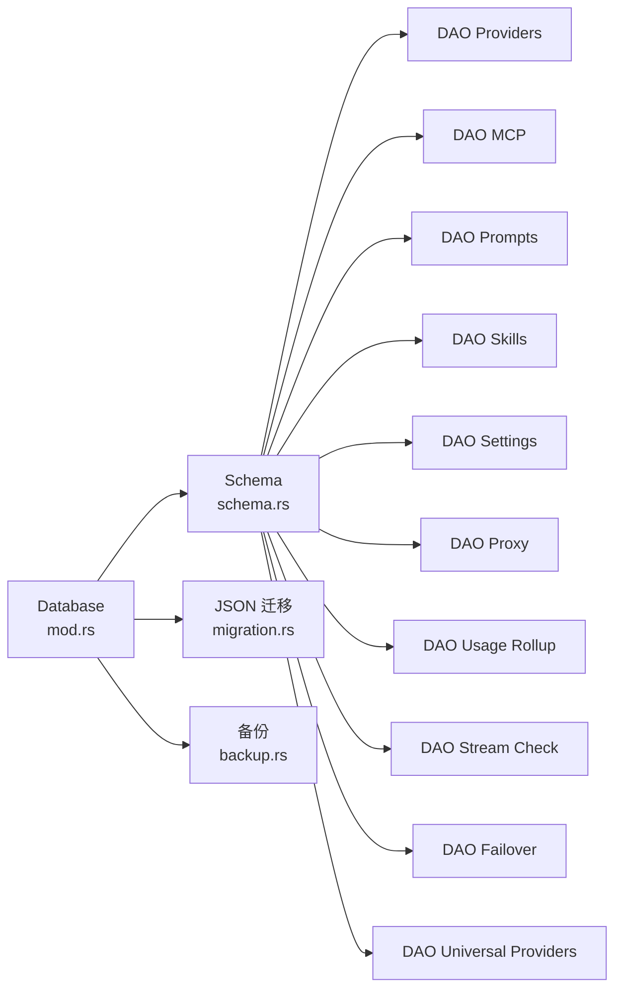

# 数据迁移策略

<cite>
**本文引用的文件**
- [src-tauri/src/database/mod.rs](file://src-tauri/src/database/mod.rs)
- [src-tauri/src/database/schema.rs](file://src-tauri/src/database/schema.rs)
- [src-tauri/src/database/migration.rs](file://src-tauri/src/database/migration.rs)
- [src-tauri/src/database/backup.rs](file://src-tauri/src/database/backup.rs)
- [src-tauri/src/database/tests.rs](file://src-tauri/src/database/tests.rs)
- [src-tauri/src/database/dao/providers.rs](file://src-tauri/src/database/dao/providers.rs)
- [src-tauri/src/database/dao/mcp.rs](file://src-tauri/src/database/dao/mcp.rs)
- [src-tauri/src/database/dao/prompts.rs](file://src-tauri/src/database/dao/prompts.rs)
- [src-tauri/src/database/dao/skills.rs](file://src-tauri/src/database/dao/skills.rs)
- [src-tauri/src/database/dao/settings.rs](file://src-tauri/src/database/dao/settings.rs)
- [src-tauri/src/database/dao/proxy.rs](file://src-tauri/src/database/dao/proxy.rs)
- [src-tauri/src/database/dao/usage_rollup.rs](file://src-tauri/src/database/dao/usage_rollup.rs)
- [src-tauri/src/database/dao/stream_check.rs](file://src-tauri/src/database/dao/stream_check.rs)
- [src-tauri/src/database/dao/failover.rs](file://src-tauri/src/database/dao/failover.rs)
- [src-tauri/src/database/dao/universal_providers.rs](file://src-tauri/src/database/dao/universal_providers.rs)
- [src-tauri/src/database/dao/settings.rs](file://src-tauri/src/database/dao/settings.rs)
- [src-tauri/src/database/dao/skill.rs](file://src-tauri/src/database/dao/skill.rs)
- [src-tauri/src/database/dao/usage_rollup.rs](file://src-tauri/src/database/dao/usage_rollup.rs)
- [src-tauri/src/database/dao/stream_check.rs](file://src-tauri/src/database/dao/stream_check.rs)
- [src-tauri/src/database/dao/failover.rs](file://src-tauri/src/database/dao/failover.rs)
- [src-tauri/src/database/dao/universal_providers.rs](file://src-tauri/src/database/dao/universal_providers.rs)
- [src-tauri/src/database/dao/settings.rs](file://src-tauri/src/database/dao/settings.rs)
- [src-tauri/src/database/dao/skill.rs](file://src-tauri/src/database/dao/skill.rs)
</cite>

## 目录
1. [简介](#简介)
2. [项目结构](#项目结构)
3. [核心组件](#核心组件)
4. [架构总览](#架构总览)
5. [详细组件分析](#详细组件分析)
6. [依赖分析](#依赖分析)
7. [性能考虑](#性能考虑)
8. [故障排除指南](#故障排除指南)
9. [结论](#结论)
10. [附录](#附录)

## 简介
本文件系统性阐述 CC Switch 的数据库迁移策略，覆盖版本管理机制（SCHEMA_VERSION）、迁移流程控制、各版本变更内容、数据转换与表结构调整、迁移安全机制（SAVEPOINT 事务、回滚与错误处理）、迁移测试策略与向后兼容性保障，以及从旧版本数据库升级到新版本的完整流程。

## 项目结构
数据库相关模块采用分层设计：
- database/mod.rs：数据库入口与初始化，负责数据库文件创建、外键约束、自动增量回收、迁移前后钩子与备份。
- database/schema.rs：表结构定义与版本迁移逻辑，包含 SCHEMA_VERSION、apply_schema_migrations、各版本迁移函数。
- database/migration.rs：JSON → SQLite 的一次性迁移（从旧版 MultiAppConfig 迁移到新表结构）。
- database/backup.rs：数据库备份与导入导出，支持一致性快照备份与 SQL 导出。
- database/dao/*：数据访问对象，提供对各业务表的 CRUD 与查询封装。
- database/tests.rs：Schema 迁移与功能测试，覆盖版本边界、列补齐、索引与种子数据等。

**图表来源**
- [src-tauri/src/database/mod.rs:1-273](file://src-tauri/src/database/mod.rs#L1-L273)
- [src-tauri/src/database/schema.rs:1-2559](file://src-tauri/src/database/schema.rs#L1-L2559)
- [src-tauri/src/database/migration.rs:1-246](file://src-tauri/src/database/migration.rs#L1-L246)
- [src-tauri/src/database/backup.rs:290-489](file://src-tauri/src/database/backup.rs#L290-L489)
- [src-tauri/src/database/tests.rs:1-834](file://src-tauri/src/database/tests.rs#L1-L834)

**章节来源**
- [src-tauri/src/database/mod.rs:1-273](file://src-tauri/src/database/mod.rs#L1-L273)
- [src-tauri/src/database/schema.rs:1-2559](file://src-tauri/src/database/schema.rs#L1-L2559)
- [src-tauri/src/database/migration.rs:1-246](file://src-tauri/src/database/migration.rs#L1-L246)
- [src-tauri/src/database/backup.rs:290-489](file://src-tauri/src/database/backup.rs#L290-L489)
- [src-tauri/src/database/tests.rs:1-834](file://src-tauri/src/database/tests.rs#L1-L834)

## 核心组件
- SCHEMA_VERSION：当前数据库 Schema 版本号，每次修改表结构时递增，并在 schema.rs 中添加相应迁移逻辑。
- apply_schema_migrations：根据 user_version 自动按顺序执行迁移，使用 SAVEPOINT 保护，失败时回滚。
- migrate_from_json：将旧版 MultiAppConfig JSON 数据一次性迁移到新表结构，使用事务包裹。
- 备份与回滚：启动前对现有数据库进行一致性快照备份，迁移失败时可回滚；同时提供 dry-run 模式验证迁移逻辑。
- DAO 层：提供对 providers、mcp_servers、prompts、skills、settings 等表的访问接口，确保迁移后数据一致性。

**章节来源**
- [src-tauri/src/database/mod.rs:50-52](file://src-tauri/src/database/mod.rs#L50-L52)
- [src-tauri/src/database/schema.rs:366-470](file://src-tauri/src/database/schema.rs#L366-L470)
- [src-tauri/src/database/migration.rs:10-65](file://src-tauri/src/database/migration.rs#L10-L65)
- [src-tauri/src/database/backup.rs:297-334](file://src-tauri/src/database/backup.rs#L297-L334)
- [src-tauri/src/database/tests.rs:613-685](file://src-tauri/src/database/tests.rs#L613-L685)

## 架构总览
数据库迁移分为两条主线：
- Schema 迁移：按 user_version 逐步升级，使用 SAVEPOINT 保护，失败即回滚。
- JSON 迁移：一次性将旧版 MultiAppConfig 迁移到新表结构，使用事务包裹，dry-run 在内存数据库验证。

**图表来源**
- [src-tauri/src/database/mod.rs:96-160](file://src-tauri/src/database/mod.rs#L96-L160)
- [src-tauri/src/database/schema.rs:372-470](file://src-tauri/src/database/schema.rs#L372-L470)

## 详细组件分析

### 版本管理与迁移控制
- SCHEMA_VERSION：当前 Schema 版本，用于控制迁移流程。
- user_version：SQLite PRAGMA，记录当前数据库 Schema 版本，迁移时逐版本推进。
- SAVEPOINT 事务：迁移过程中使用 SAVEPOINT 保护，失败时回滚到 SAVEPOINT 并释放，确保原子性。
- 版本上限校验：若数据库版本高于应用支持的最大版本，直接拒绝迁移并提示升级应用。

**图表来源**
- [src-tauri/src/database/schema.rs:372-470](file://src-tauri/src/database/schema.rs#L372-L470)
- [src-tauri/src/database/schema.rs:472-1271](file://src-tauri/src/database/schema.rs#L472-L1271)

**章节来源**
- [src-tauri/src/database/schema.rs:366-470](file://src-tauri/src/database/schema.rs#L366-L470)
- [src-tauri/src/database/schema.rs:472-1271](file://src-tauri/src/database/schema.rs#L472-L1271)

### 各版本迁移详解

#### v0 → v1：补齐缺失列
- providers：新增 category、created_at、sort_index、notes、icon、icon_color、meta、is_current。
- provider_endpoints：新增 added_at。
- mcp_servers：新增 description、homepage、docs、tags、enabled_codex、enabled_gemini。
- prompts：新增 description、enabled、created_at、updated_at。
- skills：新增 installed_at。
- skill_repos：新增 branch、enabled。

**章节来源**
- [src-tauri/src/database/schema.rs:472-530](file://src-tauri/src/database/schema.rs#L472-L530)

#### v1 → v2：添加使用统计表与重构
- providers：新增 cost_multiplier、limit_daily_usd、limit_monthly_usd、provider_type、in_failover_queue。
- proxy_config：补齐基础字段与超时配置。
- 删除 failover_queue 表，创建 providers.failover 索引。
- 新增 proxy_request_logs 表，包含成本与耗时字段。
- 新增 model_pricing 表并清空重种。
- 重构 skills 表（v1→v2），为后续 v2→v3 做准备。

**章节来源**
- [src-tauri/src/database/schema.rs:532-667](file://src-tauri/src/database/schema.rs#L532-L667)

#### v2 → v3：Skills 统一管理架构
- 旧数据库仅存储安装记录，真实 skill 文件在文件系统。
- 直接重建 skills 表结构，后续由启动时扫描文件系统重建数据。
- 设置 settings 标记：skills_ssot_migration_pending 与 skills_ssot_migration_snapshot，用于启动后迁移。

**章节来源**
- [src-tauri/src/database/schema.rs:890-974](file://src-tauri/src/database/schema.rs#L890-L974)

#### v3 → v4：OpenCode 支持
- mcp_servers 与 skills 表新增 enabled_opencode 列。

**章节来源**
- [src-tauri/src/database/schema.rs:976-998](file://src-tauri/src/database/schema.rs#L976-L998)

#### v4 → v5：计费模式配置与请求模型字段
- proxy_config 新增 default_cost_multiplier、pricing_model_source。
- proxy_request_logs 新增 request_model 字段。

**章节来源**
- [src-tauri/src/database/schema.rs:1000-1022](file://src-tauri/src/database/schema.rs#L1000-L1022)

#### v5 → v6：使用量日聚合表与模板类型统一
- 新增 usage_daily_rollups 日聚合表。
- 统一 Copilot 模板类型为 github_copilot。

**章节来源**
- [src-tauri/src/database/schema.rs:1024-1097](file://src-tauri/src/database/schema.rs#L1024-L1097)

#### v6 → v7：Skills 更新检测支持
- skills 表新增 content_hash、updated_at。

**章节来源**
- [src-tauri/src/database/schema.rs:1099-1112](file://src-tauri/src/database/schema.rs#L1099-L1112)

#### v7 → v8：会话日志追踪与定价修正
- proxy_request_logs 新增 data_source 列与使用量索引。
- 新增 session_log_sync 表。
- 修正国产模型定价（如 Doubao、DeepSeek、Kimi、MiniMax、GLM、MiMo 等）。

**章节来源**
- [src-tauri/src/database/schema.rs:1114-1172](file://src-tauri/src/database/schema.rs#L1114-L1172)

#### v8 → v9：全面补充模型定价
- 重建 model_pricing 表并清空重种默认定价数据。

**章节来源**
- [src-tauri/src/database/schema.rs:1174-1191](file://src-tauri/src/database/schema.rs#L1174-L1191)

#### v9 → v10：Hermes Agent 支持
- mcp_servers 与 skills 表新增 enabled_hermes 列。

**章节来源**
- [src-tauri/src/database/schema.rs:1193-1214](file://src-tauri/src/database/schema.rs#L1193-L1214)

#### v10 → v11：rollups 主键扩展与 pricing_model
- usage_daily_rollups 主键扩展，增加 request_model、pricing_model 维度。
- proxy_request_logs 新增 pricing_model 列，历史行回填策略明确。

**章节来源**
- [src-tauri/src/database/schema.rs:1216-1271](file://src-tauri/src/database/schema.rs#L1216-L1271)

### JSON → SQLite 迁移（一次性）
- 事务包裹：迁移在事务中执行，失败回滚。
- 数据来源：MultiAppConfig（apps、mcp.servers、prompts、skills、common_config_snippets）。
- 迁移步骤：
  - 迁移 Providers（含 endpoints）。
  - 迁移 MCP Servers。
  - 迁移 Prompts。
  - 迁移 Skills（仅迁移仓库配置，不写入安装状态，避免不一致）。
  - 迁移通用配置片段（settings）。
- Dry-run：在内存数据库验证迁移逻辑，不写入磁盘。

**图表来源**
- [src-tauri/src/database/migration.rs:10-65](file://src-tauri/src/database/migration.rs#L10-L65)
- [src-tauri/src/database/migration.rs:67-244](file://src-tauri/src/database/migration.rs#L67-L244)

**章节来源**
- [src-tauri/src/database/migration.rs:10-65](file://src-tauri/src/database/migration.rs#L10-L65)
- [src-tauri/src/database/migration.rs:67-244](file://src-tauri/src/database/migration.rs#L67-L244)

### 迁移安全性保障
- SAVEPOINT 事务：迁移使用 SAVEPOINT 包裹，失败自动回滚并释放。
- 版本上限校验：若数据库版本高于应用支持版本，直接拒绝迁移。
- 预迁移备份：升级前对现有数据库进行一致性快照备份，失败可回滚。
- Dry-run：在内存数据库验证迁移逻辑，确保部署前无误。
- 事务隔离：JSON 迁移与 Schema 迁移均在事务中执行，保证原子性。

**章节来源**
- [src-tauri/src/database/schema.rs:372-470](file://src-tauri/src/database/schema.rs#L372-L470)
- [src-tauri/src/database/mod.rs:123-136](file://src-tauri/src/database/mod.rs#L123-L136)
- [src-tauri/src/database/migration.rs:25-42](file://src-tauri/src/database/migration.rs#L25-L42)
- [src-tauri/src/database/backup.rs:297-334](file://src-tauri/src/database/backup.rs#L297-L334)

### 迁移测试策略与向后兼容性
- 测试覆盖：
  - 版本迁移：从 v1 到当前版本的链路验证。
  - 列补齐与默认值：验证各版本新增列的类型与默认值。
  - v10→v11：rollups 主键扩展与历史数据保留策略。
  - 代理配置单例修复：从单例结构修复为 per-app 三行结构。
  - JSON 迁移 dry-run：验证完整迁移路径。
  - 模型定价种子与修复：验证默认定价与历史修复。
- 向后兼容性：
  - 通过 has_column/table_exists 检查，幂等添加缺失列。
  - 旧数据不被破坏，新增字段提供合理默认值。
  - v2→v3 采用重建表结构并设置标记，启动后扫描文件系统重建数据，避免不一致。

**章节来源**
- [src-tauri/src/database/tests.rs:154-225](file://src-tauri/src/database/tests.rs#L154-L225)
- [src-tauri/src/database/tests.rs:271-293](file://src-tauri/src/database/tests.rs#L271-L293)
- [src-tauri/src/database/tests.rs:294-346](file://src-tauri/src/database/tests.rs#L294-L346)
- [src-tauri/src/database/tests.rs:348-427](file://src-tauri/src/database/tests.rs#L348-L427)
- [src-tauri/src/database/tests.rs:429-474](file://src-tauri/src/database/tests.rs#L429-L474)
- [src-tauri/src/database/tests.rs:476-611](file://src-tauri/src/database/tests.rs#L476-L611)
- [src-tauri/src/database/tests.rs:613-685](file://src-tauri/src/database/tests.rs#L613-L685)
- [src-tauri/src/database/tests.rs:687-744](file://src-tauri/src/database/tests.rs#L687-L744)
- [src-tauri/src/database/tests.rs:746-800](file://src-tauri/src/database/tests.rs#L746-L800)

### 从旧版本数据库升级到新版本的完整流程
- 启动流程：
  - 初始化数据库连接，启用外键与增量回收。
  - 若检测到旧版本数据库（user_version > 0 且 < SCHEMA_VERSION），先进行预迁移备份。
  - 创建表结构（补齐新增表）。
  - 执行 apply_schema_migrations，按 user_version 逐版本迁移。
  - 种子模型定价数据，启动清理与空间回收。
- JSON 迁移（首次运行或从旧 JSON 升级）：
  - 在内存数据库执行 dry-run，验证迁移逻辑。
  - 在事务中执行实际迁移，完成后提交。

**图表来源**
- [src-tauri/src/database/mod.rs:96-160](file://src-tauri/src/database/mod.rs#L96-L160)
- [src-tauri/src/database/schema.rs:366-470](file://src-tauri/src/database/schema.rs#L366-L470)

**章节来源**
- [src-tauri/src/database/mod.rs:96-160](file://src-tauri/src/database/mod.rs#L96-L160)
- [src-tauri/src/database/schema.rs:366-470](file://src-tauri/src/database/schema.rs#L366-L470)

## 依赖分析
- 组件耦合：
  - Database 作为门面，协调 schema.rs 与 migration.rs。
  - DAO 层依赖 schema.rs 中的表结构定义。
  - 备份模块与 Database 强耦合，依赖数据库路径与一致性备份。
- 外部依赖：
  - rusqlite：SQLite 操作与 PRAGMA。
  - serde/serde_json：JSON 序列化与迁移数据转换。
  - 日志：迁移过程与错误信息记录。

**图表来源**
- [src-tauri/src/database/mod.rs:1-273](file://src-tauri/src/database/mod.rs#L1-L273)
- [src-tauri/src/database/schema.rs:1-2559](file://src-tauri/src/database/schema.rs#L1-L2559)
- [src-tauri/src/database/migration.rs:1-246](file://src-tauri/src/database/migration.rs#L1-L246)
- [src-tauri/src/database/backup.rs:290-489](file://src-tauri/src/database/backup.rs#L290-L489)

**章节来源**
- [src-tauri/src/database/mod.rs:1-273](file://src-tauri/src/database/mod.rs#L1-L273)
- [src-tauri/src/database/schema.rs:1-2559](file://src-tauri/src/database/schema.rs#L1-L2559)

## 性能考虑
- 索引优化：在新增使用量表与代理日志表时创建必要索引，提升查询性能。
- 增量回收：启用 INCREMENTAL AUTO_VACUUM，减少碎片与空间浪费。
- 启动清理：定期裁剪旧日志与聚合数据，释放空间。
- 表重建：v10→v11 对 usage_daily_rollups 进行主键扩展重建，需注意大表性能影响，建议在维护窗口执行。

[本节为通用指导，无需特定文件引用]

## 故障排除指南
- 迁移失败：
  - 检查是否超过应用支持的最高版本，若是，升级应用后再试。
  - 查看日志中的 SAVEPOINT 错误信息，确认回滚是否成功。
  - 使用预迁移备份回滚到迁移前状态。
- JSON 迁移失败：
  - 使用 migrate_from_json_dry_run 在内存数据库验证配置有效性。
  - 检查 MultiAppConfig 结构与字段完整性。
- 备份与恢复：
  - 备份文件位于配置目录的 backups 子目录，按时间戳命名。
  - 如需恢复，可手动将备份文件重命名为 cc-switch.db。

**章节来源**
- [src-tauri/src/database/schema.rs:372-470](file://src-tauri/src/database/schema.rs#L372-L470)
- [src-tauri/src/database/mod.rs:123-136](file://src-tauri/src/database/mod.rs#L123-L136)
- [src-tauri/src/database/backup.rs:297-334](file://src-tauri/src/database/backup.rs#L297-L334)
- [src-tauri/src/database/migration.rs:25-42](file://src-tauri/src/database/migration.rs#L25-L42)

## 结论
CC Switch 的数据库迁移策略通过 SCHEMA_VERSION 与 user_version 实现严格的版本控制，结合 SAVEPOINT 事务、预迁移备份与 dry-run 验证，确保迁移过程的安全性与可回滚性。Schema 迁移与 JSON 迁移分别覆盖结构演进与数据迁移场景，配合完善的测试与向后兼容策略，为用户提供了稳定可靠的升级体验。

[本节为总结性内容，无需特定文件引用]

## 附录
- 关键 DAO 接口概览（迁移后数据一致性保障）：
  - Providers：供应商配置与当前选择标记。
  - MCP：MCP 服务器配置与启用标志。
  - Prompts：提示词集合与启用状态。
  - Skills：技能仓库与启用标志，v2→v3 后支持统一管理。
  - Settings：通用配置片段与迁移标记。
  - Proxy：代理配置与使用统计。
  - Usage Rollup：使用量日聚合。
  - Stream Check：流式检查日志。
  - Failover：故障转移队列。
  - Universal Providers：通用供应商面板。

**章节来源**
- [src-tauri/src/database/dao/providers.rs](file://src-tauri/src/database/dao/providers.rs)
- [src-tauri/src/database/dao/mcp.rs](file://src-tauri/src/database/dao/mcp.rs)
- [src-tauri/src/database/dao/prompts.rs](file://src-tauri/src/database/dao/prompts.rs)
- [src-tauri/src/database/dao/skills.rs](file://src-tauri/src/database/dao/skills.rs)
- [src-tauri/src/database/dao/settings.rs](file://src-tauri/src/database/dao/settings.rs)
- [src-tauri/src/database/dao/proxy.rs](file://src-tauri/src/database/dao/proxy.rs)
- [src-tauri/src/database/dao/usage_rollup.rs](file://src-tauri/src/database/dao/usage_rollup.rs)
- [src-tauri/src/database/dao/stream_check.rs](file://src-tauri/src/database/dao/stream_check.rs)
- [src-tauri/src/database/dao/failover.rs](file://src-tauri/src/database/dao/failover.rs)
- [src-tauri/src/database/dao/universal_providers.rs](file://src-tauri/src/database/dao/universal_providers.rs)