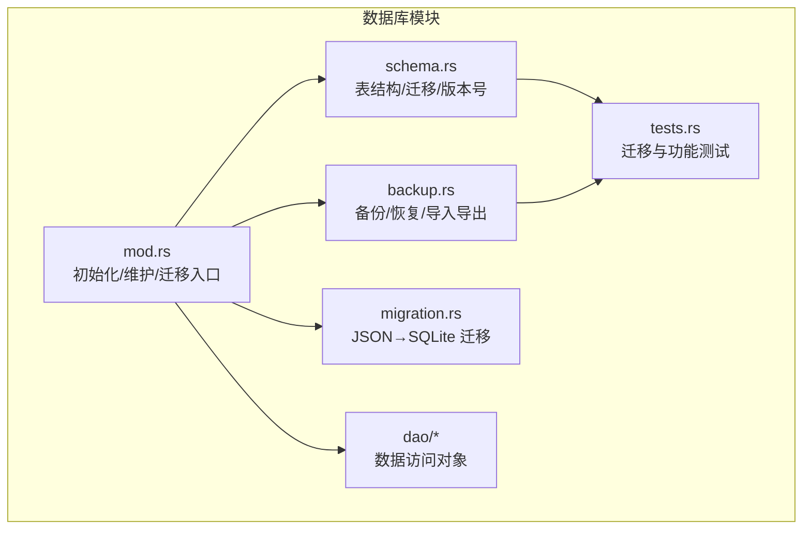
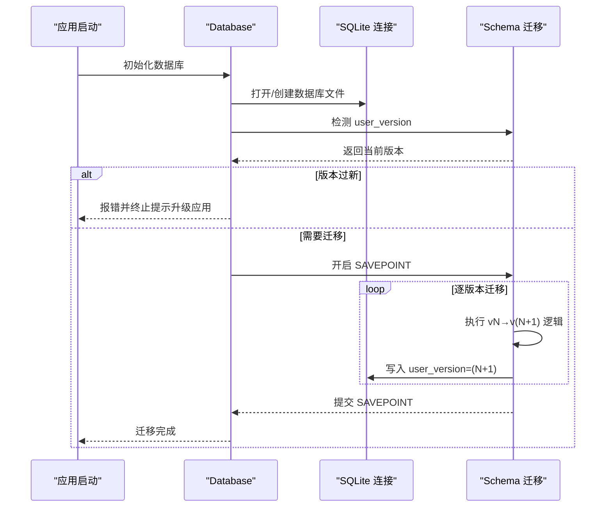
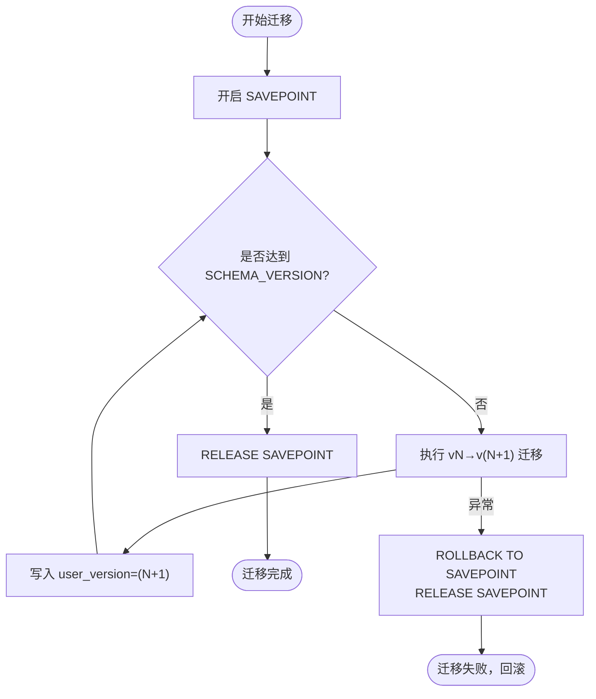
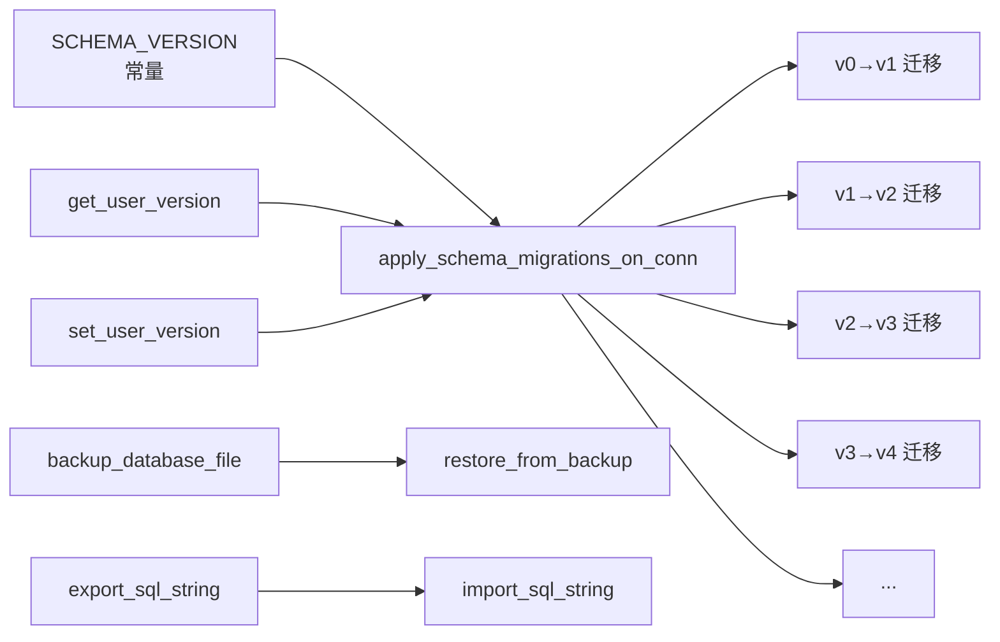

# 版本管理机制

<cite>
**本文档引用的文件**
- [src-tauri/src/database/mod.rs](file://src-tauri/src/database/mod.rs)
- [src-tauri/src/database/schema.rs](file://src-tauri/src/database/schema.rs)
- [src-tauri/src/database/backup.rs](file://src-tauri/src/database/backup.rs)
- [src-tauri/src/database/migration.rs](file://src-tauri/src/database/migration.rs)
- [src-tauri/src/database/tests.rs](file://src-tauri/src/database/tests.rs)
- [src-tauri/src/database/dao/usage_rollup.rs](file://src-tauri/src/database/dao/usage_rollup.rs)
</cite>

## 目录
1. [简介](#简介)
2. [项目结构](#项目结构)
3. [核心组件](#核心组件)
4. [架构总览](#架构总览)
5. [详细组件分析](#详细组件分析)
6. [依赖关系分析](#依赖关系分析)
7. [性能考虑](#性能考虑)
8. [故障排除指南](#故障排除指南)
9. [结论](#结论)
10. [附录](#附录)

## 简介
本文件系统性阐述 CC Switch 的数据库版本管理机制，重点围绕 SCHEMA_VERSION 的作用、版本升级流程控制、兼容性检查、SAVEPOINT 事务机制、版本回滚与错误处理策略，以及版本升级的测试与验证方法。目标是帮助开发者与运维人员理解并安全地维护数据库结构演进。

## 项目结构
数据库版本管理相关代码主要集中在 Rust 后端模块中，采用分层设计：
- database/mod.rs：数据库初始化、表创建、迁移入口、自动清理与维护
- database/schema.rs：表结构定义、SCHEMA_VERSION 常量、逐版本迁移逻辑
- database/backup.rs：数据库备份/恢复、周期性备份、导入导出
- database/migration.rs：从旧版 JSON 配置迁移至 SQLite 的逻辑
- database/dao/*：DAO 层（数据访问对象），负责具体业务表的 CRUD
- database/tests.rs：Schema 迁移与功能的单元测试

图表来源
- [src-tauri/src/database/mod.rs:1-273](file://src-tauri/src/database/mod.rs#L1-L273)
- [src-tauri/src/database/schema.rs:1-800](file://src-tauri/src/database/schema.rs#L1-L800)
- [src-tauri/src/database/backup.rs:1-800](file://src-tauri/src/database/backup.rs#L1-L800)
- [src-tauri/src/database/migration.rs:1-246](file://src-tauri/src/database/migration.rs#L1-L246)
- [src-tauri/src/database/tests.rs:1-200](file://src-tauri/src/database/tests.rs#L1-L200)

章节来源
- [src-tauri/src/database/mod.rs:1-273](file://src-tauri/src/database/mod.rs#L1-L273)
- [src-tauri/src/database/schema.rs:1-800](file://src-tauri/src/database/schema.rs#L1-L800)

## 核心组件
- SCHEMA_VERSION：当前数据库 Schema 的版本号常量，每次对表结构做出破坏性变更时递增，并在 schema.rs 中补充对应迁移逻辑。
- apply_schema_migrations_on_conn：在指定连接上执行迁移，使用 SAVEPOINT 包裹，确保迁移过程原子性。
- get_user_version/set_user_version：通过 PRAGMA user_version 读写数据库版本号，作为迁移触发与兼容性检查的依据。
- pre-migration backup：在从旧版本升级时，自动创建数据库快照备份，降低升级风险。
- DAO 层的 SAVEPOINT 使用：在复杂写入场景（如用量归档）中使用 SAVEPOINT 保障原子性与可回滚性。

章节来源
- [src-tauri/src/database/mod.rs:50-52](file://src-tauri/src/database/mod.rs#L50-L52)
- [src-tauri/src/database/schema.rs:366-470](file://src-tauri/src/database/schema.rs#L366-L470)
- [src-tauri/src/database/schema.rs:2412-2426](file://src-tauri/src/database/schema.rs#L2412-L2426)
- [src-tauri/src/database/mod.rs:123-136](file://src-tauri/src/database/mod.rs#L123-L136)

## 架构总览
数据库版本管理的关键流程如下：
- 应用启动时，初始化数据库连接并创建基础表
- 检测 user_version，若小于当前 SCHEMA_VERSION，则进入迁移流程
- 迁移在 SAVEPOINT 内执行，逐版本递增，每个版本完成后写入新的 user_version
- 若遇到未来版本（user_version > SCHEMA_VERSION），拒绝迁移并提示升级应用
- 升级前自动创建备份，便于回滚
- 启动后执行周期性维护（清理旧日志、用量归档、增量 VACUUM）

图表来源
- [src-tauri/src/database/mod.rs:118-142](file://src-tauri/src/database/mod.rs#L118-L142)
- [src-tauri/src/database/schema.rs:372-470](file://src-tauri/src/database/schema.rs#L372-L470)
- [src-tauri/src/database/schema.rs:2412-2426](file://src-tauri/src/database/schema.rs#L2412-L2426)

## 详细组件分析

### SCHEMA_VERSION 与版本号管理策略
- SCHEMA_VERSION 为当前 Schema 版本号，位于 mod.rs 中，作为迁移的上限与兼容性检查依据。
- 每次破坏性结构变更（新增/删除/重命名关键列、表结构重组）均需：
  - 提升 SCHEMA_VERSION
  - 在 schema.rs 中实现 vN→v(N+1) 的迁移函数
  - 在 apply_schema_migrations_on_conn 中增加对应分支
- 版本检测逻辑：
  - 若 user_version > SCHEMA_VERSION：拒绝迁移，提示“数据库版本过新，请升级应用”
  - 若 user_version = 0：自动补齐缺失列并设置为当前版本
  - 其他情况：循环执行 vN→v(N+1)，直到达到 SCHEMA_VERSION

章节来源
- [src-tauri/src/database/mod.rs:50-52](file://src-tauri/src/database/mod.rs#L50-L52)
- [src-tauri/src/database/schema.rs:372-470](file://src-tauri/src/database/schema.rs#L372-L470)
- [src-tauri/src/database/tests.rs:154-184](file://src-tauri/src/database/tests.rs#L154-L184)

### 版本升级流程控制
- 触发条件：
  - 应用启动时调用 apply_schema_migrations
  - 若 user_version 缺失（0）或低于当前版本，触发迁移
- 迁移策略：
  - 逐版本递增，每个版本完成后立即写入 user_version
  - 使用 SAVEPOINT 包裹整个迁移过程，任一步骤失败即回滚
- 兼容性检查：
  - 未来版本（user_version > SCHEMA_VERSION）直接拒绝
  - 旧版单实例 proxy_config 自动修复为三行结构
  - 旧版 skills 表结构在 v2→v3 时重建，保留安装快照并在启动后扫描文件系统重建

章节来源
- [src-tauri/src/database/schema.rs:372-470](file://src-tauri/src/database/schema.rs#L372-L470)
- [src-tauri/src/database/schema.rs:669-804](file://src-tauri/src/database/schema.rs#L669-L804)
- [src-tauri/src/database/schema.rs:890-974](file://src-tauri/src/database/schema.rs#L890-L974)

### SAVEPOINT 事务机制与安全性
- 迁移事务保护：
  - apply_schema_migrations_on_conn 开启 SAVEPOINT，失败时 ROLLBACK TO SAVEPOINT 并 RELEASE
  - 保证迁移过程原子性，避免部分迁移导致的不一致
- DAO 层事务保护：
  - 用量归档/清理使用 SAVEPOINT 包裹，成功则 RELEASE，失败则 ROLLBACK TO SAVEPOINT
  - 通过事务确保统计表与明细表的一致性

图表来源
- [src-tauri/src/database/schema.rs:372-470](file://src-tauri/src/database/schema.rs#L372-L470)
- [src-tauri/src/database/dao/usage_rollup.rs:87-112](file://src-tauri/src/database/dao/usage_rollup.rs#L87-L112)

章节来源
- [src-tauri/src/database/schema.rs:372-470](file://src-tauri/src/database/schema.rs#L372-L470)
- [src-tauri/src/database/dao/usage_rollup.rs:87-112](file://src-tauri/src/database/dao/usage_rollup.rs#L87-L112)

### 版本回滚机制与错误处理
- 预升级备份：
  - 从旧版本升级前自动创建数据库快照备份，文件名包含时间戳
  - 失败时可使用 restore_from_backup 从备份恢复
- 导入/恢复安全：
  - import_sql_string_inner 在临时数据库执行导入，失败不污染主库
  - 支持按表粒度保留本地数据（如日志类表），避免同步丢失
- 错误处理：
  - 迁移失败：ROLLBACK TO SAVEPOINT，记录错误并终止
  - 未来版本：直接报错，提示升级应用
  - 导入格式校验：仅接受 CC Switch 导出的 SQL 文件头

章节来源
- [src-tauri/src/database/mod.rs:123-136](file://src-tauri/src/database/mod.rs#L123-L136)
- [src-tauri/src/database/backup.rs:102-147](file://src-tauri/src/database/backup.rs#L102-L147)
- [src-tauri/src/database/backup.rs:551-599](file://src-tauri/src/database/backup.rs#L551-L599)
- [src-tauri/src/database/backup.rs:166-177](file://src-tauri/src/database/backup.rs#L166-L177)

### 版本升级测试方法与验证流程
- 测试覆盖点：
  - 设置 user_version=0，验证自动迁移至当前版本
  - 设置 user_version>当前版本，验证拒绝迁移并提示
  - 旧版表结构（如 v1）迁移，验证新增列补齐与默认值
  - 旧版 skills 表结构迁移，验证重建与迁移标记
  - 旧版 proxy_config 单例结构修复为三行结构
- 验证要点：
  - 迁移后 user_version 等于 SCHEMA_VERSION
  - 关键列存在且约束一致（NOT NULL、默认值）
  - 旧数据不丢失（如旧 provider/skill 记录）
  - 特定版本迁移（如 v10→v11）保留 request_model/pricing_model 维度

章节来源
- [src-tauri/src/database/tests.rs:154-184](file://src-tauri/src/database/tests.rs#L154-L184)
- [src-tauri/src/database/tests.rs:186-225](file://src-tauri/src/database/tests.rs#L186-L225)
- [src-tauri/src/database/tests.rs:227-233](file://src-tauri/src/database/tests.rs#L227-L233)
- [src-tauri/src/database/tests.rs:400-427](file://src-tauri/src/database/tests.rs#L400-L427)
- [src-tauri/src/database/tests.rs:429-474](file://src-tauri/src/database/tests.rs#L429-L474)
- [src-tauri/src/database/tests.rs:476-600](file://src-tauri/src/database/tests.rs#L476-L600)

## 依赖关系分析
- 版本管理依赖关系：
  - SCHEMA_VERSION 作为迁移上限，决定迁移分支数量
  - get_user_version/set_user_version 作为迁移触发与兼容性检查的唯一依据
  - apply_schema_migrations_on_conn 串联所有迁移步骤，依赖 DAO 层辅助（如索引、种子数据）
- 外部集成点：
  - 备份/恢复与文件系统交互，备份目录位于应用配置目录下的 backups 子目录
  - 导入/导出 SQL 时写入 PRAGMA user_version，确保导入后版本一致

图表来源
- [src-tauri/src/database/mod.rs:50-52](file://src-tauri/src/database/mod.rs#L50-L52)
- [src-tauri/src/database/schema.rs:372-470](file://src-tauri/src/database/schema.rs#L372-L470)
- [src-tauri/src/database/schema.rs:2412-2426](file://src-tauri/src/database/schema.rs#L2412-L2426)
- [src-tauri/src/database/backup.rs:297-334](file://src-tauri/src/database/backup.rs#L297-L334)
- [src-tauri/src/database/backup.rs:551-599](file://src-tauri/src/database/backup.rs#L551-L599)
- [src-tauri/src/database/backup.rs:386-473](file://src-tauri/src/database/backup.rs#L386-L473)

章节来源
- [src-tauri/src/database/schema.rs:372-470](file://src-tauri/src/database/schema.rs#L372-L470)
- [src-tauri/src/database/backup.rs:297-334](file://src-tauri/src/database/backup.rs#L297-L334)

## 性能考虑
- 增量自动清理：
  - 启动时执行清理与增量 VACUUM，减少碎片与空间膨胀
- 索引优化：
  - 使用表达式索引提升跨源去重查询性能
- 迁移性能：
  - 迁移在 SAVEPOINT 内执行，避免频繁 IO
  - 对大表操作建议在维护窗口执行，避免影响在线服务

## 故障排除指南
- 迁移失败：
  - 检查日志中的错误信息，确认是否为 SAVEPOINT 回滚导致
  - 使用备份恢复：restore_from_backup
- 未来版本错误：
  - 升级应用至最新版本后再尝试
- 导入失败：
  - 确认导入文件为 CC Switch 导出的 SQL（带特定头部）
  - 使用 import_sql_string_for_sync 保留本地日志类表

章节来源
- [src-tauri/src/database/schema.rs:372-470](file://src-tauri/src/database/schema.rs#L372-L470)
- [src-tauri/src/database/backup.rs:551-599](file://src-tauri/src/database/backup.rs#L551-L599)
- [src-tauri/src/database/backup.rs:166-177](file://src-tauri/src/database/backup.rs#L166-L177)

## 结论
CC Switch 的数据库版本管理通过 SCHEMA_VERSION 与 PRAGMA user_version 实现严格的版本控制，结合 SAVEPOINT 事务确保迁移过程的原子性与可回滚性。预升级备份与导入/导出的安全机制进一步提升了升级的安全性。完善的测试覆盖验证了迁移链路的正确性与兼容性，为长期演进提供了可靠保障。

## 附录
- 版本升级最佳实践：
  - 升级前备份数据库
  - 在低峰期执行升级
  - 关注迁移日志，及时处理异常
- 常见问题排查清单：
  - user_version 是否正确
  - 迁移是否被未来版本限制
  - SAVEPOINT 是否正常提交/回滚
  - 备份文件是否存在且可恢复