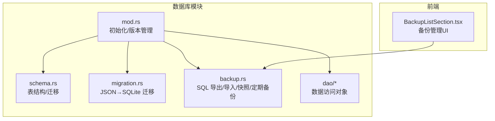
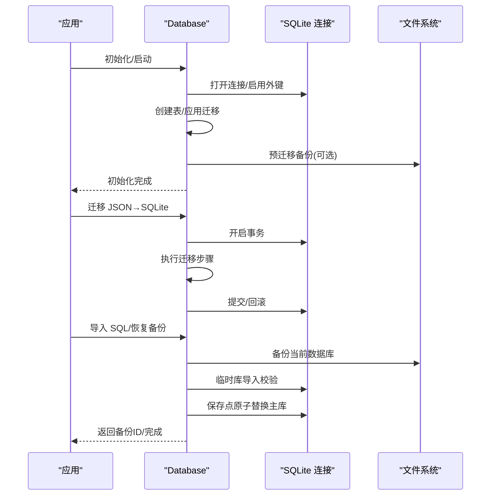
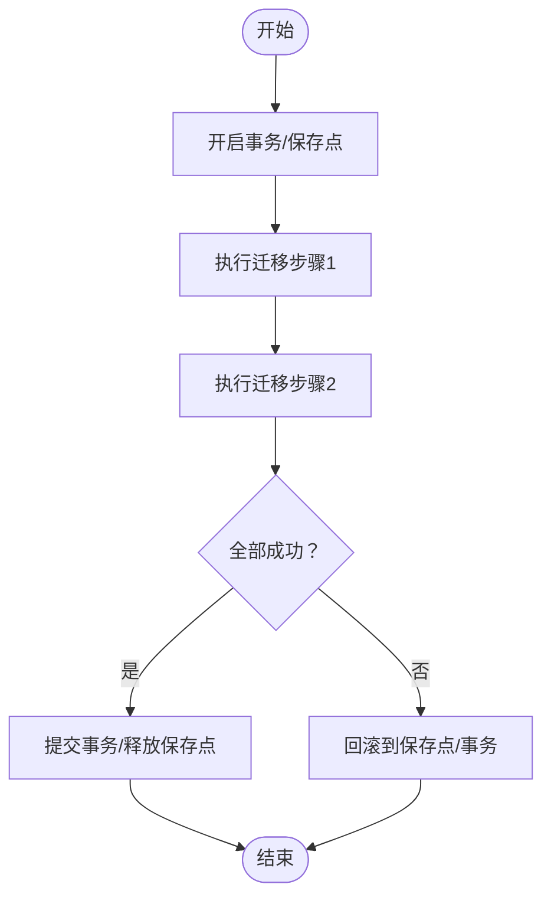
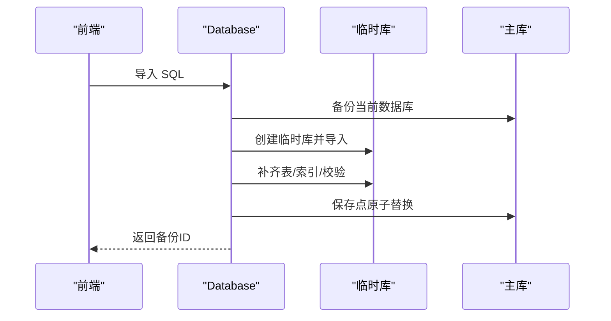
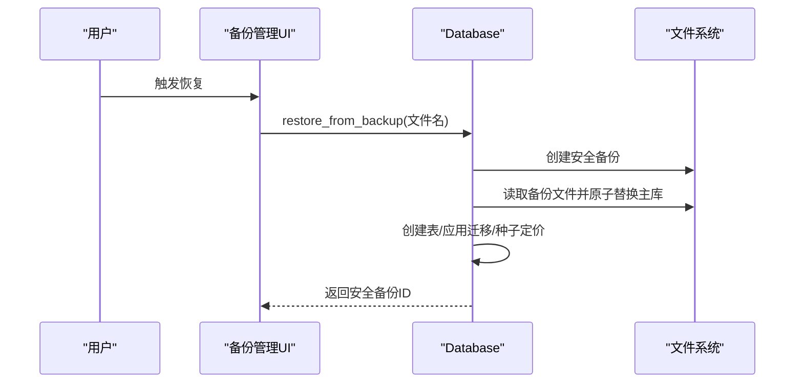
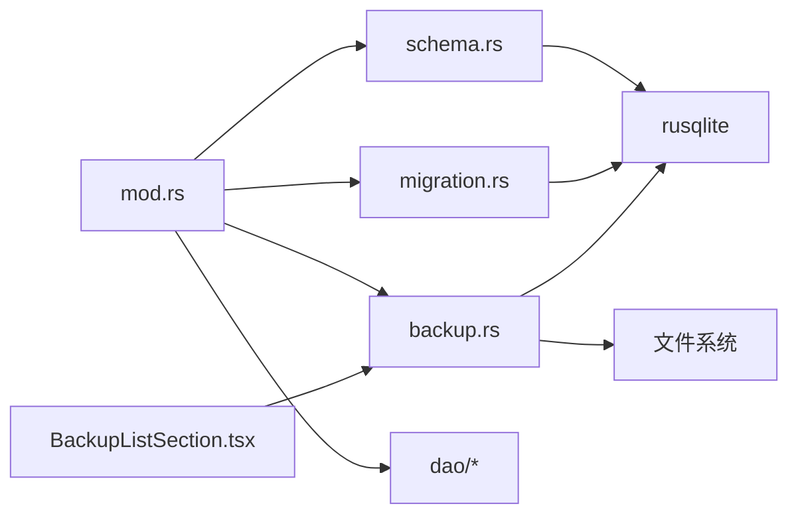

# 迁移安全保障

<cite>
**本文引用的文件**
- [src-tauri/src/database/migration.rs](file://src-tauri/src/database/migration.rs)
- [src-tauri/src/database/backup.rs](file://src-tauri/src/database/backup.rs)
- [src-tauri/src/database/schema.rs](file://src-tauri/src/database/schema.rs)
- [src-tauri/src/database/mod.rs](file://src-tauri/src/database/mod.rs)
- [src-tauri/src/database/dao/usage_rollup.rs](file://src-tauri/src/database/dao/usage_rollup.rs)
- [src-tauri/src/error.rs](file://src-tauri/src/error.rs)
- [src-tauri/src/database/dao/providers.rs](file://src-tauri/src/database/dao/providers.rs)
- [src-tauri/src/database/dao/mod.rs](file://src-tauri/src/database/dao/mod.rs)
- [src-tauri/src/codex_history_migration.rs](file://src-tauri/src/codex_history_migration.rs)
- [src-tauri/src/database/tests.rs](file://src-tauri/src/database/tests.rs)
- [src/components/settings/BackupListSection.tsx](file://src/components/settings/BackupListSection.tsx)
</cite>

## 目录
1. [简介](#简介)
2. [项目结构](#项目结构)
3. [核心组件](#核心组件)
4. [架构总览](#架构总览)
5. [详细组件分析](#详细组件分析)
6. [依赖关系分析](#依赖关系分析)
7. [性能考量](#性能考量)
8. [故障排查指南](#故障排查指南)
9. [结论](#结论)
10. [附录](#附录)

## 简介
本文件聚焦 CC Switch 的数据库迁移安全保障机制，系统阐述以下内容：
- 事务安全机制：事务与 SAVEPOINT 的使用、自动回滚策略
- 迁移过程中的数据保护：只读备份、增量检查、状态标记
- 错误处理策略：异常捕获、错误日志记录、用户反馈
- 迁移前后验证与完整性检查
- 迁移失败的应急处理与数据恢复

目标是帮助开发者与运维人员理解并正确使用迁移与备份能力，确保数据在升级、导入/导出、以及日常维护中的安全。

## 项目结构
数据库相关代码主要集中在 Rust 后端的 database 子模块，配合前端备份管理界面与国际化文案，形成完整的安全保障闭环。



图示来源
- [src-tauri/src/database/mod.rs:1-273](file://src-tauri/src/database/mod.rs#L1-L273)
- [src-tauri/src/database/schema.rs:1-2559](file://src-tauri/src/database/schema.rs#L1-L2559)
- [src-tauri/src/database/migration.rs:1-246](file://src-tauri/src/database/migration.rs#L1-L246)
- [src-tauri/src/database/backup.rs:1-861](file://src-tauri/src/database/backup.rs#L1-L861)
- [src-tauri/src/database/dao/mod.rs:1-20](file://src-tauri/src/database/dao/mod.rs#L1-L20)
- [src/components/settings/BackupListSection.tsx:87-122](file://src/components/settings/BackupListSection.tsx#L87-L122)

章节来源
- [src-tauri/src/database/mod.rs:1-273](file://src-tauri/src/database/mod.rs#L1-L273)
- [src-tauri/src/database/dao/mod.rs:1-20](file://src-tauri/src/database/dao/mod.rs#L1-L20)

## 核心组件
- 事务与 SAVEPOINT：在迁移、归档剪枝、批量写入等关键路径使用事务与 SAVEPOINT 保障原子性，失败自动回滚。
- 迁移与升级：从 JSON 配置迁移到 SQLite，以及 schema 版本升级，均在事务内执行并具备 dry-run 校验。
- 备份与恢复：支持 SQL 导出/导入、内存快照、二进制快照备份、定期备份、WebDAV 同步专用的“本地数据保留”策略。
- 错误处理与日志：统一的 AppError 类型，rusqlite 错误映射，详细日志记录，前端本地化提示。
- 数据完整性：迁移前后校验、索引与约束检查、增量维护（剪枝/归档）。

章节来源
- [src-tauri/src/database/migration.rs:1-246](file://src-tauri/src/database/migration.rs#L1-L246)
- [src-tauri/src/database/backup.rs:1-861](file://src-tauri/src/database/backup.rs#L1-L861)
- [src-tauri/src/database/schema.rs:366-470](file://src-tauri/src/database/schema.rs#L366-L470)
- [src-tauri/src/database/dao/usage_rollup.rs:87-113](file://src-tauri/src/database/dao/usage_rollup.rs#L87-L113)
- [src-tauri/src/error.rs:1-147](file://src-tauri/src/error.rs#L1-L147)

## 架构总览
数据库模块围绕“安全迁移 + 强大备份 + 原子事务”构建，关键流程如下：



图示来源
- [src-tauri/src/database/mod.rs:92-160](file://src-tauri/src/database/mod.rs#L92-L160)
- [src-tauri/src/database/migration.rs:10-42](file://src-tauri/src/database/migration.rs#L10-L42)
- [src-tauri/src/database/backup.rs:84-147](file://src-tauri/src/database/backup.rs#L84-L147)

## 详细组件分析

### 事务安全机制与自动回滚
- 迁移事务：JSON→SQLite 迁移在单个事务中执行，任一步骤失败即回滚，确保数据库一致性。
- Schema 升级事务：使用 SAVEPOINT 包裹迁移过程，失败时回滚到 SAVEPOINT 并释放，避免部分迁移导致的不一致。
- 剪枝与归档：使用 SAVEPOINT 包裹“汇总+剪枝”流程，失败自动回滚，保证明细与聚合数据的一致性。
- DAO 写入：如保存供应商配置等写入操作使用事务，避免中途失败造成脏数据。



图示来源
- [src-tauri/src/database/migration.rs:14-23](file://src-tauri/src/database/migration.rs#L14-L23)
- [src-tauri/src/database/schema.rs:374-470](file://src-tauri/src/database/schema.rs#L374-L470)
- [src-tauri/src/database/dao/usage_rollup.rs:87-113](file://src-tauri/src/database/dao/usage_rollup.rs#L87-L113)
- [src-tauri/src/database/dao/providers.rs:180-200](file://src-tauri/src/database/dao/providers.rs#L180-L200)

章节来源
- [src-tauri/src/database/migration.rs:10-65](file://src-tauri/src/database/migration.rs#L10-L65)
- [src-tauri/src/database/schema.rs:366-470](file://src-tauri/src/database/schema.rs#L366-L470)
- [src-tauri/src/database/dao/usage_rollup.rs:87-113](file://src-tauri/src/database/dao/usage_rollup.rs#L87-L113)
- [src-tauri/src/database/dao/providers.rs:180-200](file://src-tauri/src/database/dao/providers.rs#L180-L200)

### 迁移过程中的数据保护
- 预迁移备份：升级前对旧版本数据库进行备份，降低升级风险。
- Dry-run 校验：在内存数据库中执行迁移，验证逻辑正确性，不写入磁盘。
- 导入前备份：SQL 导入前创建当前数据库备份，防止导入失败污染主库。
- 临时库校验：导入在临时数据库执行，补齐缺失表/索引并进行基础校验，确认无误后再原子替换主库。
- WebDAV 同步保护：导入时可选择“保留本地数据”策略，避免同步导致的本地日志等临时数据丢失。



图示来源
- [src-tauri/src/database/backup.rs:84-147](file://src-tauri/src/database/backup.rs#L84-L147)
- [src-tauri/src/database/backup.rs:297-334](file://src-tauri/src/database/backup.rs#L297-L334)

章节来源
- [src-tauri/src/database/mod.rs:123-136](file://src-tauri/src/database/mod.rs#L123-L136)
- [src-tauri/src/database/migration.rs:25-42](file://src-tauri/src/database/migration.rs#L25-L42)
- [src-tauri/src/database/backup.rs:84-147](file://src-tauri/src/database/backup.rs#L84-L147)
- [src-tauri/src/database/backup.rs:297-334](file://src-tauri/src/database/backup.rs#L297-L334)

### 错误处理策略
- 统一错误类型：AppError 覆盖配置、IO、JSON/TOML、数据库、HTTP 状态等多种错误场景。
- 自动映射：rusqlite 错误自动映射为 AppError::Database，便于统一处理。
- 详细日志：迁移、导入、剪枝、恢复等关键路径均有日志输出，便于定位问题。
- 用户反馈：前端通过本地化文案与 Toast 展示导入/恢复成功或失败信息，包含安全备份 ID 等上下文。

```mermaid
classDiagram
class AppError {
+Config(String)
+InvalidInput(String)
+Io{path,source}
+Json{path,source}
+Toml{path,source}
+Lock(String)
+McpValidation(String)
+Message(String)
+HttpStatus{status,body}
+Localized{key,zh,en}
+Database(String)
+OmoConfigNotFound
+AllProvidersCircuitOpen
+NoProvidersConfigured
}
class Database {
+init()
+apply_schema_migrations()
+migrate_from_json()
+import_sql_string()
+restore_from_backup()
}
Database --> AppError : "抛出/转换"
```

图示来源
- [src-tauri/src/error.rs:6-63](file://src-tauri/src/error.rs#L6-L63)
- [src-tauri/src/error.rs:102-106](file://src-tauri/src/error.rs#L102-L106)
- [src-tauri/src/database/mod.rs:92-160](file://src-tauri/src/database/mod.rs#L92-L160)

章节来源
- [src-tauri/src/error.rs:1-147](file://src-tauri/src/error.rs#L1-L147)
- [src-tauri/src/database/mod.rs:92-160](file://src-tauri/src/database/mod.rs#L92-L160)

### 迁移前的数据验证与迁移后的完整性检查
- 迁移前验证
  - JSON→SQLite 迁移：dry-run 在内存数据库执行，验证迁移逻辑与表结构。
  - SQL 导入：校验头部标识、补齐缺失表/索引、基础数据校验（如包含供应商或 MCP 数据）。
- 迁移后检查
  - Schema 版本校验：user_version 与期望版本一致。
  - 关键列存在与默认值校验：迁移后对新增列进行存在性与默认值检查。
  - 剪枝/归档前置回填：在剪枝前尽力回填缺失成本，失败仅告警不阻断。

章节来源
- [src-tauri/src/database/migration.rs:25-42](file://src-tauri/src/database/migration.rs#L25-L42)
- [src-tauri/src/database/backup.rs:124-131](file://src-tauri/src/database/backup.rs#L124-L131)
- [src-tauri/src/database/backup.rs:369-384](file://src-tauri/src/database/backup.rs#L369-L384)
- [src-tauri/src/database/schema.rs:366-470](file://src-tauri/src/database/schema.rs#L366-L470)
- [src-tauri/src/database/tests.rs:194-225](file://src-tauri/src/database/tests.rs#L194-L225)
- [src-tauri/src/database/dao/usage_rollup.rs:82-85](file://src-tauri/src/database/dao/usage_rollup.rs#L82-L85)

### 迁移失败的应急处理与数据恢复
- 自动回滚：事务/保存点失败自动回滚，保证数据库处于一致状态。
- 安全备份：导入/恢复前创建安全备份，恢复后返回安全备份 ID，便于二次回退。
- 原子替换：使用 SQLite Backup API 将临时库原子写回主库，避免部分写入导致的损坏。
- 定期备份：根据配置周期性创建数据库快照备份，保留多个版本，便于回滚到历史状态。
- WebDAV 同步保护：导入时可选择保留本地日志类表，避免同步导致的数据丢失。



图示来源
- [src-tauri/src/database/backup.rs:551-599](file://src-tauri/src/database/backup.rs#L551-L599)
- [src/components/settings/BackupListSection.tsx:87-112](file://src/components/settings/BackupListSection.tsx#L87-L112)

章节来源
- [src-tauri/src/database/backup.rs:551-599](file://src-tauri/src/database/backup.rs#L551-L599)
- [src-tauri/src/database/backup.rs:235-295](file://src-tauri/src/database/backup.rs#L235-L295)
- [src/components/settings/BackupListSection.tsx:87-112](file://src/components/settings/BackupListSection.tsx#L87-L112)

## 依赖关系分析
- 模块耦合
  - mod.rs 作为入口，协调 schema.rs、migration.rs、backup.rs、dao/* 的协作。
  - schema.rs 与 migration.rs 共同负责表结构与数据迁移，依赖 rusqlite 事务与约束。
  - backup.rs 依赖 mod.rs 的连接管理与工具函数，同时依赖文件系统进行备份与导入。
- 外部依赖
  - rusqlite：事务、保存点、Backup API、PRAGMA 配置。
  - 文件系统：备份目录、SQL 导入/导出、定期备份。
  - 前端：备份管理 UI、本地化文案、Toast 反馈。



图示来源
- [src-tauri/src/database/mod.rs:1-273](file://src-tauri/src/database/mod.rs#L1-L273)
- [src-tauri/src/database/schema.rs:1-2559](file://src-tauri/src/database/schema.rs#L1-L2559)
- [src-tauri/src/database/migration.rs:1-246](file://src-tauri/src/database/migration.rs#L1-L246)
- [src-tauri/src/database/backup.rs:1-861](file://src-tauri/src/database/backup.rs#L1-L861)
- [src-tauri/src/database/dao/mod.rs:1-20](file://src-tauri/src/database/dao/mod.rs#L1-L20)
- [src/components/settings/BackupListSection.tsx:87-122](file://src/components/settings/BackupListSection.tsx#L87-L122)

章节来源
- [src-tauri/src/database/mod.rs:1-273](file://src-tauri/src/database/mod.rs#L1-L273)
- [src-tauri/src/database/dao/mod.rs:1-20](file://src-tauri/src/database/dao/mod.rs#L1-L20)

## 性能考量
- 增量维护：定期清理旧日志与归档统计，减少查询与写入压力。
- 原子写入：使用 Backup API 原子替换，避免中间态导致的二次写入。
- 保存点：在长事务中分段使用保存点，降低锁竞争与回滚成本。
- 内存快照：导入前创建内存快照，避免长时间持有数据库锁。

章节来源
- [src-tauri/src/database/backup.rs:149-164](file://src-tauri/src/database/backup.rs#L149-L164)
- [src-tauri/src/database/backup.rs:235-295](file://src-tauri/src/database/backup.rs#L235-L295)
- [src-tauri/src/database/dao/usage_rollup.rs:87-113](file://src-tauri/src/database/dao/usage_rollup.rs#L87-L113)

## 故障排查指南
- 迁移失败
  - 查看日志：确认 SAVEPOINT/事务阶段与错误信息。
  - 使用 dry-run：在内存数据库验证迁移逻辑。
  - 检查 Schema 版本：确保 user_version 与期望一致。
- 导入失败
  - 校验 SQL 文件头：仅支持 CC Switch 导出的备份文件。
  - 检查导入前备份：确认安全备份已创建。
  - 临时库校验：确认补齐表/索引与基础数据校验通过。
- 恢复失败
  - 确认备份文件名合法且存在。
  - 检查安全备份 ID，必要时回退至上一个安全备份。
- 剪枝/归档异常
  - 查看前置回填日志，确认成本回填是否失败。
  - 检查索引与过滤条件，确保查询效率。

章节来源
- [src-tauri/src/database/migration.rs:25-42](file://src-tauri/src/database/migration.rs#L25-L42)
- [src-tauri/src/database/backup.rs:166-177](file://src-tauri/src/database/backup.rs#L166-L177)
- [src-tauri/src/database/backup.rs:551-599](file://src-tauri/src/database/backup.rs#L551-L599)
- [src-tauri/src/database/dao/usage_rollup.rs:82-85](file://src-tauri/src/database/dao/usage_rollup.rs#L82-L85)

## 结论
CC Switch 的数据库迁移安全保障通过“事务+保存点+原子替换+定期备份+导入校验”五位一体的设计，在升级、导入/导出、日常维护等场景下提供了强健的数据保护。配合完善的错误处理与日志记录，以及前端友好的用户反馈，能够在最大程度上降低迁移风险，保障业务连续性。

## 附录
- 相关迁移与历史数据处理
  - Codex 历史数据迁移：对第三方历史提供者桶进行迁移，创建备份并标记迁移状态。
  
章节来源
- [src-tauri/src/codex_history_migration.rs:123-148](file://src-tauri/src/codex_history_migration.rs#L123-L148)