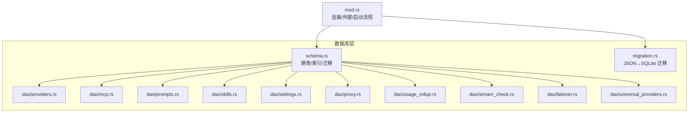
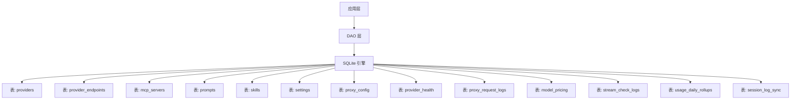
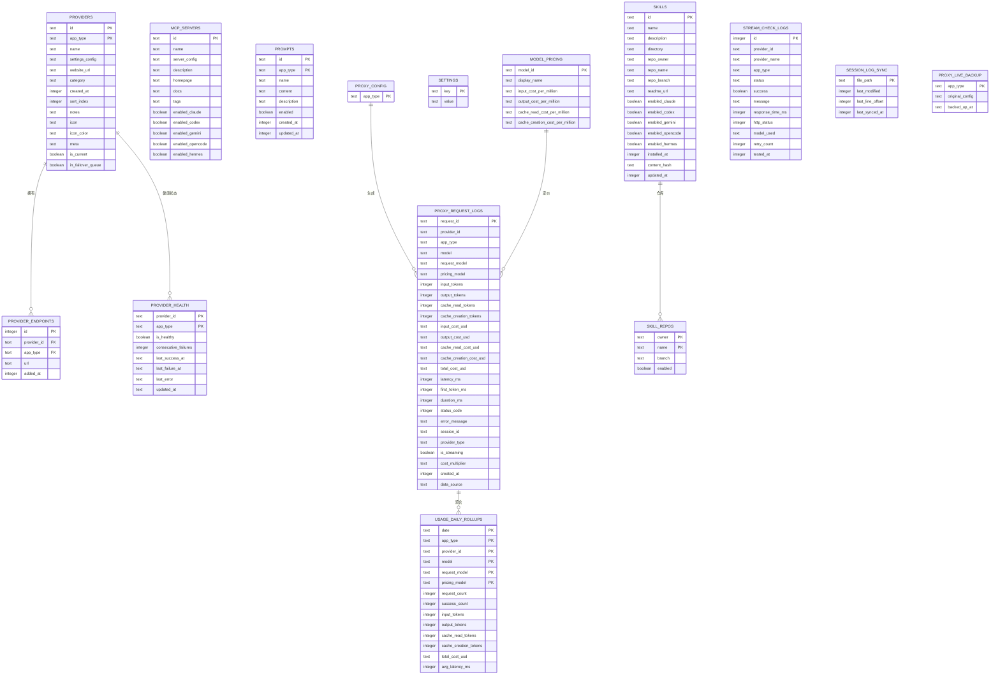

# 表结构设计

<cite>
**本文引用的文件**
- [schema.rs](file://src-tauri/src/database/schema.rs)
- [mod.rs](file://src-tauri/src/database/mod.rs)
- [providers.rs](file://src-tauri/src/database/dao/providers.rs)
- [mcp.rs](file://src-tauri/src/database/dao/mcp.rs)
- [prompts.rs](file://src-tauri/src/database/dao/prompts.rs)
- [skills.rs](file://src-tauri/src/database/dao/skills.rs)
- [settings.rs](file://src-tauri/src/database/dao/settings.rs)
- [proxy.rs](file://src-tauri/src/database/dao/proxy.rs)
- [usage_rollup.rs](file://src-tauri/src/database/dao/usage_rollup.rs)
- [stream_check.rs](file://src-tauri/src/database/dao/stream_check.rs)
- [failover.rs](file://src-tauri/src/database/dao/failover.rs)
- [universal_providers.rs](file://src-tauri/src/database/dao/universal_providers.rs)
- [migration.rs](file://src-tauri/src/database/migration.rs)
</cite>

## 目录
1. [简介](#简介)
2. [项目结构](#项目结构)
3. [核心组件](#核心组件)
4. [架构总览](#架构总览)
5. [详细组件分析](#详细组件分析)
6. [依赖分析](#依赖分析)
7. [性能考量](#性能考量)
8. [故障排查指南](#故障排查指南)
9. [结论](#结论)
10. [附录](#附录)

## 简介
本文件面向 CC Switch 的数据库表结构，围绕核心业务表进行系统化设计说明，涵盖字段定义、数据类型与约束、主外键关系、索引策略、业务含义与演进历史。重点表包括：providers、provider_endpoints、mcp_servers、prompts、skills、settings、proxy_config、provider_health、proxy_request_logs、model_pricing、stream_check_logs、usage_daily_rollups、session_log_sync。文档同时给出表间关联关系图、数据完整性约束与迁移路径，帮助开发者与运维人员理解与维护数据库结构。

## 项目结构
数据库模块采用“Schema 定义 + DAO 层”分层组织：
- schema.rs：负责建表、索引与迁移
- dao/*：各领域数据访问对象，封装 CRUD 与复杂查询
- migration.rs：从旧版 JSON 配置迁移至 SQLite
- mod.rs：数据库连接、外键约束、自动清理与启动流程

图表来源
- [schema.rs:16-364](file://src-tauri/src/database/schema.rs#L16-L364)
- [mod.rs:1-273](file://src-tauri/src/database/mod.rs#L1-L273)
- [migration.rs:1-246](file://src-tauri/src/database/migration.rs#L1-L246)
- [providers.rs:1-787](file://src-tauri/src/database/dao/providers.rs#L1-L787)
- [mcp.rs:1-107](file://src-tauri/src/database/dao/mcp.rs#L1-L107)
- [prompts.rs:1-89](file://src-tauri/src/database/dao/prompts.rs#L1-L89)
- [skills.rs:1-264](file://src-tauri/src/database/dao/skills.rs#L1-L264)
- [settings.rs:1-328](file://src-tauri/src/database/dao/settings.rs#L1-L328)
- [proxy.rs:1-953](file://src-tauri/src/database/dao/proxy.rs#L1-L953)
- [usage_rollup.rs:1-534](file://src-tauri/src/database/dao/usage_rollup.rs#L1-L534)
- [stream_check.rs:1-75](file://src-tauri/src/database/dao/stream_check.rs#L1-L75)
- [failover.rs:1-150](file://src-tauri/src/database/dao/failover.rs#L1-L150)
- [universal_providers.rs:1-75](file://src-tauri/src/database/dao/universal_providers.rs#L1-L75)

章节来源
- [mod.rs:1-273](file://src-tauri/src/database/mod.rs#L1-L273)

## 核心组件
本节概述核心表的职责与关键字段，详见后续章节的详细分析。

- providers：供应商配置与元数据，支持多应用类型与故障转移队列
- provider_endpoints：供应商自定义端点集合
- mcp_servers：MCP 服务器配置与启用标志
- prompts：提示词模板，按应用类型隔离
- skills：技能仓库与安装状态，统一 ID 主键
- settings：键值型通用设置（含代理、日志、优化器等配置）
- proxy_config：代理配置（按应用类型三行结构），包含熔断器与成本倍率
- provider_health：供应商健康状态与失败计数
- proxy_request_logs：请求明细日志，用于计费与审计
- model_pricing：模型定价表，支持缓存读写成本
- stream_check_logs：流式健康检查日志
- usage_daily_rollups：按天聚合的用量统计，支持 request_model 与 pricing_model 维度
- session_log_sync：会话日志同步状态

章节来源
- [schema.rs:25-296](file://src-tauri/src/database/schema.rs#L25-L296)

## 架构总览
数据库采用 SQLite，启用外键约束与增量自动回收，启动时执行建表、迁移与索引创建，并在运行期维护各类统计数据与健康状态。

图表来源
- [schema.rs:25-296](file://src-tauri/src/database/schema.rs#L25-L296)
- [mod.rs:107-116](file://src-tauri/src/database/mod.rs#L107-L116)

## 详细组件分析

### 表：providers（供应商）
- 主键：复合主键 (id, app_type)
- 关键字段
  - id：供应商唯一标识
  - app_type：应用类型（claude/codex/gemini/opencode/hermes）
  - name/settings_config/website_url/category/notes/icon/icon_color/meta：供应商基本信息与扩展元数据
  - created_at/sort_index/is_current/in_failover_queue：排序、当前选中与故障转移队列标记
- 约束与索引
  - 外键：与 provider_endpoints 的 (provider_id, app_type) 联合引用
  - 索引：providers 表的故障转移索引 (app_type, in_failover_queue, sort_index)
- 业务含义
  - 存储各应用类型的供应商配置与状态，支持官方种子补齐、OMO 互斥、故障转移队列管理
- 设计权衡
  - 复合主键确保多应用隔离；meta 字段 JSON 存储便于扩展

章节来源
- [schema.rs:25-46](file://src-tauri/src/database/schema.rs#L25-L46)
- [schema.rs:356-361](file://src-tauri/src/database/schema.rs#L356-L361)
- [providers.rs:19-708](file://src-tauri/src/database/dao/providers.rs#L19-L708)

### 表：provider_endpoints（供应商端点）
- 主键：id（自增）
- 外键：provider_id/app_type → providers(id, app_type)，删除级联
- 关键字段
  - provider_id/app_type/url/added_at：端点 URL 与添加时间
- 业务含义
  - 记录供应商的自定义端点，支持多 URL 与时间戳
- 设计权衡
  - 与 providers 解耦，便于动态增删端点

章节来源
- [schema.rs:48-60](file://src-tauri/src/database/schema.rs#L48-L60)
- [providers.rs:75-106](file://src-tauri/src/database/dao/providers.rs#L75-L106)

### 表：mcp_servers（MCP 服务器）
- 主键：id（文本）
- 关键字段
  - name/server_config/description/homepage/docs/tags：服务器元信息与标签
  - enabled_claude/...enabled_opencode/...enabled_hermes：按应用启用标志
- 业务含义
  - 统一存储 MCP 服务器配置与启用范围
- 设计权衡
  - tags 与启用标志集中管理，便于前端展示与过滤

章节来源
- [schema.rs:62-73](file://src-tauri/src/database/schema.rs#L62-L73)
- [mcp.rs:11-106](file://src-tauri/src/database/dao/mcp.rs#L11-L106)

### 表：prompts（提示词）
- 主键：复合主键 (id, app_type)
- 关键字段
  - name/content/description/enabled/created_at/updated_at：提示词内容与生命周期
- 业务含义
  - 按应用类型隔离的提示词模板
- 设计权衡
  - 复合主键确保跨应用隔离

章节来源
- [schema.rs:75-80](file://src-tauri/src/database/schema.rs#L75-L80)
- [prompts.rs:11-88](file://src-tauri/src/database/dao/prompts.rs#L11-L88)

### 表：skills（技能）
- 主键：id（文本，统一 ID）
- 关键字段
  - name/description/directory/repo_owner/repo_name/repo_branch/readme_url：技能元信息
  - enabled_claude/...enabled_opencode/...enabled_hermes：按应用启用标志
  - installed_at/content_hash/updated_at：安装与更新追踪
- 业务含义
  - 统一技能管理，文件系统与数据库双轨同步
- 设计权衡
  - 统一 ID 主键简化跨应用启用控制；content_hash 用于变更检测

章节来源
- [schema.rs:82-104](file://src-tauri/src/database/schema.rs#L82-L104)
- [skills.rs:16-263](file://src-tauri/src/database/dao/skills.rs#L16-L263)

### 表：settings（通用设置）
- 主键：key（文本，唯一）
- 关键字段
  - key/value：键值对存储
- 业务含义
  - 代理、日志、优化器、Copilot 优化器等配置的键值存储
- 设计权衡
  - 以键名约定配置项，避免频繁表结构调整

章节来源
- [schema.rs:116-121](file://src-tauri/src/database/schema.rs#L116-L121)
- [settings.rs:9-327](file://src-tauri/src/database/dao/settings.rs#L9-L327)

### 表：proxy_config（代理配置）
- 主键：app_type（CHECK 限定为 claude/codex/gemini）
- 关键字段
  - 代理开关、监听地址/端口、日志开关
  - 重试次数、流式首字节/空闲超时、非流式超时
  - 熔断器阈值：失败阈值、成功阈值、超时秒、错误率阈值、最小请求数
  - 默认成本倍率、计价模式来源、创建/更新时间
  - live_takeover_active（兼容字段）
- 业务含义
  - 每应用独立的代理配置，支持熔断器与成本倍率
- 设计权衡
  - 三行结构与 seed 默认值保持一致性；兼容旧字段逐步迁移

章节来源
- [schema.rs:123-172](file://src-tauri/src/database/schema.rs#L123-L172)
- [schema.rs:336-342](file://src-tauri/src/database/schema.rs#L336-L342)
- [proxy.rs:55-402](file://src-tauri/src/database/dao/proxy.rs#L55-L402)

### 表：provider_health（供应商健康）
- 主键：(provider_id, app_type)
- 外键：provider_id/app_type → providers(id, app_type)，删除级联
- 关键字段
  - is_healthy/consecutive_failures/last_success_at/last_failure_at/last_error/updated_at
- 业务含义
  - 记录供应商健康状态与失败计数，支持阈值判定
- 设计权衡
  - UPSERT 语义与阈值参数化，便于灵活配置

章节来源
- [schema.rs:174-181](file://src-tauri/src/database/schema.rs#L174-L181)
- [proxy.rs:497-671](file://src-tauri/src/database/dao/proxy.rs#L497-L671)

### 表：proxy_request_logs（代理请求明细）
- 主键：request_id（文本）
- 关键字段
  - provider_id/app_type/model/request_model/pricing_model：模型与计价维度
  - input/output/cache 令牌与成本字段（文本，字符串数值）
  - latency_ms/first_token_ms/duration_ms/status_code/error_message/session_id/provider_type/is_streaming/cost_multiplier/created_at/data_source
- 索引
  - provider(app_type)/created_at/model/session/status
- 业务含义
  - 请求明细日志，支撑计费与审计；支持回填与按天聚合
- 设计权衡
  - 文本存储成本字段便于与 Decimal 兼容；多维字段保留路由接管与计价模式差异

章节来源
- [schema.rs:183-220](file://src-tauri/src/database/schema.rs#L183-L220)
- [usage_rollup.rs:115-179](file://src-tauri/src/database/dao/usage_rollup.rs#L115-L179)

### 表：model_pricing（模型定价）
- 主键：model_id（文本）
- 关键字段
  - display_name/input/output/cache 读取/创建成本（百万次单价）
- 业务含义
  - 模型定价表，支持缓存相关成本
- 设计权衡
  - 以 model_id 为主键，便于与上游模型名对齐

章节来源
- [schema.rs:222-232](file://src-tauri/src/database/schema.rs#L222-L232)

### 表：stream_check_logs（流式健康检查日志）
- 主键：id（自增）
- 关键字段
  - provider_id/provider_name/app_type/status/success/message/response_time_ms/http_status/model_used/retry_count/tested_at
- 索引
  - (app_type, provider_id, tested_at DESC)
- 业务含义
  - 记录流式检查结果，支持清理策略
- 设计权衡
  - 时间倒序索引便于查询最新检查记录

章节来源
- [schema.rs:234-247](file://src-tauri/src/database/schema.rs#L234-L247)
- [stream_check.rs:7-74](file://src-tauri/src/database/dao/stream_check.rs#L7-L74)

### 表：usage_daily_rollups（用量日聚合）
- 主键：(date, app_type, provider_id, model, request_model, pricing_model)
- 关键字段
  - request_count/success_count/input/output/cache 读取/创建令牌、总成本、平均延迟
- 业务含义
  - 对 proxy_request_logs 的按天聚合，保留 request_model 与 pricing_model 维度
- 设计权衡
  - 复合主键确保维度完整性；与明细表的回填/修剪流程配合

章节来源
- [schema.rs:260-284](file://src-tauri/src/database/schema.rs#L260-L284)
- [usage_rollup.rs:57-179](file://src-tauri/src/database/dao/usage_rollup.rs#L57-L179)

### 表：session_log_sync（会话日志同步状态）
- 主键：file_path（文本）
- 关键字段
  - last_modified/last_line_offset/last_synced_at
- 业务含义
  - 追踪会话日志文件同步进度
- 设计权衡
  - 以文件路径为主键，便于增量同步

章节来源
- [schema.rs:286-296](file://src-tauri/src/database/schema.rs#L286-L296)

### 表：skill_repos（技能仓库）
- 主键：(owner, name)
- 关键字段
  - branch/enabled：分支与启用状态
- 业务含义
  - 技能仓库清单，支持默认仓库补齐
- 设计权衡
  - 复合主键确保仓库唯一性

章节来源
- [schema.rs:106-114](file://src-tauri/src/database/schema.rs#L106-L114)
- [skills.rs:184-233](file://src-tauri/src/database/dao/skills.rs#L184-L233)

### 表：proxy_live_backup（代理实时备份）
- 主键：app_type（CHECK 限定）
- 关键字段
  - original_config/backed_up_at：原始配置与备份时间
- 业务含义
  - 记录代理配置的备份快照
- 设计权衡
  - 三行结构与 proxy_config 对齐

章节来源
- [schema.rs:251-258](file://src-tauri/src/database/schema.rs#L251-L258)

## 依赖分析

### 表间关系图

图表来源
- [schema.rs:25-296](file://src-tauri/src/database/schema.rs#L25-L296)

### 外键与级联
- provider_endpoints(provider_id, app_type) → providers(id, app_type) ON DELETE CASCADE
- provider_health(provider_id, app_type) → providers(id, app_type) ON DELETE CASCADE
- proxy_request_logs 与 model_pricing 通过 model/pricing_model 关联（逻辑关联）

章节来源
- [schema.rs:56-56](file://src-tauri/src/database/schema.rs#L56-L56)
- [schema.rs:180-180](file://src-tauri/src/database/schema.rs#L180-L180)

### 索引策略
- providers：idx_providers_failover(app_type, in_failover_queue, sort_index)
- proxy_request_logs：idx_request_logs_provider、idx_request_logs_created_at、idx_request_logs_model、idx_request_logs_session、idx_request_logs_status
- stream_check_logs：idx_stream_check_logs_provider(app_type, provider_id, tested_at DESC)

章节来源
- [schema.rs:201-219](file://src-tauri/src/database/schema.rs#L201-L219)
- [schema.rs:242-247](file://src-tauri/src/database/schema.rs#L242-L247)

## 性能考量
- 自动回收与启动清理
  - 启动时执行增量自动回收与日志清理，减少碎片与空间膨胀
- 聚合与修剪
  - usage_daily_rollups 与 proxy_request_logs 的按天聚合与修剪，降低明细表规模
- 索引覆盖
  - 针对高频查询字段建立索引，提升统计与检索效率
- 数据类型选择
  - 成本与令牌字段采用文本存储，便于与 Decimal 兼容与避免精度问题

章节来源
- [mod.rs:144-157](file://src-tauri/src/database/mod.rs#L144-L157)
- [usage_rollup.rs:57-179](file://src-tauri/src/database/dao/usage_rollup.rs#L57-L179)

## 故障排查指南
- 代理配置异常
  - 检查 proxy_config 的 app_type 行是否存在，必要时调用初始化函数补全
  - 校验 default_cost_multiplier 与 pricing_model_source 的有效性
- 供应商健康状态
  - 通过 provider_health 查询最近失败与错误信息，结合阈值参数调整
- 日志清理与回填
  - 若发现用量统计异常，优先执行回填与修剪流程，确保明细到聚合的一致性
- 迁移与兼容
  - 若出现旧字段冲突，参考迁移逻辑（如 proxy_config 三行结构、settings 兼容字段）进行修复

章节来源
- [proxy.rs:16-53](file://src-tauri/src/database/dao/proxy.rs#L16-L53)
- [proxy.rs:358-402](file://src-tauri/src/database/dao/proxy.rs#L358-L402)
- [proxy.rs:497-671](file://src-tauri/src/database/dao/proxy.rs#L497-L671)
- [usage_rollup.rs:57-179](file://src-tauri/src/database/dao/usage_rollup.rs#L57-L179)

## 结论
CC Switch 的数据库设计以“多应用隔离 + 统一主键 + 外键约束 + 索引优化”为核心，兼顾灵活性与可维护性。通过代理配置三行结构、健康状态与用量聚合机制，实现了对多供应商、多应用类型的稳定支持。建议在新增字段时遵循现有命名与约束风格，并配套迁移脚本与索引策略，确保版本演进的平滑与数据一致性。

## 附录

### 表结构演进历史与设计权衡
- v0 → v1：补齐缺失列（providers、provider_endpoints、mcp_servers、prompts、skills、skill_repos）
- v1 → v2：引入使用统计表、完整字段、重构 skills 表、proxy_config 三行结构、failover 索引
- v2 → v3：Skills 统一管理架构
- v3 → v4：OpenCode 支持
- v4 → v5：计费模式支持
- v5 → v6：使用量聚合表 + Copilot 模板类型统一
- v6 → v7：Skills 更新检测支持
- v7 → v8：会话日志使用追踪 + 修正模型定价
- v8 → v9：全面补充模型定价
- v9 → v10：Hermes Agent 支持
- v10 → v11：usage_daily_rollups 保留 request_model 维度

章节来源
- [schema.rs:366-470](file://src-tauri/src/database/schema.rs#L366-L470)

### 从 JSON 迁移至 SQLite
- 迁移入口：migration.rs
- 涵盖：providers、mcp_servers、prompts、skills、通用配置片段
- 事务与 dry-run：提供内存数据库验证能力

章节来源
- [migration.rs:10-245](file://src-tauri/src/database/migration.rs#L10-L245)