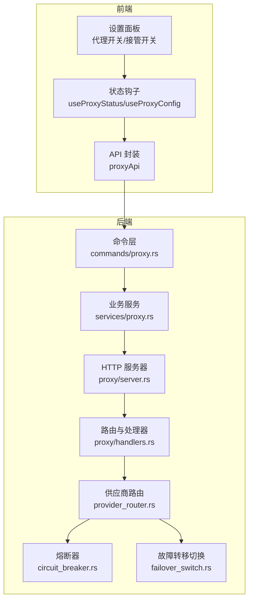
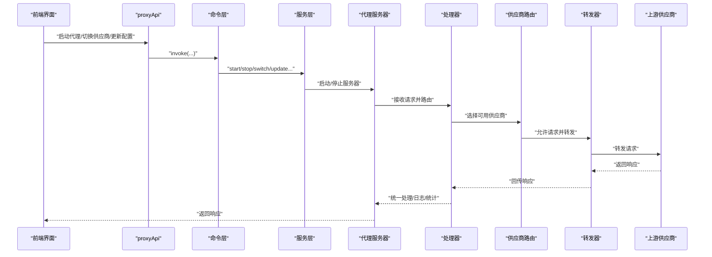
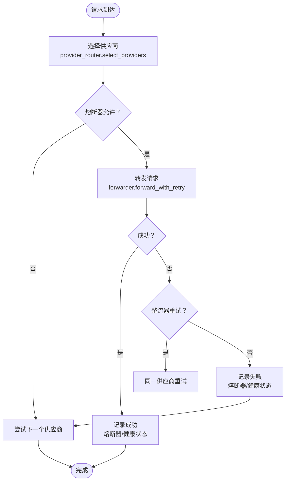
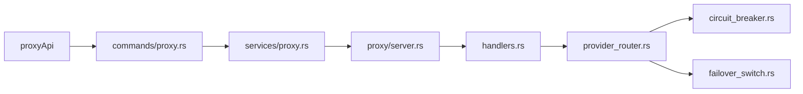

# 代理配置

<cite>
**本文引用的文件**
- [src/components/proxy/index.ts](file://src/components/proxy/index.ts)
- [src/hooks/useProxyConfig.ts](file://src/hooks/useProxyConfig.ts)
- [src/hooks/useProxyStatus.ts](file://src/hooks/useProxyStatus.ts)
- [src/types/proxy.ts](file://src/types/proxy.ts)
- [src/lib/api/proxy.ts](file://src/lib/api/proxy.ts)
- [src-tauri/src/proxy/mod.rs](file://src-tauri/src/proxy/mod.rs)
- [src-tauri/src/commands/proxy.rs](file://src-tauri/src/commands/proxy.rs)
- [src-tauri/src/services/proxy.rs](file://src-tauri/src/services/proxy.rs)
- [src-tauri/src/proxy/server.rs](file://src-tauri/src/proxy/server.rs)
- [src-tauri/src/proxy/handlers.rs](file://src-tauri/src/proxy/handlers.rs)
- [src-tauri/src/proxy/forwarder.rs](file://src-tauri/src/proxy/forwarder.rs)
- [src-tauri/src/proxy/response_handler.rs](file://src-tauri/src/proxy/response_handler.rs)
- [src-tauri/src/proxy/provider_router.rs](file://src-tauri/src/proxy/provider_router.rs)
- [src-tauri/src/proxy/circuit_breaker.rs](file://src-tauri/src/proxy/circuit_breaker.rs)
- [src-tauri/src/proxy/failover_switch.rs](file://src-tauri/src/proxy/failover_switch.rs)
</cite>

## 目录
1. [简介](#简介)
2. [项目结构](#项目结构)
3. [核心组件](#核心组件)
4. [架构总览](#架构总览)
5. [详细组件分析](#详细组件分析)
6. [依赖分析](#依赖分析)
7. [性能考虑](#性能考虑)
8. [故障排除指南](#故障排除指南)
9. [结论](#结论)
10. [附录](#附录)

## 简介
本指南面向 CC Switch 的本地代理服务配置与运维，涵盖以下主题：
- 本地代理服务器的启动与停止、接管模式与端口配置
- 请求路由规则、故障转移策略与熔断器机制
- 请求拦截、响应处理与错误重试流程
- 性能优化、安全设置与网络适配建议
- 监控方法、日志分析与故障排除技巧
- 与供应商管理、使用统计等组件的集成关系

## 项目结构
代理服务采用前后端分离设计：
- 前端（React + Tauri）负责 UI 交互、状态查询与命令调用
- 后端（Rust + Axum/Hyper）负责代理服务器、路由、熔断、故障转移与响应处理

图表来源
- [src/hooks/useProxyStatus.ts:19-244](file://src/hooks/useProxyStatus.ts#L19-L244)
- [src/lib/api/proxy.ts:11-120](file://src/lib/api/proxy.ts#L11-L120)
- [src-tauri/src/commands/proxy.rs:10-82](file://src-tauri/src/commands/proxy.rs#L10-L82)
- [src-tauri/src/services/proxy.rs:399-454](file://src-tauri/src/services/proxy.rs#L399-L454)
- [src-tauri/src/proxy/server.rs:94-223](file://src-tauri/src/proxy/server.rs#L94-L223)
- [src-tauri/src/proxy/handlers.rs:110-247](file://src-tauri/src/proxy/handlers.rs#L110-L247)
- [src-tauri/src/proxy/provider_router.rs:32-109](file://src-tauri/src/proxy/provider_router.rs#L32-L109)
- [src-tauri/src/proxy/circuit_breaker.rs:105-200](file://src-tauri/src/proxy/circuit_breaker.rs#L105-L200)
- [src-tauri/src/proxy/failover_switch.rs:33-72](file://src-tauri/src/proxy/failover_switch.rs#L33-L72)

章节来源
- [src/components/proxy/index.ts:1-6](file://src/components/proxy/index.ts#L1-L6)
- [src/hooks/useProxyConfig.ts:14-48](file://src/hooks/useProxyConfig.ts#L14-L48)
- [src/hooks/useProxyStatus.ts:19-244](file://src/hooks/useProxyStatus.ts#L19-L244)
- [src/types/proxy.ts:1-141](file://src/types/proxy.ts#L1-L141)
- [src/lib/api/proxy.ts:11-120](file://src/lib/api/proxy.ts#L11-L120)

## 核心组件
- 代理配置与状态
  - 前端 Hook：useProxyConfig、useProxyStatus
  - 类型定义：ProxyConfig、ProxyStatus、ProxyTakeoverStatus、AppProxyConfig 等
  - API 封装：proxyApi
- 后端命令与服务
  - 命令层：commands/proxy.rs（启动/停止、接管、状态查询、配置更新等）
  - 业务服务：services/proxy.rs（启动/停止、Live 配置接管与恢复、热切换）
  - 服务器：proxy/server.rs（Axum 服务器、路由、状态维护）
  - 处理器：proxy/handlers.rs（各 API 端点处理、格式转换、日志）
  - 路由与熔断：provider_router.rs、circuit_breaker.rs
  - 故障转移：failover_switch.rs

章节来源
- [src/hooks/useProxyConfig.ts:14-48](file://src/hooks/useProxyConfig.ts#L14-L48)
- [src/hooks/useProxyStatus.ts:19-244](file://src/hooks/useProxyStatus.ts#L19-L244)
- [src/types/proxy.ts:1-141](file://src/types/proxy.ts#L1-L141)
- [src/lib/api/proxy.ts:11-120](file://src/lib/api/proxy.ts#L11-L120)
- [src-tauri/src/commands/proxy.rs:10-82](file://src-tauri/src/commands/proxy.rs#L10-L82)
- [src-tauri/src/services/proxy.rs:399-454](file://src-tauri/src/services/proxy.rs#L399-L454)
- [src-tauri/src/proxy/server.rs:94-223](file://src-tauri/src/proxy/server.rs#L94-L223)
- [src-tauri/src/proxy/handlers.rs:110-247](file://src-tauri/src/proxy/handlers.rs#L110-L247)
- [src-tauri/src/proxy/provider_router.rs:32-109](file://src-tauri/src/proxy/provider_router.rs#L32-L109)
- [src-tauri/src/proxy/circuit_breaker.rs:105-200](file://src-tauri/src/proxy/circuit_breaker.rs#L105-L200)
- [src-tauri/src/proxy/failover_switch.rs:33-72](file://src-tauri/src/proxy/failover_switch.rs#L33-L72)

## 架构总览
代理服务工作原理：
- 前端通过 proxyApi 调用命令层（commands/proxy.rs），由服务层（services/proxy.rs）协调启动/停止与接管逻辑
- 服务器（proxy/server.rs）基于 Axum 构建路由，将请求交由处理器（handlers.rs）处理
- 处理器通过 RequestForwarder（forwarder.rs）选择供应商并转发，结合 ProviderRouter（provider_router.rs）与熔断器（circuit_breaker.rs）实现故障转移与健康控制
- 响应通过统一处理器（response_handler.rs）进行格式化与使用量统计，最终返回客户端

图表来源
- [src/lib/api/proxy.ts:11-120](file://src/lib/api/proxy.ts#L11-L120)
- [src-tauri/src/commands/proxy.rs:10-82](file://src-tauri/src/commands/proxy.rs#L10-L82)
- [src-tauri/src/services/proxy.rs:399-454](file://src-tauri/src/services/proxy.rs#L399-L454)
- [src-tauri/src/proxy/server.rs:291-360](file://src-tauri/src/proxy/server.rs#L291-L360)
- [src-tauri/src/proxy/handlers.rs:110-247](file://src-tauri/src/proxy/handlers.rs#L110-L247)
- [src-tauri/src/proxy/provider_router.rs:32-109](file://src-tauri/src/proxy/provider_router.rs#L32-L109)
- [src-tauri/src/proxy/forwarder.rs:325-353](file://src-tauri/src/proxy/forwarder.rs#L325-L353)

## 详细组件分析

### 代理配置与状态（前端）
- useProxyConfig：查询与更新代理配置（ProxyConfig），支持 toast 提示与查询缓存刷新
- useProxyStatus：查询代理运行状态、接管状态、启动/停止/恢复、按应用接管开关、热切换供应商
- 类型定义：ProxyConfig、ProxyStatus、ProxyTakeoverStatus、AppProxyConfig 等
- API 封装：proxyApi 提供统一的 invoke 接口，兼容 v2/v3+ 配置与计费相关接口

章节来源
- [src/hooks/useProxyConfig.ts:14-48](file://src/hooks/useProxyConfig.ts#L14-L48)
- [src/hooks/useProxyStatus.ts:19-244](file://src/hooks/useProxyStatus.ts#L19-L244)
- [src/types/proxy.ts:1-141](file://src/types/proxy.ts#L1-L141)
- [src/lib/api/proxy.ts:11-120](file://src/lib/api/proxy.ts#L11-L120)

### 后端命令与服务
- 命令层（commands/proxy.rs）：暴露前端可调用的命令，如启动/停止、接管状态查询、配置读写、熔断器配置与恢复、供应商健康状态等
- 服务层（services/proxy.rs）：实现启动/停止、Live 配置接管与恢复、热切换、代理端口持久化、启动前置检查等
- 服务器（proxy/server.rs）：Axum 服务器，绑定监听地址与端口，构建路由，维护运行状态与当前目标供应商
- 处理器（handlers.rs）：实现各 API 端点（Claude、Codex、Gemini 等），负责请求格式转换、响应处理与使用量统计
- 路由与熔断（provider_router.rs、circuit_breaker.rs）：按应用维度选择供应商、熔断器状态机与热更新
- 故障转移（failover_switch.rs）：去重控制、托盘菜单更新、前端事件发射

章节来源
- [src-tauri/src/commands/proxy.rs:10-82](file://src-tauri/src/commands/proxy.rs#L10-L82)
- [src-tauri/src/services/proxy.rs:399-454](file://src-tauri/src/services/proxy.rs#L399-L454)
- [src-tauri/src/proxy/server.rs:94-223](file://src-tauri/src/proxy/server.rs#L94-L223)
- [src-tauri/src/proxy/handlers.rs:110-247](file://src-tauri/src/proxy/handlers.rs#L110-L247)
- [src-tauri/src/proxy/provider_router.rs:32-109](file://src-tauri/src/proxy/provider_router.rs#L32-L109)
- [src-tauri/src/proxy/circuit_breaker.rs:105-200](file://src-tauri/src/proxy/circuit_breaker.rs#L105-L200)
- [src-tauri/src/proxy/failover_switch.rs:33-72](file://src-tauri/src/proxy/failover_switch.rs#L33-L72)

### 请求拦截、路由与故障转移
- 请求拦截：Axum 路由在 server.rs 中注册，handlers.rs 中具体处理
- 路由规则：按应用类型与端点匹配（/v1/messages、/chat/completions、/responses、/models、/v1beta/*path 等）
- 故障转移：provider_router.rs 依据 AppProxyConfig 的 auto_failover_enabled 与故障转移队列顺序选择供应商；circuit_breaker.rs 控制熔断状态与探测
- 熔断器：Closed/Open/HalfOpen 三种状态，支持热更新配置；HalfOpen 限流探测，避免雪崩

图表来源
- [src-tauri/src/proxy/provider_router.rs:32-109](file://src-tauri/src/proxy/provider_router.rs#L32-L109)
- [src-tauri/src/proxy/circuit_breaker.rs:105-200](file://src-tauri/src/proxy/circuit_breaker.rs#L105-L200)
- [src-tauri/src/proxy/forwarder.rs:325-353](file://src-tauri/src/proxy/forwarder.rs#L325-L353)

### 响应处理与错误重试
- 统一响应处理：response_handler.rs 提供流式与非流式响应处理接口
- 错误重试：forwarder.rs 对整流器（thinking signature/budget/media）与熔断器探测进行重试与回退
- 使用量统计：handlers.rs 在流式/非流式路径中解析 usage 并记录

章节来源
- [src-tauri/src/proxy/response_handler.rs:17-173](file://src-tauri/src/proxy/response_handler.rs#L17-L173)
- [src-tauri/src/proxy/forwarder.rs:325-353](file://src-tauri/src/proxy/forwarder.rs#L325-L353)
- [src-tauri/src/proxy/handlers.rs:110-247](file://src-tauri/src/proxy/handlers.rs#L110-L247)

### 代理端口配置与启动/停止
- 端口配置：ProxyConfig.listen_port 支持固定端口与动态分配（0 表示随机端口）
- 启动：services/proxy.rs.start 启动服务器并持久化动态端口；server.rs 绑定地址与端口
- 停止：server.rs.stop 带超时保护；commands/proxy.rs.stop_proxy_server 在接管状态存在时拒绝停止
- 恢复：commands/proxy.rs.stop_proxy_with_restore 恢复所有接管配置并停止

章节来源
- [src-tauri/src/services/proxy.rs:456-471](file://src-tauri/src/services/proxy.rs#L456-L471)
- [src-tauri/src/proxy/server.rs:225-255](file://src-tauri/src/proxy/server.rs#L225-L255)
- [src-tauri/src/commands/proxy.rs:18-34](file://src-tauri/src/commands/proxy.rs#L18-L34)

### 接管模式与 Live 配置
- 接管状态：ProxyTakeoverStatus 记录各应用接管情况
- Live 配置接管：services/proxy.rs 在接管时备份/恢复 Live 配置，写入代理地址与占位符 Token
- 代理模式切换供应商：commands/proxy.rs.switch_proxy_provider 限制官方供应商不可切换

章节来源
- [src-tauri/src/types/proxy.ts:44-52](file://src-tauri/src/types/proxy.ts#L44-L52)
- [src-tauri/src/services/proxy.rs:567-599](file://src-tauri/src/services/proxy.rs#L567-L599)
- [src-tauri/src/commands/proxy.rs:275-299](file://src-tauri/src/commands/proxy.rs#L275-L299)

## 依赖分析
- 前端依赖后端命令与服务，通过 Tauri invoke 调用
- 后端模块内聚：server.rs 负责网络层，handlers.rs 负责业务处理，provider_router.rs/circuit_breaker.rs 负责路由与熔断，failover_switch.rs 负责切换事件
- 命令层与服务层解耦：命令层只做参数校验与调用服务层，服务层协调状态与持久化

图表来源
- [src/lib/api/proxy.ts:11-120](file://src/lib/api/proxy.ts#L11-L120)
- [src-tauri/src/commands/proxy.rs:10-82](file://src-tauri/src/commands/proxy.rs#L10-L82)
- [src-tauri/src/services/proxy.rs:399-454](file://src-tauri/src/services/proxy.rs#L399-L454)
- [src-tauri/src/proxy/server.rs:291-360](file://src-tauri/src/proxy/server.rs#L291-L360)
- [src-tauri/src/proxy/handlers.rs:110-247](file://src-tauri/src/proxy/handlers.rs#L110-L247)
- [src-tauri/src/proxy/provider_router.rs:32-109](file://src-tauri/src/proxy/provider_router.rs#L32-L109)
- [src-tauri/src/proxy/circuit_breaker.rs:105-200](file://src-tauri/src/proxy/circuit_breaker.rs#L105-L200)
- [src-tauri/src/proxy/failover_switch.rs:33-72](file://src-tauri/src/proxy/failover_switch.rs#L33-L72)

## 性能考虑
- 熔断器热更新：circuit_breaker.rs 支持热更新配置，provider_router.rs 提供热更新接口
- 半开探测限流：HalfOpen 仅允许有限探测请求，避免雪崩
- 请求体大小限制：server.rs 提升默认 Body Limit，减少 413
- 超时配置：AppProxyConfig.streaming_first_byte_timeout、streaming_idle_timeout、non_streaming_timeout 控制不同场景超时
- 媒体降级与整流：forwarder.rs 预防式/反应式整流减少上游错误重试

章节来源
- [src-tauri/src/proxy/server.rs:357-358](file://src-tauri/src/proxy/server.rs#L357-L358)
- [src-tauri/src/proxy/circuit_breaker.rs:196-213](file://src-tauri/src/proxy/circuit_breaker.rs#L196-L213)
- [src-tauri/src/proxy/forwarder.rs:130-218](file://src-tauri/src/proxy/forwarder.rs#L130-L218)

## 故障排除指南
- 启动失败
  - 检查端口占用与权限；server.rs 绑定失败会返回错误
  - 查看命令层错误消息与前端 toast
- 停止失败
  - 若仍有应用处于接管状态，命令层会拒绝停止；先关闭接管再停止
- 接管异常
  - Live 配置备份/恢复失败会回滚；检查备份是否存在与接管标志
- 熔断器卡住
  - 使用 reset_circuit_breaker 命令重置；或等待超时自动 HalfOpen
- 热切换无效
  - 确认 auto_failover_enabled 已开启；检查故障转移队列顺序与优先级

章节来源
- [src-tauri/src/commands/proxy.rs:18-34](file://src-tauri/src/commands/proxy.rs#L18-L34)
- [src-tauri/src/services/proxy.rs:502-564](file://src-tauri/src/services/proxy.rs#L502-L564)
- [src-tauri/src/commands/proxy.rs:316-402](file://src-tauri/src/commands/proxy.rs#L316-L402)

## 结论
CC Switch 的代理服务通过清晰的前后端分层、完善的熔断与故障转移机制，提供了稳定可靠的本地代理能力。合理配置端口、超时与熔断参数，结合使用量统计与日志分析，可显著提升稳定性与可观测性。

## 附录

### 代理配置最佳实践
- 端口与网络
  - 固定端口便于系统代理检测；动态端口适合多实例或容器部署
  - 监听地址建议使用 127.0.0.1 或本地网卡，避免公网暴露
- 超时与重试
  - 根据上游延迟设置 streaming_first_byte_timeout 与 streaming_idle_timeout
  - 非流式请求设置合理的 non_streaming_timeout
  - max_retries 控制故障转移尝试次数，避免过多重试放大下游压力
- 安全设置
  - 仅在本地启用代理；避免将代理暴露至不受信任网络
  - 接管模式下使用占位符 Token，避免泄露真实密钥
- 性能优化
  - 启用合适的熔断器阈值与超时，平衡恢复速度与稳定性
  - 使用媒体降级与整流器减少上游错误重试
  - 合理设置故障转移队列顺序，优先选择低延迟供应商

### 监控与日志
- 代理状态
  - 通过 useProxyStatus 获取运行状态、连接数、成功率、最近错误等
- 日志
  - 服务器启动/停止、连接错误、熔断器状态变化均有日志输出
  - 使用量统计与 SSE 事件解析可用于计费与审计
- 事件与 UI
  - 故障转移成功后发射 provider-switched 事件，更新托盘菜单与 UI

章节来源
- [src/hooks/useProxyStatus.ts:23-31](file://src/hooks/useProxyStatus.ts#L23-L31)
- [src-tauri/src/proxy/server.rs:120-123](file://src-tauri/src/proxy/server.rs#L120-L123)
- [src-tauri/src/proxy/failover_switch.rs:122-131](file://src-tauri/src/proxy/failover_switch.rs#L122-L131)