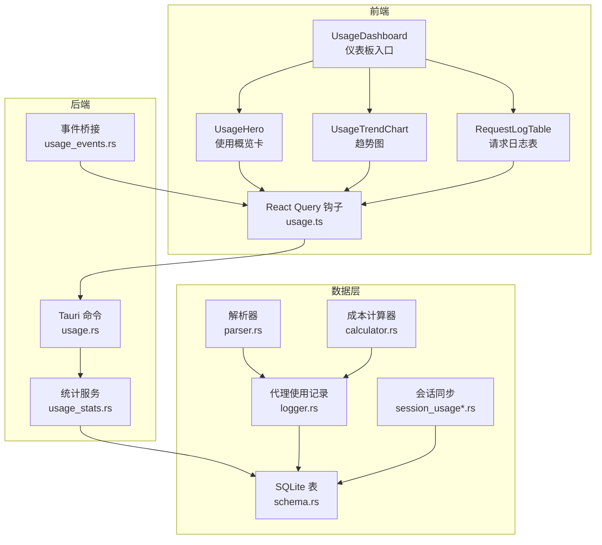
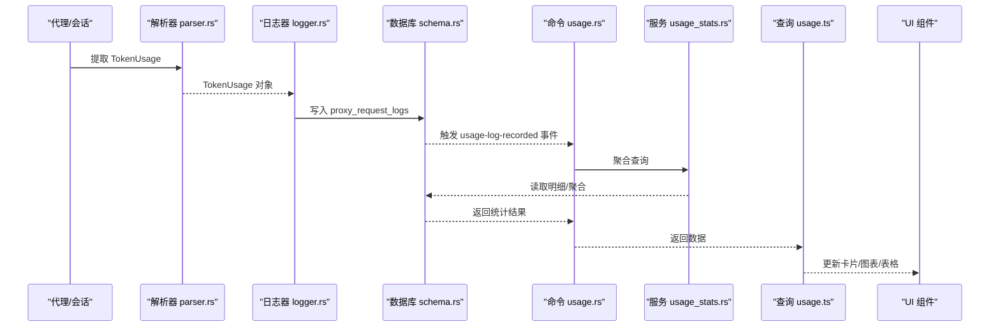
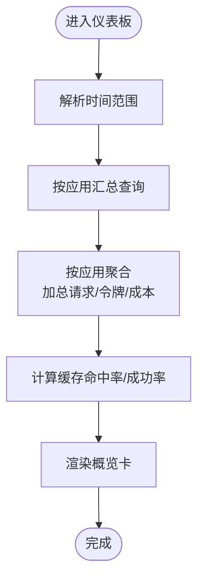
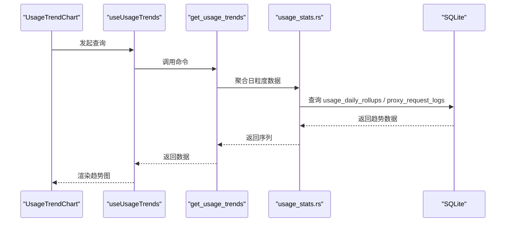
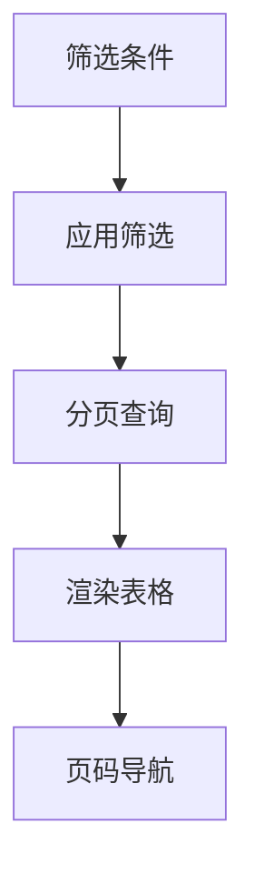
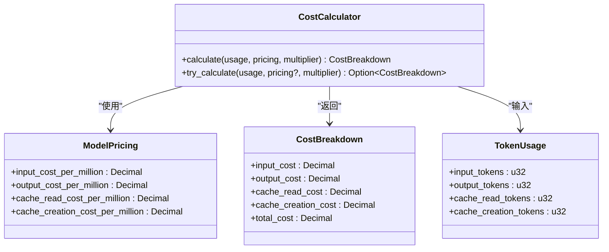
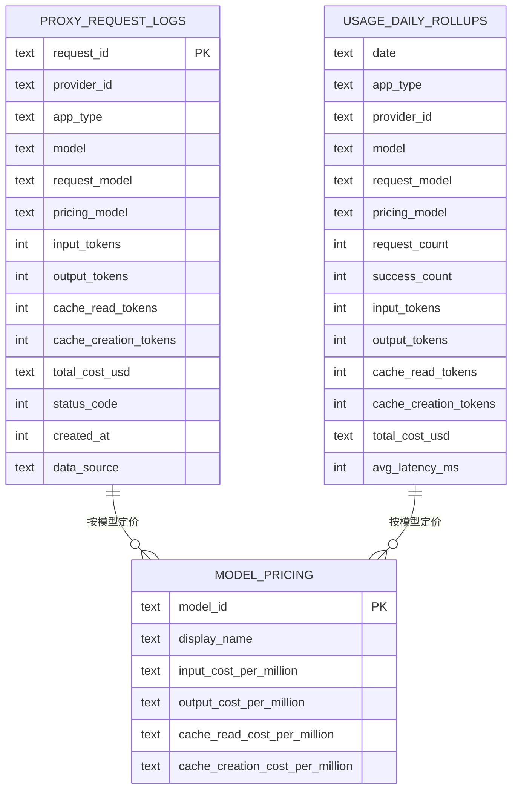
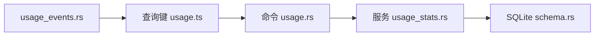

# 使用统计

<cite>
**本文引用的文件**
- [UsageDashboard.tsx](file://src/components/usage/UsageDashboard.tsx)
- [UsageHero.tsx](file://src/components/usage/UsageHero.tsx)
- [UsageTrendChart.tsx](file://src/components/usage/UsageTrendChart.tsx)
- [RequestLogTable.tsx](file://src/components/usage/RequestLogTable.tsx)
- [usage.ts](file://src/lib/query/usage.ts)
- [usage.ts](file://src/types/usage.ts)
- [usage.rs](file://src-tauri/src/commands/usage.rs)
- [usage_stats.rs](file://src-tauri/src/services/usage_stats.rs)
- [schema.rs](file://src-tauri/src/database/schema.rs)
- [logger.rs](file://src-tauri/src/proxy/usage/logger.rs)
- [calculator.rs](file://src-tauri/src/proxy/usage/calculator.rs)
- [parser.rs](file://src-tauri/src/proxy/usage/parser.rs)
- [usage_events.rs](file://src-tauri/src/usage_events.rs)
- [session_usage.rs](file://src-tauri/src/services/session_usage.rs)
- [session_usage_codex.rs](file://src-tauri/src/services/session_usage_codex.rs)
- [4-proxy/4.4-usage.md](file://docs/user-manual/en/4-proxy/4.4-usage.md)
</cite>

## 目录
1. [简介](#简介)
2. [项目结构](#项目结构)
3. [核心组件](#核心组件)
4. [架构总览](#架构总览)
5. [详细组件分析](#详细组件分析)
6. [依赖关系分析](#依赖关系分析)
7. [性能考量](#性能考量)
8. [故障排查指南](#故障排查指南)
9. [结论](#结论)
10. [附录](#附录)

## 简介
本文件面向 CC Switch 的“使用统计”功能，系统性阐述统计仪表板的组成与能力，涵盖使用概览、趋势分析、详细日志与统计报表、成本计算与定价模型、数据采集与存储、查询与导出、以及隐私与数据清理策略。文档同时提供图表解读指南，帮助用户正确理解关键指标、判断趋势与识别异常。

## 项目结构
统计功能由前端组件、查询与状态管理、后端命令与服务、数据库与日志记录四个层面协同完成：
- 前端：仪表板页面、卡片与图表、表格与筛选、定价配置面板
- 查询与状态：React Query 管理的查询键与钩子
- 后端：Tauri 命令桥接前端与数据库服务
- 数据库与日志：明细日志表、聚合滚动表、会话同步、成本计算器与解析器

**图表来源**
- [UsageDashboard.tsx:1-224](file://src/components/usage/UsageDashboard.tsx#L1-224)
- [UsageHero.tsx:1-402](file://src/components/usage/UsageHero.tsx#L1-402)
- [UsageTrendChart.tsx:1-236](file://src/components/usage/UsageTrendChart.tsx#L1-236)
- [RequestLogTable.tsx:1-505](file://src/components/usage/RequestLogTable.tsx#L1-505)
- [usage.ts:1-320](file://src/lib/query/usage.ts#L1-320)
- [usage.rs:1-314](file://src-tauri/src/commands/usage.rs#L1-314)
- [usage_stats.rs:1-1404](file://src-tauri/src/services/usage_stats.rs#L1-1404)
- [schema.rs:183-284](file://src-tauri/src/database/schema.rs#L183-284)
- [logger.rs:1-37](file://src-tauri/src/proxy/usage/logger.rs#L1-37)
- [parser.rs:1-800](file://src-tauri/src/proxy/usage/parser.rs#L1-800)
- [calculator.rs:1-119](file://src-tauri/src/proxy/usage/calculator.rs#L1-119)
- [session_usage.rs:455-476](file://src-tauri/src/services/session_usage.rs#L455-476)
- [session_usage_codex.rs:1-45](file://src-tauri/src/services/session_usage_codex.rs#L1-45)

**章节来源**
- [UsageDashboard.tsx:1-224](file://src/components/usage/UsageDashboard.tsx#L1-224)
- [usage.ts:1-320](file://src/lib/query/usage.ts#L1-320)
- [usage.rs:1-314](file://src-tauri/src/commands/usage.rs#L1-314)
- [schema.rs:183-284](file://src-tauri/src/database/schema.rs#L183-284)

## 核心组件
- 仪表板入口：聚合时间范围、应用类型过滤、自动刷新控制、定价配置折叠面板
- 使用概览卡：实时展示请求总数、真实消耗（含缓存归一）、缓存命中率、预估成本、成功率
- 趋势图：按小时/天粒度展示请求量、输入/输出/缓存读写令牌趋势与成本曲线
- 请求日志表：支持应用类型、状态码、提供商/模型关键词、时间范围筛选，分页与排序
- 统计报表：按提供商与按模型的汇总统计
- 成本计算：基于模型定价与成本倍数，支持缓存读写与创建的成本拆解
- 数据来源：代理请求日志、会话同步（Codex/Gemini/OpenCode/Hermes）

**章节来源**
- [UsageDashboard.tsx:1-224](file://src/components/usage/UsageDashboard.tsx#L1-224)
- [UsageHero.tsx:1-402](file://src/components/usage/UsageHero.tsx#L1-402)
- [UsageTrendChart.tsx:1-236](file://src/components/usage/UsageTrendChart.tsx#L1-236)
- [RequestLogTable.tsx:1-505](file://src/components/usage/RequestLogTable.tsx#L1-505)
- [usage.ts:125-320](file://src/lib/query/usage.ts#L125-320)
- [usage.rs:10-314](file://src-tauri/src/commands/usage.rs#L10-314)
- [usage_stats.rs:15-33](file://src-tauri/src/services/usage_stats.rs#L15-33)

## 架构总览
统计数据流自代理层采集，经解析与成本计算写入明细日志表，并由服务层提供聚合查询与报表接口；前端通过 React Query 与 Tauri 命令交互，实现卡片、图表与表格的联动与实时刷新。

**图表来源**
- [parser.rs:15-52](file://src-tauri/src/proxy/usage/parser.rs#L15-52)
- [logger.rs:11-37](file://src-tauri/src/proxy/usage/logger.rs#L11-37)
- [schema.rs:183-219](file://src-tauri/src/database/schema.rs#L183-219)
- [usage.rs:10-90](file://src-tauri/src/commands/usage.rs#L10-90)
- [usage_stats.rs:15-33](file://src-tauri/src/services/usage_stats.rs#L15-33)
- [usage.ts:125-231](file://src/lib/query/usage.ts#L125-231)
- [usage_events.rs:1-28](file://src-tauri/src/usage_events.rs#L1-28)

## 详细组件分析

### 仪表板与概览卡
- 仪表板入口负责时间范围选择、应用类型过滤、自动刷新间隔切换，并承载趋势图与日志/统计标签页
- 概览卡根据后端返回的按应用聚合汇总，进行加权计算得到“真实消耗”与“缓存命中率”，并支持协议差异提示（如 OpenAI 协议不区分缓存写入）

**图表来源**
- [UsageDashboard.tsx:40-74](file://src/components/usage/UsageDashboard.tsx#L40-74)
- [UsageHero.tsx:81-123](file://src/components/usage/UsageHero.tsx#L81-123)
- [usage_stats.rs:15-33](file://src-tauri/src/services/usage_stats.rs#L15-33)

**章节来源**
- [UsageDashboard.tsx:1-224](file://src/components/usage/UsageDashboard.tsx#L1-224)
- [UsageHero.tsx:1-402](file://src/components/usage/UsageHero.tsx#L1-402)
- [usage.ts:126-165](file://src/lib/query/usage.ts#L126-165)

### 趋势分析与图表
- 趋势图支持按小时/天粒度，绘制输入、输出、缓存读写令牌与成本曲线
- 图表工具提示与坐标轴本地化，支持按小时/日期格式化
- 自动刷新与防抖事件桥接，确保新日志写入后快速更新

**图表来源**
- [UsageTrendChart.tsx:30-236](file://src/components/usage/UsageTrendChart.tsx#L30-236)
- [usage.ts:167-187](file://src/lib/query/usage.ts#L167-187)
- [usage.rs:33-44](file://src-tauri/src/commands/usage.rs#L33-44)
- [usage_stats.rs:1387-1404](file://src-tauri/src/services/usage_stats.rs#L1387-1404)
- [schema.rs:260-284](file://src-tauri/src/database/schema.rs#L260-284)

**章节来源**
- [UsageTrendChart.tsx:1-236](file://src/components/usage/UsageTrendChart.tsx#L1-236)
- [usage.ts:167-187](file://src/lib/query/usage.ts#L167-187)
- [usage.rs:33-44](file://src-tauri/src/commands/usage.rs#L33-44)

### 详细日志与筛选
- 支持应用类型、状态码、提供商/模型关键词、自定义时间范围筛选
- 分页加载与页码导航，支持跳转到指定页
- 展示请求时间、提供商、计费模型、输入/输出/缓存令牌、成本、耗时、状态码与数据来源

**图表来源**
- [RequestLogTable.tsx:52-505](file://src/components/usage/RequestLogTable.tsx#L52-505)
- [usage.ts:233-259](file://src/lib/query/usage.ts#L233-259)
- [usage.rs:72-90](file://src-tauri/src/commands/usage.rs#L72-90)

**章节来源**
- [RequestLogTable.tsx:1-505](file://src/components/usage/RequestLogTable.tsx#L1-505)
- [usage.ts:233-259](file://src/lib/query/usage.ts#L233-259)
- [usage.rs:72-90](file://src-tauri/src/commands/usage.rs#L72-90)

### 成本计算与定价模型
- 成本由输入/输出/缓存读取/缓存创建四项构成，最终总价乘以成本倍数
- 模型定价按“每百万”单位存储，前端支持增删改定价并触发查询失效
- 会话同步模块对 Codex/Gemini/OpenCode/Hermes 的令牌增量进行解析与回填

**图表来源**
- [calculator.rs:19-119](file://src-tauri/src/proxy/usage/calculator.rs#L19-119)
- [parser.rs:15-52](file://src-tauri/src/proxy/usage/parser.rs#L15-52)

**章节来源**
- [calculator.rs:1-119](file://src-tauri/src/proxy/usage/calculator.rs#L1-119)
- [usage.rs:142-217](file://src-tauri/src/commands/usage.rs#L142-217)
- [session_usage_codex.rs:476-497](file://src-tauri/src/services/session_usage_codex.rs#L476-497)
- [session_usage.rs:455-476](file://src-tauri/src/services/session_usage.rs#L455-476)

### 数据采集与存储
- 代理层解析响应，提取 TokenUsage 并写入 proxy_request_logs
- 会话同步模块从各应用会话目录增量解析 JSONL，计算增量令牌并回填成本
- 日聚合表 usage_daily_rollups 用于趋势与报表的高效查询

**图表来源**
- [schema.rs:183-284](file://src-tauri/src/database/schema.rs#L183-284)
- [logger.rs:11-37](file://src-tauri/src/proxy/usage/logger.rs#L11-37)
- [usage_stats.rs:2420-2554](file://src-tauri/src/services/usage_stats.rs#L2420-2554)

**章节来源**
- [schema.rs:183-284](file://src-tauri/src/database/schema.rs#L183-284)
- [logger.rs:11-37](file://src-tauri/src/proxy/usage/logger.rs#L11-37)
- [session_usage_codex.rs:1-45](file://src-tauri/src/services/session_usage_codex.rs#L1-45)

## 依赖关系分析
- 前端查询键与后端命令一一对应，保证缓存键稳定与失效范围可控
- 事件桥接模块在日志写入后触发前端查询失效，减少轮询开销
- 服务层封装 SQL 查询与聚合逻辑，屏蔽复杂度

**图表来源**
- [usage.ts:32-123](file://src/lib/query/usage.ts#L32-123)
- [usage.rs:10-90](file://src-tauri/src/commands/usage.rs#L10-90)
- [usage_stats.rs:1387-1404](file://src-tauri/src/services/usage_stats.rs#L1387-1404)
- [schema.rs:183-284](file://src-tauri/src/database/schema.rs#L183-284)
- [usage_events.rs:1-28](file://src-tauri/src/usage_events.rs#L1-28)

**章节来源**
- [usage.ts:1-320](file://src/lib/query/usage.ts#L1-320)
- [usage.rs:1-314](file://src-tauri/src/commands/usage.rs#L1-314)
- [usage_events.rs:1-28](file://src-tauri/src/usage_events.rs#L1-28)

## 性能考量
- 自动刷新与防抖：前端定时刷新与事件防抖合并，避免频繁查询与 UI 抖动
- 索引优化：明细日志表针对 provider/app_type、created_at、model、session、status 等建立索引
- 聚合查询：趋势与报表优先使用日聚合表，降低明细表扫描压力
- 会话同步：增量解析与去重，避免重复回填

[本节为通用指导，无需特定文件引用]

## 故障排查指南
- 未定价行：当模型定价缺失且存在计费令牌时，日志中标记为未定价，成本为 0；可在定价面板补充或删除定价
- 成本倍数：若成本倍数非 1，会在日志中显示倍数；检查代理配置与提供商设置
- 缓存写入：OpenAI 协议不区分缓存写入，UI 显示 N/A；Anthropic 协议可显示写入
- 事件未刷新：确认日志写入后是否触发 usage-log-recorded 事件；检查事件桥接与前端监听

**章节来源**
- [RequestLogTable.tsx:373-391](file://src/components/usage/RequestLogTable.tsx#L373-391)
- [usage.rs:142-217](file://src-tauri/src/commands/usage.rs#L142-217)
- [usage_events.rs:1-28](file://src-tauri/src/usage_events.rs#L1-28)

## 结论
CC Switch 的使用统计以“代理解析 + 会话同步 + 成本计算 + 聚合查询”的链路实现，前端通过卡片、趋势图与日志表提供直观的使用洞察。通过模型定价与成本倍数灵活配置，结合按应用/提供商/模型的多维统计，用户可以有效监控成本与资源消耗，并据此优化路由与用量策略。

[本节为总结，无需特定文件引用]

## 附录

### 统计图表解读指南
- 真实消耗（输入+输出+缓存创建+缓存命中）：反映实际被模型处理的令牌总量，建议关注其变化趋势
- 缓存命中率：缓存命中占可缓存输入的比例，越高代表复用效果越好
- 请求趋势：结合小时/天粒度观察业务高峰与低谷，辅助容量规划
- 成本曲线：与令牌趋势联动，识别成本异常波动

**章节来源**
- [UsageHero.tsx:193-231](file://src/components/usage/UsageHero.tsx#L193-231)
- [UsageTrendChart.tsx:180-230](file://src/components/usage/UsageTrendChart.tsx#L180-230)
- [4-proxy/4.4-usage.md:44-93](file://docs/user-manual/en/4-proxy/4.4-usage.md#L44-L93)

### 关键指标与异常检测
- 异常指标：缓存命中率骤降、成本曲线与令牌趋势背离、未定价行增多
- 建议：核对模型定价、检查路由接管与计价模式、审查会话同步状态

**章节来源**
- [usage.ts:188-252](file://src/types/usage.ts#L188-252)
- [RequestLogTable.tsx:373-391](file://src/components/usage/RequestLogTable.tsx#L373-391)

### 数据隐私与清理策略
- 数据隐私：统计仅包含必要的令牌与成本信息，不包含对话内容；会话同步遵循增量解析与去重
- 数据清理：历史明细与聚合数据按需保留，建议定期评估磁盘占用并结合导出进行归档

**章节来源**
- [session_usage.rs:1-45](file://src-tauri/src/services/session_usage.rs#L1-45)
- [schema.rs:183-284](file://src-tauri/src/database/schema.rs#L183-284)