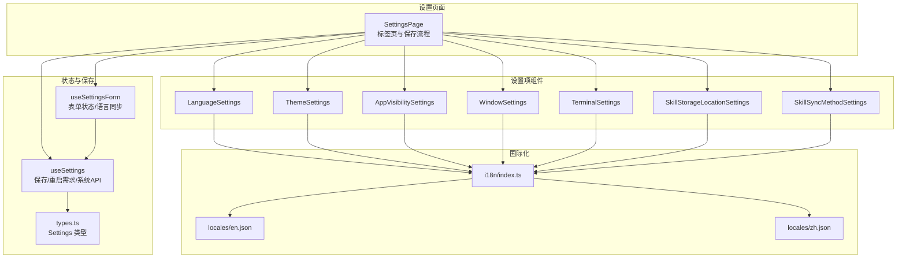
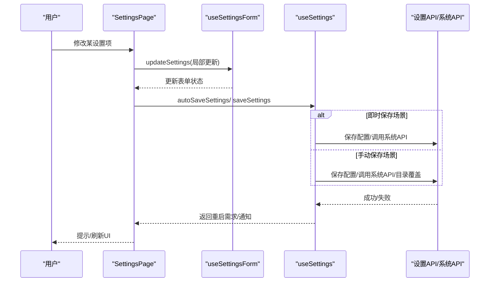
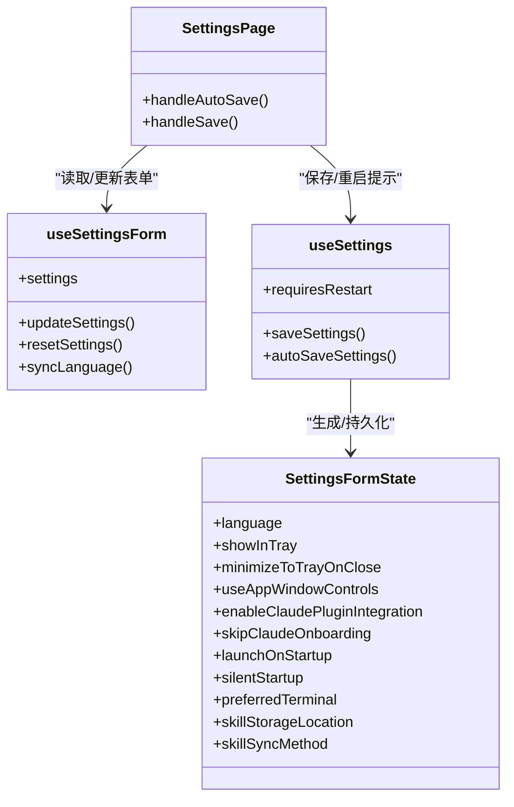

# 全局设置

<cite>
**本文引用的文件**
- [LanguageSettings.tsx](file://src/components/settings/LanguageSettings.tsx)
- [ThemeSettings.tsx](file://src/components/settings/ThemeSettings.tsx)
- [AppVisibilitySettings.tsx](file://src/components/settings/AppVisibilitySettings.tsx)
- [WindowSettings.tsx](file://src/components/settings/WindowSettings.tsx)
- [TerminalSettings.tsx](file://src/components/settings/TerminalSettings.tsx)
- [SkillStorageLocationSettings.tsx](file://src/components/settings/SkillStorageLocationSettings.tsx)
- [SkillSyncMethodSettings.tsx](file://src/components/settings/SkillSyncMethodSettings.tsx)
- [SettingsPage.tsx](file://src/components/settings/SettingsPage.tsx)
- [useSettings.ts](file://src/hooks/useSettings.ts)
- [useSettingsForm.ts](file://src/hooks/useSettingsForm.ts)
- [types.ts](file://src/types.ts)
- [index.ts](file://src/i18n/index.ts)
- [en.json](file://src/i18n/locales/en.json)
- [zh.json](file://src/i18n/locales/zh.json)
</cite>

## 目录
1. [简介](#简介)
2. [项目结构](#项目结构)
3. [核心组件](#核心组件)
4. [架构总览](#架构总览)
5. [详细组件分析](#详细组件分析)
6. [依赖关系分析](#依赖关系分析)
7. [性能考量](#性能考量)
8. [故障排查指南](#故障排查指南)
9. [结论](#结论)
10. [附录](#附录)

## 简介
本文件系统化梳理 CC Switch 的全局设置功能，覆盖语言设置、主题配置、应用可见性、窗口行为、终端选择、技能存储与同步等关键领域。文档逐项说明每个设置项的作用、可选值范围、实际影响、相互依赖与冲突处理，并提供最佳实践与常见配置组合示例，帮助用户高效、稳定地定制应用体验。

## 项目结构
全局设置位于前端设置页面组件与状态钩子之间，通过统一的状态管理与保存逻辑实现持久化与即时反馈。主要涉及以下模块：
- 设置页面容器：负责标签页组织、保存流程与重启提示
- 设置项组件：语言、主题、应用可见性、窗口行为、终端、技能存储与同步
- 状态与保存：表单状态、目录覆盖、元数据与重启需求
- 类型定义：Settings 结构与各设置项的类型约束
- 国际化：语言选择与文案

图表来源
- [SettingsPage.tsx:193-261](file://src/components/settings/SettingsPage.tsx#L193-L261)
- [LanguageSettings.tsx:12-42](file://src/components/settings/LanguageSettings.tsx#L12-L42)
- [ThemeSettings.tsx:7-44](file://src/components/settings/ThemeSettings.tsx#L7-L44)
- [AppVisibilitySettings.tsx:32-96](file://src/components/settings/AppVisibilitySettings.tsx#L32-L96)
- [WindowSettings.tsx:13-95](file://src/components/settings/WindowSettings.tsx#L13-L95)
- [TerminalSettings.tsx:81-115](file://src/components/settings/TerminalSettings.tsx#L81-L115)
- [SkillStorageLocationSettings.tsx:24-133](file://src/components/settings/SkillStorageLocationSettings.tsx#L24-L133)
- [SkillSyncMethodSettings.tsx:11-49](file://src/components/settings/SkillSyncMethodSettings.tsx#L11-L49)
- [useSettingsForm.ts:72-132](file://src/hooks/useSettingsForm.ts#L72-L132)
- [useSettings.ts:62-126](file://src/hooks/useSettings.ts#L62-L126)
- [types.ts:326-427](file://src/types.ts#L326-L427)
- [index.ts:13-62](file://src/i18n/index.ts#L13-L62)

章节来源
- [SettingsPage.tsx:193-261](file://src/components/settings/SettingsPage.tsx#L193-L261)
- [useSettings.ts:62-126](file://src/hooks/useSettings.ts#L62-L126)
- [types.ts:326-427](file://src/types.ts#L326-L427)

## 核心组件
- 语言设置：支持中（简/繁）、英、日四种语言，变更即时生效并持久化到本地存储。
- 主题设置：支持亮色、暗色、跟随系统三种模式，通过主题提供器驱动 UI 切换。
- 应用可见性：控制 Claude/Claude Desktop/Codex/Gemini/OpenCode/OpenClaw/Hermes 等应用在主界面的显示。
- 窗口行为：开机自启、静默启动、最小化到托盘、Claude 插件集成、跳过 Claude 首次引导等。
- 终端设置：按平台提供可选终端，支持默认值与回退提示。
- 技能存储位置：CC Switch 内部存储或统一存储（~/.agents/skills/），支持迁移与提示。
- 技能同步方式：符号链接或复制，支持自动推断为符号链接显示。

章节来源
- [LanguageSettings.tsx:12-42](file://src/components/settings/LanguageSettings.tsx#L12-L42)
- [ThemeSettings.tsx:7-44](file://src/components/settings/ThemeSettings.tsx#L7-L44)
- [AppVisibilitySettings.tsx:32-96](file://src/components/settings/AppVisibilitySettings.tsx#L32-L96)
- [WindowSettings.tsx:13-95](file://src/components/settings/WindowSettings.tsx#L13-L95)
- [TerminalSettings.tsx:81-115](file://src/components/settings/TerminalSettings.tsx#L81-L115)
- [SkillStorageLocationSettings.tsx:24-133](file://src/components/settings/SkillStorageLocationSettings.tsx#L24-L133)
- [SkillSyncMethodSettings.tsx:11-49](file://src/components/settings/SkillSyncMethodSettings.tsx#L11-L49)

## 架构总览
设置页面通过 useSettings 与 useSettingsForm 组合状态与保存逻辑，将用户交互转化为 Settings 结构并通过 API 持久化。语言变更通过 i18n 实时同步，部分系统级设置（如开机自启、Claude 插件集成）通过系统 API 生效。

图表来源
- [SettingsPage.tsx:164-182](file://src/components/settings/SettingsPage.tsx#L164-L182)
- [useSettings.ts:181-305](file://src/hooks/useSettings.ts#L181-L305)
- [useSettings.ts:309-484](file://src/hooks/useSettings.ts#L309-L484)

章节来源
- [SettingsPage.tsx:164-182](file://src/components/settings/SettingsPage.tsx#L164-L182)
- [useSettings.ts:181-305](file://src/hooks/useSettings.ts#L181-L305)
- [useSettings.ts:309-484](file://src/hooks/useSettings.ts#L309-L484)

## 详细组件分析

### 语言设置
- 作用：选择界面语言（中/日/英），影响所有 UI 文案与提示。
- 可选值：zh、zh-TW、en、ja。
- 实际影响：变更后立即通过 i18n 切换语言，并将语言偏好写入本地存储；重启后默认使用上次选择。
- 依赖与冲突：与系统语言探测与本地存储互为后备；与主题设置无直接冲突。
- 最佳实践：首次使用建议与系统语言一致；团队协作建议统一为 en 以减少歧义。

章节来源
- [LanguageSettings.tsx:5-42](file://src/components/settings/LanguageSettings.tsx#L5-L42)
- [useSettingsForm.ts:82-100](file://src/hooks/useSettingsForm.ts#L82-L100)
- [index.ts:13-62](file://src/i18n/index.ts#L13-L62)
- [en.json:1-200](file://src/i18n/locales/en.json#L1-L200)
- [zh.json:1-200](file://src/i18n/locales/zh.json#L1-L200)

### 主题配置
- 作用：切换亮/暗/系统主题，适配系统外观。
- 可选值：light、dark、system。
- 实际影响：通过主题提供器即时切换 UI 主题；系统模式下随系统变化。
- 依赖与冲突：与语言设置独立；与窗口行为中的“使用应用窗口控件”在某些平台上可能有视觉差异。
- 最佳实践：夜间工作建议使用暗色或系统跟随；高对比度需求可选亮色。

章节来源
- [ThemeSettings.tsx:7-44](file://src/components/settings/ThemeSettings.tsx#L7-L44)

### 应用可见性设置
- 作用：控制各应用在主界面的显示开关，避免界面拥挤。
- 可选值：布尔集合，针对每个应用独立开关。
- 实际影响：至少保留一个应用可见；隐藏后托盘菜单与相关入口会相应调整。
- 依赖与冲突：最后一项不可关闭；与“最小化到托盘”配合使用可减少桌面占用。
- 最佳实践：仅保留常用应用；团队共享配置时建议统一可见性。

章节来源
- [AppVisibilitySettings.tsx:32-96](file://src/components/settings/AppVisibilitySettings.tsx#L32-L96)
- [types.ts:262-270](file://src/types.ts#L262-L270)

### 窗口管理与行为
- 作用：控制应用启动、托盘行为、窗口控件与 Claude 插件集成等。
- 可选值：布尔开关为主；开机自启可配合静默启动。
- 实际影响：
  - 开机自启：调用系统 API 设置自启动。
  - 静默启动：启动时不显示主窗口。
  - 最小化到托盘：关闭按钮行为改为最小化至托盘。
  - Claude 插件集成：写入 ~/.claude/settings.json 并同步当前供应商。
  - 跳过 Claude 首次引导：写入 ~/.claude.json 的 hasCompletedOnboarding。
  - 应用窗口控件：Linux 下可启用原生窗口控件。
- 依赖与冲突：
  - 开机自启与静默启动可叠加；若权限受限可能失败。
  - Claude 插件集成需当前供应商为官方时才写入 primaryApiKey。
  - 跳过首次引导与插件集成互不影响。
- 最佳实践：开发/自动化场景建议开启开机自启+静默启动；生产环境谨慎开启静默启动。

章节来源
- [WindowSettings.tsx:13-95](file://src/components/settings/WindowSettings.tsx#L13-L95)
- [useSettings.ts:131-177](file://src/hooks/useSettings.ts#L131-L177)
- [useSettings.ts:218-271](file://src/hooks/useSettings.ts#L218-L271)
- [useSettings.ts:376-401](file://src/hooks/useSettings.ts#L376-L401)
- [types.ts:326-364](file://src/types.ts#L326-L364)

### 终端配置
- 作用：选择默认终端应用，便于打开相关配置或运行脚本。
- 可选值：按平台区分（macOS、Windows、Linux）。
- 实际影响：保存后作为首选终端；若未安装对应终端，可能无法打开。
- 依赖与冲突：与系统默认终端无关；不同平台选项不同。
- 最佳实践：与本地开发工具链一致；Linux 下优先选择图形终端。

章节来源
- [TerminalSettings.tsx:81-115](file://src/components/settings/TerminalSettings.tsx#L81-L115)
- [types.ts:410-416](file://src/types.ts#L410-L416)

### 技能存储设置
- 作用：选择技能存储位置与同步方式。
- 可选值：
  - 存储位置：cc_switch（应用内）、unified（~/.agents/skills/）。
  - 同步方式：auto（默认 symlink）、symlink、copy。
- 实际影响：
  - 存储位置迁移会触发迁移流程与提示；存在已安装技能时需二次确认。
  - 同步方式为 symlink 时更节省空间且保持实时更新；copy 方式更稳定但占用空间更大。
- 依赖与冲突：
  - 存储位置切换可能影响第三方工具对技能目录的访问。
  - symlink 在部分文件系统/网络盘上可能不可用。
- 最佳实践：个人开发建议 symlink；团队共享建议 copy；统一存储适合多应用共享。

章节来源
- [SkillStorageLocationSettings.tsx:24-133](file://src/components/settings/SkillStorageLocationSettings.tsx#L24-L133)
- [SkillSyncMethodSettings.tsx:11-49](file://src/components/settings/SkillSyncMethodSettings.tsx#L11-L49)
- [types.ts:230-235](file://src/types.ts#L230-L235)
- [types.ts:392-397](file://src/types.ts#L392-L397)

## 依赖关系分析
- 设置项与状态：
  - SettingsPage 调用 useSettingsForm 与 useSettings 组合状态与保存逻辑。
  - useSettingsForm 负责语言标准化与表单初始化；useSettings 负责保存、重启需求与系统 API 调用。
- 设置项与类型：
  - Settings 类型定义了所有设置项的字段、默认值与可选范围。
- 设置项与国际化：
  - 所有文案通过 i18n 管理，语言设置直接影响文案显示。
- 设置项之间的耦合：
  - 窗口行为中的开机自启与静默启动可叠加；Claude 插件集成与跳过首次引导互不影响。
  - 应用可见性与托盘行为共同影响桌面占用与任务栏行为。
  - 技能存储位置与同步方式影响外部工具访问与磁盘占用。

图表来源
- [useSettingsForm.ts:72-132](file://src/hooks/useSettingsForm.ts#L72-L132)
- [useSettings.ts:62-126](file://src/hooks/useSettings.ts#L62-L126)
- [SettingsPage.tsx:164-182](file://src/components/settings/SettingsPage.tsx#L164-L182)
- [types.ts:326-427](file://src/types.ts#L326-L427)

章节来源
- [useSettingsForm.ts:72-132](file://src/hooks/useSettingsForm.ts#L72-L132)
- [useSettings.ts:62-126](file://src/hooks/useSettings.ts#L62-L126)
- [SettingsPage.tsx:164-182](file://src/components/settings/SettingsPage.tsx#L164-L182)
- [types.ts:326-427](file://src/types.ts#L326-L427)

## 性能考量
- 即时保存与系统 API：
  - 即时保存（autoSaveSettings）避免频繁调用系统 API，降低阻塞风险。
  - 手动保存（saveSettings）包含更全面的校验与系统 API 调用，适合批量修改。
- 语言切换：
  - 语言切换为纯前端操作，性能开销极低；持久化到本地存储避免每次启动读取。
- 技能迁移：
  - 迁移过程可能较慢，建议在空闲时段执行；迁移失败会提示部分成功。

## 故障排查指南
- 语言设置未生效
  - 检查本地存储中 language 键是否存在；确认 i18n 初始化逻辑是否正确读取。
  - 章节来源
    - [index.ts:13-62](file://src/i18n/index.ts#L13-L62)
    - [useSettingsForm.ts:82-100](file://src/hooks/useSettingsForm.ts#L82-L100)
- 开机自启设置失败
  - 检查系统权限与平台支持情况；查看保存日志与错误提示。
  - 章节来源
    - [useSettings.ts:226-236](file://src/hooks/useSettings.ts#L226-L236)
- Claude 插件集成失败
  - 确认当前供应商类别；检查 ~/.claude/settings.json 写入权限。
  - 章节来源
    - [useSettings.ts:131-177](file://src/hooks/useSettings.ts#L131-L177)
- 技能迁移失败
  - 查看迁移结果中的错误数量与详情；必要时改用复制方式。
  - 章节来源
    - [SkillStorageLocationSettings.tsx:43-68](file://src/components/settings/SkillStorageLocationSettings.tsx#L43-L68)

## 结论
CC Switch 的全局设置围绕“即时反馈 + 系统集成 + 可靠持久化”的设计目标构建。通过清晰的设置项划分、完善的类型约束与保存流程，用户可以在多语言、多主题、多应用环境下获得一致且可控的使用体验。建议结合自身工作流选择合适的组合，并在团队环境中统一策略以提升协作效率。

## 附录
- 常见配置组合示例
  - 开发/自动化：开机自启 + 静默启动 + 暗色主题 + 最小化到托盘 + 统一存储 + 符号链接同步。
  - 团队共享：开机自启 + 亮色主题 + 统一存储 + 复制同步 + 显式可见性。
  - 夜间工作：暗色主题 + 符号链接同步 + 统一存储 + 最小化到托盘。
- 术语说明
  - 符号链接：指向同一文件的快捷方式，节省空间且实时同步。
  - 复制：独立副本，稳定性高但占用空间较大。
  - 统一存储：技能放置于 ~/.agents/skills/，便于多应用共享。