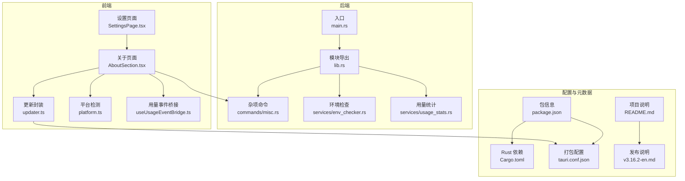
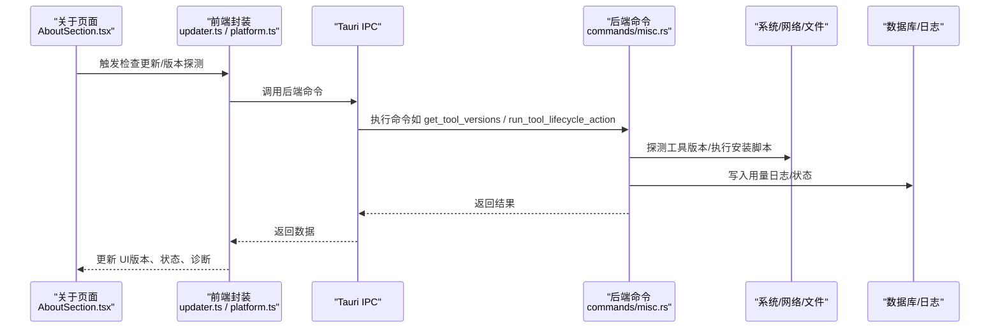
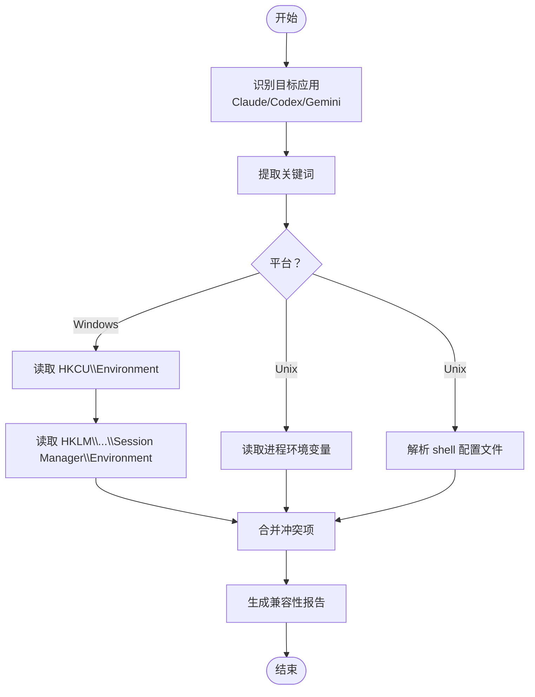
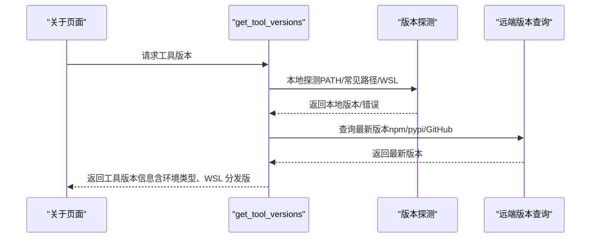
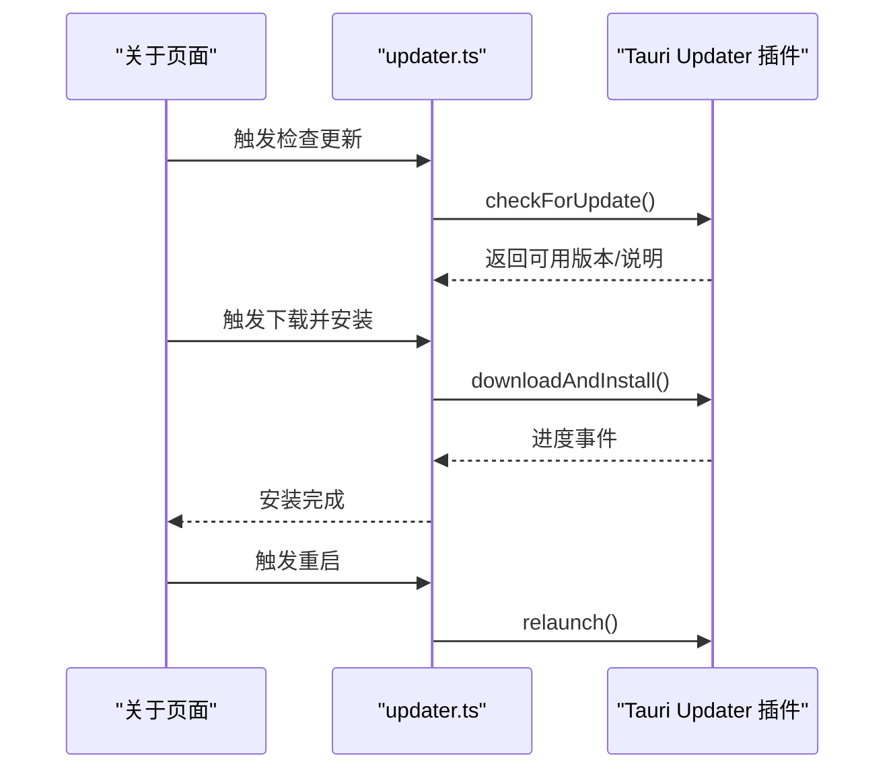
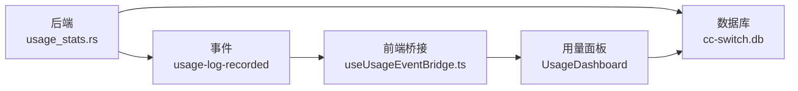
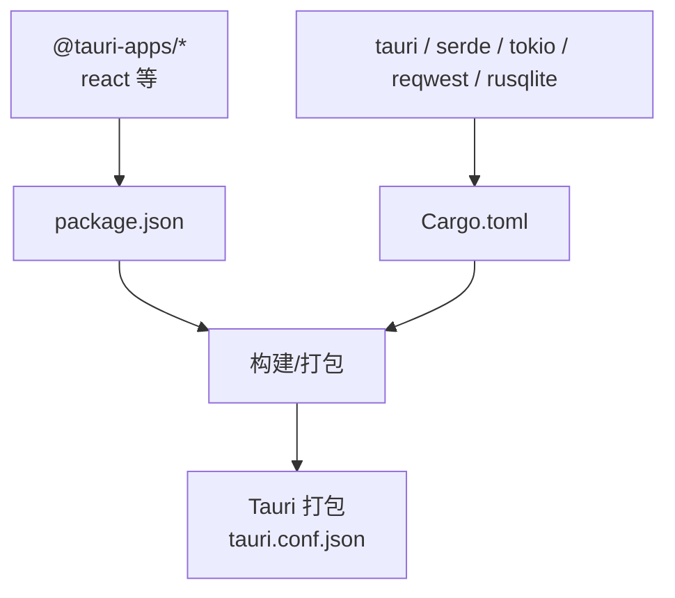

# 关于系统

<cite>
**本文引用的文件**
- [AboutSection.tsx](file://src/components/settings/AboutSection.tsx)
- [updater.ts](file://src/lib/updater.ts)
- [platform.ts](file://src/lib/platform.ts)
- [env_checker.rs](file://src-tauri/src/services/env_checker.rs)
- [main.rs](file://src-tauri/src/main.rs)
- [package.json](file://package.json)
- [Cargo.toml](file://src-tauri/Cargo.toml)
- [version.ts](file://src/lib/version.ts)
- [lib.rs](file://src-tauri/src/lib.rs)
- [SettingsPage.tsx](file://src/components/settings/SettingsPage.tsx)
- [useUsageEventBridge.ts](file://src/hooks/useUsageEventBridge.ts)
- [usage_stats.rs](file://src-tauri/src/services/usage_stats.rs)
- [misc.rs](file://src-tauri/src/commands/misc.rs)
- [README.md](file://README.md)
- [v3.16.2-en.md](file://docs/release-notes/v3.16.2-en.md)
- [tauri.conf.json](file://src-tauri/tauri.conf.json)
</cite>

## 目录
1. [简介](#简介)
2. [项目结构](#项目结构)
3. [核心组件](#核心组件)
4. [架构总览](#架构总览)
5. [详细组件分析](#详细组件分析)
6. [依赖分析](#依赖分析)
7. [性能考虑](#性能考虑)
8. [故障排除指南](#故障排除指南)
9. [结论](#结论)
10. [附录](#附录)

## 简介
本文件面向 CC Switch 的“关于系统”页面，系统性说明应用版本信息、构建详情、许可证与开发者信息；解释系统环境检查、依赖项验证与兼容性报告；提供系统状态监控方法（内存、CPU、磁盘）；说明更新机制、版本历史与变更日志；并给出诊断工具与故障排除建议。同时对比便携版与安装版的差异及优缺点。

## 项目结构
- 前端（React + TypeScript）位于 src/，负责 UI、国际化、设置面板与关于页面。
- 后端（Tauri + Rust）位于 src-tauri/，负责系统命令、代理、数据库、日志与更新。
- 构建与打包配置位于根目录的 package.json、Cargo.toml 与 tauri.conf.json。
- 文档与发布说明位于 docs/release-notes/ 与 README.md。

图表来源
- [SettingsPage.tsx](file://src/components/settings/SettingsPage.tsx)
- [AboutSection.tsx](file://src/components/settings/AboutSection.tsx)
- [updater.ts](file://src/lib/updater.ts)
- [platform.ts](file://src/lib/platform.ts)
- [useUsageEventBridge.ts](file://src/hooks/useUsageEventBridge.ts)
- [main.rs](file://src-tauri/src/main.rs)
- [lib.rs](file://src-tauri/src/lib.rs)
- [misc.rs](file://src-tauri/src/commands/misc.rs)
- [env_checker.rs](file://src-tauri/src/services/env_checker.rs)
- [usage_stats.rs](file://src-tauri/src/services/usage_stats.rs)
- [package.json](file://package.json)
- [Cargo.toml](file://src-tauri/Cargo.toml)
- [tauri.conf.json](file://src-tauri/tauri.conf.json)
- [README.md](file://README.md)
- [v3.16.2-en.md](file://docs/release-notes/v3.16.2-en.md)

章节来源
- [package.json](file://package.json)
- [Cargo.toml](file://src-tauri/Cargo.toml)
- [tauri.conf.json](file://src-tauri/tauri.conf.json)
- [README.md](file://README.md)

## 核心组件
- 关于页面组件：负责展示应用版本、便携模式标识、工具版本探测、一键安装/升级、环境诊断与更新检查。
- 更新封装：封装 Tauri Updater 插件，提供检查、下载、安装与重启能力。
- 平台检测：轻量平台检测，避免在 SSR 或无 navigator 环境报错。
- 环境检查服务：跨平台检查环境变量冲突，Windows 读注册表，类 Unix 检查进程环境与 shell 配置文件。
- 杂项命令：提供工具版本探测、生命周期动作（安装/更新）、便携模式判断、外部链接打开等。
- 用量事件桥接：监听后端用量日志事件，驱动前端用量面板即时刷新。
- 用量统计服务：提供汇总、分组、趋势与日志查询，支撑“关于系统”的用量监控。

章节来源
- [AboutSection.tsx](file://src/components/settings/AboutSection.tsx)
- [updater.ts](file://src/lib/updater.ts)
- [platform.ts](file://src/lib/platform.ts)
- [env_checker.rs](file://src-tauri/src/services/env_checker.rs)
- [misc.rs](file://src-tauri/src/commands/misc.rs)
- [useUsageEventBridge.ts](file://src/hooks/useUsageEventBridge.ts)
- [usage_stats.rs](file://src-tauri/src/services/usage_stats.rs)

## 架构总览
前端通过 Tauri IPC 调用后端命令，后端执行系统级操作（版本探测、安装、更新、日志、数据库、代理等），并通过事件向前端推送状态变化。

图表来源
- [AboutSection.tsx](file://src/components/settings/AboutSection.tsx)
- [updater.ts](file://src/lib/updater.ts)
- [platform.ts](file://src/lib/platform.ts)
- [misc.rs](file://src-tauri/src/commands/misc.rs)

## 详细组件分析

### 版本信息与构建详情
- 应用版本与构建信息来源于前端包配置与后端 Cargo 配置，同时 Tauri 打包配置包含产品名称、版本与更新通道公钥。
- 前端 package.json 显示应用名称、版本、作者与许可证。
- 后端 Cargo.toml 显示应用名称、版本、作者、许可证与 Rust 版本要求。
- Tauri 配置包含产品名、版本、图标、更新通道公钥与下载地址。

章节来源
- [package.json](file://package.json)
- [Cargo.toml](file://src-tauri/Cargo.toml)
- [tauri.conf.json](file://src-tauri/tauri.conf.json)

### 许可证与开发者信息
- 前端 package.json 显示作者与 MIT 许可证。
- 后端 Cargo.toml 显示作者与 MIT 许可证。
- README.md 显示项目主页、赞助与贡献说明。

章节来源
- [package.json](file://package.json)
- [Cargo.toml](file://src-tauri/Cargo.toml)
- [README.md](file://README.md)

### 系统环境检查与兼容性报告
- 环境变量冲突检测：Windows 从 HKCU/HKLM 注册表读取系统环境变量；类 Unix 从当前进程环境变量与 shell 配置文件（~/.bashrc、~/.zshrc 等）解析 export 语句，匹配关键词（如 ANTHROPIC、OPENAI、GEMINI、GOOGLE_GEMINI）。
- 兼容性报告：返回冲突项清单（变量名、值、来源类型与路径），用于诊断第三方工具与 CLI 工具之间的环境干扰。

图表来源
- [env_checker.rs](file://src-tauri/src/services/env_checker.rs)

章节来源
- [env_checker.rs](file://src-tauri/src/services/env_checker.rs)

### 依赖项验证与工具版本探测
- 工具版本探测：支持 Claude Code、Codex、Gemini CLI、OpenCode、OpenClaw、Hermes。探测逻辑：
  - Windows：优先扫描真实可执行文件路径，避免误触 App Execution Alias。
  - 类 Unix：优先 PATH 命中的命令，未找到时扫描常见安装路径。
  - 远程版本：针对 npm/pypi 工具，查询最新版本；当本地版本已严格领先 latest 时，按预发布通道补查。
- 生命周期动作：支持安装与更新，Windows 与类 Unix 采用不同的锚定策略与回退方案；WSL 场景通过 wsl.exe 调用 POSIX 命令行。

图表来源
- [misc.rs](file://src-tauri/src/commands/misc.rs)
- [AboutSection.tsx](file://src/components/settings/AboutSection.tsx)

章节来源
- [misc.rs](file://src-tauri/src/commands/misc.rs)
- [AboutSection.tsx](file://src/components/settings/AboutSection.tsx)
- [version.ts](file://src/lib/version.ts)

### 更新机制与版本历史
- 更新通道：通过 Tauri Updater 插件，使用配置中的公钥与更新端点进行签名验证与下载安装。
- 更新流程：前端封装 checkForUpdate/downloadAndInstall/relaunch，支持进度回调与错误处理。
- 版本历史：发布说明文档集中记录每个版本的亮点、变更与修复，便于用户查阅。

图表来源
- [updater.ts](file://src/lib/updater.ts)
- [tauri.conf.json](file://src-tauri/tauri.conf.json)
- [AboutSection.tsx](file://src/components/settings/AboutSection.tsx)

章节来源
- [updater.ts](file://src/lib/updater.ts)
- [tauri.conf.json](file://src-tauri/tauri.conf.json)
- [v3.16.2-en.md](file://docs/release-notes/v3.16.2-en.md)

### 系统状态监控（内存、CPU、磁盘）
- 用量监控：后端提供用量统计接口，前端通过事件桥接即时刷新用量面板。
- 数据来源：代理日志、会话同步（Codex/Gemini/OpenCode）与启动归档。
- 事件桥接：前端监听 usage-log-recorded 事件，触发用量查询失效，避免轮询延迟。
- 磁盘空间：应用数据目录位于用户配置目录（平台相关），可通过设置页面查看与切换；便携版与安装版的数据目录位置不同。

图表来源
- [usage_stats.rs](file://src-tauri/src/services/usage_stats.rs)
- [useUsageEventBridge.ts](file://src/hooks/useUsageEventBridge.ts)

章节来源
- [useUsageEventBridge.ts](file://src/hooks/useUsageEventBridge.ts)
- [usage_stats.rs](file://src-tauri/src/services/usage_stats.rs)

### 诊断工具与故障排除
- 环境变量冲突诊断：在“关于系统”页面提供一键诊断，扫描系统与 shell 配置中的冲突项，并给出来源路径与建议。
- 工具安装冲突诊断：对每个工具进行安装位置探测，发现多处安装时列出冲突清单，指导用户清理或修复。
- 更新失败排查：当更新失败时，前端会提示错误并尝试打开备用更新页面；同时记录日志便于定位问题。
- 平台特定问题：Windows 任务栏图标、托盘图标残留、输入法自动大写等问题已在后端初始化与事件处理中修复。

章节来源
- [AboutSection.tsx](file://src/components/settings/AboutSection.tsx)
- [env_checker.rs](file://src-tauri/src/services/env_checker.rs)
- [misc.rs](file://src-tauri/src/commands/misc.rs)

### 便携版与安装版的区别
- 便携版：通过 portable.ini 标识，数据目录位于可执行文件同级目录，便于随身携带与跨设备使用。
- 安装版：数据目录位于用户配置目录（平台相关），支持自动更新与系统集成（如任务栏图标、托盘）。
- 优缺点：
  - 便携版：优点是无系统级写入、可跨平台拷贝；缺点是无法使用系统自动更新、部分平台集成受限。
  - 安装版：优点是系统集成好、自动更新便捷；缺点是需要管理员权限与系统级写入。

章节来源
- [misc.rs](file://src-tauri/src/commands/misc.rs)
- [SettingsPage.tsx](file://src/components/settings/SettingsPage.tsx)

## 依赖分析
- 前端依赖：@tauri-apps/*、react、react-i18next、zod、lucide-react 等。
- 后端依赖：tauri、serde、tokio、reqwest、rusqlite、thiserror 等。
- 构建与打包：Tauri CLI、Rust 工具链、包管理器（pnpm/cargo）。

图表来源
- [package.json](file://package.json)
- [Cargo.toml](file://src-tauri/Cargo.toml)
- [tauri.conf.json](file://src-tauri/tauri.conf.json)

章节来源
- [package.json](file://package.json)
- [Cargo.toml](file://src-tauri/Cargo.toml)
- [tauri.conf.json](file://src-tauri/tauri.conf.json)

## 性能考虑
- 版本探测与安装：采用异步线程池与阻塞 I/O（如剪贴板、子进程）分离，避免阻塞主线程。
- 用量统计：SQL 查询按日期范围与维度聚合，减少 N+1 查询；滚动聚合表降低明细查询压力。
- 事件驱动刷新：用量日志事件桥接避免轮询，提升实时性与资源利用率。
- 平台优化：Linux 上禁用拖拽区域以规避 Wayland 窗口事件异常；WebKit 渲染参数优化以解决特定 GPU/合成器问题。

章节来源
- [platform.ts](file://src/lib/platform.ts)
- [main.rs](file://src-tauri/src/main.rs)
- [useUsageEventBridge.ts](file://src/hooks/useUsageEventBridge.ts)
- [usage_stats.rs](file://src-tauri/src/services/usage_stats.rs)

## 故障排除指南
- 更新失败
  - 现象：更新下载或安装失败。
  - 处理：前端会提示错误并尝试打开备用更新页面；检查网络与签名公钥配置；必要时手动下载安装包。
- 工具安装/更新失败
  - 现象：安装命令执行失败或版本未变更。
  - 处理：查看失败详情（最后若干行输出）；确认 Node/npm/pip/py 等前置工具版本；在 WSL 环境下检查 shell 与 flag 配置。
- 环境变量冲突
  - 现象：CLI 工具无法识别密钥或认证失败。
  - 处理：使用“诊断安装冲突”与“环境变量冲突诊断”，根据来源路径清理或调整 shell 配置。
- 平台问题
  - Windows：任务栏图标残留、输入法自动大写；已在后端修复。
  - Linux：DMA-BUF 渲染器与合成模式问题；已在启动时设置环境变量规避。

章节来源
- [AboutSection.tsx](file://src/components/settings/AboutSection.tsx)
- [misc.rs](file://src-tauri/src/commands/misc.rs)
- [env_checker.rs](file://src-tauri/src/services/env_checker.rs)
- [main.rs](file://src-tauri/src/main.rs)

## 结论
“关于系统”页面整合了版本信息、工具探测、环境诊断与更新检查等功能，配合后端的用量统计与事件桥接，为用户提供完整的系统状态视图。通过发布说明与变更日志，用户可清晰了解版本演进与修复内容。便携版与安装版各有优势，用户可根据使用场景选择。

## 附录
- 版本历史与变更日志：参阅 docs/release-notes/ 下各版本文档。
- 项目说明与系统要求：参阅 README.md。
- 平台与架构细节：参阅 README.md 与 tauri.conf.json。

章节来源
- [v3.16.2-en.md](file://docs/release-notes/v3.16.2-en.md)
- [README.md](file://README.md)
- [tauri.conf.json](file://src-tauri/tauri.conf.json)