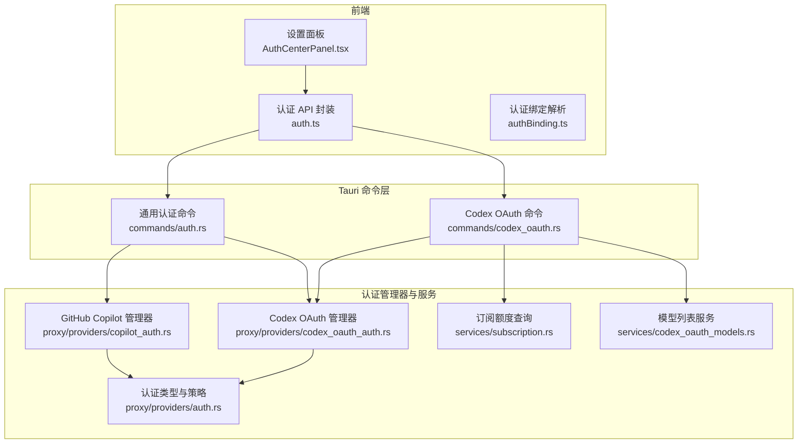
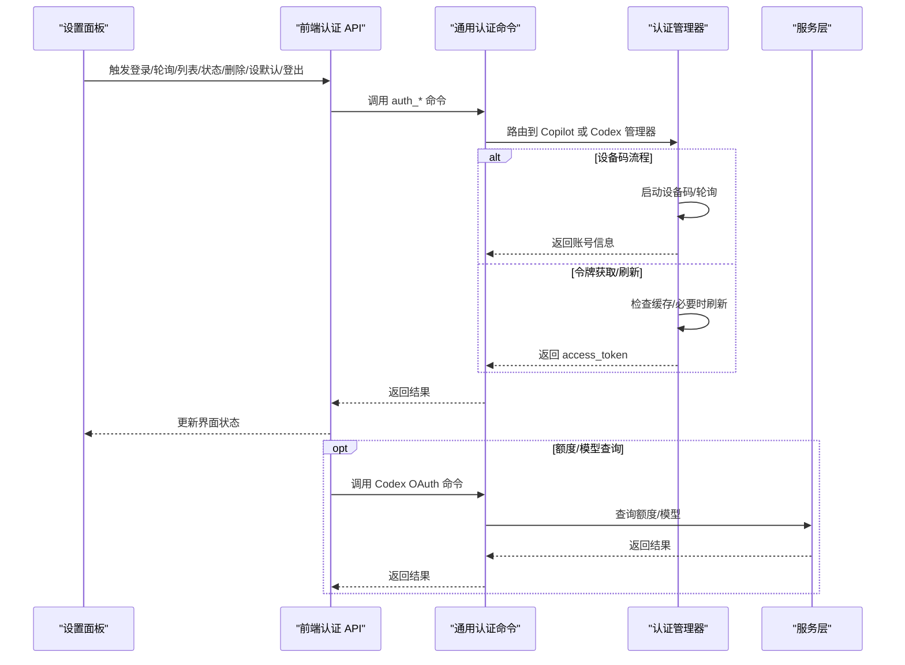
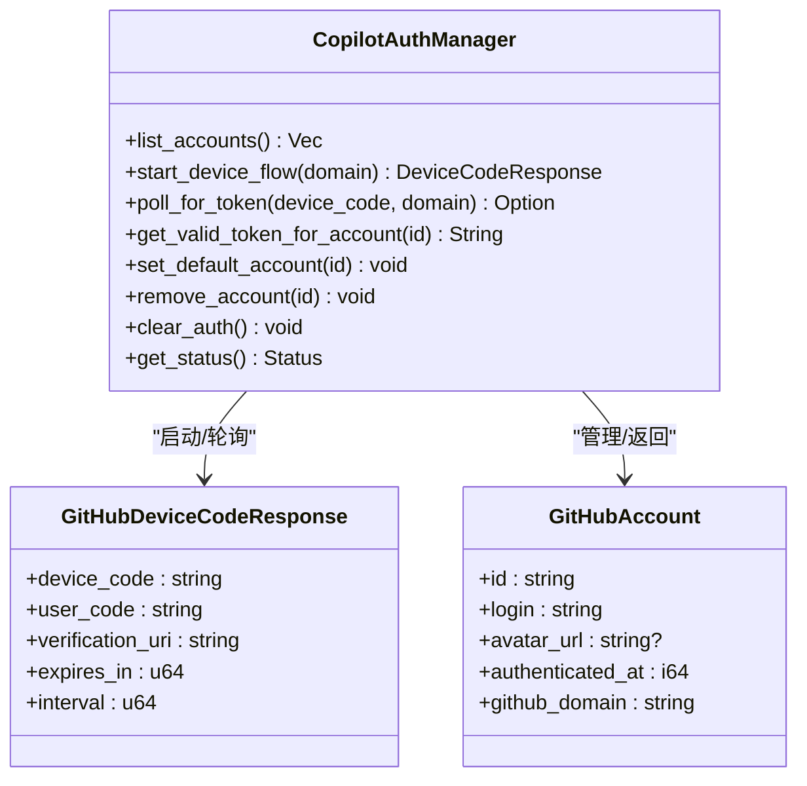
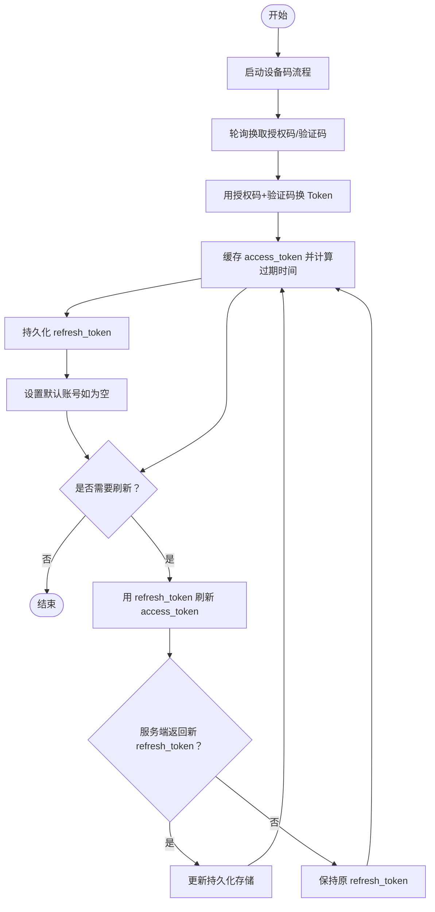
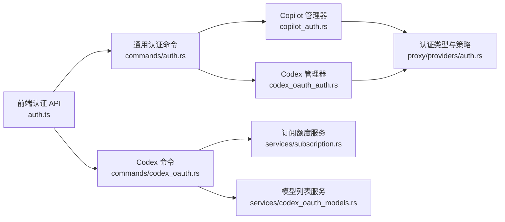

# 认证设置

<cite>
**本文引用的文件**
- [AuthCenterPanel.tsx](file://src/components/settings/AuthCenterPanel.tsx)
- [auth.ts（前端 API 封装）](file://src/lib/api/auth.ts)
- [authBinding.ts](file://src/lib/authBinding.ts)
- [auth.rs（Tauri 命令）](file://src-tauri/src/commands/auth.rs)
- [codex_oauth.rs（Tauri 命令）](file://src-tauri/src/commands/codex_oauth.rs)
- [auth.rs（认证类型与策略）](file://src-tauri/src/proxy/providers/auth.rs)
- [copilot_auth.rs（GitHub Copilot 认证）](file://src-tauri/src/proxy/providers/copilot_auth.rs)
- [codex_oauth_auth.rs（Codex OAuth 认证）](file://src-tauri/src/proxy/providers/codex_oauth_auth.rs)
- [subscription.rs（订阅额度查询）](file://src-tauri/src/services/subscription.rs)
- [codex_oauth_models.rs（模型列表服务）](file://src-tauri/src/services/codex_oauth_models.rs)
- [1.5-settings.md](file://docs/user-manual/en/1-getting-started/1.5-settings.md)
- [2.1-add.md](file://docs/user-manual/en/2-providers/2.1-add.md)
</cite>

## 目录
1. [简介](#简介)
2. [项目结构](#项目结构)
3. [核心组件](#核心组件)
4. [架构总览](#架构总览)
5. [详细组件分析](#详细组件分析)
6. [依赖关系分析](#依赖关系分析)
7. [性能考量](#性能考量)
8. [故障排查指南](#故障排查指南)
9. [结论](#结论)
10. [附录](#附录)

## 简介
本文件面向 CC Switch 的认证系统，聚焦“认证中心”的工作机制与配置，涵盖凭据存储、令牌管理、安全策略、多认证方式（API Key、OAuth）、会话与自动续期、配置安全最佳实践、常见失败原因与解决方案，以及扩展与自定义认证提供商的集成指南。内容基于仓库中的前端设置面板、Tauri 命令层、代理适配器与服务层代码进行系统化梳理，并辅以用户手册中的使用说明。

## 项目结构
认证体系横跨前端设置界面、Tauri 命令桥接、认证管理器与服务层，形成“设置面板 → 前端 API → Tauri 命令 → 认证管理器/服务 → 上游供应商”的完整链路。

图示来源
- [AuthCenterPanel.tsx:1-75](file://src/components/settings/AuthCenterPanel.tsx#L1-75)
- [auth.ts（前端 API 封装）:1-107](file://src/lib/api/auth.ts#L1-107)
- [authBinding.ts:1-22](file://src/lib/authBinding.ts#L1-22)
- [auth.rs（Tauri 命令）:1-306](file://src-tauri/src/commands/auth.rs#L1-306)
- [codex_oauth.rs（Tauri 命令）:1-91](file://src-tauri/src/commands/codex_oauth.rs#L1-91)
- [auth.rs（认证类型与策略）:1-260](file://src-tauri/src/proxy/providers/auth.rs#L1-260)
- [copilot_auth.rs（GitHub Copilot 认证）:1-800](file://src-tauri/src/proxy/providers/copilot_auth.rs#L1-800)
- [codex_oauth_auth.rs（Codex OAuth 认证）:1-1134](file://src-tauri/src/proxy/providers/codex_oauth_auth.rs#L1-1134)
- [subscription.rs（订阅额度查询）:1-800](file://src-tauri/src/services/subscription.rs#L1-800)
- [codex_oauth_models.rs（模型列表服务）:1-193](file://src-tauri/src/services/codex_oauth_models.rs#L1-193)

章节来源
- [AuthCenterPanel.tsx:1-75](file://src/components/settings/AuthCenterPanel.tsx#L1-75)
- [auth.rs（Tauri 命令）:1-306](file://src-tauri/src/commands/auth.rs#L1-306)
- [auth.rs（认证类型与策略）:1-260](file://src-tauri/src/proxy/providers/auth.rs#L1-260)

## 核心组件
- 认证中心设置面板：统一展示与管理 GitHub Copilot 与 ChatGPT（Codex OAuth）两类第三方 OAuth 账号，支持设备码登录、默认账号设置、批量登出等。
- 前端认证 API：封装通用认证命令调用，提供启动登录、轮询、列出账户、获取状态、删除账号、设置默认账号、登出等接口。
- Tauri 通用认证命令：根据 provider 类型路由到 Copilot 或 Codex 管理器，执行设备码流程、轮询、状态查询与操作。
- Copilot 认证管理器：支持 GitHub 设备码流程、多账号存储、默认账号、Copilot Token 自动刷新与缓存。
- Codex OAuth 认证管理器：支持 OpenAI ChatGPT Plus/Pro 设备码流程、多账号存储、默认账号、access_token 自动刷新与缓存、JWT claims 解析与账号识别。
- 服务层：订阅额度查询与模型列表服务，复用托管 OAuth 账号访问上游资源。

章节来源
- [AuthCenterPanel.tsx:1-75](file://src/components/settings/AuthCenterPanel.tsx#L1-75)
- [auth.ts（前端 API 封装）:1-107](file://src/lib/api/auth.ts#L1-107)
- [auth.rs（Tauri 命令）:1-306](file://src-tauri/src/commands/auth.rs#L1-306)
- [copilot_auth.rs（GitHub Copilot 认证）:1-800](file://src-tauri/src/proxy/providers/copilot_auth.rs#L1-800)
- [codex_oauth_auth.rs（Codex OAuth 认证）:1-1134](file://src-tauri/src/proxy/providers/codex_oauth_auth.rs#L1-1134)
- [subscription.rs（订阅额度查询）:1-800](file://src-tauri/src/services/subscription.rs#L1-800)
- [codex_oauth_models.rs（模型列表服务）:1-193](file://src-tauri/src/services/codex_oauth_models.rs#L1-193)

## 架构总览
认证中心采用“前端设置面板 + Tauri 命令 + 认证管理器/服务”的分层设计。前端通过统一 API 调用通用命令，命令层再根据 provider 类型分派至具体管理器；管理器负责设备码流程、令牌缓存与刷新、持久化存储；服务层提供订阅额度与模型列表查询能力。

图示来源
- [auth.ts（前端 API 封装）:1-107](file://src/lib/api/auth.ts#L1-107)
- [auth.rs（Tauri 命令）:1-306](file://src-tauri/src/commands/auth.rs#L1-306)
- [copilot_auth.rs（GitHub Copilot 认证）:1-800](file://src-tauri/src/proxy/providers/copilot_auth.rs#L1-800)
- [codex_oauth_auth.rs（Codex OAuth 认证）:1-1134](file://src-tauri/src/proxy/providers/codex_oauth_auth.rs#L1-1134)
- [codex_oauth.rs（Tauri 命令）:1-91](file://src-tauri/src/commands/codex_oauth.rs#L1-91)
- [subscription.rs（订阅额度查询）:1-800](file://src-tauri/src/services/subscription.rs#L1-800)
- [codex_oauth_models.rs（模型列表服务）:1-193](file://src-tauri/src/services/codex_oauth_models.rs#L1-193)

## 详细组件分析

### 组件 A：认证中心设置面板
- 功能概述：集中展示 OAuth 认证中心，支持 Copilot 与 Codex OAuth 两大类账号管理入口，提供设备码登录、账号列表、默认账号设置、批量登出等。
- 交互要点：Beta 标签提示当前功能处于测试阶段；支持多账号并行管理；自动续期在后台静默执行。

章节来源
- [AuthCenterPanel.tsx:1-75](file://src/components/settings/AuthCenterPanel.tsx#L1-75)
- [1.5-settings.md:277-296](file://docs/user-manual/en/1-getting-started/1.5-settings.md#L277-L296)

### 组件 B：前端认证 API 封装
- 职责：对 Tauri 命令进行统一封装，提供启动登录、轮询、列出账户、获取状态、删除账号、设置默认账号、登出等方法。
- 设计原则：统一参数命名与返回值结构，便于 UI 与命令层解耦。

章节来源
- [auth.ts（前端 API 封装）:1-107](file://src/lib/api/auth.ts#L1-107)

### 组件 C：Tauri 通用认证命令
- 职责：根据 provider 类型（github_copilot / codex_oauth）路由到对应管理器，执行设备码流程、轮询、状态查询与操作。
- 安全策略：命令层对 provider 进行白名单校验，避免非法调用。

章节来源
- [auth.rs（Tauri 命令）:1-306](file://src-tauri/src/commands/auth.rs#L1-306)

### 组件 D：Copilot 认证管理器（GitHub OAuth）
- 设备码流程：支持 github.com 与 GHES（GitHub Enterprise Server）两类域名，自动选择客户端 ID 与端点。
- 多账号支持：v3 版本引入多账号 + 默认账号格式，支持复合账号 ID 以区分不同实例。
- 令牌管理：GitHub OAuth token 与 Copilot Token 分离缓存，自动刷新（到期前 60 秒）。
- 存储与迁移：支持 v1 单账号到 v3 多账号的迁移，记录迁移错误以便前端提示。

图示来源
- [copilot_auth.rs（GitHub Copilot 认证）:1-800](file://src-tauri/src/proxy/providers/copilot_auth.rs#L1-800)

章节来源
- [copilot_auth.rs（GitHub Copilot 认证）:1-800](file://src-tauri/src/proxy/providers/copilot_auth.rs#L1-800)

### 组件 E：Codex OAuth 认证管理器（ChatGPT Plus/Pro）
- 设备码流程：OpenAI ChatGPT Plus/Pro 设备码流程，支持用户在浏览器完成授权后换取 access_token + refresh_token。
- 多账号支持：每个 ChatGPT 账号独立存储 refresh_token，通过 JWT claims 中的 account_id 识别账号。
- 令牌管理：内存缓存 access_token，自动刷新（到期前 60 秒），支持服务端返回的新 refresh_token 更新持久化。
- 存储与安全：本地持久化文件采用原子写入与平台权限（Unix 0600），避免明文泄露。

图示来源
- [codex_oauth_auth.rs（Codex OAuth 认证）:1-1134](file://src-tauri/src/proxy/providers/codex_oauth_auth.rs#L1-1134)

章节来源
- [codex_oauth_auth.rs（Codex OAuth 认证）:1-1134](file://src-tauri/src/proxy/providers/codex_oauth_auth.rs#L1-1134)

### 组件 F：认证类型与策略
- 认证信息结构：包含 API Key 与认证策略，支持 OAuth 场景下的 access_token 字段。
- 认证策略枚举：覆盖 Anthropic、ClaudeAuth、Bearer、Google、GoogleOAuth、GitHubCopilot、CodexOAuth 等策略，决定请求头与注入方式。

章节来源
- [auth.rs（认证类型与策略）:1-260](file://src-tauri/src/proxy/providers/auth.rs#L1-260)

### 组件 G：订阅额度与模型查询
- 订阅额度查询：支持 Claude、Codex（OAuth）、Gemini 等工具的额度查询，返回各窗口利用率与重置时间等信息。
- 模型列表查询：Codex OAuth 模型列表通过托管 access_token 直接访问上游端点，兼容多种响应结构。

章节来源
- [subscription.rs（订阅额度查询）:1-800](file://src-tauri/src/services/subscription.rs#L1-800)
- [codex_oauth_models.rs（模型列表服务）:1-193](file://src-tauri/src/services/codex_oauth_models.rs#L1-193)

### 组件 H：认证绑定与 Provider 关联
- 认证绑定解析：根据 ProviderMeta 的 authBinding 与 authProvider 字段解析托管账号 ID，支持 Copilot 的 githubAccountId 回退逻辑。

章节来源
- [authBinding.ts:1-22](file://src/lib/authBinding.ts#L1-22)

## 依赖关系分析
- 前端设置面板依赖认证 API 封装，认证 API 通过 Tauri 命令桥接到后端。
- Tauri 通用命令根据 provider 类型路由到 Copilot 或 Codex 管理器。
- Copilot 与 Codex 管理器共享认证类型与策略定义，遵循统一的策略注入方式。
- 订阅额度与模型查询服务复用管理器提供的 access_token，实现额度与模型的动态获取。

图示来源
- [auth.ts（前端 API 封装）:1-107](file://src/lib/api/auth.ts#L1-107)
- [auth.rs（Tauri 命令）:1-306](file://src-tauri/src/commands/auth.rs#L1-306)
- [codex_oauth.rs（Tauri 命令）:1-91](file://src-tauri/src/commands/codex_oauth.rs#L1-91)
- [copilot_auth.rs（GitHub Copilot 认证）:1-800](file://src-tauri/src/proxy/providers/copilot_auth.rs#L1-800)
- [codex_oauth_auth.rs（Codex OAuth 认证）:1-1134](file://src-tauri/src/proxy/providers/codex_oauth_auth.rs#L1-1134)
- [subscription.rs（订阅额度查询）:1-800](file://src-tauri/src/services/subscription.rs#L1-800)
- [codex_oauth_models.rs（模型列表服务）:1-193](file://src-tauri/src/services/codex_oauth_models.rs#L1-193)
- [auth.rs（认证类型与策略）:1-260](file://src-tauri/src/proxy/providers/auth.rs#L1-260)

章节来源
- [auth.rs（Tauri 命令）:1-306](file://src-tauri/src/commands/auth.rs#L1-306)
- [codex_oauth_auth.rs（Codex OAuth 认证）:1-1134](file://src-tauri/src/proxy/providers/codex_oauth_auth.rs#L1-1134)

## 性能考量
- 令牌缓存与并发刷新：Copilot 与 Codex 管理器均采用内存缓存与刷新锁，避免并发刷新带来的重复请求与资源浪费。
- 自动续期窗口：提前 60 秒刷新，降低请求失败概率；Codex 管理器还对即将过期的 token 进行快速检测与刷新。
- 端点兼容与降级：模型列表服务对多种上游响应结构进行兼容解析，减少因上游变更导致的解析失败。

## 故障排查指南
- 网络问题
  - 现象：设备码轮询返回“等待用户授权中”或“设备码已过期”。
  - 排查：确认网络可达性与代理设置；Codex 设备码默认有效期 15 分钟，需在有效期内完成授权。
  - 参考
    - [auth.rs（Tauri 命令）:110-151](file://src-tauri/src/commands/auth.rs#L110-L151)
    - [codex_oauth_auth.rs（Codex OAuth 认证）:324-426](file://src-tauri/src/proxy/providers/codex_oauth_auth.rs#L324-L426)
- 过期令牌
  - 现象：额度查询或模型列表返回“认证失败/令牌过期”。
  - 排查：Copilot 与 Codex 管理器均内置自动刷新；若仍失败，需重新触发设备码登录流程。
  - 参考
    - [copilot_auth.rs（GitHub Copilot 认证）:717-792](file://src-tauri/src/proxy/providers/copilot_auth.rs#L717-L792)
    - [codex_oauth_auth.rs（Codex OAuth 认证）:500-580](file://src-tauri/src/proxy/providers/codex_oauth_auth.rs#L500-L580)
- 权限不足
  - 现象：Copilot 未订阅或 Codex 非 Plus/Pro 账号。
  - 排查：确认账号订阅状态；Codex 仅支持 Plus/Pro 订阅的 OAuth 模式额度查询。
  - 参考
    - [subscription.rs（订阅额度查询）:462-590](file://src-tauri/src/services/subscription.rs#L462-L590)
- 多账号冲突
  - 现象：不同 GHES 实例的账号 ID 冲突。
  - 排查：管理器使用复合账号 ID（domain:user_id）避免冲突；确保默认账号正确设置。
  - 参考
    - [copilot_auth.rs（GitHub Copilot 认证）:126-134](file://src-tauri/src/proxy/providers/copilot_auth.rs#L126-L134)

章节来源
- [auth.rs（Tauri 命令）:110-151](file://src-tauri/src/commands/auth.rs#L110-L151)
- [codex_oauth_auth.rs（Codex OAuth 认证）:324-580](file://src-tauri/src/proxy/providers/codex_oauth_auth.rs#L324-L580)
- [copilot_auth.rs（GitHub Copilot 认证）:717-792](file://src-tauri/src/proxy/providers/copilot_auth.rs#L717-L792)
- [subscription.rs（订阅额度查询）:462-590](file://src-tauri/src/services/subscription.rs#L462-L590)

## 结论
认证中心通过统一的设置面板与 API 封装，结合 Copilot 与 Codex OAuth 的多账号管理与自动续期机制，实现了对第三方 OAuth 凭据的集中治理。配合订阅额度与模型列表的服务层能力，用户可在 CC Switch 中高效地管理多个账号并获得实时用量与模型信息。建议在生产环境中启用严格的日志级别与最小权限原则，并定期轮换密钥与审查访问策略。

## 附录

### 认证方式支持概览
- API Key：通过认证策略注入请求头，适用于不支持 OAuth 的场景。
- OAuth（GitHub Copilot）：设备码流程，支持 github.com 与 GHES；Copilot Token 自动刷新。
- OAuth（Codex ChatGPT Plus/Pro）：设备码流程，access_token 自动刷新，支持多账号与默认账号。

章节来源
- [auth.rs（认证类型与策略）:82-131](file://src-tauri/src/proxy/providers/auth.rs#L82-L131)
- [copilot_auth.rs（GitHub Copilot 认证）:1-800](file://src-tauri/src/proxy/providers/copilot_auth.rs#L1-L800)
- [codex_oauth_auth.rs（Codex OAuth 认证）:1-1134](file://src-tauri/src/proxy/providers/codex_oauth_auth.rs#L1-1134)

### 会话管理与自动续期
- Copilot：Copilot Token 在到期前 60 秒自动刷新，支持 GHES 与 github.com 的差异化处理。
- Codex：access_token 在到期前 60 秒自动刷新，支持服务端返回的新 refresh_token 更新持久化。

章节来源
- [copilot_auth.rs（GitHub Copilot 认证）:92-93](file://src-tauri/src/proxy/providers/copilot_auth.rs#L92-L93)
- [codex_oauth_auth.rs（Codex OAuth 认证）:48-49](file://src-tauri/src/proxy/providers/codex_oauth_auth.rs#L48-L49)

### 认证配置安全最佳实践
- 密钥轮换：定期更换 refresh_token 与 access_token，避免长期使用同一凭证；Codex 管理器支持服务端返回的新 refresh_token 自动更新。
- 权限控制：最小权限原则，仅授予必要的作用域；避免在公共环境导出认证数据。
- 审计日志：启用合适的日志级别，记录关键事件（登录、刷新、登出），但避免输出敏感信息（系统已提供遮蔽输出）。
- 多账号隔离：使用复合账号 ID 与默认账号设置，减少误用风险。

章节来源
- [codex_oauth_auth.rs（Codex OAuth 认证）:844-891](file://src-tauri/src/proxy/providers/codex_oauth_auth.rs#L844-L891)
- [auth.rs（认证类型与策略）:37-79](file://src-tauri/src/proxy/providers/auth.rs#L37-L79)

### 常见失败原因与解决方案
- 网络问题：检查代理与 DNS；Codex 设备码有效期 15 分钟，需及时完成授权。
- 过期令牌：Copilot 与 Codex 管理器自动刷新；若失败，重新登录。
- 权限不足：确认账号订阅状态；Codex 仅支持 Plus/Pro 的 OAuth 模式额度查询。
- 多账号冲突：使用复合账号 ID；确保默认账号正确设置。

章节来源
- [auth.rs（Tauri 命令）:110-151](file://src-tauri/src/commands/auth.rs#L110-L151)
- [codex_oauth_auth.rs（Codex OAuth 认证）:324-580](file://src-tauri/src/proxy/providers/codex_oauth_auth.rs#L324-L580)
- [copilot_auth.rs（GitHub Copilot 认证）:717-792](file://src-tauri/src/proxy/providers/copilot_auth.rs#L717-L792)
- [subscription.rs（订阅额度查询）:462-590](file://src-tauri/src/services/subscription.rs#L462-L590)

### 扩展与自定义认证提供商集成指南
- 新增 provider 类型：在通用认证命令中增加 provider 白名单校验与路由分支。
- 认证流程适配：实现设备码启动、轮询、令牌换取与刷新逻辑，参考 Copilot 与 Codex 的实现模式。
- 存储与安全：采用原子写入与平台权限保护本地存储；对敏感字段进行遮蔽输出。
- 服务层对接：如需额度或模型查询，复用现有服务层接口，或新增相应命令与服务。

章节来源
- [auth.rs（Tauri 命令）:43-49](file://src-tauri/src/commands/auth.rs#L43-L49)
- [copilot_auth.rs（GitHub Copilot 认证）:592-715](file://src-tauri/src/proxy/providers/copilot_auth.rs#L592-L715)
- [codex_oauth_auth.rs（Codex OAuth 认证）:258-426](file://src-tauri/src/proxy/providers/codex_oauth_auth.rs#L258-L426)
- [subscription.rs（订阅额度查询）:648-744](file://src-tauri/src/services/subscription.rs#L648-L744)
- [codex_oauth_models.rs（模型列表服务）:15-43](file://src-tauri/src/services/codex_oauth_models.rs#L15-L43)