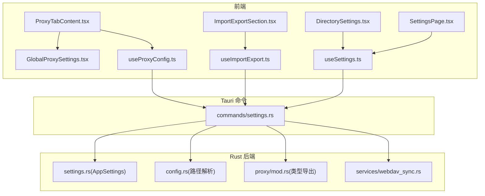
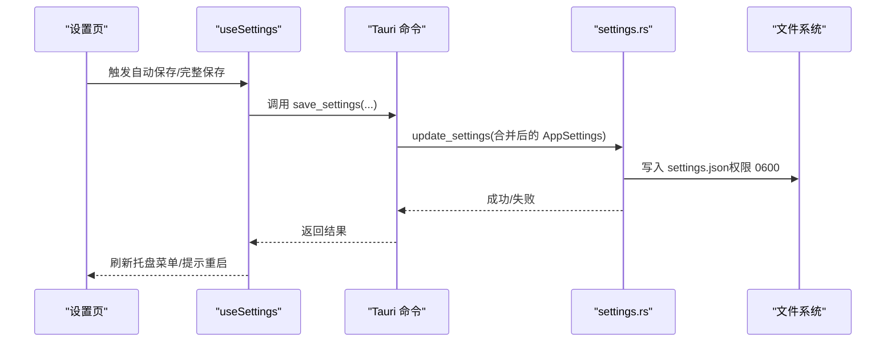
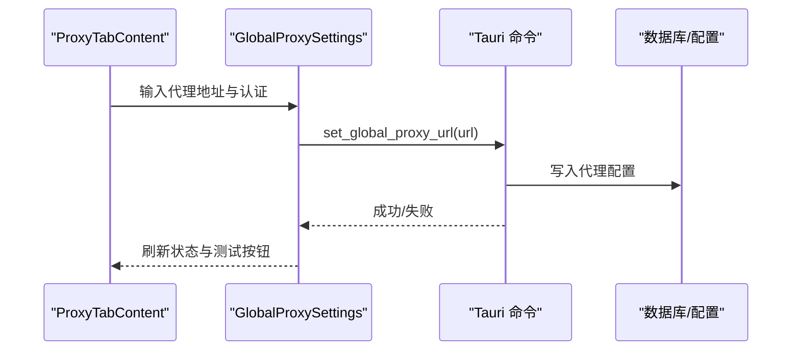
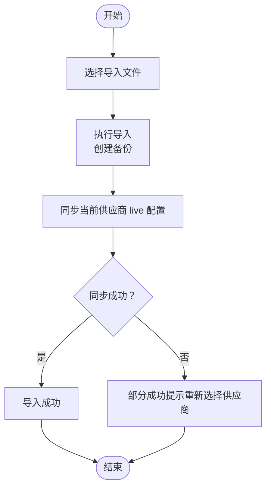
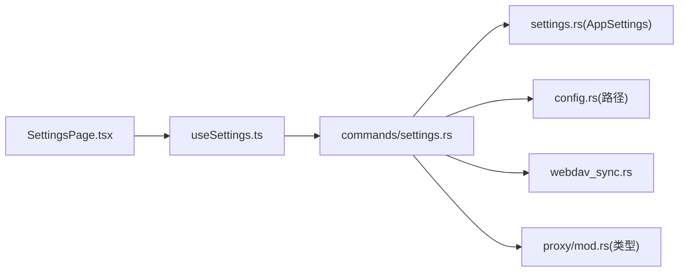

# 设置与配置

<cite>
**本文引用的文件**
- [SettingsPage.tsx](file://src/components/settings/SettingsPage.tsx)
- [ProxyTabContent.tsx](file://src/components/settings/ProxyTabContent.tsx)
- [GlobalProxySettings.tsx](file://src/components/settings/GlobalProxySettings.tsx)
- [DirectorySettings.tsx](file://src/components/settings/DirectorySettings.tsx)
- [ImportExportSection.tsx](file://src/components/settings/ImportExportSection.tsx)
- [useSettings.ts](file://src/hooks/useSettings.ts)
- [useProxyConfig.ts](file://src/hooks/useProxyConfig.ts)
- [useImportExport.ts](file://src/hooks/useImportExport.ts)
- [settings.rs](file://src-tauri/src/settings.rs)
- [config.rs](file://src-tauri/src/config.rs)
- [settings.rs（命令）](file://src-tauri/src/commands/settings.rs)
- [mod.rs（代理模块）](file://src-tauri/src/proxy/mod.rs)
- [webdav_sync.rs](file://src-tauri/src/services/webdav_sync.rs)
- [5.1 配置文件.md（英文手册）](file://docs/user-manual/en/5-faq/5.1-config-files.md)
</cite>

## 目录
1. [简介](#简介)
2. [项目结构](#项目结构)
3. [核心组件](#核心组件)
4. [架构总览](#架构总览)
5. [详细组件分析](#详细组件分析)
6. [依赖关系分析](#依赖关系分析)
7. [性能考量](#性能考量)
8. [故障排除指南](#故障排除指南)
9. [结论](#结论)
10. [附录](#附录)

## 简介
本指南面向 CC Switch 的管理员与高级用户，系统讲解设置与配置系统的功能与使用方法，涵盖：
- 全局设置：应用外观（主题、语言、窗口行为）、系统集成（开机自启动、静默启动、托盘）、设备设置（终端、目录覆盖）
- 代理配置：本地代理开关、故障转移、整流器与优化器、全局出站代理（含认证）
- 数据管理：导入/导出、备份与恢复、WebDAV 同步、数据迁移
- 认证中心、订阅配额与日志配置
- 配置文件位置、格式与手动编辑注意事项
- 配置优化建议与常见问题排查

## 项目结构
设置与配置系统由前端 UI 组件、React Hooks、Tauri 命令与 Rust 后端共同构成：
- 前端负责展示与交互（设置页、代理面板、导入导出、目录设置等）
- Hooks 负责状态管理、保存策略与与后端通信
- Tauri 命令桥接前端与后端，Rust 模块负责持久化、路径解析与同步协议

图表来源
- [SettingsPage.tsx:61-541](file://src/components/settings/SettingsPage.tsx#L61-L541)
- [ProxyTabContent.tsx:28-286](file://src/components/settings/ProxyTabContent.tsx#L28-L286)
- [GlobalProxySettings.tsx:72-276](file://src/components/settings/GlobalProxySettings.tsx#L72-L276)
- [DirectorySettings.tsx:28-230](file://src/components/settings/DirectorySettings.tsx#L28-L230)
- [ImportExportSection.tsx:26-213](file://src/components/settings/ImportExportSection.tsx#L26-L213)
- [useSettings.ts:62-512](file://src/hooks/useSettings.ts#L62-L512)
- [useImportExport.ts:31-204](file://src/hooks/useImportExport.ts#L31-L204)
- [useProxyConfig.ts:14-49](file://src/hooks/useProxyConfig.ts#L14-L49)
- [settings.rs（命令）:59-458](file://src-tauri/src/commands/settings.rs#L59-L458)
- [settings.rs:315-507](file://src-tauri/src/settings.rs#L315-L507)
- [config.rs:89-128](file://src-tauri/src/config.rs#L89-L128)
- [mod.rs（代理模块）:1-60](file://src-tauri/src/proxy/mod.rs#L1-L60)
- [webdav_sync.rs:53-187](file://src-tauri/src/services/webdav_sync.rs#L53-L187)

章节来源
- [SettingsPage.tsx:61-541](file://src/components/settings/SettingsPage.tsx#L61-L541)
- [useSettings.ts:62-512](file://src/hooks/useSettings.ts#L62-L512)
- [settings.rs（命令）:59-458](file://src-tauri/src/commands/settings.rs#L59-L458)

## 核心组件
- 设置页（SettingsPage）：承载“通用/代理/认证/高级/用量/关于”六大标签页，统一保存与重启提示逻辑
- 代理标签页（ProxyTabContent）：整合本地代理、故障转移、整流器、全局出站代理
- 目录设置（DirectorySettings）：集中管理 CC Switch 配置目录与各应用配置目录覆盖
- 导入导出（ImportExportSection）：SQL 备份导入/导出与状态反馈
- Hooks：
  - useSettings：设置查询、自动保存、完整保存、开机自启、托盘菜单刷新、重启提示
  - useImportExport：导入/导出流程、状态机、错误处理
  - useProxyConfig：代理配置查询与更新
- 后端：
  - AppSettings 结构体与序列化/反序列化、路径规范化、文件写入
  - 路径解析：应用配置目录、Claude 配置目录、Claude MCP 配置文件路径
  - WebDAV 同步协议：连接检查、上传/下载、清单校验、状态持久化
  - Tauri 命令：获取/保存设置、重启、开机自启、日志/整流器/优化器配置

章节来源
- [SettingsPage.tsx:213-479](file://src/components/settings/SettingsPage.tsx#L213-L479)
- [useSettings.ts:179-484](file://src/hooks/useSettings.ts#L179-L484)
- [useImportExport.ts:68-183](file://src/hooks/useImportExport.ts#L68-L183)
- [useProxyConfig.ts:18-47](file://src/hooks/useProxyConfig.ts#L18-L47)
- [settings.rs:315-507](file://src-tauri/src/settings.rs#L315-L507)
- [config.rs:89-128](file://src-tauri/src/config.rs#L89-L128)
- [webdav_sync.rs:53-187](file://src-tauri/src/services/webdav_sync.rs#L53-L187)

## 架构总览
设置与配置系统采用“前端 UI + Hooks + Tauri 命令 + Rust 后端”的分层设计：
- 前端负责用户交互与即时保存（如语言、主题、窗口行为、开机自启）
- 高级设置（如目录覆盖、WebDAV/S3、自动备份）通过完整保存触发重启提示
- Rust 层负责：
  - AppSettings 的读取/写入与权限控制（Unix 下 0600）
  - 路径解析与兼容（支持覆盖目录、旧版文件名回退）
  - WebDAV 同步协议与清单校验
  - 日志等级动态更新

图表来源
- [useSettings.ts:179-484](file://src/hooks/useSettings.ts#L179-L484)
- [settings.rs（命令）:66-72](file://src-tauri/src/commands/settings.rs#L66-L72)
- [settings.rs:609-644](file://src-tauri/src/settings.rs#L609-L644)

## 详细组件分析

### 通用设置（外观、语言、窗口、技能存储与同步）
- 语言与主题：即时保存至本地存储与设置文件
- 窗口行为：最小化到托盘、使用系统窗口控件、静默启动
- 技能存储位置与同步方式：支持 cc_switch 与 unified 两种位置，支持 symlink/copy 同步策略
- 认证设置：Codex 认证相关项（与认证中心配合）

章节来源
- [SettingsPage.tsx:223-258](file://src/components/settings/SettingsPage.tsx#L223-L258)
- [useSettings.ts:179-305](file://src/hooks/useSettings.ts#L179-L305)

### 系统集成（开机自启动、静默启动、托盘）
- 开机自启动：通过系统 API 设置/取消，保存到设置文件
- 静默启动：启动时不显示主窗口，仅托盘运行
- 托盘菜单：保存后刷新，确保菜单与当前供应商状态一致

章节来源
- [useSettings.ts:221-271](file://src/hooks/useSettings.ts#L221-L271)
- [settings.rs（命令）:104-113](file://src-tauri/src/commands/settings.rs#L104-L113)

### 设备设置（终端、目录覆盖）
- 终端设置：首选终端应用（macOS/Windows/Linux 平台枚举）
- 目录覆盖：
  - CC Switch 配置目录：可覆盖到任意路径，变更后需要重启
  - 各应用配置目录：Claude、Codex、Gemini、OpenCode、OpenClaw、Hermes
  - 路径解析：支持 ~ 与相对路径，兼容旧版文件名（如 Claude 的 claude.json）

章节来源
- [SettingsPage.tsx:313-329](file://src/components/settings/SettingsPage.tsx#L313-L329)
- [DirectorySettings.tsx:28-163](file://src/components/settings/DirectorySettings.tsx#L28-L163)
- [config.rs:89-128](file://src-tauri/src/config.rs#L89-L128)
- [settings.rs:519-561](file://src-tauri/src/settings.rs#L519-L561)

### 代理配置（本地代理、故障转移、整流器、全局出站代理）
- 本地代理开关与状态：启动/停止代理服务，支持确认提示
- 故障转移：为 Claude/Codex/Gemini 配置故障转移队列与自动切换策略
- 整流器：针对模型输出预算/格式进行修正
- 全局出站代理：支持 HTTP/SOCKS5，含用户名/密码认证，支持扫描与测试

图表来源
- [ProxyTabContent.tsx:44-83](file://src/components/settings/ProxyTabContent.tsx#L44-L83)
- [GlobalProxySettings.tsx:103-112](file://src/components/settings/GlobalProxySettings.tsx#L103-L112)
- [settings.rs（命令）:351-355](file://src-tauri/src/commands/settings.rs#L351-L355)

章节来源
- [ProxyTabContent.tsx:28-286](file://src/components/settings/ProxyTabContent.tsx#L28-L286)
- [GlobalProxySettings.tsx:72-276](file://src/components/settings/GlobalProxySettings.tsx#L72-L276)
- [useProxyConfig.ts:18-47](file://src/hooks/useProxyConfig.ts#L18-L47)
- [mod.rs（代理模块）:54-54](file://src-tauri/src/proxy/mod.rs#L54-L54)

### 数据管理（导入/导出、备份/恢复、WebDAV 同步、迁移）
- 导入/导出：
  - 导出：生成带时间戳的 SQL 文件
  - 导入：选择文件后执行导入，自动创建备份，同步当前供应商 live 配置
- 备份与恢复：自动备份策略（间隔与保留数量），支持查看与恢复
- WebDAV 同步：
  - 连接检查与目录准备
  - 上传/下载：db.sql + skills.zip + manifest
  - 清单校验与兼容性检查，状态持久化（最后同步时间、ETag、哈希）
- 迁移：本地迁移标记（如 Codex 历史与模板迁移），跨版本兼容

图表来源
- [useImportExport.ts:68-141](file://src/hooks/useImportExport.ts#L68-L141)
- [ImportExportSection.tsx:132-212](file://src/components/settings/ImportExportSection.tsx#L132-L212)

章节来源
- [ImportExportSection.tsx:26-213](file://src/components/settings/ImportExportSection.tsx#L26-L213)
- [useImportExport.ts:31-204](file://src/hooks/useImportExport.ts#L31-L204)
- [webdav_sync.rs:53-187](file://src-tauri/src/services/webdav_sync.rs#L53-L187)

### 认证中心、订阅配额与日志配置
- 认证中心：统一管理认证凭据与配额
- 订阅配额：显示与管理订阅状态与额度
- 日志配置：动态设置日志级别与开关，实时生效

章节来源
- [SettingsPage.tsx:279-279](file://src/components/settings/SettingsPage.tsx#L279-L279)
- [settings.rs（命令）:432-457](file://src-tauri/src/commands/settings.rs#L432-L457)

### 配置文件位置、格式与手动编辑
- 存储目录：默认位于用户主目录下的 ~/.cc-switch/
- 目录结构：
  - cc-switch.db：SQLite 数据库（单一真相源）
  - settings.json：设备级设置（不参与数据库同步）
  - skills/：技能资源目录
  - skill-backups/：卸载时生成的技能备份
  - backups/：数据库自动备份
- 设备设置（settings.json）字段示例：语言、主题、窗口行为、开机自启动、各应用配置目录覆盖
- 手动编辑建议：
  - CLI 工具配置文件（会被 CC Switch 回填）
  - settings.json 可安全手动编辑
  - 不建议手动编辑 cc-switch.db 与备份文件

章节来源
- [5.1 配置文件.md（英文手册）:13-60](file://docs/user-manual/en/5-faq/5.1-config-files.md#L13-L60)
- [settings.rs:609-644](file://src-tauri/src/settings.rs#L609-L644)

## 依赖关系分析
- 前端组件依赖 Hooks 与 API，Hooks 通过 Tauri 命令与后端交互
- AppSettings 作为设备级配置，影响路径解析与同步策略
- WebDAV 同步依赖清单校验与远程布局兼容性
- 代理模块提供类型与能力导出，供命令与服务使用

图表来源
- [SettingsPage.tsx:61-86](file://src/components/settings/SettingsPage.tsx#L61-L86)
- [useSettings.ts:62-103](file://src/hooks/useSettings.ts#L62-L103)
- [settings.rs（命令）:59-72](file://src-tauri/src/commands/settings.rs#L59-L72)
- [settings.rs:315-507](file://src-tauri/src/settings.rs#L315-L507)
- [config.rs:89-128](file://src-tauri/src/config.rs#L89-L128)
- [webdav_sync.rs:53-187](file://src-tauri/src/services/webdav_sync.rs#L53-L187)
- [mod.rs（代理模块）:38-60](file://src-tauri/src/proxy/mod.rs#L38-L60)

章节来源
- [SettingsPage.tsx:61-100](file://src/components/settings/SettingsPage.tsx#L61-L100)
- [useSettings.ts:62-104](file://src/hooks/useSettings.ts#L62-L104)

## 性能考量
- 即时保存与完整保存分离：通用设置即时保存，避免频繁系统调用；高级设置完整保存并考虑重启
- WebDAV 同步采用清单驱动与分段传输，限制最大清单与工件大小，减少网络与磁盘压力
- 日志级别动态调整：仅在必要时提升日志级别，避免过度 IO
- 路径解析与原子写入：确保配置文件一致性，降低异常中断风险

## 故障排除指南
- 保存失败：
  - 检查设置文件写入权限（Unix 下 0600）
  - 查看前端通知与控制台日志
- 导入失败：
  - 确认 SQL 文件完整性与格式
  - 导入后若同步失败，按提示重新选择一次当前供应商
- WebDAV 同步异常：
  - 先执行连接检查，确认远程目录结构
  - 核对清单兼容性与工件哈希
- 代理无法启动/测试失败：
  - 检查代理地址与认证信息
  - 使用扫描与测试功能定位网络问题
- 目录覆盖无效：
  - 确认覆盖路径存在且可访问
  - 若变更应用配置目录，需重启应用以生效

章节来源
- [useSettings.ts:294-302](file://src/hooks/useSettings.ts#L294-L302)
- [useImportExport.ts:126-141](file://src/hooks/useImportExport.ts#L126-L141)
- [webdav_sync.rs:53-61](file://src-tauri/src/services/webdav_sync.rs#L53-L61)
- [GlobalProxySettings.tsx:108-112](file://src/components/settings/GlobalProxySettings.tsx#L108-L112)

## 结论
CC Switch 的设置与配置系统以清晰的分层设计实现了从 UI 到持久化的全链路管理。通过即时保存与完整保存的策略、严格的路径解析与原子写入、以及完善的 WebDAV 同步与日志配置能力，既满足日常高效操作，又保障了跨设备与跨版本的稳定性与安全性。

## 附录
- 配置文件位置与结构参考：[5.1 配置文件.md（英文手册）:1-313](file://docs/user-manual/en/5-faq/5.1-config-files.md#L1-L313)
- 代理模块类型导出：[mod.rs（代理模块）:38-60](file://src-tauri/src/proxy/mod.rs#L38-L60)
- 日志配置命令实现：[settings.rs（命令）:432-457](file://src-tauri/src/commands/settings.rs#L432-L457)