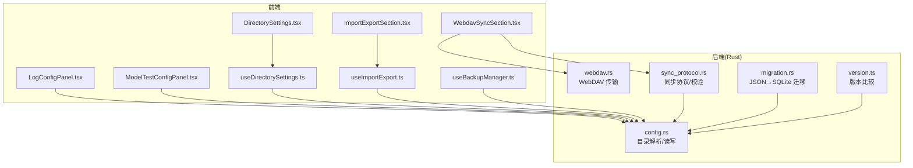
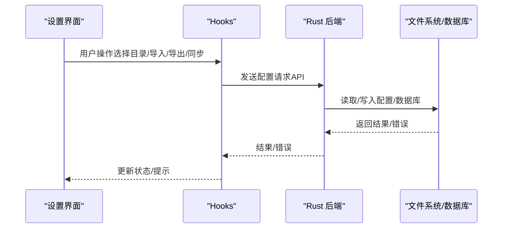
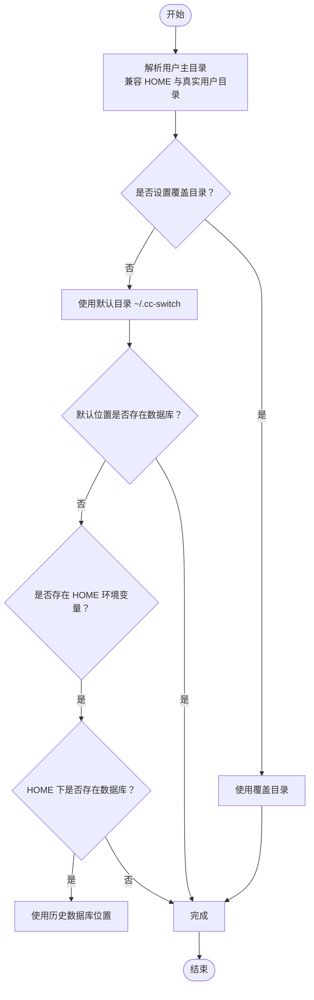
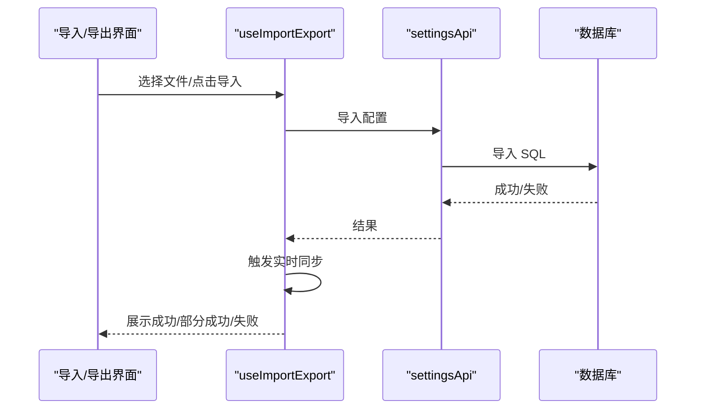
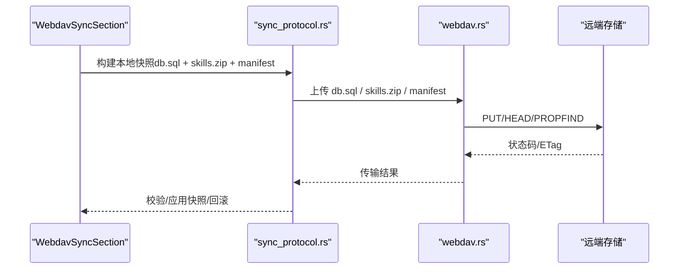
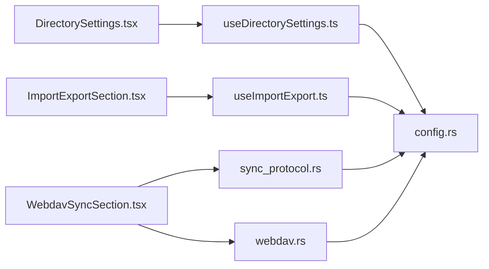

# 高级配置

<cite>
**本文引用的文件**
- [src/config/appConfig.tsx](file://src/config/appConfig.tsx)
- [src-tauri/src/config.rs](file://src-tauri/src/config.rs)
- [src/hooks/useDirectorySettings.ts](file://src/hooks/useDirectorySettings.ts)
- [src/components/settings/DirectorySettings.tsx](file://src/components/settings/DirectorySettings.tsx)
- [src/hooks/useImportExport.ts](file://src/hooks/useImportExport.ts)
- [src/hooks/useBackupManager.ts](file://src/hooks/useBackupManager.ts)
- [src/components/settings/ImportExportSection.tsx](file://src/components/settings/ImportExportSection.tsx)
- [src/components/settings/WebdavSyncSection.tsx](file://src/components/settings/WebdavSyncSection.tsx)
- [src/components/settings/LogConfigPanel.tsx](file://src/components/settings/LogConfigPanel.tsx)
- [src-tauri/src/services/webdav.rs](file://src-tauri/src/services/webdav.rs)
- [src-tauri/src/services/sync_protocol.rs](file://src-tauri/src/services/sync_protocol.rs)
- [src/components/usage/ModelTestConfigPanel.tsx](file://src/components/usage/ModelTestConfigPanel.tsx)
- [src/lib/version.ts](file://src/lib/version.ts)
- [src-tauri/src/database/migration.rs](file://src-tauri/src/database/migration.rs)
</cite>

## 目录
1. [简介](#简介)
2. [项目结构](#项目结构)
3. [核心组件](#核心组件)
4. [架构总览](#架构总览)
5. [详细组件分析](#详细组件分析)
6. [依赖分析](#依赖分析)
7. [性能考量](#性能考量)
8. [故障排查指南](#故障排查指南)
9. [结论](#结论)
10. [附录](#附录)

## 简介
本指南面向高级用户，系统讲解 CC Switch 的高级配置能力，涵盖：
- 目录设置：配置目录、应用数据目录、供应商特定目录的管理与覆盖策略
- 数据管理：导入/导出、备份/恢复、WebDAV/S3 同步
- 模型测试配置：测试用例、性能评估、结果分析
- 日志配置与系统监控：日志级别、输出格式、文件轮转与监控要点
- 配置优化建议：性能调优、资源管理、故障预防
- 手动编辑配置与版本兼容性管理

## 项目结构
围绕高级配置的关键代码分布在前端设置页、Hooks、以及 Rust 后端服务层：
- 前端设置页负责用户交互与状态展示（目录、导入导出、WebDAV/S3、日志、模型测试）
- Hooks 负责与后端 API 通信、状态管理与交互流程
- Rust 层负责目录解析、配置读写、同步协议、WebDAV 传输、数据库迁移与版本比较

图表来源
- [src/components/settings/DirectorySettings.tsx:1-230](file://src/components/settings/DirectorySettings.tsx#L1-L230)
- [src/hooks/useDirectorySettings.ts:1-374](file://src/hooks/useDirectorySettings.ts#L1-L374)
- [src/components/settings/ImportExportSection.tsx:1-213](file://src/components/settings/ImportExportSection.tsx#L1-L213)
- [src/hooks/useImportExport.ts:1-204](file://src/hooks/useImportExport.ts#L1-L204)
- [src/components/settings/WebdavSyncSection.tsx:1-800](file://src/components/settings/WebdavSyncSection.tsx#L1-L800)
- [src-tauri/src/services/sync_protocol.rs:1-649](file://src-tauri/src/services/sync_protocol.rs#L1-L649)
- [src-tauri/src/services/webdav.rs:1-555](file://src-tauri/src/services/webdav.rs#L1-L555)
- [src-tauri/src/config.rs:1-425](file://src-tauri/src/config.rs#L1-L425)
- [src-tauri/src/database/migration.rs:1-246](file://src-tauri/src/database/migration.rs#L1-L246)
- [src/lib/version.ts:1-86](file://src/lib/version.ts#L1-L86)

章节来源
- [src/components/settings/DirectorySettings.tsx:1-230](file://src/components/settings/DirectorySettings.tsx#L1-L230)
- [src/hooks/useDirectorySettings.ts:1-374](file://src/hooks/useDirectorySettings.ts#L1-L374)
- [src/components/settings/ImportExportSection.tsx:1-213](file://src/components/settings/ImportExportSection.tsx#L1-L213)
- [src/hooks/useImportExport.ts:1-204](file://src/hooks/useImportExport.ts#L1-L204)
- [src/components/settings/WebdavSyncSection.tsx:1-800](file://src/components/settings/WebdavSyncSection.tsx#L1-L800)
- [src-tauri/src/services/sync_protocol.rs:1-649](file://src-tauri/src/services/sync_protocol.rs#L1-L649)
- [src-tauri/src/services/webdav.rs:1-555](file://src-tauri/src/services/webdav.rs#L1-L555)
- [src-tauri/src/config.rs:1-425](file://src-tauri/src/config.rs#L1-L425)
- [src-tauri/src/database/migration.rs:1-246](file://src-tauri/src/database/migration.rs#L1-L246)
- [src/lib/version.ts:1-86](file://src/lib/version.ts#L1-L86)

## 核心组件
- 目录设置：集中管理 CC Switch 应用配置目录与各供应商配置目录，支持覆盖与重置
- 数据管理：导入/导出 SQL 备份、备份列表管理、WebDAV/S3 同步
- 日志配置：启用/禁用日志与设置日志级别
- 模型测试：配置测试模型、超时、重试、降级阈值，评估供应商健康度

章节来源
- [src/hooks/useDirectorySettings.ts:1-374](file://src/hooks/useDirectorySettings.ts#L1-L374)
- [src/components/settings/DirectorySettings.tsx:1-230](file://src/components/settings/DirectorySettings.tsx#L1-L230)
- [src/hooks/useImportExport.ts:1-204](file://src/hooks/useImportExport.ts#L1-L204)
- [src/hooks/useBackupManager.ts:1-60](file://src/hooks/useBackupManager.ts#L1-L60)
- [src/components/settings/WebdavSyncSection.tsx:1-800](file://src/components/settings/WebdavSyncSection.tsx#L1-L800)
- [src/components/settings/LogConfigPanel.tsx:1-120](file://src/components/settings/LogConfigPanel.tsx#L1-L120)
- [src/components/usage/ModelTestConfigPanel.tsx:1-231](file://src/components/usage/ModelTestConfigPanel.tsx#L1-L231)

## 架构总览
高级配置涉及前后端协作：前端负责 UI 与交互，后端负责目录解析、配置读写、同步协议与传输。

图表来源
- [src/components/settings/DirectorySettings.tsx:1-230](file://src/components/settings/DirectorySettings.tsx#L1-L230)
- [src/hooks/useDirectorySettings.ts:1-374](file://src/hooks/useDirectorySettings.ts#L1-L374)
- [src/components/settings/ImportExportSection.tsx:1-213](file://src/components/settings/ImportExportSection.tsx#L1-L213)
- [src/hooks/useImportExport.ts:1-204](file://src/hooks/useImportExport.ts#L1-L204)
- [src/components/settings/WebdavSyncSection.tsx:1-800](file://src/components/settings/WebdavSyncSection.tsx#L1-L800)
- [src-tauri/src/config.rs:1-425](file://src-tauri/src/config.rs#L1-L425)

## 详细组件分析

### 目录设置与管理
- 应用配置目录：默认位于用户主目录下的隐藏目录，支持覆盖与重置
- 供应商配置目录：针对 Claude/Codex/Gemini/OpenCode/OpenClaw/Hermes 的独立覆盖
- 目录解析与兼容：Windows 下对 HOME 与真实用户目录的兼容处理，历史数据库位置回退
- 原子写入：配置写入采用临时文件 + 原子替换，避免半写状态

图表来源
- [src-tauri/src/config.rs:22-123](file://src-tauri/src/config.rs#L22-L123)

章节来源
- [src-tauri/src/config.rs:1-425](file://src-tauri/src/config.rs#L1-L425)
- [src/hooks/useDirectorySettings.ts:1-374](file://src/hooks/useDirectorySettings.ts#L1-L374)
- [src/components/settings/DirectorySettings.tsx:1-230](file://src/components/settings/DirectorySettings.tsx#L1-L230)

### 数据管理：导入/导出与备份恢复
- 导入/导出：基于 SQLite 的 SQL 备份，导出时生成带时间戳的文件名，导入后触发实时同步
- 备份管理：列出/创建/恢复/重命名/删除数据库备份
- 容错与提示：导入失败、部分成功、网络异常均有明确反馈

图表来源
- [src/components/settings/ImportExportSection.tsx:1-213](file://src/components/settings/ImportExportSection.tsx#L1-L213)
- [src/hooks/useImportExport.ts:1-204](file://src/hooks/useImportExport.ts#L1-L204)

章节来源
- [src/hooks/useImportExport.ts:1-204](file://src/hooks/useImportExport.ts#L1-L204)
- [src/hooks/useBackupManager.ts:1-60](file://src/hooks/useBackupManager.ts#L1-L60)
- [src/components/settings/ImportExportSection.tsx:1-213](file://src/components/settings/ImportExportSection.tsx#L1-L213)

### WebDAV/S3 同步
- 协议与兼容：统一的同步协议（manifest、db.sql、skills.zip），支持版本与兼容性校验
- WebDAV 传输：PROPFIND/MKCOL/PUT/GET/HEAD，带超时与错误提示，支持坚果云等服务特性
- S3 同步：与 WebDAV 类似的协议抽象，支持区域、桶、凭据与远程根目录
- 交互流程：测试连接、保存设置、拉取远端信息、上传/下载确认与执行

图表来源
- [src-tauri/src/services/sync_protocol.rs:1-649](file://src-tauri/src/services/sync_protocol.rs#L1-L649)
- [src-tauri/src/services/webdav.rs:1-555](file://src-tauri/src/services/webdav.rs#L1-L555)
- [src/components/settings/WebdavSyncSection.tsx:1-800](file://src/components/settings/WebdavSyncSection.tsx#L1-L800)

章节来源
- [src-tauri/src/services/sync_protocol.rs:1-649](file://src-tauri/src/services/sync_protocol.rs#L1-L649)
- [src-tauri/src/services/webdav.rs:1-555](file://src-tauri/src/services/webdav.rs#L1-L555)
- [src/components/settings/WebdavSyncSection.tsx:1-800](file://src/components/settings/WebdavSyncSection.tsx#L1-L800)

### 日志配置与系统监控
- 日志开关与级别：支持启用/禁用与多级日志（error/warn/info/debug/trace）
- 级别说明：提供各级别的含义与适用场景
- 系统监控建议：结合日志级别与 WebDAV/S3 同步状态进行问题定位

章节来源
- [src/components/settings/LogConfigPanel.tsx:1-120](file://src/components/settings/LogConfigPanel.tsx#L1-L120)

### 模型测试配置与性能评估
- 测试模型：为 Claude/Codex/Gemini/OpenCode/OpenClaw 配置测试模型
- 参数配置：超时、最大重试、降级阈值（毫秒）
- 结果分析：健康/降级/不可用，显示延迟与 TTFB，便于与故障转移联动

章节来源
- [src/components/usage/ModelTestConfigPanel.tsx:1-231](file://src/components/usage/ModelTestConfigPanel.tsx#L1-L231)

## 依赖分析
- 前端设置页依赖 Hooks 与 API，实现目录选择、导入导出、同步与日志配置
- 后端目录解析与配置读写依赖平台路径与文件系统
- 同步协议与 WebDAV 传输相互解耦，便于扩展其他传输（如 S3）

图表来源
- [src/components/settings/DirectorySettings.tsx:1-230](file://src/components/settings/DirectorySettings.tsx#L1-L230)
- [src/hooks/useDirectorySettings.ts:1-374](file://src/hooks/useDirectorySettings.ts#L1-L374)
- [src/components/settings/ImportExportSection.tsx:1-213](file://src/components/settings/ImportExportSection.tsx#L1-L213)
- [src/hooks/useImportExport.ts:1-204](file://src/hooks/useImportExport.ts#L1-L204)
- [src/components/settings/WebdavSyncSection.tsx:1-800](file://src/components/settings/WebdavSyncSection.tsx#L1-L800)
- [src-tauri/src/services/sync_protocol.rs:1-649](file://src-tauri/src/services/sync_protocol.rs#L1-L649)
- [src-tauri/src/services/webdav.rs:1-555](file://src-tauri/src/services/webdav.rs#L1-L555)
- [src-tauri/src/config.rs:1-425](file://src-tauri/src/config.rs#L1-L425)

## 性能考量
- 目录与配置写入：采用原子写入，减少并发写入风险
- 同步传输：WebDAV/S3 传输具备超时与大小限制，避免长时间阻塞
- 日志级别：生产环境建议 info 或 warn，避免 debug/trace 的高 IO 开销
- 模型测试：合理设置超时与重试，避免频繁测试导致配额消耗

## 故障排查指南
- WebDAV 连接失败
  - 检查 URL 协议（仅 http/https）、用户名/密码与目录权限
  - 常见服务差异：坚果云需使用第三方应用密码并指向 /dav/ 目录
  - 使用“测试连接”按钮快速定位问题
- 同步版本不兼容
  - 检查远端 manifest 的协议版本与数据库兼容版本
  - 若远端为旧布局，兼容策略不同，需确认远端布局类型
- 导入失败或部分成功
  - 确认 SQL 文件完整性与格式
  - 导入后触发实时同步，若失败需手动重新选择供应商
- 日志问题
  - 调整日志级别，查看详细错误信息
  - 关注网络请求超时、连接失败、请求构造失败等提示

章节来源
- [src-tauri/src/services/webdav.rs:1-555](file://src-tauri/src/services/webdav.rs#L1-L555)
- [src-tauri/src/services/sync_protocol.rs:1-649](file://src-tauri/src/services/sync_protocol.rs#L1-L649)
- [src/hooks/useImportExport.ts:1-204](file://src/hooks/useImportExport.ts#L1-L204)
- [src/components/settings/LogConfigPanel.tsx:1-120](file://src/components/settings/LogConfigPanel.tsx#L1-L120)

## 结论
通过目录覆盖、导入导出、备份恢复与 WebDAV/S3 同步，CC Switch 提供了完整的高级配置与运维能力。配合日志配置与模型测试，用户可以实现跨设备迁移、版本兼容管理与持续监控，保障系统的稳定性与可维护性。

## 附录

### 目录设置最佳实践
- 将应用配置目录与供应商配置目录分离，便于迁移与审计
- 在 Windows 环境下避免依赖 HOME 环境变量，优先使用真实用户目录
- 使用覆盖目录功能集中管理多个设备的配置

章节来源
- [src-tauri/src/config.rs:1-425](file://src-tauri/src/config.rs#L1-L425)
- [src/hooks/useDirectorySettings.ts:1-374](file://src/hooks/useDirectorySettings.ts#L1-L374)

### 数据管理与版本兼容
- 使用 SQL 备份进行跨设备迁移，定期导出配置
- WebDAV/S3 同步时关注协议版本与数据库兼容版本
- JSON→SQLite 迁移逻辑已内置，首次启动自动迁移并保留旧文件作为备份

章节来源
- [src-tauri/src/database/migration.rs:1-246](file://src-tauri/src/database/migration.rs#L1-L246)
- [src-tauri/src/services/sync_protocol.rs:1-649](file://src-tauri/src/services/sync_protocol.rs#L1-L649)

### 手动编辑配置与版本比较
- 手动编辑 CLI 工具配置后，需在 CC Switch 中重新编辑并保存以同步到数据库
- 版本比较采用轻量 semver，避免抢先/预发布通道导致的误判

章节来源
- [src/lib/version.ts:1-86](file://src/lib/version.ts#L1-L86)
- [src/components/settings/WebdavSyncSection.tsx:1-800](file://src/components/settings/WebdavSyncSection.tsx#L1-L800)