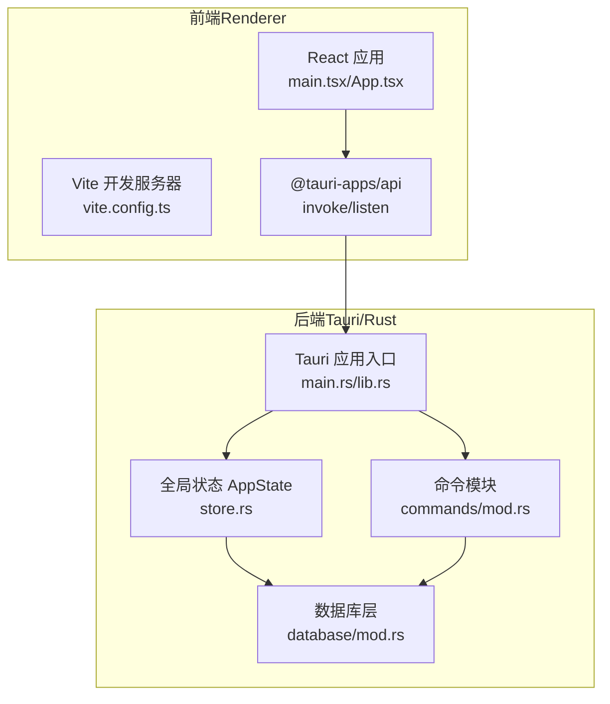
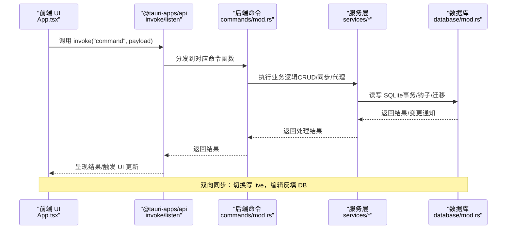
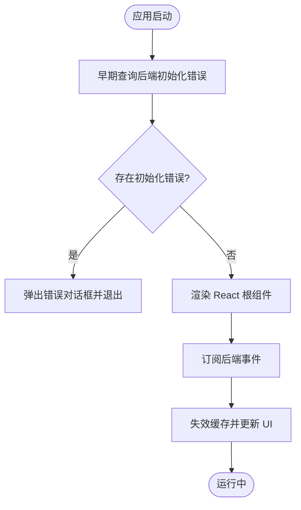
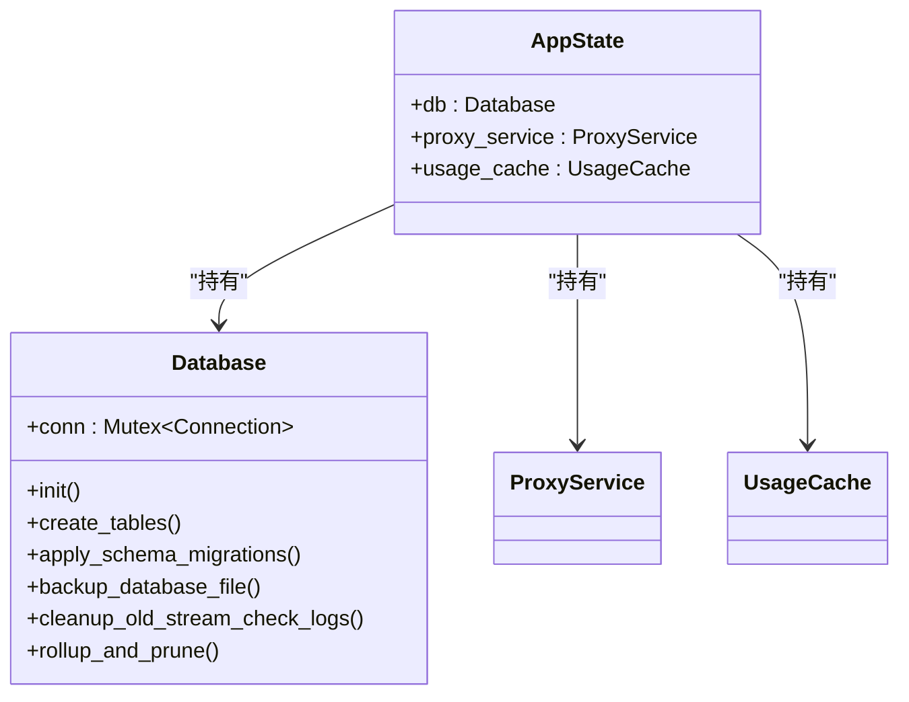
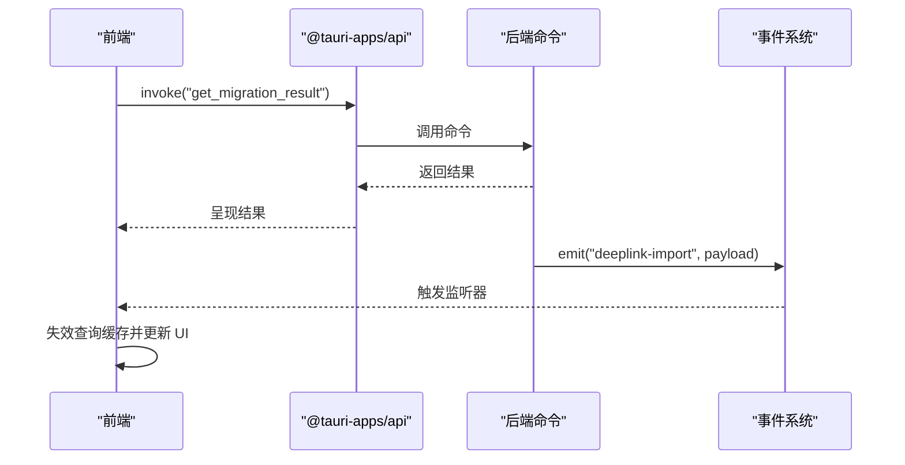
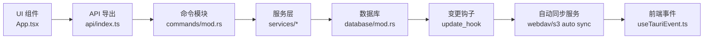
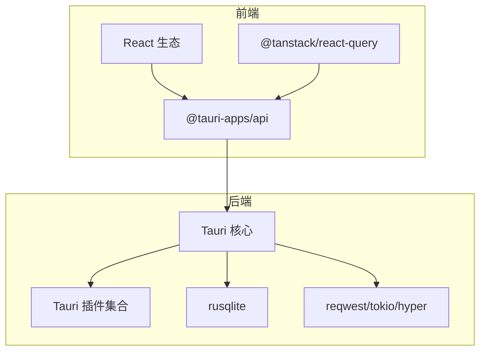

# 技术架构概览

<cite>
**本文引用的文件**
- [Cargo.toml](file://src-tauri/Cargo.toml)
- [package.json](file://package.json)
- [vite.config.ts](file://vite.config.ts)
- [tauri.conf.json](file://src-tauri/tauri.conf.json)
- [main.tsx](file://src/main.tsx)
- [lib.rs](file://src-tauri/src/lib.rs)
- [main.rs](file://src-tauri/src/main.rs)
- [store.rs](file://src-tauri/src/store.rs)
- [database/mod.rs](file://src-tauri/src/database/mod.rs)
- [commands/mod.rs](file://src-tauri/src/commands/mod.rs)
- [App.tsx](file://src/App.tsx)
- [useTauriEvent.ts](file://src/hooks/useTauriEvent.ts)
- [appConfig.tsx](file://src/config/appConfig.tsx)
- [query/index.ts](file://src/lib/query/index.ts)
- [api/index.ts](file://src/lib/api/index.ts)
- [README.md](file://README.md)
</cite>

## 目录
1. [简介](#简介)
2. [项目结构](#项目结构)
3. [核心组件](#核心组件)
4. [架构总览](#架构总览)
5. [详细组件分析](#详细组件分析)
6. [依赖关系分析](#依赖关系分析)
7. [性能考量](#性能考量)
8. [故障排查指南](#故障排查指南)
9. [结论](#结论)
10. [附录](#附录)

## 简介
本文件面向 CC Switch 的技术架构概览，系统阐述基于 Tauri 2 + React + Rust 的混合架构设计，涵盖前端（React + TypeScript + Vite + TailwindCSS）与后端（Rust + Tauri）的技术选型与优势，双端交互（IPC 通信）方式、数据流向与组件关系，以及架构设计原则（SSOT、双层存储、双向同步、原子写入等）与关键技术模式（单向数据流、命令模式、观察者模式）。文档还提供架构图与组件层次结构说明，展示从 UI 层到数据库层的完整数据流，并解释跨平台支持与性能优化策略。

## 项目结构
项目采用前后端分离的混合架构：
- 前端：React + TypeScript + Vite（开发服务器与构建工具），TailwindCSS（样式框架）
- 后端：Rust + Tauri（桌面应用壳与系统集成），SQLite（持久化存储）
- IPC：前端通过 @tauri-apps/api 与后端命令交互，事件驱动（事件监听与广播）

图表来源
- [main.tsx:1-104](file://src/main.tsx#L1-L104)
- [vite.config.ts:1-33](file://vite.config.ts#L1-L33)
- [main.rs:1-23](file://src-tauri/src/main.rs#L1-L23)
- [lib.rs:1-800](file://src-tauri/src/lib.rs#L1-L800)
- [store.rs:1-24](file://src-tauri/src/store.rs#L1-L24)
- [database/mod.rs:1-273](file://src-tauri/src/database/mod.rs#L1-L273)
- [commands/mod.rs:1-69](file://src-tauri/src/commands/mod.rs#L1-L69)

章节来源
- [package.json:1-96](file://package.json#L1-L96)
- [vite.config.ts:1-33](file://vite.config.ts#L1-L33)
- [tauri.conf.json:1-70](file://src-tauri/tauri.conf.json#L1-L70)

## 核心组件
- 前端核心
  - 应用入口与事件处理：main.tsx 负责初始化、错误事件监听与主题/更新上下文装配
  - 主应用视图与业务逻辑：App.tsx 管理应用状态、视图切换、事件监听、快捷键与窗口状态同步
  - 事件钩子：useTauriEvent.ts 封装 Tauri 事件监听生命周期，避免样板代码
  - 应用配置与图标映射：appConfig.tsx 提供应用 ID、标签与视觉样式
  - 查询与 API 导出：query/index.ts 与 api/index.ts 提供统一的数据访问接口

- 后端核心
  - 应用入口：main.rs 负责平台环境变量设置与启动
  - 应用运行时：lib.rs 组装 Tauri Builder、插件、日志、数据库初始化、迁移与自动导入
  - 全局状态：store.rs 定义 AppState，聚合数据库、代理服务与用量缓存
  - 数据库层：database/mod.rs 提供 SQLite 连接、表结构与迁移、变更钩子与自动回收
  - 命令模块：commands/mod.rs 汇总所有后端命令，作为 IPC 对外接口

章节来源
- [main.tsx:1-104](file://src/main.tsx#L1-L104)
- [App.tsx:1-800](file://src/App.tsx#L1-L800)
- [useTauriEvent.ts:1-40](file://src/hooks/useTauriEvent.ts#L1-L40)
- [appConfig.tsx:1-112](file://src/config/appConfig.tsx#L1-L112)
- [query/index.ts:1-6](file://src/lib/query/index.ts#L1-L6)
- [api/index.ts:1-31](file://src/lib/api/index.ts#L1-L31)
- [main.rs:1-23](file://src-tauri/src/main.rs#L1-L23)
- [lib.rs:1-800](file://src-tauri/src/lib.rs#L1-L800)
- [store.rs:1-24](file://src-tauri/src/store.rs#L1-L24)
- [database/mod.rs:1-273](file://src-tauri/src/database/mod.rs#L1-L273)
- [commands/mod.rs:1-69](file://src-tauri/src/commands/mod.rs#L1-L69)

## 架构总览
- 技术栈与选型
  - 前端：React + TypeScript + Vite + TailwindCSS，具备快速开发、热重载与现代化生态
  - 后端：Rust + Tauri，提供高性能、内存安全与跨平台打包能力
  - 数据持久化：SQLite，结合变更钩子与增量回收，保障可靠性与性能
- 双端交互
  - IPC：前端通过 invoke 调用后端命令，通过 listen 订阅后端事件
  - 深链接：统一处理 ccswitch://，向前端广播 deeplink-import/deeplink-error 事件
  - 窗口与托盘：窗口状态插件、托盘菜单动态更新
- 数据流与一致性
  - SSOT（单一事实源）：所有数据集中存储于 SQLite
  - 双层存储：同步数据（SQLite）与设备级设置（JSON）
  - 双向同步：切换时写入 live 文件，编辑时从 live 反填数据库
  - 原子写入：临时文件 + rename 防止配置损坏
  - 并发安全：Mutex 保护的数据库连接，避免竞态

图表来源
- [App.tsx:1-800](file://src/App.tsx#L1-L800)
- [useTauriEvent.ts:1-40](file://src/hooks/useTauriEvent.ts#L1-L40)
- [commands/mod.rs:1-69](file://src-tauri/src/commands/mod.rs#L1-L69)
- [database/mod.rs:1-273](file://src-tauri/src/database/mod.rs#L1-L273)

章节来源
- [README.md:366-425](file://README.md#L366-L425)

## 详细组件分析

### 前端组件分析
- 应用入口与初始化
  - main.tsx 在启动早期主动查询后端初始化错误并通过事件回调提示用户并退出，避免配置损坏导致的不可预期行为
  - 装配 QueryClientProvider、ThemeProvider、UpdateProvider 与全局 Toaster，统一状态与主题
- 主应用视图与状态
  - App.tsx 维护应用 ID、视图、窗口控制与可见应用集合，处理代理状态、环境冲突、迁移结果与同步状态等事件
  - 使用 useTauriEvent.ts 订阅后端事件，自动失效查询缓存并触发 UI 通知
- 事件钩子与观察者模式
  - useTauriEvent.ts 封装事件监听生命周期，避免重复样板代码，体现观察者模式在前端的应用

图表来源
- [main.tsx:73-104](file://src/main.tsx#L73-L104)
- [useTauriEvent.ts:1-40](file://src/hooks/useTauriEvent.ts#L1-L40)
- [App.tsx:365-404](file://src/App.tsx#L365-L404)

章节来源
- [main.tsx:1-104](file://src/main.tsx#L1-L104)
- [App.tsx:1-800](file://src/App.tsx#L1-L800)
- [useTauriEvent.ts:1-40](file://src/hooks/useTauriEvent.ts#L1-L40)

### 后端组件分析
- 应用入口与运行时
  - main.rs 在 Linux 上设置 WebKit 环境变量以规避 DMA-BUF 渲染问题，随后调用 cc_switch_lib::run()
  - lib.rs 组装 Tauri Builder，注册插件（日志、对话框、窗口状态、深链、更新器等），初始化日志与数据库，执行迁移与自动导入
- 全局状态与服务
  - store.rs 定义 AppState，聚合数据库、代理服务与用量缓存，作为多服务共享状态载体
- 数据库层
  - database/mod.rs 提供数据库连接、表结构与迁移、变更钩子（通知自动同步）、增量回收与启动清理
- 命令模块
  - commands/mod.rs 汇总所有命令，作为 IPC 对外接口，覆盖认证、余额、配置、代理、会话、设置、技能、使用统计等

图表来源
- [store.rs:1-24](file://src-tauri/src/store.rs#L1-L24)
- [database/mod.rs:1-273](file://src-tauri/src/database/mod.rs#L1-L273)

章节来源
- [main.rs:1-23](file://src-tauri/src/main.rs#L1-L23)
- [lib.rs:1-800](file://src-tauri/src/lib.rs#L1-L800)
- [store.rs:1-24](file://src-tauri/src/store.rs#L1-L24)
- [database/mod.rs:1-273](file://src-tauri/src/database/mod.rs#L1-L273)
- [commands/mod.rs:1-69](file://src-tauri/src/commands/mod.rs#L1-L69)

### IPC 通信与事件流
- 命令调用
  - 前端通过 @tauri-apps/api.invoke 调用后端命令，命令在 commands/mod.rs 中分发至具体实现
- 事件监听
  - 前端通过 @tauri-apps/api.listen 订阅后端事件，useTauriEvent.ts 封装生命周期管理
  - 后端通过 Emitter 发射事件（如 deeplink-import、deeplink-error、webdav-sync-status-updated 等），前端统一处理并更新 UI

图表来源
- [App.tsx:488-532](file://src/App.tsx#L488-L532)
- [useTauriEvent.ts:1-40](file://src/hooks/useTauriEvent.ts#L1-L40)
- [lib.rs:119-182](file://src-tauri/src/lib.rs#L119-L182)

章节来源
- [App.tsx:1-800](file://src/App.tsx#L1-L800)
- [useTauriEvent.ts:1-40](file://src/hooks/useTauriEvent.ts#L1-L40)
- [lib.rs:1-800](file://src-tauri/src/lib.rs#L1-L800)

### 数据流向与组件关系
- UI 层到命令层：App.tsx 通过 providersApi/settingsApi 等统一 API 调用后端命令
- 命令层到服务层：commands/mod.rs 将请求委派给 services/*（ProviderService/McpService/ProxyService 等）
- 服务层到数据库层：services/* 通过 Database 实例进行读写，利用变更钩子触发自动同步
- 事件驱动：数据库变更通过 update_hook 通知自动同步服务，后端再通过事件广播到前端

图表来源
- [App.tsx:1-800](file://src/App.tsx#L1-L800)
- [api/index.ts:1-31](file://src/lib/api/index.ts#L1-L31)
- [commands/mod.rs:1-69](file://src-tauri/src/commands/mod.rs#L1-L69)
- [database/mod.rs:80-90](file://src-tauri/src/database/mod.rs#L80-L90)

章节来源
- [App.tsx:1-800](file://src/App.tsx#L1-L800)
- [api/index.ts:1-31](file://src/lib/api/index.ts#L1-L31)
- [database/mod.rs:1-273](file://src-tauri/src/database/mod.rs#L1-L273)

## 依赖关系分析
- 前端依赖
  - @tauri-apps/api 提供 invoke/listen 与系统能力访问
  - @tanstack/react-query 提供查询客户端与缓存管理
  - React + Radix UI + Lucide Icons + TailwindCSS 构建 UI 组件体系
- 后端依赖
  - tauri、tauri-plugin-* 提供窗口、托盘、深链、对话框、日志、窗口状态、更新器等
  - rusqlite 提供 SQLite 访问与外键约束
  - reqwest、tokio、hyper 等提供网络与并发能力
  - serde、serde_json、toml、indexmap 等提供序列化与配置处理

图表来源
- [package.json:42-94](file://package.json#L42-L94)
- [Cargo.toml:25-82](file://src-tauri/Cargo.toml#L25-L82)

章节来源
- [package.json:1-96](file://package.json#L1-L96)
- [Cargo.toml:1-110](file://src-tauri/Cargo.toml#L1-L110)

## 性能考量
- 前端
  - Vite 开发服务器与按需构建，TailwindCSS 原子化样式减少打包体积
  - React Query 缓存与失效策略降低重复请求
- 后端
  - SQLite 增量自动回收与启动清理，减少磁盘占用与碎片
  - 变更钩子触发自动同步，避免轮询带来的资源浪费
  - 并发安全：Mutex 保护数据库连接，避免竞态
- 跨平台
  - Tauri 2 提供统一打包与系统集成，Linux 上针对 WebKit 环境变量优化，Windows/macOS 平台特定能力（如 AppUserModelID、托盘菜单）

章节来源
- [lib.rs:363-421](file://src-tauri/src/lib.rs#L363-L421)
- [database/mod.rs:144-157](file://src-tauri/src/database/mod.rs#L144-L157)
- [main.rs:5-19](file://src-tauri/src/main.rs#L5-L19)

## 故障排查指南
- 配置加载失败
  - 前端监听后端的 configLoadError 事件，弹出错误对话框并退出，避免损坏配置导致应用异常
- 数据库初始化失败
  - 后端在初始化数据库失败时弹出对话框，允许用户重试或退出，避免应用直接崩溃
- 迁移与同步
  - 前端监听迁移与技能迁移结果事件，toast 提示用户；同步错误事件在前端统一处理并提示
- 环境变量冲突
  - 启动与切换应用时检查环境冲突，弹出横幅提示并允许用户忽略

章节来源
- [main.tsx:39-71](file://src/main.tsx#L39-L71)
- [lib.rs:406-421](file://src-tauri/src/lib.rs#L406-L421)
- [App.tsx:488-532](file://src/App.tsx#L488-L532)
- [App.tsx:464-486](file://src/App.tsx#L464-L486)

## 结论
CC Switch 采用 Tauri 2 + React + Rust 的混合架构，前端以现代 Web 技术实现高可用 UI，后端以 Rust + Tauri 提供高性能与跨平台能力。通过 SSOT、双层存储、双向同步与原子写入等设计原则，结合命令模式与观察者模式，实现了稳定可靠的数据流与事件驱动的用户体验。数据库层的变更钩子与自动同步进一步提升了系统的自动化程度与一致性。

## 附录
- 关键设计模式与原则
  - SSOT：单一事实源集中于 SQLite
  - 双层存储：同步数据（SQLite）与设备级设置（JSON）
  - 双向同步：切换写入 live 文件，编辑时从 live 反填数据库
  - 原子写入：临时文件 + rename 防止配置损坏
  - 并发安全：Mutex 保护数据库连接
  - 单向数据流：前端通过 API 调用后端命令，后端通过事件广播更新前端
- 开发与构建
  - Node.js 18+、pnpm 8+、Rust 1.85+、Tauri CLI 2.8+
  - 开发模式：pnpm dev（前端热重载 + 后端调试）
  - 构建模式：pnpm build（打包应用）

章节来源
- [README.md:366-425](file://README.md#L366-L425)
- [tauri.conf.json:1-70](file://src-tauri/tauri.conf.json#L1-L70)
- [vite.config.ts:1-33](file://vite.config.ts#L1-L33)
- [package.json:6-17](file://package.json#L6-L17)