# 支持的工具与平台

<cite>
**本文引用的文件**
- [universalProviderPresets.ts](file://src/config/universalProviderPresets.ts)
- [claudeProviderPresets.ts](file://src/config/claudeProviderPresets.ts)
- [codexProviderPresets.ts](file://src/config/codexProviderPresets.ts)
- [geminiProviderPresets.ts](file://src/config/geminiProviderPresets.ts)
- [hermesProviderPresets.ts](file://src/config/hermesProviderPresets.ts)
- [opencodeProviderPresets.ts](file://src/config/opencodeProviderPresets.ts)
- [openclawProviderPresets.ts](file://src/config/openclawProviderPresets.ts)
- [mcpPresets.ts](file://src/config/mcpPresets.ts)
- [1.2-installation.md](file://docs/user-manual/zh/1-getting-started/1.2-installation.md)
- [2.1-add.md](file://docs/user-manual/zh/2-providers/2.1-add.md)
- [2.2-switch.md](file://docs/user-manual/zh/2-providers/2.2-switch.md)
- [2.6-claude-desktop.md](file://docs/user-manual/zh/2-providers/2.6-claude-desktop.md)
</cite>

## 目录
1. [简介](#简介)
2. [项目结构](#项目结构)
3. [核心组件](#核心组件)
4. [架构总览](#架构总览)
5. [详细组件分析](#详细组件分析)
6. [依赖关系分析](#依赖关系分析)
7. [性能考量](#性能考量)
8. [故障排查指南](#故障排查指南)
9. [结论](#结论)
10. [附录](#附录)

## 简介
本章节面向 CC Switch 支持的七种 AI 工具与平台，系统梳理 Claude Code、Claude Desktop、Codex、Gemini CLI、OpenCode、OpenClaw、Hermes 的特性、用途、认证方式与配置要点，并详解统一供应商（Universal Providers）跨应用共享机制与系统托盘快速切换实现原理。同时给出平台系统要求、安装方式、兼容性说明与工具选择建议。

## 项目结构
围绕“工具与平台”的文档目标，本仓库的关键支撑文件主要分布在以下位置：
- 配置层：各类 Provider 预设配置（Claude、Codex、Gemini、OpenCode、OpenClaw、Hermes）
- 统一配置：Universal Providers 预设与创建逻辑
- 用户手册：安装、添加供应商、切换、托盘快速切换、Claude Desktop 管理等
- MCP 预设：MCP 服务器示例，便于扩展工具链

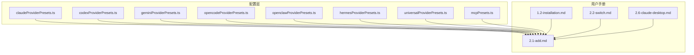

**图表来源**
- [claudeProviderPresets.ts](file://src/config/claudeProviderPresets.ts)
- [codexProviderPresets.ts](file://src/config/codexProviderPresets.ts)
- [geminiProviderPresets.ts](file://src/config/geminiProviderPresets.ts)
- [opencodeProviderPresets.ts](file://src/config/opencodeProviderPresets.ts)
- [openclawProviderPresets.ts](file://src/config/openclawProviderPresets.ts)
- [hermesProviderPresets.ts](file://src/config/hermesProviderPresets.ts)
- [universalProviderPresets.ts](file://src/config/universalProviderPresets.ts)
- [mcpPresets.ts](file://src/config/mcpPresets.ts)
- [1.2-installation.md](file://docs/user-manual/zh/1-getting-started/1.2-installation.md)
- [2.1-add.md](file://docs/user-manual/zh/2-providers/2.1-add.md)
- [2.2-switch.md](file://docs/user-manual/zh/2-providers/2.2-switch.md)
- [2.6-claude-desktop.md](file://docs/user-manual/zh/2-providers/2.6-claude-desktop.md)

**章节来源**
- [1.2-installation.md](file://docs/user-manual/zh/1-getting-started/1.2-installation.md)
- [2.1-add.md](file://docs/user-manual/zh/2-providers/2.1-add.md)
- [2.2-switch.md](file://docs/user-manual/zh/2-providers/2.2-switch.md)
- [2.6-claude-desktop.md](file://docs/user-manual/zh/2-providers/2.6-claude-desktop.md)

## 核心组件
- 统一供应商（Universal Providers）：跨应用共享配置，支持 Claude Code、Codex、Gemini 三应用同步。
- 七种工具预设：
  - Claude Code：支持多种 API 格式（Anthropic Messages、OpenAI Chat Completions、OpenAI Responses、Gemini Native），内置 50+ 预设。
  - Codex：支持 Responses 协议与 Chat Completions 协议，内置 50+ 预设。
  - Gemini CLI：支持 Google OAuth 与 API Key，内置 40+ 预设。
  - OpenCode：基于 npm 包抽象，内置 50+ 模型变体与适配。
  - OpenClaw：面向 OpenClaw Gateway 的模型与协议配置。
  - Hermes：面向 Hermes Agent 的 custom_providers 配置与模型建议。
- 系统托盘快速切换：按应用分组的子菜单，支持一键切换。
- MCP 预设：提供常用 stdio MCP 服务器示例。

**章节来源**
- [universalProviderPresets.ts](file://src/config/universalProviderPresets.ts)
- [claudeProviderPresets.ts](file://src/config/claudeProviderPresets.ts)
- [codexProviderPresets.ts](file://src/config/codexProviderPresets.ts)
- [geminiProviderPresets.ts](file://src/config/geminiProviderPresets.ts)
- [opencodeProviderPresets.ts](file://src/config/opencodeProviderPresets.ts)
- [openclawProviderPresets.ts](file://src/config/openclawProviderPresets.ts)
- [hermesProviderPresets.ts](file://src/config/hermesProviderPresets.ts)
- [mcpPresets.ts](file://src/config/mcpPresets.ts)
- [2.2-switch.md](file://docs/user-manual/zh/2-providers/2.2-switch.md)

## 架构总览
CC Switch 通过“预设配置 + 统一配置 + 应用面板 + 托盘菜单”的方式，将七种工具的认证、端点、模型与协议差异抽象为可复用的模板，并在不同应用间共享与同步。

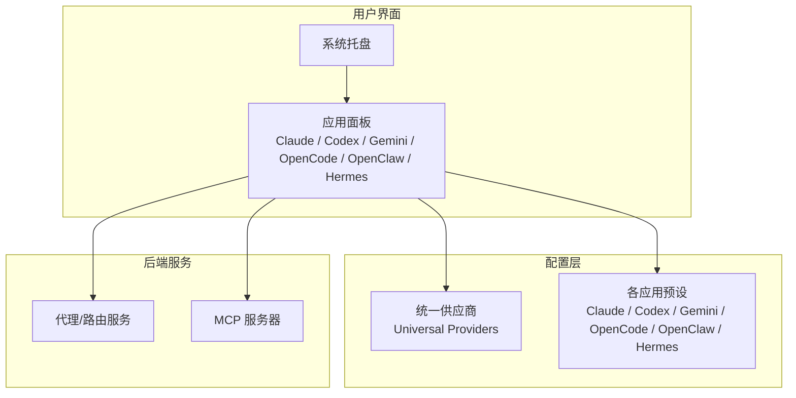

**图表来源**
- [2.2-switch.md](file://docs/user-manual/zh/2-providers/2.2-switch.md)
- [2.1-add.md](file://docs/user-manual/zh/2-providers/2.1-add.md)
- [universalProviderPresets.ts](file://src/config/universalProviderPresets.ts)
- [mcpPresets.ts](file://src/config/mcpPresets.ts)

## 详细组件分析

### 统一供应商（Universal Providers）
- 目标：在 Claude Code、Codex、Gemini 之间共享配置，减少重复设置。
- 预设示例：NewAPI、自定义网关，包含默认应用启用与默认模型映射。
- 创建逻辑：根据预设生成统一供应商，填充基础 URL、API Key、图标与模型配置。
- 同步机制：修改后自动同步到勾选的应用；删除后联动清理。

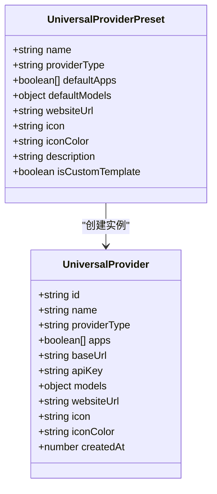

**图表来源**
- [universalProviderPresets.ts](file://src/config/universalProviderPresets.ts)

**章节来源**
- [universalProviderPresets.ts](file://src/config/universalProviderPresets.ts)
- [2.1-add.md](file://docs/user-manual/zh/2-providers/2.1-add.md)

### Claude Code（Claude）
- 特点：支持多种 API 格式（Anthropic Messages、OpenAI Chat Completions、OpenAI Responses、Gemini Native），内置 50+ 预设。
- 认证方式：API Key（ANTHROPIC_AUTH_TOKEN/ANTHROPIC_API_KEY）、模板变量、端点候选、主题与图标。
- 特殊功能：API 格式自动转换、完整 URL 模式、通用配置快捷开关、端点测速。
- 预设类别：官方、第三方、聚合、合作伙伴、国内官方等。

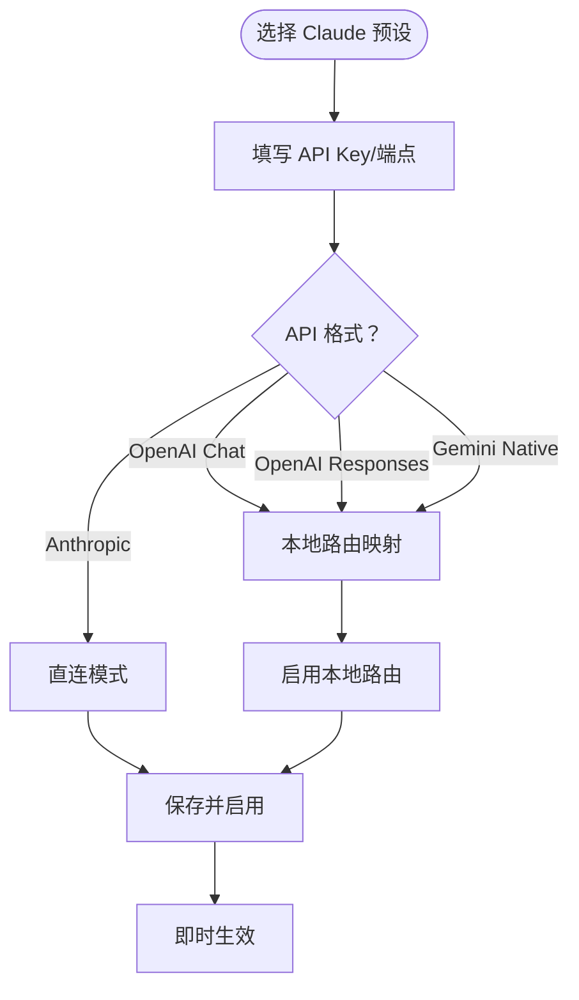

**图表来源**
- [claudeProviderPresets.ts](file://src/config/claudeProviderPresets.ts)
- [2.1-add.md](file://docs/user-manual/zh/2-providers/2.1-add.md)

**章节来源**
- [claudeProviderPresets.ts](file://src/config/claudeProviderPresets.ts)
- [2.1-add.md](file://docs/user-manual/zh/2-providers/2.1-add.md)

### Codex
- 特点：支持 Responses 协议（可直连）与 Chat Completions 协议（需本地路由映射）。
- 认证方式：auth.json（OPENAI_API_KEY）、config.toml（model_provider、base_url、wire_api 等）。
- 特殊功能：本地路由映射、模型映射表、思考能力（reasoning）自适应、1M 上下文窗口开关。
- 预设类别：OpenAI 官方、Azure OpenAI、聚合/托管平台、国内官方等。

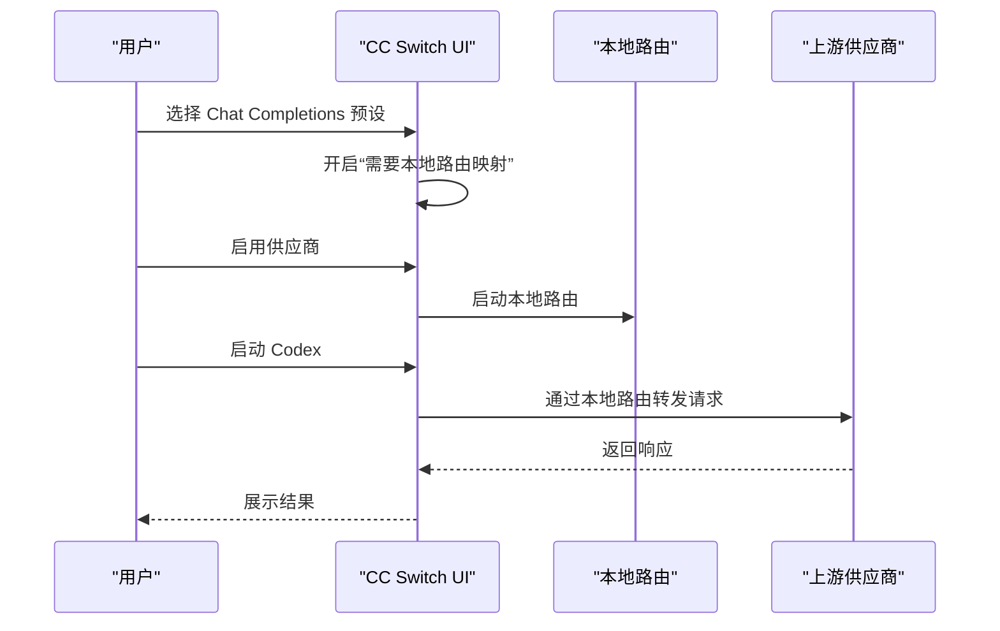

**图表来源**
- [codexProviderPresets.ts](file://src/config/codexProviderPresets.ts)
- [2.1-add.md](file://docs/user-manual/zh/2-providers/2.1-add.md)

**章节来源**
- [codexProviderPresets.ts](file://src/config/codexProviderPresets.ts)
- [2.1-add.md](file://docs/user-manual/zh/2-providers/2.1-add.md)

### Gemini CLI
- 特点：支持 Google OAuth 与 API Key，内置 40+ 预设。
- 认证方式：GEMINI_API_KEY、GOOGLE_GEMINI_BASE_URL、GEMINI_MODEL。
- 特殊功能：自动识别认证类型、自定义模型、端点候选。

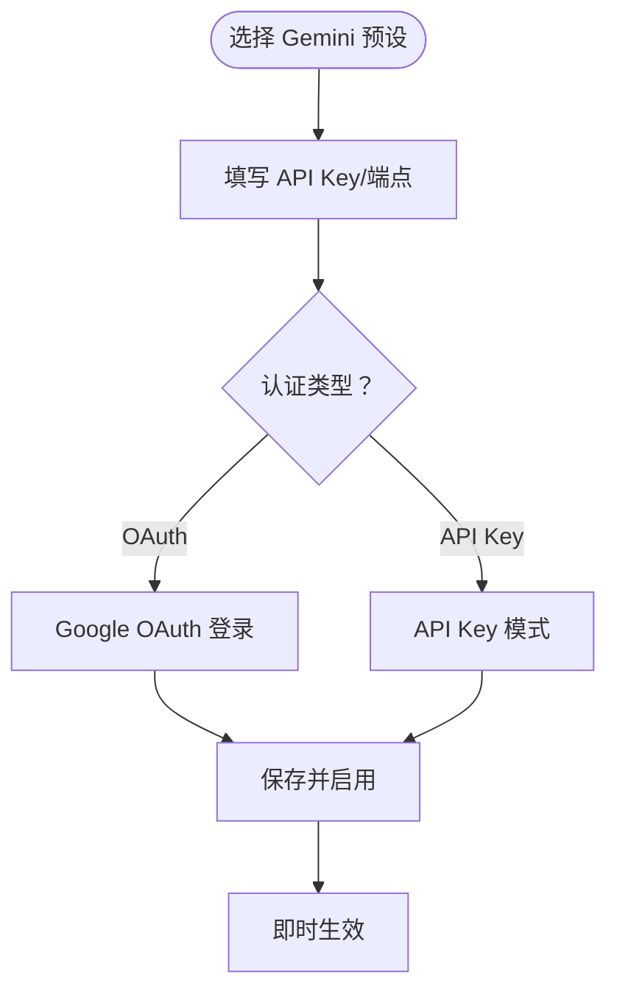

**图表来源**
- [geminiProviderPresets.ts](file://src/config/geminiProviderPresets.ts)
- [2.1-add.md](file://docs/user-manual/zh/2-providers/2.1-add.md)

**章节来源**
- [geminiProviderPresets.ts](file://src/config/geminiProviderPresets.ts)
- [2.1-add.md](file://docs/user-manual/zh/2-providers/2.1-add.md)

### OpenCode
- 特点：基于 npm 包抽象（@ai-sdk/*），内置 50+ 模型变体与适配（含思考配置、模态、输出限制等）。
- 认证方式：各 npm 包自有认证（如 OpenAI、Anthropic、Gemini、Bedrock）。
- 特殊功能：模型变体默认值合并、自动识别思考能力、多协议支持。

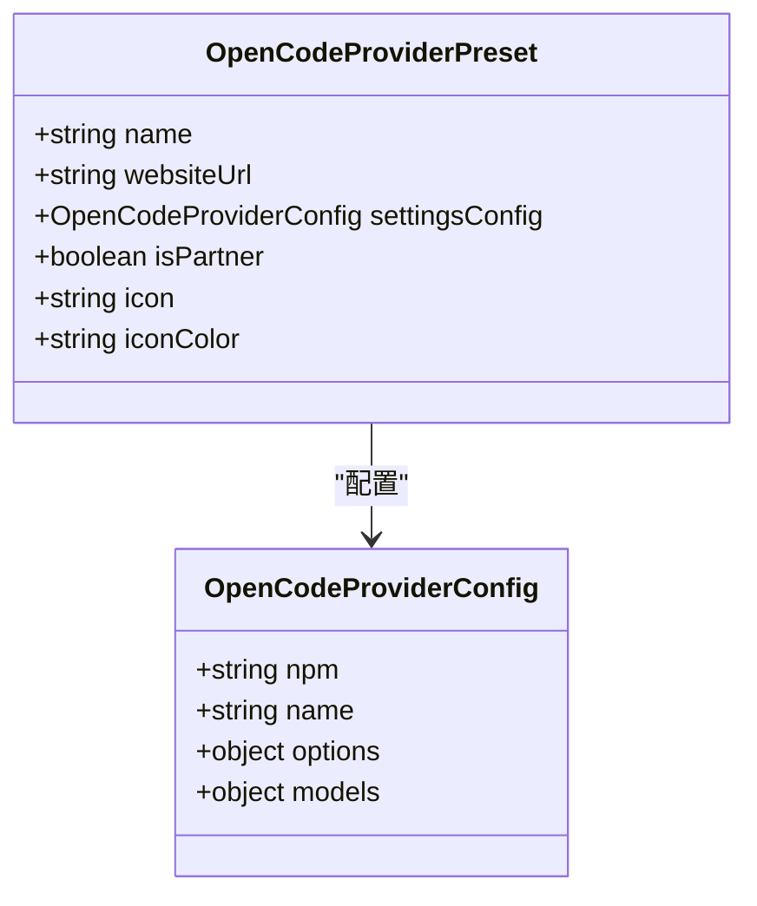

**图表来源**
- [opencodeProviderPresets.ts](file://src/config/opencodeProviderPresets.ts)

**章节来源**
- [opencodeProviderPresets.ts](file://src/config/opencodeProviderPresets.ts)
- [2.1-add.md](file://docs/user-manual/zh/2-providers/2.1-add.md)

### OpenClaw
- 特点：面向 OpenClaw Gateway 的模型与协议配置，支持多种 API 协议（OpenAI Completions/Responses、Anthropic Messages、Google Generative AI、AWS Bedrock）。
- 认证方式：baseUrl + apiKey + api 协议 + models 列表。
- 特殊功能：建议默认模型与模型目录、端点测速、模板变量。

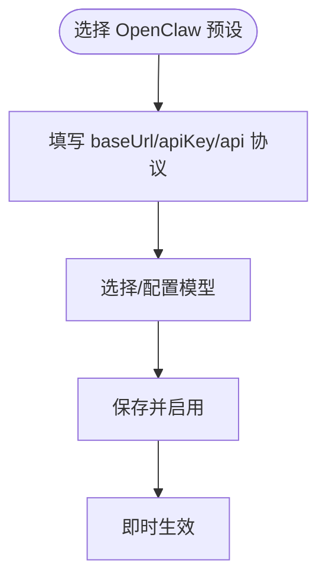

**图表来源**
- [openclawProviderPresets.ts](file://src/config/openclawProviderPresets.ts)
- [2.1-add.md](file://docs/user-manual/zh/2-providers/2.1-add.md)

**章节来源**
- [openclawProviderPresets.ts](file://src/config/openclawProviderPresets.ts)
- [2.1-add.md](file://docs/user-manual/zh/2-providers/2.1-add.md)

### Hermes
- 特点：基于 custom_providers 数组，支持 chat_completions、anthropic_messages、codex_responses、bedrock_converse 等 API 模式。
- 认证方式：name/base_url/api_key/api_mode/models/rate_limit_delay。
- 特殊功能：只读标记（来自 Hermes v12+ providers: dict）、建议默认模型、模板变量。

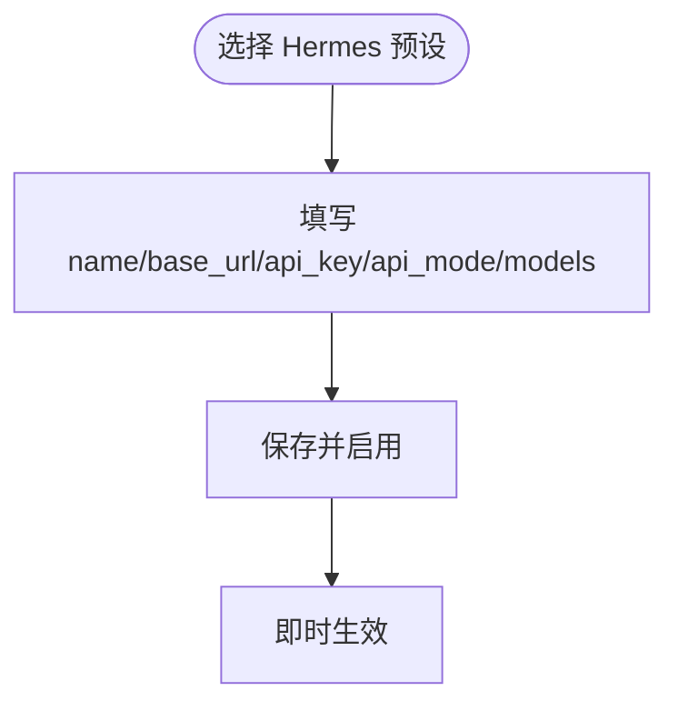

**图表来源**
- [hermesProviderPresets.ts](file://src/config/hermesProviderPresets.ts)
- [2.1-add.md](file://docs/user-manual/zh/2-providers/2.1-add.md)

**章节来源**
- [hermesProviderPresets.ts](file://src/config/hermesProviderPresets.ts)
- [2.1-add.md](file://docs/user-manual/zh/2-providers/2.1-add.md)

### 系统托盘快速切换
- 结构：按应用分组的子菜单（Claude、Codex、Gemini），标题显示当前供应商与用量摘要。
- 优点：防止菜单溢出、隔离操作、轻量模式组合适合高频切换用户。

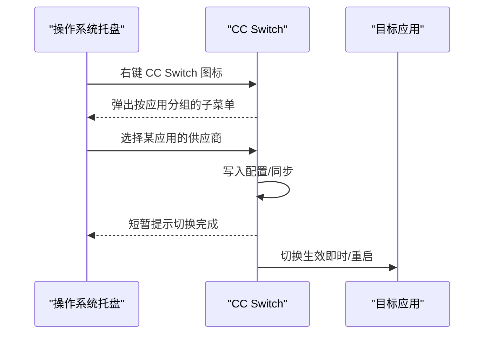

**图表来源**
- [2.2-switch.md](file://docs/user-manual/zh/2-providers/2.2-switch.md)

**章节来源**
- [2.2-switch.md](file://docs/user-manual/zh/2-providers/2.2-switch.md)

### 平台系统要求与安装方式
- 系统要求：Windows 10+（x64）、macOS 12+（Intel/Apple Silicon）、Linux（发行版支持）。
- 前置要求：Node.js 18 LTS 或更高（CLI 工具依赖）。
- 安装方式：Windows MSI/绿色版、macOS Homebrew/App、Linux AUR/Deb/AppImage。
- CLI 工具安装：Claude Code、Codex、Gemini CLI 通过 Homebrew 或 npm 安装。

**章节来源**
- [1.2-installation.md](file://docs/user-manual/zh/1-getting-started/1.2-installation.md)

## 依赖关系分析
- 预设到 UI：各 Provider 预设驱动“添加供应商”面板的预设选择、字段提示与模板变量。
- 预设到配置：预设决定最终写入的配置文件（settings.json、auth.json、config.toml、.env、settings.json、YAML）。
- 统一配置到应用：统一供应商在三应用间同步，避免重复配置。
- 托盘到应用：托盘菜单直接触发应用面板的启用动作，实现快速切换。

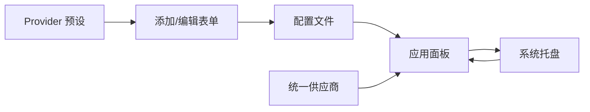

**图表来源**
- [2.1-add.md](file://docs/user-manual/zh/2-providers/2.1-add.md)
- [2.2-switch.md](file://docs/user-manual/zh/2-providers/2.2-switch.md)
- [universalProviderPresets.ts](file://src/config/universalProviderPresets.ts)

**章节来源**
- [2.1-add.md](file://docs/user-manual/zh/2-providers/2.1-add.md)
- [2.2-switch.md](file://docs/user-manual/zh/2-providers/2.2-switch.md)
- [universalProviderPresets.ts](file://src/config/universalProviderPresets.ts)

## 性能考量
- 端点测速：通过“测速”功能选择延迟最低的端点，提升请求效率。
- 本地路由：Codex Chat Completions 协议需本地路由映射，建议保持路由服务稳定运行。
- 代理与格式转换：非默认 API 格式需代理服务与应用接管配合，避免不必要的往返。
- 通用配置快捷开关：合理使用可减少冗余配置，降低解析与传输成本。

[本节为通用指导，无需特定文件引用]

## 故障排查指南
- 切换失败
  - 配置文件被占用：关闭 CLI 工具后再试。
  - 权限不足：检查配置目录权限。
  - 配置格式错误：修复 JSON/TOML 格式。
- Codex 需重启：切换后需关闭并重新打开终端。
- Claude Desktop 需重启：切换后需完全退出并重新打开。
- Codex OAuth 反向代理
  - 风险提示：违反服务条款、账号风险、不可保证长期可用。
  - 常见失败：验证码超时、浏览器拒绝授权、网络错误、Token 失效。
- 端点测速：选择延迟最低端点；若供应商不支持 /v1/models，需手动填写模型 ID。

**章节来源**
- [2.2-switch.md](file://docs/user-manual/zh/2-providers/2.2-switch.md)
- [2.1-add.md](file://docs/user-manual/zh/2-providers/2.1-add.md)

## 结论
CC Switch 通过丰富的 Provider 预设、统一配置与托盘快速切换，显著降低了多工具、多平台的配置与切换成本。结合端点测速、本地路由与代理服务，用户可在不同供应商与协议间灵活切换，满足多样化开发与生产需求。

[本节为总结，无需特定文件引用]

## 附录
- 工具选择建议
  - Claude Code：优先选择直连模式（原生 Anthropic Messages API）；非三档角色模型或需格式转换时启用本地路由。
  - Codex：Responses 协议优先；Chat Completions 协议需开启本地路由映射。
  - Gemini CLI：Google OAuth 优先；自定义端点时注意认证类型自动识别。
  - OpenCode：按 npm 包选择适配的供应商；关注模型变体与思考配置。
  - OpenClaw：按协议选择（OpenAI/Anthropic/Gemini/Bedrock）；配置模型与成本信息。
  - Hermes：优先使用 custom_providers；关注只读标记与建议默认模型。
- 最佳实践
  - 使用统一供应商在三应用间共享配置，减少重复维护。
  - 通过端点测速选择最优上游；定期检查配额与 Token 刷新。
  - 对非默认 API 格式与 Chat Completions 协议，确保代理与本地路由稳定运行。
  - 使用系统托盘快速切换，结合轻量模式提升高频用户的效率。

[本节为通用指导，无需特定文件引用]