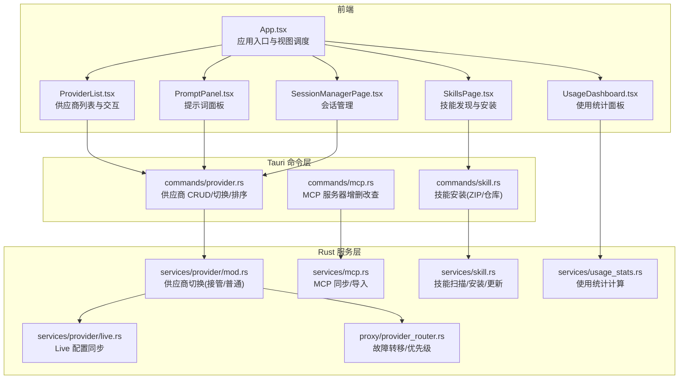
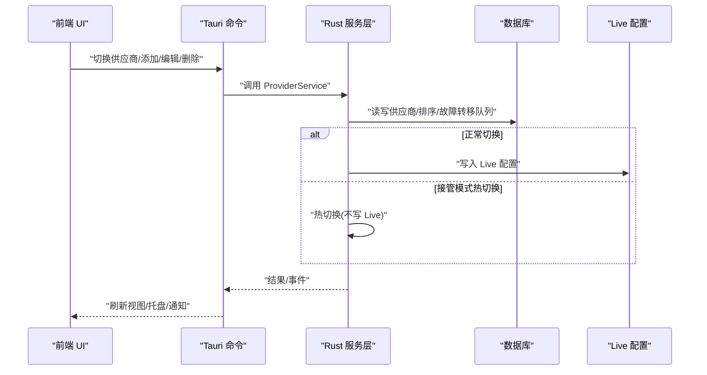
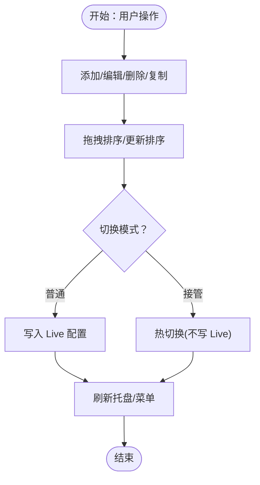
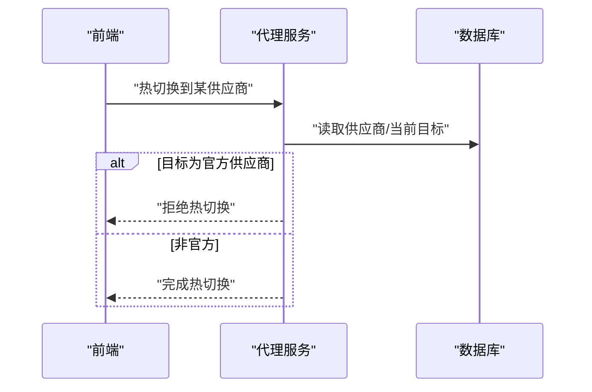
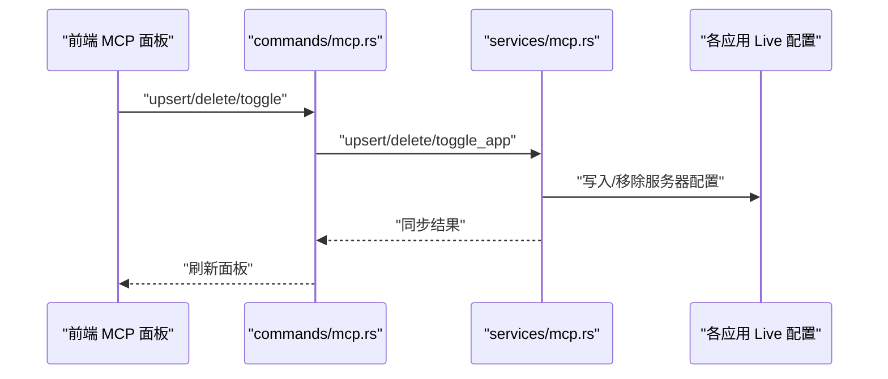
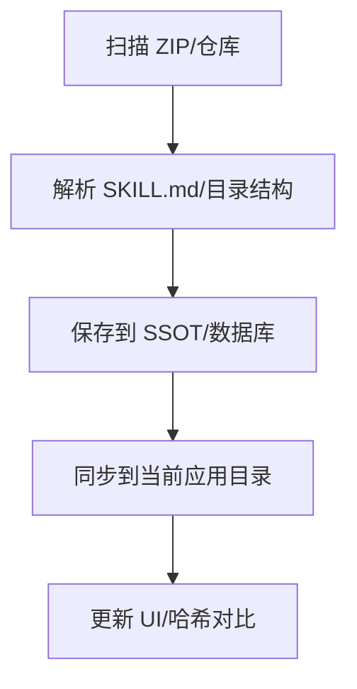
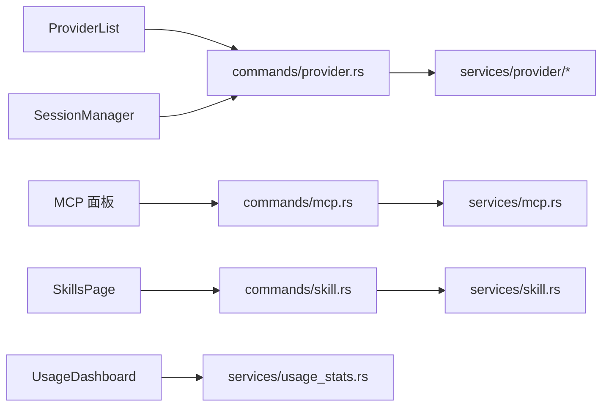

# 核心功能特性

<cite>
**本文引用的文件**
- [src/App.tsx](file://src/App.tsx)
- [src/main.tsx](file://src/main.tsx)
- [src/components/providers/ProviderList.tsx](file://src/components/providers/ProviderList.tsx)
- [src-tauri/src/commands/provider.rs](file://src-tauri/src/commands/provider.rs)
- [src-tauri/src/services/provider/mod.rs](file://src-tauri/src/services/provider/mod.rs)
- [src-tauri/src/proxy/provider_router.rs](file://src-tauri/src/proxy/provider_router.rs)
- [src-tauri/src/services/provider/live.rs](file://src-tauri/src/services/provider/live.rs)
- [src-tauri/src/services/proxy.rs](file://src-tauri/src/services/proxy.rs)
- [src-tauri/src/commands/mcp.rs](file://src-tauri/src/commands/mcp.rs)
- [src-tauri/src/mcp/mod.rs](file://src-tauri/src/mcp/mod.rs)
- [src-tauri/src/mcp/codex.rs](file://src-tauri/src/mcp/codex.rs)
- [src-tauri/src/mcp/opencode.rs](file://src-tauri/src/mcp/opencode.rs)
- [src/components/prompts/PromptPanel.tsx](file://src/components/prompts/PromptPanel.tsx)
- [src/components/skills/SkillsPage.tsx](file://src/components/skills/SkillsPage.tsx)
- [src-tauri/src/commands/skill.rs](file://src-tauri/src/commands/skill.rs)
- [src-tauri/src/services/skill.rs](file://src-tauri/src/services/skill.rs)
- [src-tauri/src/app_config.rs](file://src-tauri/src/app_config.rs)
- [src/components/sessions/SessionManagerPage.tsx](file://src/components/sessions/SessionManagerPage.tsx)
- [src/components/usage/UsageDashboard.tsx](file://src/components/usage/UsageDashboard.tsx)
- [src-tauri/src/services/usage_stats.rs](file://src-tauri/src/services/usage_stats.rs)
- [docs/user-manual/zh/2-providers/2.3-edit.md](file://docs/user-manual/zh/2-providers/2.3-edit.md)
- [docs/user-manual/zh/2-providers/2.4-sort-duplicate.md](file://docs/user-manual/zh/2-providers/2.4-sort-duplicate.md)
- [docs/user-manual/zh/3-extensions/3.1-mcp.md](file://docs/user-manual/zh/3-extensions/3.1-mcp.md)
- [docs/user-manual/zh/3-extensions/3.2-prompts.md](file://docs/user-manual/zh/3-extensions/3.2-prompts.md)
- [docs/user-manual/zh/3-extensions/3.3-skills.md](file://docs/user-manual/zh/3-extensions/3.3-skills.md)
- [docs/user-manual/zh/3-extensions/3.4-sessions.md](file://docs/user-manual/zh/3-extensions/3.4-sessions.md)
- [docs/user-manual/zh/4-proxy/4.4-usage.md](file://docs/user-manual/zh/4-proxy/4.4-usage.md)
</cite>

## 目录
1. [简介](#简介)
2. [项目结构](#项目结构)
3. [核心组件](#核心组件)
4. [架构总览](#架构总览)
5. [详细组件分析](#详细组件分析)
6. [依赖分析](#依赖分析)
7. [性能考虑](#性能考虑)
8. [故障排除指南](#故障排除指南)
9. [结论](#结论)
10. [附录](#附录)

## 简介
本文件面向 CC Switch 的核心功能特性，围绕七大模块进行系统化说明：供应商管理、代理服务、MCP 协议支持、提示词管理、技能系统、会话管理、使用统计。内容涵盖实现原理、使用场景、配置选项、最佳实践、功能协作关系与数据流，并提供实际使用案例与操作流程演示。

## 项目结构
- 前端采用 React + Tauri 架构，UI 组件位于 src/components 下，业务逻辑通过 Tauri 命令桥接到 Rust 后端。
- 后端位于 src-tauri，包含命令层、服务层、数据库与代理/会话/使用统计等子系统。
- 文档位于 docs/user-manual，提供中文用户手册与各功能的使用指南。

图表来源
- [src/App.tsx:164-363](file://src/App.tsx#L164-L363)
- [src/components/providers/ProviderList.tsx:73-470](file://src/components/providers/ProviderList.tsx#L73-L470)
- [src-tauri/src/commands/provider.rs:21-152](file://src-tauri/src/commands/provider.rs#L21-L152)
- [src-tauri/src/commands/mcp.rs:170-207](file://src-tauri/src/commands/mcp.rs#L170-L207)
- [src-tauri/src/commands/skill.rs:325-336](file://src-tauri/src/commands/skill.rs#L325-L336)
- [src-tauri/src/services/provider/mod.rs:1633-1668](file://src-tauri/src/services/provider/mod.rs#L1633-L1668)
- [src-tauri/src/services/provider/live.rs:915-946](file://src-tauri/src/services/provider/live.rs#L915-L946)
- [src-tauri/src/proxy/provider_router.rs:369-402](file://src-tauri/src/proxy/provider_router.rs#L369-L402)
- [src-tauri/src/services/mcp.rs:179-217](file://src-tauri/src/services/mcp.rs#L179-L217)
- [src-tauri/src/services/skill.rs:2531-2683](file://src-tauri/src/services/skill.rs#L2531-L2683)
- [src-tauri/src/services/usage_stats.rs:1387-1404](file://src-tauri/src/services/usage_stats.rs#L1387-L1404)

章节来源
- [src/App.tsx:164-363](file://src/App.tsx#L164-L363)
- [src/main.tsx:73-104](file://src/main.tsx#L73-L104)

## 核心组件
- 供应商管理：提供添加、编辑、切换、排序、复制、删除、测试、故障转移队列管理等能力，支持 Live 配置与接管模式下的热切换。
- 代理服务：本地代理、故障转移、热切换、接管模式、健康检查与警告提示。
- MCP 协议支持：统一服务器管理、应用绑定、跨应用同步（Claude/Codex/Gemini/OpenCode/Hermes）。
- 提示词管理：Markdown 编辑器、跨应用同步、深链分享、导入导出。
- 技能系统：GitHub 仓库与 ZIP 文件安装、自定义仓库、自动更新检测、SSOT 结构。
- 会话管理：历史浏览、搜索、恢复、批量删除、目录导航。
- 使用统计：请求趋势、令牌与费用、提供商/模型统计、定价配置、实时刷新。

章节来源
- [src/components/providers/ProviderList.tsx:73-470](file://src/components/providers/ProviderList.tsx#L73-L470)
- [src-tauri/src/commands/provider.rs:21-152](file://src-tauri/src/commands/provider.rs#L21-L152)
- [src-tauri/src/services/provider/mod.rs:1633-1668](file://src-tauri/src/services/provider/mod.rs#L1633-L1668)
- [src-tauri/src/services/provider/live.rs:915-946](file://src-tauri/src/services/provider/live.rs#L915-L946)
- [src-tauri/src/proxy/provider_router.rs:369-402](file://src-tauri/src/proxy/provider_router.rs#L369-L402)
- [src-tauri/src/commands/mcp.rs:170-207](file://src-tauri/src/commands/mcp.rs#L170-L207)
- [src-tauri/src/mcp/mod.rs:1-36](file://src-tauri/src/mcp/mod.rs#L1-36)
- [src-tauri/src/mcp/codex.rs:16-43](file://src-tauri/src/mcp/codex.rs#L16-L43)
- [src-tauri/src/mcp/opencode.rs:183-222](file://src-tauri/src/mcp/opencode.rs#L183-L222)
- [src/components/prompts/PromptPanel.tsx:20-169](file://src/components/prompts/PromptPanel.tsx#L20-L169)
- [src/components/skills/SkillsPage.tsx:56-619](file://src/components/skills/SkillsPage.tsx#L56-L619)
- [src-tauri/src/commands/skill.rs:325-336](file://src-tauri/src/commands/skill.rs#L325-L336)
- [src-tauri/src/services/skill.rs:2531-2683](file://src-tauri/src/services/skill.rs#L2531-L2683)
- [src-tauri/src/app_config.rs:166-201](file://src-tauri/src/app_config.rs#L166-L201)
- [src/components/sessions/SessionManagerPage.tsx:71-800](file://src/components/sessions/SessionManagerPage.tsx#L71-L800)
- [src/components/usage/UsageDashboard.tsx:40-224](file://src/components/usage/UsageDashboard.tsx#L40-L224)
- [src-tauri/src/services/usage_stats.rs:1387-1404](file://src-tauri/src/services/usage_stats.rs#L1387-L1404)

## 架构总览
- 前端通过 Tauri 命令调用后端服务，后端执行业务逻辑并持久化到数据库，同时与各应用的 Live 配置进行同步。
- 代理层负责请求转发、故障转移与热切换，保障在接管模式下的安全与一致性。
- MCP、技能、会话与使用统计均通过统一的数据结构与查询接口与前端交互。

图表来源
- [src-tauri/src/commands/provider.rs:85-110](file://src-tauri/src/commands/provider.rs#L85-L110)
- [src-tauri/src/services/provider/mod.rs:1633-1668](file://src-tauri/src/services/provider/mod.rs#L1633-L1668)
- [src-tauri/src/services/provider/live.rs:915-946](file://src-tauri/src/services/provider/live.rs#L915-L946)

## 详细组件分析

### 供应商管理
- 功能要点
  - 添加/编辑/删除/复制：支持拖拽排序、搜索、测试端点、导入当前配置。
  - 切换与接管：普通模式写入 Live，接管模式热切换不写 Live。
  - 故障转移：按队列顺序选择，支持自动故障转移与优先级标注。
  - Live 集成：OpenCode/OpenClaw/Hermes 的“累加模式”支持 isInConfig 与默认模型标注。
- 数据流
  - 前端 ProviderList 触发命令，后端 ProviderService 执行，必要时写入 Live 并触发托盘/菜单更新。
- 最佳实践
  - 重要供应商建议启用故障转移队列，合理设置排序。
  - 接管模式下避免切换官方供应商，遵循安全限制。

图表来源
- [src-tauri/src/commands/provider.rs:37-110](file://src-tauri/src/commands/provider.rs#L37-L110)
- [src-tauri/src/services/provider/mod.rs:1633-1668](file://src-tauri/src/services/provider/mod.rs#L1633-L1668)
- [src-tauri/src/services/provider/live.rs:915-946](file://src-tauri/src/services/provider/live.rs#L915-L946)

章节来源
- [src/components/providers/ProviderList.tsx:73-470](file://src/components/providers/ProviderList.tsx#L73-L470)
- [src-tauri/src/commands/provider.rs:21-152](file://src-tauri/src/commands/provider.rs#L21-L152)
- [src-tauri/src/proxy/provider_router.rs:369-402](file://src-tauri/src/proxy/provider_router.rs#L369-L402)
- [docs/user-manual/zh/2-providers/2.3-edit.md:1-63](file://docs/user-manual/zh/2-providers/2.3-edit.md#L1-L63)
- [docs/user-manual/zh/2-providers/2.4-sort-duplicate.md:1-64](file://docs/user-manual/zh/2-providers/2.4-sort-duplicate.md#L1-L64)

### 代理服务
- 功能要点
  - 本地代理与接管模式：热切换禁止官方供应商，保护用户配置安全。
  - 故障转移：根据队列顺序与排序字段选择下一个供应商。
  - 健康检查与警告：对官方供应商接管给出提示。
- 数据流
  - 前端状态驱动，后端代理服务执行热切换与路由选择。

图表来源
- [src-tauri/src/services/proxy.rs:2051-2076](file://src-tauri/src/services/proxy.rs#L2051-L2076)
- [src-tauri/src/services/provider/mod.rs:1633-1668](file://src-tauri/src/services/provider/mod.rs#L1633-L1668)

章节来源
- [src-tauri/src/services/proxy.rs:2051-2076](file://src-tauri/src/services/proxy.rs#L2051-L2076)
- [src-tauri/src/proxy/provider_router.rs:369-402](file://src-tauri/src/proxy/provider_router.rs#L369-L402)

### MCP 协议支持
- 功能要点
  - 统一服务器管理：添加、编辑、删除、从应用导入。
  - 应用绑定：为 Claude/Codex/Gemini/OpenCode/Hermes 启用/禁用服务器。
  - 同步机制：仅在对应应用安装时写入 Live 配置，支持移除与兼容层。
- 数据流
  - 前端通过命令增删改查，后端服务层同步到各应用配置。

图表来源
- [src-tauri/src/commands/mcp.rs:170-207](file://src-tauri/src/commands/mcp.rs#L170-L207)
- [src-tauri/src/services/mcp.rs:179-217](file://src-tauri/src/services/mcp.rs#L179-L217)
- [src-tauri/src/mcp/codex.rs:16-43](file://src-tauri/src/mcp/codex.rs#L16-L43)
- [src-tauri/src/mcp/opencode.rs:183-222](file://src-tauri/src/mcp/opencode.rs#L183-L222)

章节来源
- [docs/user-manual/zh/3-extensions/3.1-mcp.md:57-117](file://docs/user-manual/zh/3-extensions/3.1-mcp.md#L57-L117)
- [src-tauri/src/mcp/mod.rs:1-36](file://src-tauri/src/mcp/mod.rs#L1-L36)

### 提示词管理
- 功能要点
  - Markdown 编辑器、预览、快捷格式；跨应用同步至 Claude/Codex/Gemini/OpenCode。
  - 深链分享与配置导出导入。
- 数据流
  - 前端 PromptPanel 管理提示词集合，变更后写入对应应用文件。

章节来源
- [src/components/prompts/PromptPanel.tsx:20-169](file://src/components/prompts/PromptPanel.tsx#L20-L169)
- [docs/user-manual/zh/3-extensions/3.2-prompts.md:1-159](file://docs/user-manual/zh/3-extensions/3.2-prompts.md#L1-L159)

### 技能系统
- 功能要点
  - GitHub 仓库与 skills.sh 源发现；ZIP 文件安装；自定义仓库管理；自动更新检测。
  - SSOT 存储 InstalledSkill，记录内容哈希与应用启用状态。
- 数据流
  - 前端 SkillsPage 与 Hook 管理仓库与技能，后端扫描/解压/复制/同步。

图表来源
- [src-tauri/src/commands/skill.rs:325-336](file://src-tauri/src/commands/skill.rs#L325-L336)
- [src-tauri/src/services/skill.rs:2531-2683](file://src-tauri/src/services/skill.rs#L2531-L2683)
- [src-tauri/src/app_config.rs:166-201](file://src-tauri/src/app_config.rs#L166-L201)

章节来源
- [src/components/skills/SkillsPage.tsx:56-619](file://src/components/skills/SkillsPage.tsx#L56-L619)
- [docs/user-manual/zh/3-extensions/3.3-skills.md:149-207](file://docs/user-manual/zh/3-extensions/3.3-skills.md#L149-L207)

### 会话管理
- 功能要点
  - 历史浏览、搜索、按应用过滤、批量删除、目录导航、恢复命令。
  - 支持多终端平台的恢复体验。
- 数据流
  - 前端虚拟列表展示，查询/删除通过 API 完成，删除后即时刷新 UI。

章节来源
- [src/components/sessions/SessionManagerPage.tsx:71-800](file://src/components/sessions/SessionManagerPage.tsx#L71-L800)
- [docs/user-manual/zh/3-extensions/3.4-sessions.md:56-100](file://docs/user-manual/zh/3-extensions/3.4-sessions.md#L56-L100)

### 使用统计
- 功能要点
  - 请求趋势、令牌与费用、提供商/模型统计、定价配置、实时刷新。
  - 支持多种时间粒度与应用过滤。
- 数据流
  - 前端 UsageDashboard 组合查询，后端计算与缓存，事件驱动刷新。

章节来源
- [src/components/usage/UsageDashboard.tsx:40-224](file://src/components/usage/UsageDashboard.tsx#L40-L224)
- [src-tauri/src/services/usage_stats.rs:1387-1404](file://src-tauri/src/services/usage_stats.rs#L1387-L1404)
- [docs/user-manual/zh/4-proxy/4.4-usage.md:44-143](file://docs/user-manual/zh/4-proxy/4.4-usage.md#L44-L143)

## 依赖分析
- 组件耦合
  - ProviderList 依赖 ProviderService 命令与查询钩子，耦合度适中，职责清晰。
  - MCP/技能/会话/使用统计均通过命令层与服务层解耦。
- 外部依赖
  - Tauri 事件系统用于跨线程/跨进程通信（如 universal-provider-synced、usage-cache-updated）。
  - 各应用 Live 配置作为外部系统，通过服务层同步。

图表来源
- [src-tauri/src/commands/provider.rs:21-152](file://src-tauri/src/commands/provider.rs#L21-L152)
- [src-tauri/src/commands/mcp.rs:170-207](file://src-tauri/src/commands/mcp.rs#L170-L207)
- [src-tauri/src/commands/skill.rs:325-336](file://src-tauri/src/commands/skill.rs#L325-L336)
- [src-tauri/src/services/usage_stats.rs:1387-1404](file://src-tauri/src/services/usage_stats.rs#L1387-L1404)

## 性能考虑
- 虚拟化与懒加载
  - 会话列表使用虚拟滚动减少 DOM 节点数量，提升大列表性能。
- 查询与缓存
  - 使用 React Query 缓存与失效策略，事件驱动刷新避免轮询。
- I/O 优化
  - ZIP 解压与目录扫描在临时目录进行，完成后清理，降低磁盘压力。
- 代理与同步
  - 热切换避免写入 Live，减少 I/O 与冲突风险。

## 故障排除指南
- 配置加载失败
  - 启动时监听 configLoadError 事件，弹窗提示并退出，避免损坏配置运行。
- MCP 同步失败
  - 检查应用安装状态与配置路径；确认服务器启用状态与 Live 写入。
- 技能安装失败
  - 检查 ZIP 内容是否包含 SKILL.md；确认权限与磁盘空间。
- 会话恢复失败
  - 非 macOS 平台会复制命令到剪贴板；检查终端与项目目录有效性。
- 使用统计异常
  - 切换实时刷新间隔；检查数据源（代理日志/CLI 会话）是否启用。

章节来源
- [src/main.tsx:39-61](file://src/main.tsx#L39-L61)
- [src-tauri/src/services/mcp.rs:179-217](file://src-tauri/src/services/mcp.rs#L179-L217)
- [src-tauri/src/services/skill.rs:2531-2683](file://src-tauri/src/services/skill.rs#L2531-L2683)
- [src/components/sessions/SessionManagerPage.tsx:228-250](file://src/components/sessions/SessionManagerPage.tsx#L228-L250)
- [src/components/usage/UsageDashboard.tsx:47-61](file://src/components/usage/UsageDashboard.tsx#L47-L61)

## 结论
CC Switch 通过前后端清晰分层与命令/服务模式，实现了供应商、代理、MCP、提示词、技能、会话与使用统计的完整闭环。其关键优势在于：
- 强一致的 Live 配置同步与接管模式的安全隔离；
- 统一的数据结构与跨应用同步；
- 事件驱动的实时刷新与良好的用户体验；
- 丰富的配置选项与最佳实践指导。

## 附录
- 实际使用案例与操作流程
  - 供应商管理：添加 → 编辑 API Key/端点 → 测试 → 排序/复制 → 切换/故障转移。
  - 代理服务：启动代理 → 启用接管 → 热切换到非官方供应商 → 观察健康状态。
  - MCP：添加服务器 → 为应用启用 → 同步到 Live → 验证 CLI 工具加载。
  - 提示词：创建 Markdown → 激活 → 同步到目标应用 → 分享深链。
  - 技能：添加仓库 → 发现/安装 → ZIP 安装 → 更新检测 → 同步到应用。
  - 会话：搜索/过滤 → 选择会话 → 恢复/批量删除 → 查看目录。
  - 使用统计：选择时间范围/应用 → 查看趋势/费用 → 调整定价配置。