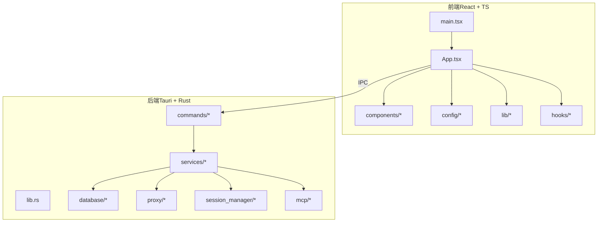
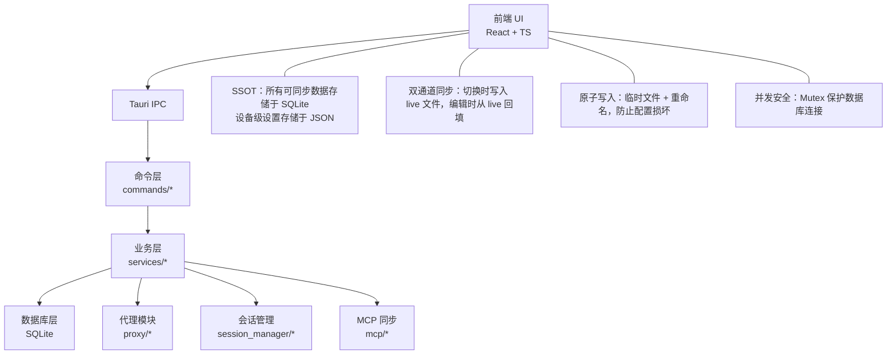
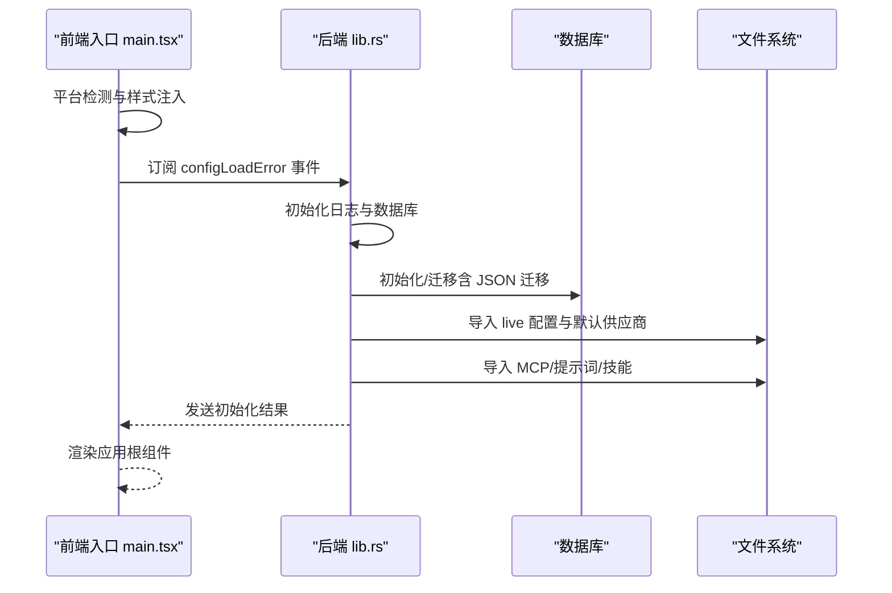
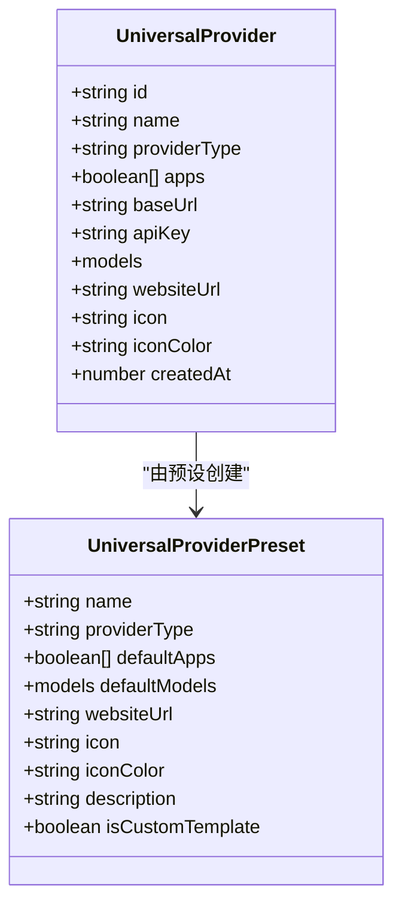
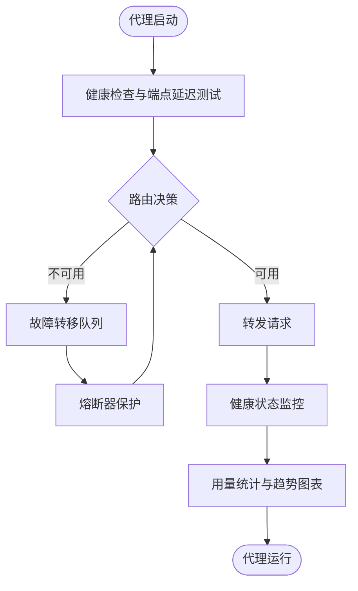
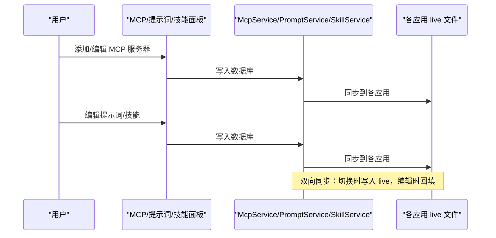
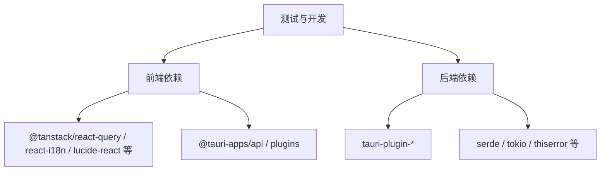

# 项目介绍

<cite>
**本文引用的文件**
- [README.md](file://README.md)
- [README_ZH.md](file://README_ZH.md)
- [docs/user-manual/zh/README.md](file://docs/user-manual/zh/README.md)
- [src/main.tsx](file://src/main.tsx)
- [src/App.tsx](file://src/App.tsx)
- [src/config/appConfig.tsx](file://src/config/appConfig.tsx)
- [src/config/universalProviderPresets.ts](file://src/config/universalProviderPresets.ts)
- [src-tauri/src/lib.rs](file://src-tauri/src/lib.rs)
- [src-tauri/src/commands/mod.rs](file://src-tauri/src/commands/mod.rs)
- [src-tauri/src/services/mod.rs](file://src-tauri/src/services/mod.rs)
- [package.json](file://package.json)
- [CONTRIBUTING.md](file://CONTRIBUTING.md)
</cite>

## 目录
1. [引言](#引言)
2. [项目结构](#项目结构)
3. [核心组件](#核心组件)
4. [架构总览](#架构总览)
5. [详细组件分析](#详细组件分析)
6. [依赖关系分析](#依赖关系分析)
7. [性能考量](#性能考量)
8. [故障排查指南](#故障排查指南)
9. [结论](#结论)
10. [附录](#附录)

## 引言
CC Switch 是一款面向 AI 编程与智能体开发的统一管理器，旨在简化多工具、多供应商、多协议的复杂配置与切换流程。它支持 Claude Code、Claude Desktop、Codex、Gemini CLI、OpenCode、OpenClaw 与 Hermes 等主流 AI 工具，提供统一的供应商管理、MCP/提示词/技能、会话与工作区、本地代理与故障转移、用量与成本追踪、云同步与深链导入等能力。其核心价值在于：
- 以“单一事实源”（SSOT）集中管理配置，避免手动编辑 JSON/TOML/.env 的繁琐与易错
- 通过统一界面与系统托盘实现“一键切换”，显著提升多工具协作效率
- 提供跨应用的 MCP、提示词与技能统一管理，减少重复配置与维护成本
- 以本地代理与故障转移保障高可用，结合用量统计与定价配置实现成本可控

CC Switch 的目标用户包括：
- AI 开发者：在多模型、多供应商间快速切换，统一管理配置与会话
- Agent 工程师：集中管理 MCP 服务器、提示词与技能，加速智能体开发与迭代
- 企业工程团队：通过云同步与统一配置，降低团队协作与运维成本

## 项目结构
项目采用前后端分离的桌面应用架构，前端基于 React + TypeScript，后端基于 Tauri + Rust，二者通过 IPC 通信。核心目录与职责如下：
- src/：前端代码（组件、Hooks、配置、类型、国际化等）
- src-tauri/：后端代码（命令层、服务层、数据库层、代理模块、会话管理等）
- docs/user-manual/：用户手册（多语言）
- tests/：前端单元测试
- assets/：截图与合作伙伴资源
- flatpak/：打包相关说明
- scripts/：图标提取与过滤脚本

**图表来源**
- [src/main.tsx:1-104](file://src/main.tsx#L1-L104)
- [src/App.tsx:1-800](file://src/App.tsx#L1-L800)
- [src-tauri/src/lib.rs:1-800](file://src-tauri/src/lib.rs#L1-L800)
- [src-tauri/src/commands/mod.rs:1-69](file://src-tauri/src/commands/mod.rs#L1-L69)
- [src-tauri/src/services/mod.rs:1-47](file://src-tauri/src/services/mod.rs#L1-L47)

**章节来源**
- [README.md:346-425](file://README.md#L346-L425)
- [README_ZH.md:348-386](file://README_ZH.md#L348-L386)

## 核心组件
- 应用入口与初始化
  - 前端入口负责平台检测、错误事件监听与主题/更新上下文注入
  - 后端负责日志初始化、数据库初始化与首次运行数据导入
- 供应商管理
  - 提供 CRUD、切换、排序、回填与统一供应商（Universal Provider）等功能
- 代理与故障转移
  - 本地代理热切换、格式转换、熔断器、健康监控与自动故障转移
- MCP/提示词/技能
  - 统一面板管理跨应用 MCP 服务器，提示词与技能双向同步
- 会话与工作区
  - 支持浏览、搜索与恢复会话；OpenClaw 提供工作区文件编辑
- 用量与成本追踪
  - 用量仪表盘、趋势图表、请求日志与自定义定价
- 云同步与深链导入
  - 支持 Dropbox、OneDrive、iCloud、WebDAV 等云同步；ccswitch:// 深链导入

**章节来源**
- [src/main.tsx:1-104](file://src/main.tsx#L1-L104)
- [src-tauri/src/lib.rs:300-800](file://src-tauri/src/lib.rs#L300-L800)
- [README.md:178-213](file://README.md#L178-L213)

## 架构总览
CC Switch 采用“前端 UI + 后端服务 + 数据库”的分层架构，通过 Tauri IPC 实现前后端解耦与安全通信。SSOT 将所有可同步数据存储于 SQLite，设备级设置以 JSON 存储，配合原子写入与并发安全机制，确保配置一致性与可靠性。

**图表来源**
- [README.md:366-384](file://README.md#L366-L384)
- [src-tauri/src/lib.rs:300-800](file://src-tauri/src/lib.rs#L300-L800)

**章节来源**
- [README.md:346-384](file://README.md#L346-L384)

## 详细组件分析

### 应用入口与初始化流程
- 前端入口负责：
  - 平台检测并注入样式类
  - 订阅后端“配置加载失败”事件，弹窗提示并强制退出
  - 渲染应用根组件、主题与更新上下文
- 后端初始化负责：
  - 日志系统初始化（单文件轮转）
  - 数据库初始化与迁移（含 JSON 到 SQLite 的迁移）
  - 首次运行数据导入（live 配置、官方供应商、MCP/提示词/技能等）
  - 深链处理器注册与托盘菜单更新

**图表来源**
- [src/main.tsx:1-104](file://src/main.tsx#L1-L104)
- [src-tauri/src/lib.rs:300-800](file://src-tauri/src/lib.rs#L300-L800)

**章节来源**
- [src/main.tsx:1-104](file://src/main.tsx#L1-L104)
- [src-tauri/src/lib.rs:300-800](file://src-tauri/src/lib.rs#L300-L800)

### 供应商管理与统一供应商（Universal Provider）
- 支持 7 个工具的供应商管理，内置 50+ 预设（含 AWS Bedrock、NVIDIA NIM、社区中转等）
- 统一供应商（Universal Provider）可跨应用同步配置，适用于支持多协议的 API 网关
- 提供一键切换、系统托盘快速切换、拖拽排序、导入导出与“共享配置片段”回填机制

**图表来源**
- [src/config/universalProviderPresets.ts:1-133](file://src/config/universalProviderPresets.ts#L1-L133)

**章节来源**
- [README.md:182-187](file://README.md#L182-L187)
- [src/config/universalProviderPresets.ts:1-133](file://src/config/universalProviderPresets.ts#L1-L133)

### 代理与故障转移
- 本地代理支持热切换、格式转换、熔断器、健康监控与请求整流
- 支持应用级接管（独立为 Claude、Codex、Gemini 配置代理）
- 提供端点延迟测试与模型健康检测

**图表来源**
- [README.md:188-192](file://README.md#L188-L192)
- [src-tauri/src/services/mod.rs:1-47](file://src-tauri/src/services/mod.rs#L1-L47)

**章节来源**
- [README.md:188-192](file://README.md#L188-L192)
- [src-tauri/src/services/mod.rs:1-47](file://src-tauri/src/services/mod.rs#L1-L47)

### MCP、提示词与技能
- 统一 MCP 面板：管理 Claude、Codex、Gemini、OpenCode、Hermes 的 MCP 服务器，支持双向同步与深链导入
- 提示词：Markdown 编辑器，跨应用同步与回填保护
- 技能：一键安装、自定义仓库管理，支持软链接与文件复制

**图表来源**
- [README.md:193-198](file://README.md#L193-L198)
- [src-tauri/src/services/mod.rs:1-47](file://src-tauri/src/services/mod.rs#L1-L47)

**章节来源**
- [README.md:193-198](file://README.md#L193-L198)

### 会话管理与工作区
- 浏览、搜索与恢复会话历史（支持 Claude、Codex、OpenCode、OpenClaw、Gemini、Hermes）
- OpenClaw 工作区文件编辑（AGENTS.md、SOUL.md 等）与 Markdown 预览

**章节来源**
- [README.md:203-207](file://README.md#L203-L207)

### 系统与平台
- 云同步：支持 Dropbox、OneDrive、iCloud、WebDAV 等
- 深链导入：ccswitch:// 协议一键导入供应商、MCP、提示词与技能
- 主题与偏好：深色/浅色/系统主题、开机自启、自动更新、自动备份、国际化

**章节来源**
- [README.md:210-213](file://README.md#L210-L213)

## 依赖关系分析
- 前端依赖
  - React 18、TypeScript、Vite、TailwindCSS、TanStack Query、i18n、shadcn/ui 等
  - Tauri 插件：dialog、process、store、updater 等
- 后端依赖
  - Tauri 2.8、Rust 生态（serde、tokio、thiserror 等）、数据库与网络栈
- 测试与开发
  - Vitest、MSW、Testing Library、Prettier、ESLint、Cargo 工具链

**图表来源**
- [package.json:42-94](file://package.json#L42-L94)
- [README.md:469-477](file://README.md#L469-L477)

**章节来源**
- [package.json:1-96](file://package.json#L1-L96)
- [README.md:469-477](file://README.md#L469-L477)

## 性能考量
- 原子写入与并发安全：通过临时文件 + 重命名与 Mutex 保护数据库连接，避免配置损坏与竞态
- 双向同步：切换时写入 live 文件，编辑时从 live 回填，减少重复解析与 IO
- 本地代理优化：格式转换、熔断器与健康监控降低上游波动对用户体验的影响
- 轻量模式：退出到托盘时销毁主窗口，降低空闲占用

**章节来源**
- [README.md:366-375](file://README.md#L366-L375)

## 故障排查指南
- 配置加载失败：前端监听后端“配置加载失败”事件，弹窗提示并强制退出，建议检查 JSON 有效性或从备份恢复
- 环境变量冲突：启动与切换时检测冲突并弹出横幅提示，支持在设置中隐藏对应应用
- 代理与官方供应商：当前供应商为官方供应商时，建议切换到第三方供应商后再使用代理接管
- 云同步失败：自动同步失败时前端弹出通知，检查凭据与网络

**章节来源**
- [src/main.tsx:1-104](file://src/main.tsx#L1-L104)
- [src/App.tsx:464-564](file://src/App.tsx#L464-L564)
- [README.md:208-213](file://README.md#L208-L213)

## 结论
CC Switch 通过“单一事实源”与“双层存储”设计，将多工具、多供应商、多协议的复杂配置统一到一个桌面应用中，显著降低了配置与切换成本，提升了多工具协作效率。其代理与故障转移、用量追踪、云同步与深链导入等能力，进一步增强了可用性与可运维性。对于 AI 开发者、Agent 工程师与企业工程团队而言，CC Switch 是提升生产力与降低维护成本的理想工具。

## 附录
- 快速开始：添加供应商 → 切换供应商 → 生效方式（重启终端或对应 CLI 工具） → 恢复官方登录
- 用户手册：涵盖供应商管理、MCP/提示词/技能、代理与故障转移、会话与工作区、云同步与深链导入等
- 开发指南：环境要求、开发命令、测试与技术栈说明

**章节来源**
- [README.md:273-294](file://README.md#L273-L294)
- [docs/user-manual/zh/README.md:1-135](file://docs/user-manual/zh/README.md#L1-L135)
- [CONTRIBUTING.md:19-57](file://CONTRIBUTING.md#L19-L57)