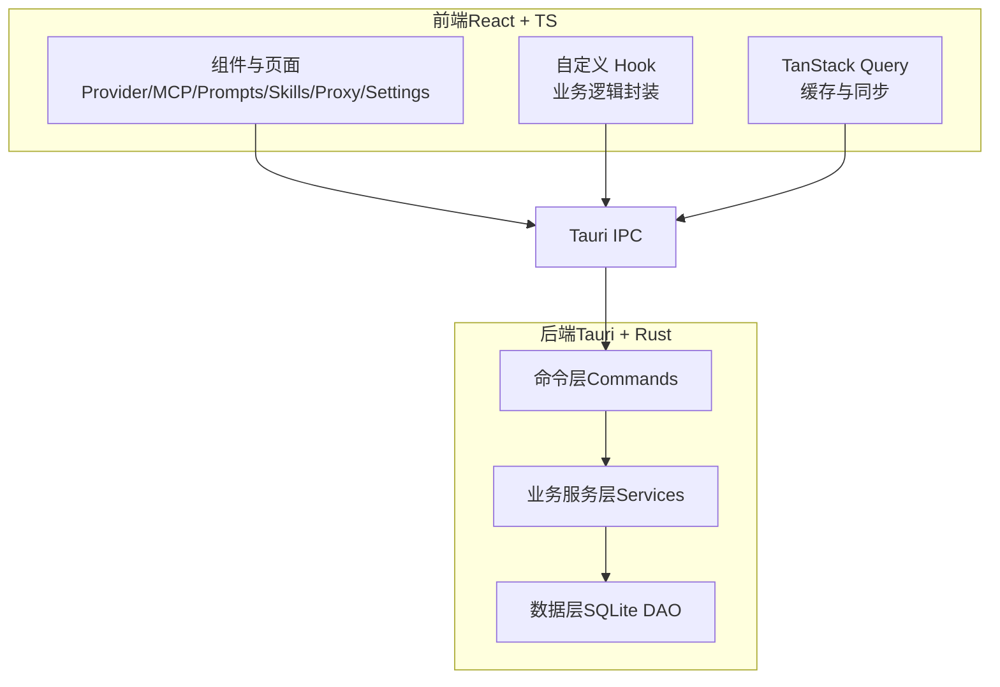
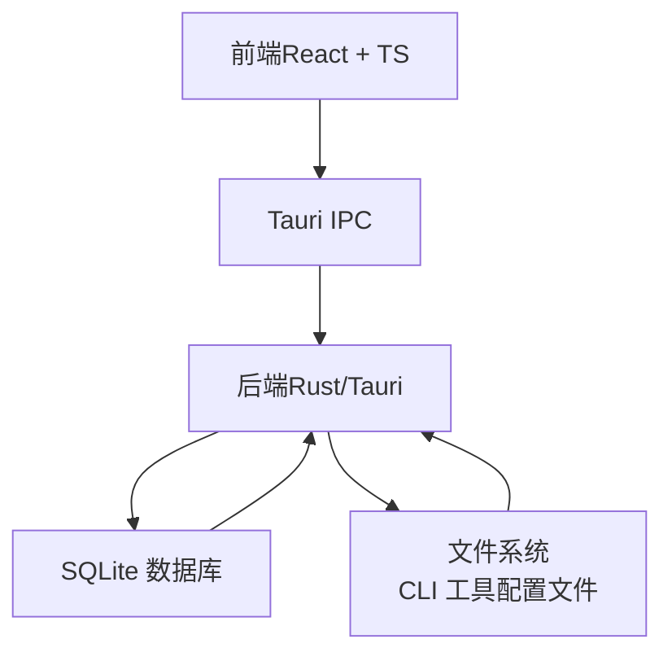
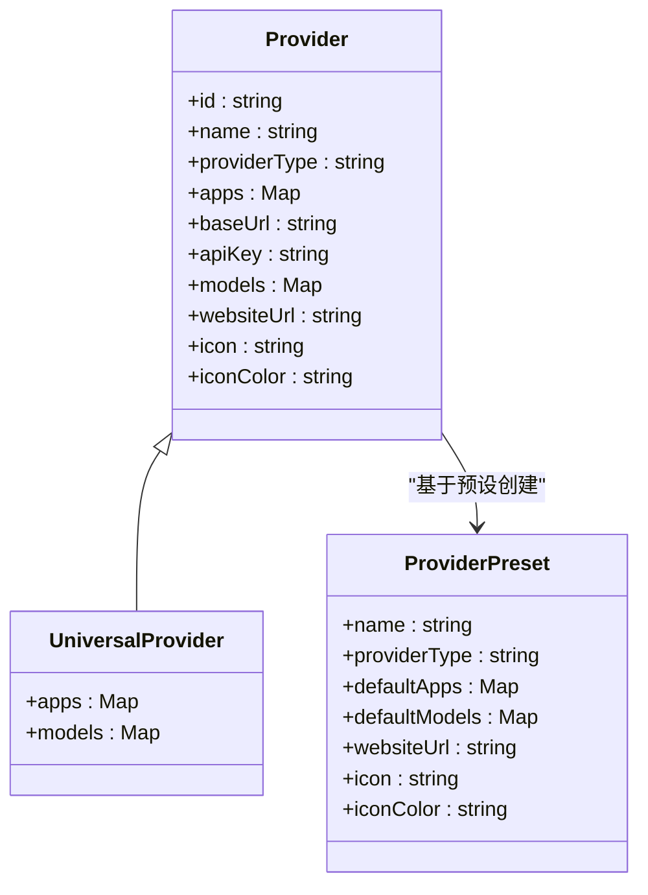
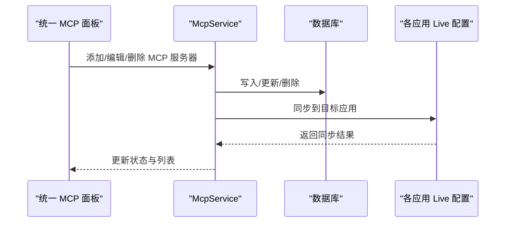
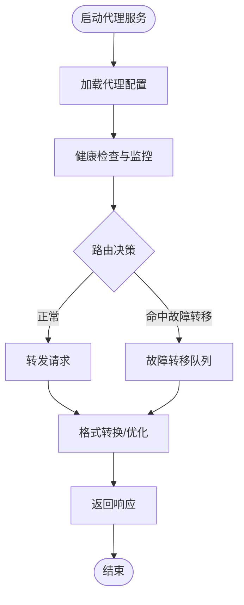
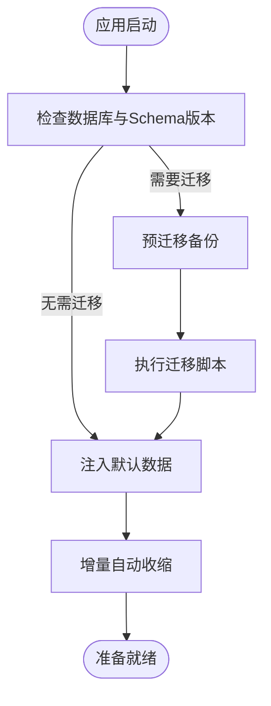
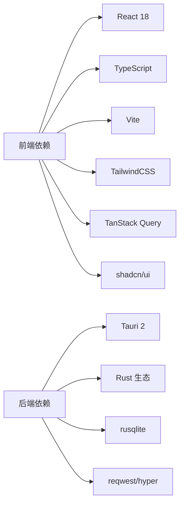

# 项目概述

<cite>
**本文引用的文件**
- [README.md](file://README.md)
- [src-tauri/Cargo.toml](file://src-tauri/Cargo.toml)
- [package.json](file://package.json)
- [src/main.tsx](file://src/main.tsx)
- [src-tauri/src/main.rs](file://src-tauri/src/main.rs)
- [src-tauri/src/lib.rs](file://src-tauri/src/lib.rs)
- [src/App.tsx](file://src/App.tsx)
- [src-tauri/src/services/mod.rs](file://src-tauri/src/services/mod.rs)
- [src-tauri/src/database/mod.rs](file://src-tauri/src/database/mod.rs)
- [src/config/universalProviderPresets.ts](file://src/config/universalProviderPresets.ts)
- [src/config/claudeProviderPresets.ts](file://src/config/claudeProviderPresets.ts)
- [src/config/hermesProviderPresets.ts](file://src/config/hermesProviderPresets.ts)
- [src/components/mcp/UnifiedMcpPanel.tsx](file://src/components/mcp/UnifiedMcpPanel.tsx)
- [docs/user-manual/en/README.md](file://docs/user-manual/en/README.md)
- [src/index.css](file://src/index.css)
</cite>

## 目录
1. [引言](#引言)
2. [项目结构](#项目结构)
3. [核心组件](#核心组件)
4. [架构总览](#架构总览)
5. [详细组件分析](#详细组件分析)
6. [依赖分析](#依赖分析)
7. [性能考虑](#性能考虑)
8. [故障排查指南](#故障排查指南)
9. [结论](#结论)
10. [附录](#附录)

## 引言
CC Switch 是一款面向 AI 编程场景的统一管理器，旨在简化对多款 AI 工具的配置与切换。它支持七种主流 AI 工具：Claude Code、Claude Desktop、Codex、Gemini CLI、OpenCode、OpenClaw、Hermes；通过统一界面与后端服务，实现供应商配置、MCP 服务器、提示词与技能的跨应用同步与管理，并提供本地代理与高可用路由能力。项目采用 Tauri 2 + React + Rust 技术栈，支持 Windows、macOS、Linux 三大平台，具备跨平台原生体验与高性能。

## 项目结构
项目采用前后端分离的分层架构：
- 前端层（React + TypeScript）：负责 UI、交互、状态管理与与后端的 IPC 通信。
- 后端层（Tauri + Rust）：负责命令层、业务服务层、数据持久化与系统集成。
- 数据层（SQLite）：集中存储供应商、MCP、提示词、技能、设置等数据，确保单一可信源（SSOT）。

图表来源
- [src-tauri/src/lib.rs:1-120](file://src-tauri/src/lib.rs#L1-L120)
- [src-tauri/src/services/mod.rs:1-47](file://src-tauri/src/services/mod.rs#L1-L47)
- [src-tauri/src/database/mod.rs:1-120](file://src-tauri/src/database/mod.rs#L1-L120)

章节来源
- [README.md:482-516](file://README.md#L482-L516)
- [src-tauri/Cargo.toml:1-110](file://src-tauri/Cargo.toml#L1-L110)
- [package.json:1-96](file://package.json#L1-L96)

## 核心组件
- 供应商管理（ProviderService）：提供供应商的增删改查、切换、排序、回填与导入导出，支持统一供应商（Universal Provider）跨应用共享。
- MCP 管理（McpService）：统一管理 MCP 服务器，支持跨应用绑定与双向同步。
- 代理与高可用（ProxyService）：本地代理、格式转换、热切换、健康监控、熔断与故障转移。
- 会话管理（SessionManager）：浏览、搜索与恢复多应用会话历史。
- 配置服务（ConfigService）：导入导出、备份轮换与设备级设置。
- 速度测试（SpeedtestService）：端点延迟测量与模型测试。
- 数据库（SQLite）：集中存储与迁移，支持增量自动收缩与变更钩子。

章节来源
- [README.md:346-384](file://README.md#L346-L384)
- [src-tauri/src/services/mod.rs:1-47](file://src-tauri/src/services/mod.rs#L1-L47)
- [src-tauri/src/database/mod.rs:1-120](file://src-tauri/src/database/mod.rs#L1-L120)

## 架构总览
CC Switch 的核心设计原则是“单一可信源（SSOT）”，所有数据集中存储于 SQLite 数据库，并通过双层存储（SQLite 同步数据 + JSON 设备级设置）实现一致性与可移植性。前端通过 Tauri IPC 与后端命令层交互，业务逻辑集中在服务层，DAO 层负责数据访问与迁移。

图表来源
- [src-tauri/src/lib.rs:300-420](file://src-tauri/src/lib.rs#L300-L420)
- [src-tauri/src/database/mod.rs:90-160](file://src-tauri/src/database/mod.rs#L90-L160)

章节来源
- [README.md:346-384](file://README.md#L346-L384)

## 详细组件分析

### 供应商体系与统一供应商（Universal Provider）
- 支持七种工具：Claude Code、Claude Desktop、Codex、Gemini CLI、OpenCode、OpenClaw、Hermes。
- 统一供应商（Universal Provider）可在 Claude、Codex、Gemini 三类应用间共享配置，减少重复维护成本。
- 预设供应商（Provider Presets）覆盖官方与聚合服务商，支持一键导入与切换。

图表来源
- [src/config/universalProviderPresets.ts:1-133](file://src/config/universalProviderPresets.ts#L1-L133)
- [src/config/claudeProviderPresets.ts:75-118](file://src/config/claudeProviderPresets.ts#L75-L118)
- [src/config/hermesProviderPresets.ts:1-29](file://src/config/hermesProviderPresets.ts#L1-L29)

章节来源
- [README.md:214-236](file://README.md#L214-L236)
- [src/config/universalProviderPresets.ts:1-133](file://src/config/universalProviderPresets.ts#L1-L133)
- [src/config/claudeProviderPresets.ts:75-118](file://src/config/claudeProviderPresets.ts#L75-L118)
- [src/config/hermesProviderPresets.ts:1-29](file://src/config/hermesProviderPresets.ts#L1-L29)

### MCP 管理与跨应用同步
- 统一 MCP 面板支持在 Claude、Codex、Gemini、OpenCode、Hermes、OpenClaw、Hermes 之间管理 MCP 服务器。
- 支持导入现有应用的 MCP 配置，实现双向同步与应用绑定。

图表来源
- [src/components/mcp/UnifiedMcpPanel.tsx:29-74](file://src/components/mcp/UnifiedMcpPanel.tsx#L29-L74)
- [src-tauri/src/services/mod.rs:32-47](file://src-tauri/src/services/mod.rs#L32-L47)

章节来源
- [src/components/mcp/UnifiedMcpPanel.tsx:29-74](file://src/components/mcp/UnifiedMcpPanel.tsx#L29-L74)

### 代理与高可用路由
- 本地代理支持格式转换、热切换、健康监控、熔断与故障转移队列。
- 支持应用级接管（按应用或按供应商），并提供路由状态指示与告警。

图表来源
- [src-tauri/src/lib.rs:220-320](file://src-tauri/src/lib.rs#L220-L320)
- [src-tauri/src/services/mod.rs:32-47](file://src-tauri/src/services/mod.rs#L32-L47)

章节来源
- [README.md:188-192](file://README.md#L188-L192)

### 数据持久化与迁移
- 数据库集中存储，支持 Schema 迁移、增量自动收缩与变更钩子通知云同步。
- 启动时执行数据迁移与默认种子数据注入，保障首次运行体验。

图表来源
- [src-tauri/src/database/mod.rs:90-160](file://src-tauri/src/database/mod.rs#L90-L160)
- [src-tauri/src/lib.rs:360-440](file://src-tauri/src/lib.rs#L360-L440)

章节来源
- [src-tauri/src/database/mod.rs:1-273](file://src-tauri/src/database/mod.rs#L1-L273)
- [src-tauri/src/lib.rs:360-440](file://src-tauri/src/lib.rs#L360-L440)

## 依赖分析
- 前端依赖：React 18、TypeScript、Vite、TailwindCSS、TanStack Query、i18n、shadcn/ui 等。
- 后端依赖：Tauri 2、Rust 生态（serde、tokio、thiserror、rusqlite 等）。
- 构建与测试：Vitest、MSW、@testing-library 等。

图表来源
- [package.json:42-94](file://package.json#L42-L94)
- [src-tauri/Cargo.toml:25-83](file://src-tauri/Cargo.toml#L25-L83)

章节来源
- [package.json:1-96](file://package.json#L1-L96)
- [src-tauri/Cargo.toml:1-110](file://src-tauri/Cargo.toml#L1-L110)

## 性能考虑
- 前端：使用 TanStack Query 进行缓存与同步，减少重复请求；TailwindCSS 与按需组件降低包体积。
- 后端：SQLite 使用增量自动收缩与更新钩子，减少磁盘占用；Tokio 异步运行时提升并发处理能力。
- 跨平台：Tauri 2 提供原生体验与较小的二进制体积，Linux 上针对 WebKit 渲染问题做了环境变量兼容处理。

## 故障排查指南
- 配置加载失败：前端监听后端的配置加载错误事件，弹出错误提示并强制退出，避免损坏配置导致应用无法运行。
- 数据库初始化失败：启动时若数据库初始化失败，弹出对话框提示用户重试或退出，防止应用异常。
- 环境变量冲突：启动与切换应用时检测环境变量冲突，弹出横幅提示并允许用户查看与修复。
- 代理接管告警：当代理接管官方供应商时发出警告，避免误用导致不可预期行为。

章节来源
- [src/main.tsx:29-71](file://src/main.tsx#L29-L71)
- [src-tauri/src/lib.rs:300-360](file://src-tauri/src/lib.rs#L300-L360)
- [src/App.tsx:464-564](file://src/App.tsx#L464-L564)
- [src/App.tsx:406-418](file://src/App.tsx#L406-L418)

## 结论
CC Switch 通过统一的供应商与 MCP 管理、本地代理与高可用路由、跨应用同步与一致的数据存储，显著降低了多工具场景下的运维复杂度。其分层清晰、可扩展性强、跨平台稳定，适合个人开发者、团队与企业工程团队在 AI 编程与智能体开发中长期使用。

## 附录
- 用户手册与快速入门：参见用户手册目录与快速开始章节。
- 主题与样式：项目使用 TailwindCSS 与暗/亮主题，支持系统跟随。
- 开发与构建：提供完整的开发命令与测试指南，便于贡献者参与。

章节来源
- [docs/user-manual/en/README.md:1-135](file://docs/user-manual/en/README.md#L1-L135)
- [src/index.css:1-61](file://src/index.css#L1-L61)
- [README.md:386-477](file://README.md#L386-L477)